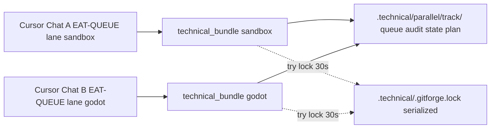

# Parallel dual-track nervous system (v1 — ship)

## Grok evaluation of the Cursor draft

**Strengths (agreed):** Honest trade-offs (GitForge must serialize in v1); clean bundle architecture; good config/file list; practical migration; subfolders preferred over suffix-only files.

**Weaknesses (addressed in this plan):** Prior draft under-specified GitForge v1 and Watcher; hand-off section can stay **minimal** (track id + resolved paths in a few lines — avoid a large `## technical_paths` manifest unless tooling needs it).

---

## Goal (v1)

Safe **true parallel EAT-QUEUE** in two Cursor chats (one **sandbox** track, one **godot** track) with **minimal** contention on queue/state files. **Full** zero-contention git is explicitly **v2** (worktrees / separate checkouts).

---

## Hard constraints (unchanged facts)

1. **Shared vault `.git`** — Per-track folders under `1-Projects/` do not isolate git. Queue sharding fixes **JSONL / plan / continuation** races only.
2. **Obsidian Watcher** — Expects a **canonical** `3-Resources/Watcher-Result.md` path unless the plugin is reconfigured.

---

## Finalized v1 decisions (Grok + Cursor)

### 1. GitForge policy (v1 — **decided**)

- **Global file lock:** `.technical/.gitforge.lock`
- **Timeout:** 30 seconds (`parallel_execution.gitforge.lock_timeout_seconds`)
- **Policy:** `lock_last_wins` — if lock cannot be acquired within timeout, **skip** GitForge for that run; log clearly (e.g. message / Errors / git audit) `**GitForge skipped — lock held by other track`** (or equivalent), **do not** block the rest of Layer 1 return.
- **v2:** Optional git worktrees or export-only flows for zero-contention commits.

### 2. Watcher-Result strategy (v1 — **decided**)

- **Canonical:** Always append to `3-Resources/Watcher-Result.md` for plugin compatibility (`parallel_execution.watcher.canonical_path`).
- **Mirrors:** When `parallel_execution.watcher.enable_mirrors` is true, also append the **same line** (or track-prefixed variant per contract) to:
  - `3-Resources/Watcher-Result-sandbox.md`
  - `3-Resources/Watcher-Result-godot.md`
- **Canonical contention:** v1 accepts **best-effort** concurrent appends to canonical from two chats (occasional overlap acceptable per operator tolerance). Document risk; tighten later with append-only discipline or a second lock if needed.

### 3. Lane → track mapping (v1 — **decided**)

- `EAT-QUEUE lane sandbox` → technical bundle `.technical/parallel/sandbox/` (track id `sandbox`).
- `EAT-QUEUE lane godot` → `.technical/parallel/godot/` (track id `godot`).
- Legacy: `parallel_execution.enabled: false` **or** `default_to_legacy: true` (when defined) keeps single `.technical/prompt-queue.jsonl` behavior; plain `EAT-QUEUE` without lane uses legacy or documented merge rules for `default`/`shared` only.

### 4. Hand-off simplification (v1)

Layer 0 → Layer 1 hand-off includes a **small** parallel block, e.g.:

- `parallel_track: sandbox | godot | null`
- `technical_bundle_root: .technical/parallel/sandbox` (vault-relative)
- Optional one-line list of resolved filenames (`prompt-queue.jsonl`, …) **only if** needed for subagent tooling — avoid large duplicated manifests.

---

## Target architecture




---

## Config block (add to [Second-Brain-Config.md](3-Resources/Second-Brain/Second-Brain-Config.md))

Machine-readable YAML (human bullets above must stay aligned):

```yaml
parallel_execution:
  enabled: true
  default_to_legacy: false
  tracks:
    - id: sandbox
      lane: sandbox
      technical_subdir: parallel/sandbox
      branch_prefix: sandbox-
      export_path: "/home/darth/Documents/gmm-roadmap-export"
    - id: godot
      lane: godot
      technical_subdir: parallel/godot
      branch_prefix: godot-
      export_path: "/home/darth/Documents/gmm-roadmap-export"
  gitforge:
    lock_timeout_seconds: 30
    policy: lock_last_wins
  watcher:
    canonical_path: "3-Resources/Watcher-Result.md"
    enable_mirrors: true
```

Adjust `export_path` / `branch_prefix` if your export repo layout differs; keep paths consistent with existing [gitforge](3-Resources/Second-Brain/Second-Brain-Config.md) and [git-push-workflow](3-Resources/Second-Brain/Docs/git-push-workflow-2026-04-02-0446.md).

---

## Files to update (prioritized)

### Must update


| File                                                                                                                                     | Change                                                                                                                                                                                                                                             |
| ---------------------------------------------------------------------------------------------------------------------------------------- | -------------------------------------------------------------------------------------------------------------------------------------------------------------------------------------------------------------------------------------------------- |
| [.cursor/rules/agents/queue.mdc](.cursor/rules/agents/queue.mdc)                                                                         | New **A.0 Parallel Context Resolution** (immediately after config load / start of Part A): resolve `queue_lane_filter` → track → bundle paths for prompt queue, plan, continuation, audit, tmp-prompt (and handoff comms if sharded in same pass). |
| [.cursor/rules/always/dispatcher.mdc](.cursor/rules/always/dispatcher.mdc)                                                               | Pass **minimal** parallel context in `Task(queue)` hand-off when lane + parallel enabled.                                                                                                                                                          |
| [.cursor/agents/gitforge.md](.cursor/agents/gitforge.md) (+ [.cursor/rules/agents/gitforge.mdc](.cursor/rules/agents/gitforge.mdc))      | `parallel_track`, branch prefix from config, **lock acquire/release**, skip + log when lock not acquired.                                                                                                                                          |
| [3-Resources/Second-Brain/Second-Brain-Config.md](3-Resources/Second-Brain/Second-Brain-Config.md)                                       | `parallel_execution` block as above.                                                                                                                                                                                                               |
| [3-Resources/Second-Brain/Docs/git-push-workflow-2026-04-02-0446.md](3-Resources/Second-Brain/Docs/git-push-workflow-2026-04-02-0446.md) | Note parallel tracks, lock behavior, optional mirror Watcher paths for export/docs copy steps.                                                                                                                                                     |


### Should update


| File                                                                                                                         | Change                                                               |
| ---------------------------------------------------------------------------------------------------------------------------- | -------------------------------------------------------------------- |
| [.cursor/rules/always/watcher-result-append.mdc](.cursor/rules/always/watcher-result-append.mdc)                             | Canonical + mirror append rules; v1 overlap disclaimer on canonical. |
| [3-Resources/Second-Brain/Subagent-Safety-Contract.md](3-Resources/Second-Brain/Subagent-Safety-Contract.md)                 | Path variables for queue/Watcher when parallel context active.       |
| [3-Resources/Second-Brain/Docs/User-Flows/EAT-QUEUE-Flow.md](3-Resources/Second-Brain/Docs/User-Flows/EAT-QUEUE-Flow.md)     | Document two-chat + lane + lock + mirrors.                           |
| [Queue-Sources.md](3-Resources/Second-Brain/Queue-Sources.md), [Parameters.md](3-Resources/Second-Brain/Parameters.md)       | Audit / default paths under bundle.                                  |
| [.cursor/agents/queue.md](.cursor/agents/queue.md), [.cursor/sync/rules/agents/queue.md](.cursor/sync/rules/agents/queue.md) | Sync with queue.mdc.                                                 |
| [.cursor/sync/changelog.md](.cursor/sync/changelog.md)                                                                       | Backbone sync entry per project rules.                               |


### Optional (phase 2)


| File                                                                                                     | Change                                                                           |
| -------------------------------------------------------------------------------------------------------- | -------------------------------------------------------------------------------- |
| [.cursor/rules/context/plan-mode-prompt-crafter.mdc](.cursor/rules/context/plan-mode-prompt-crafter.mdc) | Append crafted lines to track `prompt-queue.jsonl` when user selects lane/track. |
| [scripts/eat_queue_core/full_cycle.py](scripts/eat_queue_core/full_cycle.py)                             | CLI/plan paths parameterized by bundle.                                          |


---

## Migration checklist

1. Create `.technical/parallel/sandbox/` and `.technical/parallel/godot/`; add `prompt-queue.jsonl` (empty or split from legacy by `queue_lane`).
2. Add Config `parallel_execution` block; set `enabled: true` when ready.
3. **Operator ritual:** Chat A → `EAT-QUEUE lane sandbox`; Chat B → `EAT-QUEUE lane godot`. Avoid plain `EAT-QUEUE` while maintaining split queues unless policy for `default`/`shared` only is documented.
4. Create empty mirror files if needed: `Watcher-Result-sandbox.md`, `Watcher-Result-godot.md` (or first-append creates via agent).
5. Dry-run two chats: disjoint queue consumption, A.7 rewrite only touches the active bundle; verify one GitForge run skips when lock held.
6. **v2 backlog:** git worktrees or stricter Watcher canonical serialization.

---

## Acceptance criteria (v1)


| Criterion                              | Expected                                                                                                                              |
| -------------------------------------- | ------------------------------------------------------------------------------------------------------------------------------------- |
| Two chats, no prompt-queue JSONL fight | Each lane uses its own `.technical/parallel/<track>/prompt-queue.jsonl` when parallel enabled.                                        |
| Per-track state                        | Continuation, plan JSON, audit JSONL colocated in same bundle (document any intentional exceptions).                                  |
| GitForge                               | Uses `branch_prefix` / track-aware export from config; **serialized** via `.technical/.gitforge.lock`; loser skips with explicit log. |
| Watcher                                | Plugin-compatible canonical path; mirrors updated when `enable_mirrors: true`.                                                        |
| Legacy                                 | `parallel_execution.enabled: false` preserves current single-file behavior.                                                           |


---

## Subfolders vs suffix

Keep **subfolders** under `.technical/parallel/<track>/` with the same inner filenames as today (`prompt-queue.jsonl`, etc.) for clarity and tooling.

---

## Copy-paste implementation drafts

Deferred until **execute** phase: exact `A.0` prose for `queue.mdc`, full GitForge lock pseudocode, and short workflow-doc diff can be produced when you reply with an explicit **implement / execute the plan** request (Grok’s “Output the full drafts”).