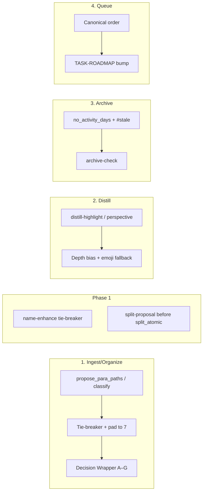

# Post-Process Stabilizers (Variance Dampeners)

**Doc name**: In backbone and user-facing docs, call this collection **"post-process stabilizers"** or **"variance dampeners"** — avoids over-promising; users want predictable wrappers.

## Context (from your brainstorm)

- **Goal**: Boost consistency without bloating the stack; heuristics run **post-AI**, **non-destructive** where applicable, respect [Vault-Layout](3-Resources/Second-Brain/Vault-Layout.md) exclusions, and gate on confidence (no commit below 85%; snapshot/dry_run before any move).
- **Existing**: Pinned configs ([Second-Brain-Config](3-Resources/Second-Brain-Config.md) → `prompt_defaults`), validation ([Prompt-Crafter-Structure-Detailed](3-Resources/Second-Brain/Prompt-Crafter-Structure-Detailed.md)), confidence bands ([Parameters](3-Resources/Second-Brain/Parameters.md)); minimal heuristics today—only roadmap flows (e.g. [Cursor-Skill-Pipelines-Reference](3-Resources/Second-Brain/Cursor-Skill-Pipelines-Reference.md) § autonomous-express: deterministic phase breakdown; add-roadmap-append provenance append).
- **Vault state**: Docs snapshot 2026-03-06/07; [Backbone](3-Resources/Second-Brain/Backbone.md), [Responsibilities-Breakdown](3-Resources/Second-Brain/Responsibilities-Breakdown.md), [MCP-Tools](3-Resources/Second-Brain/MCP-Tools.md), [Queue-Sources](3-Resources/Second-Brain/Queue-Sources.md), [PARA-Actionability-Rubric](3-Resources/Second-Brain/PARA-Actionability-Rubric.md), [Regression-Stability-Log](3-Resources/Second-Brain/Regression-Stability-Log.md), [System-Audit-Report-2026-03-06](3-Resources/System-Audit-Report-2026-03-06.md) are present and aligned.

---

## 1. Ingest / Organize — Path re-rank and pad to 7

**Where**: After `propose_para_paths` or `obsidian_classify_para` (MCP core group). [MCP-Tools](3-Resources/Second-Brain/MCP-Tools.md) and [para-zettel-autopilot](.cursor/rules/context/para-zettel-autopilot.mdc) already require **pad to exactly 7** candidates for Decision Wrappers (A–G); fallbacks: direct PARA roots + basename, then `3-Resources/Unfiled/`, then `4-Archives/Ingest-YYYY-MM-DD/` per MCP-Tools § propose_para_paths.

**Technique**:

- **Tie-breaker**: Apply [PARA-Actionability-Rubric](3-Resources/Second-Brain/PARA-Actionability-Rubric.md) v1.0 descending order (Projects > Areas > Resources > Archives) when re-ranking or resolving ties in the candidate list returned by the AI/MCP.
- **Pad to 7**: Deterministic fallback list when `candidates.length < 7`: fill remaining slots from a fixed sequence (e.g. `1-Projects/<basename>`, `2-Areas/<basename>`, `3-Resources/<basename>`, `3-Resources/Unfiled/<basename>`, …) so every wrapper has exactly 7 options per [Templates](3-Resources/Second-Brain/Templates.md) / [User-Flow-Diagram-Detailed](3-Resources/Second-Brain/Second-Brain-User-Flows/User-Flow-Diagram-Detailed.md).

**Implement**:

- **Ownership**: [subfolder-organize](.cursor/skills/subfolder-organize/SKILL.md) (path proposal) or a small **post-classify heuristic** step invoked by para-zettel-autopilot / full-autonomous-ingest **after** `propose_para_paths` and **before** writing the Decision Wrapper. Prefer a single place (e.g. “candidate normalization” in the ingest rule or a thin helper referenced by the rule) so padding and tie-breaker live together.
- **Tests**: [Testing](3-Resources/Second-Brain/Testing.md) → para-regression suite; add or extend fixture that asserts: (1) fewer than 7 MCP candidates → wrapper still gets 7 options from fallbacks; (2) tie-breaker order when two paths tie (e.g. project vs area). Measure **flip-rate delta** in [Regression-Stability-Log](3-Resources/Second-Brain/Regression-Stability-Log.md) after enabling.

**Safety**: Heuristic **proposes only**; no move without `approved: true`, per-change snapshot, and `obsidian_move_note` dry_run then commit per [mcp-obsidian-integration](.cursor/rules/always/mcp-obsidian-integration.mdc).

---

## 2. Distill / Highlights — Depth bias and emoji fallback

**Where**: Post `distill-highlight-color` or `highlight-perspective-layer` ([Skills](3-Resources/Second-Brain/Skills.md) → distill chain). Low-risk (purely additive).

**Technique**:

- **Bias toward core (🔵)** for short notes or user `<mark>` sections: treat as core/drift 0 when assigning/normalizing `data-drift-level`. Threshold and toggles **configurable** via config (see below).
- **Emoji fallback**: Emit emoji indicators (🔵 core, 🟢 supporting, ⚪ fading) **only when mobile context is detected** (e.g. user-agent in MCP or Commander "Mobile Mode" flag). Otherwise keep CSS gradients on desktop.

**Implement**:

- **Ownership**: Post-process block inside [distill-highlight-color](.cursor/skills/distill-highlight-color/SKILL.md) or [layer-promote](.cursor/skills/layer-promote/SKILL.md) (after highlight-perspective-layer). Add a short post-pass: word-count < 300 or presence of user `<mark>` → nudge drift toward 0 for TL;DR/depth; optional emoji injection when “mobile” or “emoji_fallback” is set (config or frontmatter).
- **Logging**: In [Distill-Log](3-Resources/Second-Brain/Logs.md), log applied bias explicitly, e.g. `heuristic: short-note-core-bias applied (248 words < 300)`. Include `loop`_* if refined.

**Safety**: Additive only; confidence gates unchanged.

---

## 3. Archive — Confidence-floor boost (no_activity_days + #stale)

**Where**: Inside [archive-check](.cursor/skills/archive-check/SKILL.md) in autonomous-archive. Weakest signal-to-noise of the four; avoid forcing archive (reduces false positives).

**Technique**:

- **Do not** force-propose archive when `no_activity_days` exceeded alone. Instead: **raise confidence floor by +5–8%** when **both** conditions are met: (1) `age > config.no_activity_days` (e.g. 60; add to [Second-Brain-Config](3-Resources/Second-Brain-Config.md) § archive if missing), (2) note contains tag `#stale` or `#review-later`. Effect: pushes marginal cases from mid to high band (fewer refinement loops); still proposal-only. **Safety guard**: **Never** apply to notes with `status: active` or `status: evergreen` in frontmatter. If `no_activity_days > 60` (from [Second-Brain-Config](3-Resources/Second-Brain-Config.md) § archive; add `no_activity_days: 60` if not present—currently only `age_days: 180` is in config; archive-check already documents “default 90/60”), **force propose** archive (do not auto-skip).

**Implement**:

- **Ownership**: Post-process block **inside** [archive-check](.cursor/skills/archive-check/SKILL.md); read config; apply floor bump only when both conditions hold and status is not active/evergreen.
- **Tests**: [Testing](3-Resources/Second-Brain/Testing.md) → integration/archive; fixture with age > 60 + #stale, no status: active/evergreen → assert confidence floor bump; fixture with status: active → assert no bump.

**Safety**: Proposal only; move to `4-Archives/` only after snapshot and dry_run; never process notes already under Archives/ (Vault-Layout exclusions).

---

## 4. Queue dispatch — Canonical order + confidence-conditional TASK-ROADMAP bump

**Where**: In [auto-eat-queue](.cursor/rules/context/auto-eat-queue.mdc) Step 4 (Ordering). Safest change (reordering only, no content mutation).

**Technique**:

- **Enforce canonical order**: Already in place.
- **Bump conditional on confidence**: When the **originating note** (for the queue entry) has **conf ≥ 90%**, move **TASK-ROADMAP** (and optionally EXPAND-ROAD / TASK-TO-PLAN-PROMPT) a **priority bump** when the note’s `project-id` (or path) matches a project context—e.g. sort TASK-ROADMAP immediately after INGEST for that file so roadmap flows run before generic DISTILL/EXPRESS for the same note. Document the rule so it is deterministic (e.g. “same source_file: INGEST, then TASK-ROADMAP, then EXPAND-ROAD, then TASK-TO-PLAN-PROMPT, then others by canonical order”).

**Implement**:

- **Ownership**: Post-process inside [auto-eat-queue](.cursor/rules/context/auto-eat-queue.mdc) Step 4. When grouping by `source_file`, if note confidence ≥ 90%, within-group order = INGEST → ORGANIZE → TASK-ROADMAP → EXPAND-ROAD → TASK-TO-PLAN-PROMPT → rest by canonical order; else use existing canonical order. No new MCP calls.

**Safety**: Non-destructive (dispatch order only).

---

## 5. Name-enhance tie-breaker (Phase 1)

**Where**: After [name-enhance](.cursor/skills/name-enhance/SKILL.md) produces multiple candidate filenames (or when re-ranking suggested names); same skill family as ingest (subfolder-organize → name-enhance). Used in **organize** and **NAME-REVIEW** queue; ingest already uses suggested_name from name-enhance without applying rename.

**Technique (tie-break order)**:

1. Prefer candidate that **matches [Naming-Conventions](3-Resources/Second-Brain/Naming-Conventions.md)** format: `kebab-slug-YYYY-MM-DD-HHMM` (slug first, date-time at end).
2. If tied: **shorter slug length** (fewer chars).
3. If still tied: **alphabetically first** slug.

**Implement**:

- **Frontmatter**: When heuristic re-ranks or picks a name: set `heuristic_adjusted: true`, `heuristic_reason: "name-enhance tie-breaker per Naming-Conventions"` on the note (or in the name-enhance output structure used by the pipeline).
- **Logging**: Log to **Organize-Log** or **Name-Review-Log** per [Logs](3-Resources/Second-Brain/Logs.md) with a line that includes e.g. `heuristic: name-enhance tie-breaker applied`, old_stem, suggested_name, confidence.
- **Ownership**: [name-enhance](.cursor/skills/name-enhance/SKILL.md) skill — add a post-process block that applies the tie-break when multiple valid names exist; same pattern as ingest path re-rank (deterministic, no new skill file).
- **Safety**: Renames (or propose-only in ingest) already gated by existing confidence + dry_run + snapshot per [mcp-obsidian-integration](.cursor/rules/always/mcp-obsidian-integration.mdc); name-enhance already documents apply only at ≥85% (organize/name-review). Zero new risk.
- **Tests / measurement**: NAME-REVIEW queue runs; add a row to [Regression-Stability-Log](3-Resources/Second-Brain/Regression-Stability-Log.md) for filename flip-rate or consistency metric if desired.

**Rationale**: Directly extends the ingest/organize stabilizer; high user-visible variance (flaky filenames); low effort (copy ingest tie-breaker, swap PARA rubric for Naming-Conventions rules).

---

## 6. Split / atomicity proposal heuristic (Phase 1)

**Where**: In full-autonomous-ingest chain, **before** `obsidian_split_atomic` is called (or as a thin pre-step that proposes split points). Current flow: classify_para → … → subfolder-organize → (confidence gate) → **split_atomic** → split-link-preserve → distill_note → … ([Cursor-Skill-Pipelines-Reference](3-Resources/Second-Brain/Cursor-Skill-Pipelines-Reference.md), [Pipelines](3-Resources/Second-Brain/Pipelines.md)).

**Technique (deterministic proposal rules)**:

- **Prefer splits at H2/H3 headings** (e.g. `##`, `###`).
- If **multiple same-level headings** qualify: take **first occurrence** (document order).
- **Tie-break**: **shorter heading text first** (more atomic intent).
- If **no clear headings**: propose **single split at ~400–600 word boundary** (configurable in [Second-Brain-Config](3-Resources/Second-Brain-Config.md) or [Parameters](3-Resources/Second-Brain/Parameters.md), e.g. `split_fallback_word_boundary_min: 400`, `split_fallback_word_boundary_max: 600`).

**Behaviour**: Heuristic is **100% proposal-only** when confidence < 85%: output proposed split points and add **#review-needed** callout; **do not** call `obsidian_split_atomic`. When confidence ≥ 85%, pipeline may use the proposed points to inform the MCP call (or leave MCP to decide); existing snapshot-before-split and confidence gates unchanged.

**Implement**:

- **Ownership**: Either (a) logic inside [para-zettel-autopilot](.cursor/rules/context/para-zettel-autopilot.mdc) that runs before `obsidian_split_atomic`, or (b) a **tiny post-split processor / pre-split proposal** helper invoked by the ingest rule (no new skill file if the logic lives in the rule; otherwise one minimal skill e.g. "split-proposal" that returns proposed split points). Prefer (a) to avoid new skill files per §7 "Where stabilizers live".
- **Safety**: Never auto-apply split below 85%; always proposal + #review-needed when below threshold. Pairs with existing snapshot-before-split and confidence bands.
- **Tests**: Ingest fixture with multi-heading note; assert proposed split points follow H2/H3 → first occurrence → shorter heading; fixture with no headings asserts fallback word-boundary proposal.

**Rationale**: Lives in same ingest chain; bad split points → manual cleanup; proposal-only below high conf; better splits → cleaner content → more confident classify_para and stabler wrappers.

---

## 7. Rollout and extensibility

**Start small**:

- **Prototype**: Implement **ingest padding + tie-breaker** first (candidate normalization post–propose_para_paths). Add a test in `tests/` (e.g. unit test for “pad to 7” and “tie-breaker order”) and run para-regression per [Regression-Stability-Log](3-Resources/Second-Brain/Regression-Stability-Log.md) Baseline Run Procedure.
- **Measure**: Add **one new row** to [Regression-Stability-Log](3-Resources/Second-Brain/Regression-Stability-Log.md) before and after each stabilizer is enabled. Metrics: **flip-rate %** on para-regression suite + **average pre/post_loop_conf delta**; target flip-rate remains <10%.
- **Document**: Add a short “Heuristics” subsection to [System-Audit-Report-2026-03-06](3-Resources/System-Audit-Report-2026-03-06.md) (or next run’s audit) listing: ingest (tie-breaker + pad-to-7), distill (depth bias + emoji fallback), archive (no_activity_days + #stale), queue (canonical order + TASK-ROADMAP bump).

**Extensibility**: If ingest heuristics reduce flip-rate and feel stable, the **name-enhance tie-breaker** (§5) forks the same pattern: deterministic tie-break when multiple names are equally valid per [Naming-Conventions](3-Resources/Second-Brain/Naming-Conventions.md).

**Vault verification**: If the vault has changed since 2026-03-06, confirm scope and exclusions in [System-Audit-Report-2026-03-06](3-Resources/System-Audit-Report-2026-03-06.md) before rolling out heuristics.

### Where stabilizers live (no new skill files)

Post-process blocks **inside** existing skills/rules only; keeps `.cursor/skills/` count low:

- **Ingest/organize**: [subfolder-organize](.cursor/skills/subfolder-organize/SKILL.md)
- **Name-enhance**: [name-enhance](.cursor/skills/name-enhance/SKILL.md)
- **Split proposal**: [para-zettel-autopilot](.cursor/rules/context/para-zettel-autopilot.mdc) (or thin helper before obsidian_split_atomic)
- **Distill/highlights**: [distill-highlight-color](.cursor/skills/distill-highlight-color/SKILL.md) or [layer-promote](.cursor/skills/layer-promote/SKILL.md)
- **Archive**: [archive-check](.cursor/skills/archive-check/SKILL.md)
- **Queue order**: [auto-eat-queue](.cursor/rules/context/auto-eat-queue.mdc)

### Changelog discipline

Every time you add or tweak a stabilizer:

1. Update the skill/rule `.mdc` (or SKILL.md) file.
2. Sync to `.cursor/sync/rules` and `.cursor/sync/skills` per [backbone-docs-sync](.cursor/rules/always/backbone-docs-sync.mdc).
3. Append **one line** to the backbone changelog (e.g. `3-Resources/Second-Brain/changelog.md` or the sync target in backbone-docs-sync).

**Example changelog line**: `2026-03-07: Added PARA-rubric tie-breaker post-processing to subfolder-organize skill`

---

## 8. Research-backed extensions (optional)

Findings from ML/RL and industry practice: **ensembles/self-consistency** cut variance 20–50% in judge-style tasks; **calibration and thresholding** tie heuristics to confidence; **hybrid systems** (heuristics + AI) often beat pure AI in sparse/high-dim settings. Slot these as **optional** enhancements so the core four heuristics ship first; add only if flip-rate or #review-needed justify the extra cost.

### 8.1 Mid-band self-consistency (ingest)

- **Idea**: In mid-band (68–84%), instead of a single refinement loop, run **2–3 quick** `propose_para_paths` (or classify) calls with **perturbed params** (e.g. `rationale_style`: concise vs detailed; or different `context_mode`). **Majority-vote** on top path (or top-k); use result as post_loop_conf input.
- **Benefit**: Reduces flip-rate; can boost post_loop_conf floor (+5–10%) and fewer #review-needed entries in [Logs](3-Resources/Second-Brain/Logs.md).
- **Cost**: 2–3× MCP calls in mid-band only; high band skips for speed.
- **Implement**: Optional branch in para-zettel-autopilot / full-autonomous-ingest when `pre_loop_conf` in mid-band; config flag e.g. `self_consistency_mid_band: true` in [Second-Brain-Config](3-Resources/Second-Brain-Config.md).

### 8.2 Counterfactual perturbation + variance threshold

- **Idea**: Post–classify_para, **perturb** input (e.g. rephrase summary or shuffle candidate order) and re-run ranking; compute **variance** (e.g. rank change magnitude). If variance > threshold (e.g. 20%), **flag** as low-quality proposal and route to fallback (e.g. deterministic path per [MCP-Tools](3-Resources/Second-Brain/MCP-Tools.md) low-quality fallback).
- **Trigger**: Mid/low band only; high band skips.
- **Implement**: Optional step after propose_para_paths; document threshold in [Parameters](3-Resources/Second-Brain/Parameters.md) (e.g. `heuristic_variance_threshold_pct: 20`).

### 8.3 Confidence-weighted queue and mid-band threshold

- **Queue**: When multiple entries share `source_file`, **weight TASK-ROADMAP** (and EXPAND-ROAD / TASK-TO-PLAN-PROMPT) higher when **conf > 90%** for that note (e.g. bump after INGEST within same-file group). Complements §4 (canonical order + bump).
- **Mid-band heuristic gate**: Optional `**heuristic_mid_threshold: 75`** in [Parameters](3-Resources/Second-Brain/Parameters.md): below this, apply simple rules (e.g. #stale bias for archive, tie-breaker for ingest) and **recalibrate** post-heuristic to possibly push into high band; above 75% but below 85%, run refinement loop as today.
- **Implement**: auto-eat-queue Step 4 (ordering + confidence-aware bump when conf available); confidence-loops / pipeline rules read `heuristic_mid_threshold` from config when present.

### 8.4 Logprobs / confidence calibration (stub)

- **Idea**: If MCP or LLM ever exposes **token-level logprobs**, average for an overall confidence; use to calibrate (e.g. low avg logprob → deterministic fallback). No change to current stack until such an API exists; document in [MCP-Tools](3-Resources/Second-Brain/MCP-Tools.md) as optional future (“rationale_style + logprob sim” or similar).

**Testing**: Prototype any of 8.1–8.3 in [Testing](3-Resources/Second-Brain/Testing.md) fixtures; measure flip-rate and #review-needed in [Regression-Stability-Log](3-Resources/Second-Brain/Regression-Stability-Log.md) before/after. Document in next [System-Audit-Report](3-Resources/System-Audit-Report-2026-03-06.md) run.

---

## 9. Doc and sync updates

- **[Pipelines](3-Resources/Second-Brain/Pipelines.md)** / **[Skills](3-Resources/Second-Brain/Skills.md)** / **[MCP-Tools](3-Resources/Second-Brain/MCP-Tools.md)**: Add one short line each under the relevant pipeline/skill/tool describing the heuristic (e.g. “Post-AI: pad to 7 candidates; tie-break by PARA-Actionability-Rubric” for ingest; “Depth bias for <300w and user marks; emoji fallback” for distill; “no_activity_days > 60 and #stale bias” for archive; “Canonical order + TASK-ROADMAP bump per source_file” for queue). **Phase 1**: **name-enhance** — tie-break by Naming-Conventions (kebab+date-time, shorter slug, alpha); log to Organize-Log or Name-Review-Log; heuristic_adjusted/heuristic_reason. **Split proposal** — H2/H3 first, first occurrence, shorter heading; fallback word-boundary (config keys split_fallback_word_boundary_min/max); proposal-only below 85%, #review-needed callout.
- **[Logs](3-Resources/Second-Brain/Logs.md)** / **[Parameters](3-Resources/Second-Brain/Parameters.md)**: Name-enhance: log heuristic line to Organize-Log or Name-Review-Log; split: document config keys for fallback word boundary; #review-needed when split proposed below 85%.
- **[Backbone](3-Resources/Second-Brain/Backbone.md)**: Optionally add a bullet under “Remaining gaps (mitigated)” or a new “Heuristics” line: low-variance post-AI steps (ingest pad/tie-breaker, name-enhance tie-breaker, split proposal, distill depth/emoji, archive age/stale, queue order) for consistency; all gated by existing confidence and safety.
- **[.cursor/sync/](.cursor/sync/)**: Update sync copies of any modified rules/skills; append one line to changelog (e.g. `3-Resources/Second-Brain/changelog.md` or sync target per [backbone-docs-sync](.cursor/rules/always/backbone-docs-sync.mdc)). Example: `2026-03-07: Added PARA-rubric tie-breaker post-processing to subfolder-organize skill`.

---

## Summary diagram

All heuristics (including Phase 1: name-enhance tie-breaker, split proposal) are **post-AI**, **non-destructive** where applicable, and **respect 85% + snapshot + dry_run** before any move.