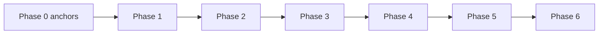

# Distilled core — genesis-mythos-master

## Phase 0 anchors

- **Workflow log clocks:** In [[workflow_state]] **## Log**, human **Timestamp** + **`monotonic_log_timestamp`** establish **run order**; **`telemetry_utc`** correlates queue hand-offs / validators and may differ when **`clock_corrected`** is present — not automatically an incoherence.

- Master goal: [[Source-genesis-mythos-master-goal-2026-03-30-0430]]
- Roadmap state: [[roadmap-state]]
- Workflow state: [[workflow_state]]
- Decisions log: [[decisions-log]]

## Core decisions (🔵)

- **Phase 1 (conceptual):** Four-layer separation (world state / simulation / rendering / input); procedural generation graph with intent injection; named seams for stages, rule hooks, and event bus; safety hooks for snapshot + dry-run before destructive world replacement. Detail: [[Phase-1-Conceptual-Foundation-and-Core-Architecture-Roadmap-2026-03-30-0430]].
- **Conceptual track waiver (rollup / CI / HR):** This project’s design authority on the conceptual track does not claim execution rollup, registry/CI closure, or HR-style proof rows; those are execution-deferred per [[3-Resources/Second-Brain/Docs/Dual-Roadmap-Track|Dual-Roadmap-Track]]. Advisory validator codes (`missing_roll_up_gates`) do not block conceptual completion when deferrals are explicit in phase notes and distilled-core.

## Phase 2.1 pipeline slice (seed→world — partial)

Tertiary **2.1.3** defines **StagedDeltaBundle** composition: merge seams with explicit resolution policies, canonical apply ordering before Stage 4 validation, and consistency with validation labels from **2.1.2**. Detail: [[Phase-2-1-3-Staged-Delta-Bundles-Merge-Seams-and-Apply-Ordering-Roadmap-2026-03-30-1041]]; decision record: [[Conceptual-Decision-Records/deepen-phase-2-1-3-tertiary-2026-03-30-1041]]. Sharded commit and binary delta formats are execution-deferred.

Tertiary **2.1.4** adds **BundleIdentity**, **SeamCatalogRevision**, replay-equivalence, and **BundleDiffSummary** — logical identity keys and catalog monotonicity; cryptographic hashes and on-disk manifests remain execution-deferred. Detail: [[Phase-2-1-4-Bundle-Identity-Seam-Catalog-Stability-and-Replay-Diff-Roadmap-2026-03-30-2305]]; CDR: [[Conceptual-Decision-Records/deepen-phase-2-1-4-tertiary-2026-03-30-2305]].

## Phase 2.2 intent resolver slice (2.2.1-2.2.5 closed)

Tertiary **2.2.1** defines **canonical intent envelopes** and **identity binding** (actor, channel, frame; dedupe/idempotency) so resolver stages classify and resolve comparable records. Cryptographic proof of origin and transport details remain execution-deferred. Detail: [[Phase-2-2-1-Intent-Envelope-Normalization-and-Identity-Binding-Roadmap-2026-03-30-2338]]; CDR: [[Conceptual-Decision-Records/deepen-phase-2-2-1-tertiary-2026-03-30-2338]].

Tertiary **2.2.2** defines schema validation/classification against **HookSchemaCatalog** and deterministic mapping to **HookPayloadOutline** (including explicit defer behavior on ambiguous cases). Detail: [[Phase-2-2-2-Validate-Classify-Schema-and-Hook-Mapping-Roadmap-2026-03-31-0001]]; CDR: [[Conceptual-Decision-Records/deepen-phase-2-2-2-tertiary-2026-03-31-0001]].

Tertiary **2.2.3** defines deterministic conflict-resolution, priority ordering, and merge-policy matrix before emission. Detail: [[Phase-2-2-3-Conflict-Resolution-Priority-Ordering-and-Merge-Policy-Roadmap-2026-03-31-0002]]; CDR: [[Conceptual-Decision-Records/deepen-phase-2-2-3-tertiary-2026-03-31-0002]].

Tertiary **2.2.4** defines deterministic hook emission envelopes and a pre-commit payload handoff that preserves replay safety and commit isolation. Detail: [[Phase-2-2-4-Deterministic-Hook-Emission-Envelope-and-Pre-Commit-Payload-Handoff-Roadmap-2026-03-31-0003]]; CDR: [[Conceptual-Decision-Records/deepen-phase-2-2-4-tertiary-2026-03-31-0003]].

Tertiary **2.2.5** defines validation-label semantics and deterministic chunk ordering boundaries for large pre-commit bundles. Detail: [[Phase-2-2-5-Envelope-Validation-Labels-and-Bundle-Chunk-Ordering-Boundary-Roadmap-2026-03-31-0004]]; CDR: [[Conceptual-Decision-Records/deepen-phase-2-2-5-tertiary-2026-03-31-0004]].

## Phase 3 living simulation (primary checklist complete; **primary rollup** complete — `phase3_primary_rollup_post_34: complete`, `handoff_readiness` **86**; secondaries **3.1** + **3.2** + **3.3** + **3.4** minted; tertiaries **3.1.1–3.1.5** + **3.2.1**–**3.2.3** + **3.3.1** + **3.3.2** + **3.4.1** minted; **3.1** chain complete; **3.2.1–3.2.3** tertiary chain complete; **secondary 3.2 rollup** complete — `handoff_readiness` **86**; **tertiary chain 3.3.1–3.3.2** structurally complete; **secondary 3.3 rollup** complete — `handoff_readiness` **86**; **tertiary 3.4.1** minted — `handoff_readiness` **85**; **tertiary chain under 3.4** structurally complete; **secondary 3.4 rollup** complete — `handoff_readiness` **86**; Phase **3** structurally complete; **`advance-phase`** Phase **3→4** executed; Phase **4** completed through **primary rollup**; **`advance-phase`** Phase **4→5** executed; **`advance-phase`** Phase **5→6** **executed** 2026-04-05 (`advance-phase-p5-to-p6-gmm-post-52-idempotent-20260405T120500Z`); **authoritative** [[workflow_state]] cursor: **`current_phase: 6`**, **`current_subphase_index: \"6.1\"`** (post–Phase **6 primary**; see [[roadmap-state]] + **## Phase 5**/**## Phase 6** below); Phase **4 primary** checklist complete; **secondary 4.1 rollup complete**; **secondary 4.2 rollup complete**; **Phase 4 primary rollup** complete (`phase4_primary_rollup_nl_gwt: complete`); **tertiary chain 4.2.1–4.2.3** complete; **Phase 5** **complete** — secondary **5.1** [[Phase-5-1-Rule-Primitives-Plugin-Host-and-Conflict-Precedence-Roadmap-2026-04-03-2330]] **restored + rollup complete 2026-04-04** (`handoff_readiness` **86**; CDR [[Conceptual-Decision-Records/deepen-phase-5-1-secondary-rollup-nl-gwt-2026-04-04-1815]]); tertiaries **5.1.1** [[Phase-5-1-1-Ruleset-Manifest-Seam-Admission-and-Deterministic-Evaluation-Order-Roadmap-2026-04-04-0010]] + **5.1.2** [[Phase-5-1-2-Kernel-Evaluation-Schedule-and-Rule-Ordering-Roadmap-2026-04-04-0715]] + **5.1.3** [[Phase-5-1-3-Precedence-Conflict-Matrix-and-Cross-Seam-Resolution-Roadmap-2026-04-04-1209]] **on disk**; **Phase 5 primary rollup** complete (CDR [[Conceptual-Decision-Records/deepen-phase-5-primary-rollup-nl-gwt-2026-04-04-1930]]); secondary **5.2 rollup** complete on [[Phase-5-2-Ecosystem-Generator-Event-Style-Swap-Documentation-Seam-Roadmap-2026-04-04-2100]] (rollup CDR [[Conceptual-Decision-Records/deepen-phase-5-2-secondary-rollup-nl-gwt-2026-04-05-0005]]) + tertiary **5.2.1** [[Phase-5-2-1-Slot-Bundle-Identity-Taxonomy-and-RulesetManifest-Seam-Vocabulary-Roadmap-2026-04-04-2208]] + tertiary **5.2.2** [[Phase-5-2-2-Cross-Bundle-Compatibility-Matrix-and-Multi-Bundle-Session-Outcomes-Roadmap-2026-04-04-2335]] + tertiary **5.2.3** [[Phase-5-2-3-Worked-Examples-Replay-Narratives-Roadmap-2026-04-03-2135]] minted; archive [[1-Projects/genesis-mythos-master/Roadmap/Branches/phase-5-1-secondary-rollback-2026-04-02/ROLLBACK-MANIFEST-2026-04-02]]))

**Primary** Phase 3 establishes NL **Scope / Behavior / Interfaces / Edge cases / Open questions / Pseudo-code readiness** for a **tick-based** simulation with **DM overwrite classes** (live tweak vs structural regen), **simulation vs rendering** separation, and **event bus** integration as the cross-cutting seam—without shipping engine APIs at primary depth. **Primary rollup** adds **GWT-3-A–K** vs secondaries **3.1–3.4** + **3.4.1** evidence; **`handoff_readiness` 86** on [[Phase-3-Living-Simulation-and-Dynamic-Agency-Roadmap-2026-03-30-0430]]; CDRs: [[Conceptual-Decision-Records/deepen-phase-3-primary-checklist-living-simulation-2026-03-30-1200]], [[Conceptual-Decision-Records/deepen-phase-3-primary-rollup-nl-gwt-2026-04-03-1812]]. **Secondary 3.1** — [[Phase-3-1-Sim-Tick-and-Event-Bus-Spine-Roadmap-2026-03-30-2213]] — names **sim tick cadence** + **event bus spine** (`handoff_readiness` **84**); CDR: [[Conceptual-Decision-Records/deepen-phase-3-1-secondary-sim-tick-event-bus-spine-2026-03-30-2213]]. **Tertiary 3.1.1** — [[Phase-3-1-1-Event-Bus-Ordering-and-Pub-Sub-Lanes-Roadmap-2026-03-30-1830]] — **lane total order** + **pub/sub registration** (`handoff_readiness` **85**); CDR: [[Conceptual-Decision-Records/deepen-phase-3-1-1-tertiary-ordering-pub-sub-2026-03-30-1830]]. **Tertiary 3.1.2** — [[Phase-3-1-2-Tick-Scheduling-Defer-Merge-and-Work-Queue-Policy-Roadmap-2026-04-02-0020]] — **work queue** + **defer-merge policy** (`handoff_readiness` **85**); CDR: [[Conceptual-Decision-Records/deepen-phase-3-1-2-tertiary-tick-scheduling-defer-merge-2026-04-02-0020]]. **Tertiary 3.1.3** — [[Phase-3-1-3-Sim-Visible-Classification-and-DM-Overwrite-Channel-Mapping-Roadmap-2026-04-02-0035]] — **sim-visible classification** + **DM overwrite channel mapping** (`handoff_readiness` **85**); CDR: [[Conceptual-Decision-Records/deepen-phase-3-1-3-tertiary-dm-overwrite-channel-mapping-2026-04-02-0035]]. **Tertiary 3.1.4** — [[Phase-3-1-4-Persistence-Checkpoint-Boundaries-Roadmap-2026-04-02-2240]] — **persistence checkpoint boundaries** (`handoff_readiness` **85**); CDR: [[Conceptual-Decision-Records/deepen-phase-3-1-4-tertiary-persistence-checkpoints-2026-04-02-2240]]. **Tertiary 3.1.5** — [[Phase-3-1-5-Agency-Actor-Drivers-and-Intent-Scheduling-Roadmap-2026-04-02-2250]] — **actor lanes** + **intent → WorkItem** scheduling (`handoff_readiness` **85**); CDR: [[Conceptual-Decision-Records/deepen-phase-3-1-5-tertiary-agency-actor-drivers-2026-04-02-2250]]. **Secondary 3.2** — [[Phase-3-2-Simulation-Rendering-Decoupling-and-Observation-Channels-Roadmap-2026-04-02-2300]] — **observation channels** + **preview vs committed session** — **rollup complete** (`handoff_readiness` **86**; **GWT-3.2-A–K**); CDRs: [[Conceptual-Decision-Records/deepen-phase-3-2-secondary-simulation-rendering-2026-04-02-2300]], [[Conceptual-Decision-Records/deepen-phase-3-2-secondary-rollup-nl-gwt-2026-04-02-2355]]. **Tertiary 3.2.1** — [[Phase-3-2-1-Observation-Channel-Taxonomy-Roadmap-2026-03-30-2310]] — **observation channel taxonomy** vs **3.1.1** lanes + **preview_shadow** / committed boundary (`handoff_readiness` **85**); CDR: [[Conceptual-Decision-Records/deepen-phase-3-2-1-observation-channel-taxonomy-2026-03-30-2310]]. **Tertiary 3.2.2** — [[Phase-3-2-2-Freshness-Drift-Policy-Classes-Roadmap-2026-04-02-2350]] — **freshness** (**tick_aligned** vs **frame_aligned**) + **drift** (**semantic_drift_bounded** vs **display_lag_disclosed**) policy classes on **3.2.1** **ObservationChannel**, aligned to **3.1.2** / **3.1.4** / **3.1.1** (`handoff_readiness` **85**); CDR: [[Conceptual-Decision-Records/deepen-phase-3-2-2-freshness-drift-policy-2026-04-02-2350]]. **Tertiary 3.2.3** — [[Phase-3-2-3-UX-D3-1-5-Binding-Surfaces-Roadmap-2026-03-30-2319]] — **UX binding surfaces** for **D-3.1.5-*** + **3.2.1**/**3.2.2** (`handoff_readiness` **85**); CDR: [[Conceptual-Decision-Records/deepen-phase-3-2-3-ux-d3-1-5-binding-surfaces-2026-03-30-2319]]. **Secondary 3.3** — [[Phase-3-3-Vitality-Consequence-and-Persistence-Cohesion-Roadmap-2026-04-03-0005]] — **vitality / consequence / persistence cohesion** — **rollup complete** (`handoff_readiness` **86**; **GWT-3.3-A–K**); CDRs: [[Conceptual-Decision-Records/deepen-phase-3-3-secondary-vitality-consequence-persistence-2026-04-03-0005]], [[Conceptual-Decision-Records/deepen-phase-3-3-secondary-rollup-nl-gwt-2026-04-03-0030]]. **Tertiary 3.3.1** — [[Phase-3-3-1-Vitality-Consequence-Persistence-Cohesion-Seams-Roadmap-2026-04-03-0012]] — **cohesion seams** + **GWT-3.3-A–F** (`handoff_readiness` **85**); CDR: [[Conceptual-Decision-Records/deepen-phase-3-3-1-cohesion-seams-2026-04-03-0012]]. **Tertiary 3.3.2** — [[Phase-3-3-2-Consequence-Durability-Matrix-and-Persistence-Invariants-Roadmap-2026-04-03-0020]] — **durability matrix** + **persistence invariants** + **GWT-3.3-G–K** (`handoff_readiness` **85**); CDR: [[Conceptual-Decision-Records/deepen-phase-3-3-2-consequence-durability-matrix-2026-04-03-0020]]. **Secondary 3.4** — [[Phase-3-4-Downstream-Handoff-and-Phase-4-Readiness-Roadmap-2026-04-03-0100]] — **downstream handoff + Phase 4 readiness** — **rollup complete** (`handoff_readiness` **86**; **GWT-3.4-A–K** vs **3.4.1**); CDRs: [[Conceptual-Decision-Records/deepen-phase-3-4-secondary-downstream-handoff-phase-4-readiness-2026-04-03-0100]], [[Conceptual-Decision-Records/deepen-phase-3-4-secondary-rollup-nl-gwt-2026-04-03-0130]]. **Tertiary 3.4.1** — [[Phase-3-4-1-Handoff-Seam-Catalog-and-Consumer-Contract-Rows-Roadmap-2026-04-03-0115]] — **handoff seam catalog** + **consumer contract rows** (`handoff_readiness` **85**; **GWT-3.4.1-A–K**); CDR: [[Conceptual-Decision-Records/deepen-phase-3-4-1-handoff-seam-catalog-consumer-rows-2026-04-03-0115]]. **Canonical routing:** Phase **3** complete (primary rollup + **GWT-3-A–K**); **`advance-phase`** Phase **3→4** executed (`followup-advance-phase-p3-to-p4-gmm-post-hygiene-repair-20260330T182500Z`); Phase **4 primary** checklist + **primary rollup** complete (`phase4_primary_checklist: complete`, `phase4_primary_rollup_nl_gwt: complete`, `handoff_readiness` **86** on [[Phase-4-Perspective-Split-and-Control-Systems-Roadmap-2026-03-30-0430]]; CDR [[Conceptual-Decision-Records/deepen-phase-4-primary-rollup-nl-gwt-2026-03-31-1200]]); **secondary 4.1 rollup complete** (`handoff_readiness` **86**) and **secondary 4.2 rollup complete** (`handoff_readiness` **86**) with CDRs [[Conceptual-Decision-Records/deepen-phase-4-2-secondary-session-orchestration-perspective-control-coherence-2026-04-03-2120]], [[Conceptual-Decision-Records/deepen-phase-4-2-secondary-rollup-nl-gwt-2026-04-03-2200]]. **tertiary chain 4.2.1–4.2.3** complete ([[Phase-4-2-1-Session-Scoped-Orchestration-Hooks-and-Perspective-Transition-Graph-Roadmap-2026-04-03-2125]], [[Phase-4-2-2-Transition-Outcome-Ledger-and-Lane-Projection-Parity-Roadmap-2026-03-31-1200]], [[Phase-4-2-3-Replay-Closure-Orchestration-Repair-and-Operator-Escalation-Readout-Roadmap-2026-03-31-1500]]). **`advance-phase`** Phase **4→5** then **5→6** **executed** — **authoritative** [[workflow_state]]: **`current_phase: 6`**, **`current_subphase_index: \"6.1\"`** — Phase **5** secondaries **5.1** + **5.2** **rollup complete**; tertiaries **5.2.1–5.2.3** minted; Phase **6 primary** checklist **complete** on [[Phase-6-Prototype-Assembly-Testing-and-Iteration-Roadmap-2026-03-30-0430]] (CDR [[Conceptual-Decision-Records/deepen-phase-6-primary-checklist-prototype-assembly-2026-04-05-1510]]); **canonical** next **mint** secondary **6.1** per [[workflow_state]] (see **## Phase 5** + **## Phase 6**); **supersedes** pre-rollup interim text that read **`\"5.2\"`** + “next = secondary **5.2** rollup”. Evidence trail: **3.1** chain **3.1.1–3.1.5**; **3.2** rollup + **3.2.1–3.2.3**; **3.3** rollup + **3.3.1–3.3.2**; **3.4** rollup + **3.4.1**; Phase **3** primary rollup CDR [[Conceptual-Decision-Records/deepen-phase-3-primary-rollup-nl-gwt-2026-04-03-1812]]. Continuity: Phase **2.7.3** shadow-to-live / first committed tick trace feeds admission into living simulation without re-deriving **2.4**/**2.5** semantics.

## Phase 4 perspective split (primary checklist complete; **primary rollup** complete — `phase4_primary_rollup_nl_gwt: complete`, `handoff_readiness` **86**; **secondary 4.1 rollup complete**; **secondary 4.2 rollup complete**; **tertiary chain 4.2.1–4.2.3** complete; Phases **4→5** and **5→6** advances executed — **canonical** cursor: Phase **6** / [[workflow_state]] + [[roadmap-state]])

**Primary** Phase 4 establishes NL **Scope / Behavior / Interfaces / Edge cases / Open questions / Pseudo-code readiness** for **player first-person**, **DM free-flight + orthographic tabletop**, and **camera interpolator** contracts—while **consuming** **3.4.1** **SeamId** / consumer rows and **3.2.x** **ObservationChannel** authority (**preview_shadow** vs **committed_session**) without inventing a second sim truth. **Primary rollup** adds **GWT-4-A–K** evidence vs secondaries **4.1** + **4.2**; **`handoff_readiness` 86** on [[Phase-4-Perspective-Split-and-Control-Systems-Roadmap-2026-03-30-0430]]; CDRs [[Conceptual-Decision-Records/deepen-phase-4-primary-checklist-perspective-2026-03-30-1900]], [[Conceptual-Decision-Records/deepen-phase-4-primary-rollup-nl-gwt-2026-03-31-1200]]. **Secondary 4.1** — [[Phase-4-1-Narrative-Rendering-and-Consumer-Surface-Lanes-Roadmap-2026-04-03-2015]] — **narrative** vs **rendering** consumer lanes + **GWT-4.1-A–K**; rollup complete at **86**; CDRs [[Conceptual-Decision-Records/deepen-phase-4-1-secondary-narrative-rendering-consumer-lanes-2026-04-03-2015]], [[Conceptual-Decision-Records/deepen-phase-4-1-secondary-rollup-nl-gwt-2026-04-03-2115]]. **Tertiary 4.1.1** — [[Phase-4-1-1-Lane-Adapters-Emphasis-and-GWT-Narrowing-Roadmap-2026-04-03-2016]]; **4.1.2** — [[Phase-4-1-2-Cross-Lane-Coherence-and-Emphasis-Reconciliation-Roadmap-2026-03-30-1200]]; **4.1.3** — [[Phase-4-1-3-Consumer-Surface-Framing-and-Presentation-Time-Validation-Roadmap-2026-04-03-2110]]; **tertiary chain 4.1.1–4.1.3** structurally complete. **Secondary 4.2** — [[Phase-4-2-Session-Orchestration-and-Perspective-Control-Coherence-Roadmap-2026-04-03-2120]] — session orchestration + perspective-control coherence — **rollup complete** at **86** (**GWT-4.2-A–K**); CDRs [[Conceptual-Decision-Records/deepen-phase-4-2-secondary-session-orchestration-perspective-control-coherence-2026-04-03-2120]], [[Conceptual-Decision-Records/deepen-phase-4-2-secondary-rollup-nl-gwt-2026-04-03-2200]]. **Tertiary 4.2.1** — [[Phase-4-2-1-Session-Scoped-Orchestration-Hooks-and-Perspective-Transition-Graph-Roadmap-2026-04-03-2125]]; **4.2.2** — [[Phase-4-2-2-Transition-Outcome-Ledger-and-Lane-Projection-Parity-Roadmap-2026-03-31-1200]]; **4.2.3** — [[Phase-4-2-3-Replay-Closure-Orchestration-Repair-and-Operator-Escalation-Readout-Roadmap-2026-03-31-1500]]. **Current canonical routing:** Phases **4→5** and **5→6** **`advance-phase`** rows are complete; [[workflow_state]] is authoritative at **`current_phase: 6`**, **`current_subphase_index: "6.1"`** (Phase **6 primary** **complete**; next **mint** secondary **6.1**). Phase **5** secondary **5.1** rollup complete at [[Phase-5-1-Rule-Primitives-Plugin-Host-and-Conflict-Precedence-Roadmap-2026-04-03-2330]] (`handoff_readiness` **86**; CDR [[Conceptual-Decision-Records/deepen-phase-5-1-secondary-rollup-nl-gwt-2026-04-04-1815]]); tertiaries **5.1.1** [[Phase-5-1-1-Ruleset-Manifest-Seam-Admission-and-Deterministic-Evaluation-Order-Roadmap-2026-04-04-0010]] + **5.1.2** [[Phase-5-1-2-Kernel-Evaluation-Schedule-and-Rule-Ordering-Roadmap-2026-04-04-0715]] + **5.1.3** [[Phase-5-1-3-Precedence-Conflict-Matrix-and-Cross-Seam-Resolution-Roadmap-2026-04-04-1209]] **on disk**; **Phase 5 primary rollup** complete (`phase5_primary_rollup_nl_gwt: complete`; CDR [[Conceptual-Decision-Records/deepen-phase-5-primary-rollup-nl-gwt-2026-04-04-1930]]); secondary **5.2** **rolled up** ([[Phase-5-2-Ecosystem-Generator-Event-Style-Swap-Documentation-Seam-Roadmap-2026-04-04-2100]]; rollup CDR [[Conceptual-Decision-Records/deepen-phase-5-2-secondary-rollup-nl-gwt-2026-04-05-0005]]); tertiaries **5.2.1–5.2.3** on disk. RECAL references for Phase 5 are historical hygiene entries under [[roadmap-state#Consistency reports (RECAL-ROAD)]].

## Phase 5 rule system integration (primary checklist + **primary rollup** complete — `phase5_primary_checklist: complete`, `phase5_primary_rollup_nl_gwt: complete`; secondary 5.1 **rollup complete** 2026-04-04; secondary 5.2 **rollup complete** 2026-04-05; **tertiaries 5.2.1–5.2.3 minted** 2026-04-04; tertiaries 5.1.1–5.1.3 on disk; **`advance-phase`** Phase **5→6** **executed** 2026-04-05 — **Phase 5 complete**; Phase **6 primary** **complete**; next **mint** secondary **6.1** per [[workflow_state]])

**Primary** Phase 5 establishes NL **Scope / Behavior / Interfaces / Edge cases / Open questions / Pseudo-code readiness** for a **core rules engine**, **plugin ruleset registration**, **deterministic conflict resolution**, and **ecosystem seams** (swap generators / events / styles)—while **consuming** Phase **4** session orchestration + **4.1.3** presentation-time validation legibility without bypassing Phase **2** commit / deny / defer semantics. **GWT-5-A–K** binds upstream Phase **3–4** contracts at primary depth with evidence vs rolled-up **5.1**; checklist CDR [[Conceptual-Decision-Records/deepen-phase-5-primary-checklist-rule-system-2026-03-31-1200]]; primary rollup CDR [[Conceptual-Decision-Records/deepen-phase-5-primary-rollup-nl-gwt-2026-04-04-1930]]. **Secondary 5.1 (rollup complete):** [[Phase-5-1-Rule-Primitives-Plugin-Host-and-Conflict-Precedence-Roadmap-2026-04-03-2330]] — **GWT-5.1-A–K** + deterministic tie-break digest + NL rollup closure vs **5.1.1–5.1.3**; `handoff_readiness` **86**; mint CDR [[Conceptual-Decision-Records/deepen-phase-5-1-secondary-rule-primitives-plugin-host-conflict-2026-04-03-2310]]; rollup CDR [[Conceptual-Decision-Records/deepen-phase-5-1-secondary-rollup-nl-gwt-2026-04-04-1815]]; archive copy [[1-Projects/genesis-mythos-master/Roadmap/Branches/phase-5-1-secondary-rollback-2026-04-02/Phase-5-1-Rule-Primitives-Plugin-Host-and-Conflict-Precedence-Roadmap-2026-04-03-2310]]. **Tertiary 5.1.1 (minted):** [[Phase-5-1-1-Ruleset-Manifest-Seam-Admission-and-Deterministic-Evaluation-Order-Roadmap-2026-04-04-0010]] — RulesetManifest + **3.4.1** seam admission + deterministic evaluation order + **GWT-5.1.1-A–K**; CDR [[Conceptual-Decision-Records/deepen-phase-5-1-1-manifest-seam-admission-eval-order-2026-04-04-0010]]. **Tertiary 5.1.2 (minted):** [[Phase-5-1-2-Kernel-Evaluation-Schedule-and-Rule-Ordering-Roadmap-2026-04-04-0715]] — **EvaluationFrame** schedule + **precedence_class** pass order + **GWT-5.1.2-A–K**; CDR [[Conceptual-Decision-Records/deepen-phase-5-1-2-kernel-eval-schedule-rule-ordering-2026-04-04-0715]]. **Tertiary 5.1.3 (minted):** [[Phase-5-1-3-Precedence-Conflict-Matrix-and-Cross-Seam-Resolution-Roadmap-2026-04-04-1209]] — unified **conflict matrix** + cross-seam keys + **GWT-5.1.3-A–K**; CDR [[Conceptual-Decision-Records/deepen-phase-5-1-3-precedence-conflict-matrix-cross-seam-2026-04-04-1209]]. **Secondary 5.2 (rollup complete):** [[Phase-5-2-Ecosystem-Generator-Event-Style-Swap-Documentation-Seam-Roadmap-2026-04-04-2100]] — ecosystem **generator / event / style** swap **documentation seam** — NL + **GWT-5.2-A–K** vs **GWT-5-J** + **5.1** + parity vs **5.2.1–5.2.3**; `handoff_readiness` **86**; mint CDR [[Conceptual-Decision-Records/deepen-phase-5-2-secondary-ecosystem-swap-documentation-seam-2026-04-04-2100]]; rollup CDR [[Conceptual-Decision-Records/deepen-phase-5-2-secondary-rollup-nl-gwt-2026-04-05-0005]]. **Tertiary 5.2.1 (minted):** [[Phase-5-2-1-Slot-Bundle-Identity-Taxonomy-and-RulesetManifest-Seam-Vocabulary-Roadmap-2026-04-04-2208]] — slot/bundle identity taxonomy vs **RulesetManifest** + **5.1.1** seam vocabulary + **GWT-5.2.1-A–K**; `handoff_readiness` **86**; CDR [[Conceptual-Decision-Records/deepen-phase-5-2-1-slot-bundle-identity-rulesetmanifest-seam-2026-04-04-2208]]. **Tertiary 5.2.2 (minted):** [[Phase-5-2-2-Cross-Bundle-Compatibility-Matrix-and-Multi-Bundle-Session-Outcomes-Roadmap-2026-04-04-2335]] — cross-bundle **compatibility matrix** (doc-level **`swap_outcome_class`** + multi-bundle session ordering) + **GWT-5.2.2-A–K**; `handoff_readiness` **87**; CDR [[Conceptual-Decision-Records/deepen-phase-5-2-2-cross-bundle-compatibility-matrix-2026-04-04-2335]]. **Tertiary 5.2.3 (minted):** [[Phase-5-2-3-Worked-Examples-Replay-Narratives-Roadmap-2026-04-03-2135]] — worked examples + replay narratives + **GWT-5.2.3-A–K**; `handoff_readiness` **88**; CDR [[Conceptual-Decision-Records/deepen-phase-5-2-3-worked-examples-replay-narratives-2026-04-03-2135]]. **Canonical routing (historical Phase 5 closure):** Phase **5** is **complete** in [[roadmap-state]] (`completed_phases` includes **5**); [[workflow_state]] **`current_phase: 6`**, **`current_subphase_index: "6.1"`** — **tertiary chain 5.1.1–5.1.3** complete; **secondary 5.1 rollup** complete; **primary rollup** complete; **secondary 5.2 rollup** complete; **tertiaries 5.2.1–5.2.3** minted; **`advance-phase`** Phase **5→6** **executed**; Phase **6 primary** **complete**; next **mint** secondary **6.1** (optional **RECAL** at high ctx util only if operator requests).

## Phase 6 prototype assembly (primary checklist complete — `phase6_primary_checklist: complete`, `handoff_readiness` **86**; next **mint** secondary **6.1**)

**Primary** Phase 6 locks the **Horizon-Q3** **vertical slice** story: **2.7 → 3 → 4 → 5** **non-bypass** threading, **InstrumentationIntent** loci, **FeedbackRecord** routing to [[roadmap-state]] / [[decisions-log]], and **GWT-6-A–K** vs future **6.1+** secondaries. Detail: [[Phase-6-Prototype-Assembly-Testing-and-Iteration-Roadmap-2026-03-30-0430]]; CDR: [[Conceptual-Decision-Records/deepen-phase-6-primary-checklist-prototype-assembly-2026-04-05-1510]]. **Canonical cursor:** [[workflow_state]] **`current_subphase_index: "6.1"`**.

## Phase 2.5–2.6 telemetry / consumer slice (2.5 chain complete; **2.6** secondary minted; **2.6.1–2.6.3** tertiaries minted; **2.6** chain complete)

Tertiary **2.5.1–2.5.5** (minted) close the **2.5** chain (rollup + **2.6** handoff in **2.5.5**). **Secondary 2.6** (minted) defines **post-audit consumer integration and forge dialogue continuity** — how operators and forge dialogue **read** canonical **2.5** audit surfaces without re-deriving **2.4** branch semantics; `GMM-2.4.5-*` stay reference-only. **Tertiary 2.6.1** (minted) defines the **post-audit consumer binding matrix** and **forge dialogue citation** contracts. **Tertiary 2.6.2** (minted) defines **session ordering**, **escalation read paths**, and **forge drill-down vs rollup index** (rollup non-authoritative). **Tertiary 2.6.3** (minted) defines **replay anchor**, **cold-start minimum**, and **secondary 2.6 rollup closure** (**2.6 chain complete**). **Secondary 2.7** (minted) defines **simulation-entry bootstrap** and **deterministic first-tick contract** — admits committed world state to the simulation loop using **2.6.3** replay/cold-start surfaces. **Tertiary 2.7.1** (minted) defines **SimulationEntryBootstrap** bindings, **admission gate**, and **first-tick hook order**. **Tertiary 2.7.2** (minted) defines **dry-run shadow** policy, **hook matrix**, **operator bootstrap preview**, and **multi-operator admission** minimum fields. **Tertiary 2.7.3** (minted) defines **admission ticket redemption**, **shadow-to-live parity**, and **FirstCommittedTickTrace** — **2.7 chain complete (2.7.1–2.7.3)**; **Phase 2 primary rollup** (post-2.7) logged on [[Phase-2-Procedural-Generation-and-World-Building-Roadmap-2026-03-30-0430]] (`phase2_primary_rollup_post_27: complete`); **`advance-phase`** (Phase 2→3) **executed** (`resume-advance-p2-post-rollup-20260401T200000Z`). **Phase 3 canonical routing** (cursor, next deepen) is authoritative only under **## Phase 3 living simulation** above — do not duplicate here. **Phase 2.7** detail: [[Phase-2-7-Simulation-Entry-Bootstrap-and-Deterministic-First-Tick-Roadmap-2026-04-01-0115]], [[Phase-2-7-1-Simulation-Entry-Bootstrap-and-Deterministic-First-Tick-Contract-Roadmap-2026-04-01-0116]], [[Phase-2-7-2-First-Tick-Dry-Run-Shadow-Hook-Matrix-and-Operator-Bootstrap-Preview-Roadmap-2026-04-01-1200]], [[Phase-2-7-3-Shadow-to-Live-Parity-Admission-Ticket-Redemption-and-First-Committed-Tick-Trace-Roadmap-2026-03-30-1800]]; CDR: [[Conceptual-Decision-Records/deepen-phase-2-7-secondary-simulation-entry-bootstrap-2026-04-01-0115]], [[Conceptual-Decision-Records/deepen-phase-2-7-1-tertiary-simulation-entry-first-tick-2026-04-01-0116]], [[Conceptual-Decision-Records/deepen-phase-2-7-2-tertiary-dry-run-shadow-hook-matrix-2026-04-01-1200]], [[Conceptual-Decision-Records/deepen-phase-2-7-3-tertiary-shadow-to-live-parity-2026-03-30-1800]]. Prior **2.6** detail: [[Phase-2-6-Post-Audit-Consumer-Integration-and-Forge-Dialogue-Continuity-Roadmap-2026-03-30-2145]], [[Phase-2-6-1-Post-Audit-Consumer-Bindings-and-Forge-Dialogue-Citation-Roadmap-2026-04-01-2225]], [[Phase-2-6-2-Operator-Session-Escalation-Surfaces-and-Forge-Continuity-Roadmap-2026-03-30-1200]], [[Phase-2-6-3-Consumer-Replay-Cold-Start-and-Secondary-2-6-Rollup-Closure-Roadmap-2026-03-30-2109]]; CDR: [[Conceptual-Decision-Records/deepen-phase-2-6-secondary-post-audit-consumer-integration-2026-03-30-2145]], [[Conceptual-Decision-Records/deepen-phase-2-6-1-post-audit-consumer-bindings-2026-04-01-2225]], [[Conceptual-Decision-Records/deepen-phase-2-6-2-operator-session-escalation-2026-03-30-1200]], [[Conceptual-Decision-Records/deepen-phase-2-6-3-consumer-replay-and-secondary-2-6-chain-closure-2026-03-30-2109]].

## Phase 2.3 validation slice (opened — 2.3.1 scaffold)

Secondary **2.3** defines **PreCommitVerificationBundle** gate taxonomy and rollup pass/fail before commit. Tertiary **2.3.1** holds **test-plan** and **acceptance-criteria** tables (execution binds later). Tertiary **2.3.2** adds explicit verification task decomposition (owner/input/output/done), `V-2.3-*` gate-to-failure-payload contracts, and tightened AC rows anchored to **D-2.3-diagnostics-granularity** and **D-2.3-warm-cache-shortcuts** without collapsing execution deferrals. Detail: [[Phase-2-3-Pipeline-Validation-and-Pre-Commit-Verification-Roadmap-2026-03-30-2140]], [[Phase-2-3-1-Validation-Test-Plan-and-Acceptance-Criteria-Scaffold-Roadmap-2026-03-30-2140]], [[Phase-2-3-2-Verification-Task-Decomposition-and-Failure-Payload-Contracts-Roadmap-2026-03-31-0215]]; CDRs: [[Conceptual-Decision-Records/deepen-phase-2-3-secondary-231-scaffold-2026-03-30-2140]], [[Conceptual-Decision-Records/deepen-phase-2-3-2-task-decomposition-and-failure-payload-contracts-2026-03-31-0215]].

## Phase 1.1 layering slice (1.1.1–1.1.5 — closed; next **1.2**)

Secondary **1.1** is **conceptually closed** for the layering / interface-contract spine: **commit pipeline + layer boundaries** ([[Phase-1-1-1-Layer-Boundary-and-Commit-Pipeline-Roadmap-2026-03-30-0431]]), **observation + cache + invalidation** ([[Phase-1-1-2-Observation-Cache-and-Invalidation-Roadmap-2026-03-30-1325]]), **dependency direction + lifecycle** ([[Phase-1-1-3-Dependency-Direction-and-Lifecycle-Roadmap-2026-03-30-1420]]), **error boundaries + propagation** ([[Phase-1-1-4-Error-Boundaries-and-Failure-Propagation-Roadmap-2026-03-30-1430]]), **observability + test seams + slice handoff** ([[Phase-1-1-5-Cross-Layer-Observability-Test-Seams-and-Slice-Handoff-Roadmap-2026-03-30-1431]]). Cross-layer **correlation** and **boundary test hooks** are named at **documented seams** only; **slice-complete** means tertiaries **1.1.1–1.1.5** meet the NL checklist at the conceptual floor, and the workflow cursor advances to **1.2** (procedural generation graph skeleton) without re-litigating layer identities.

## Dependency graph

