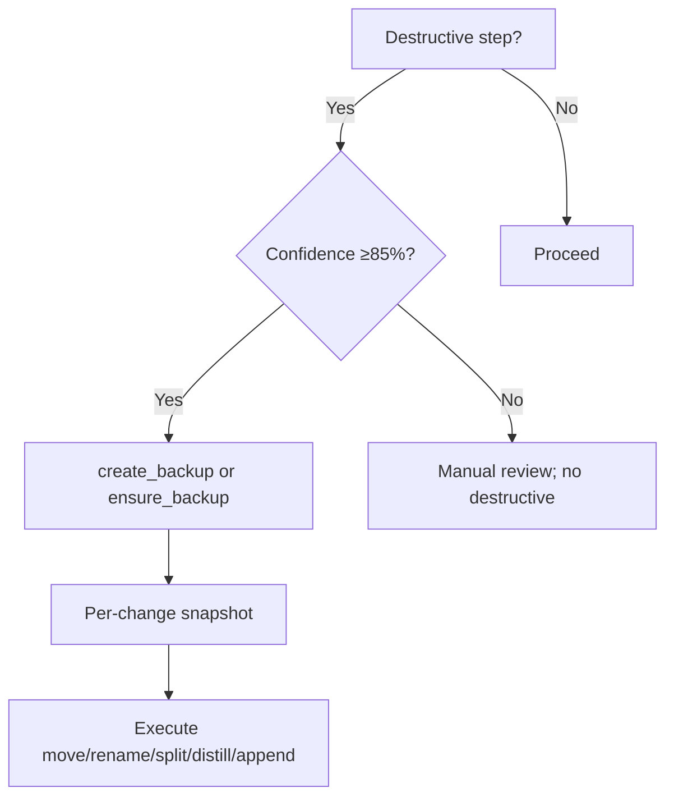
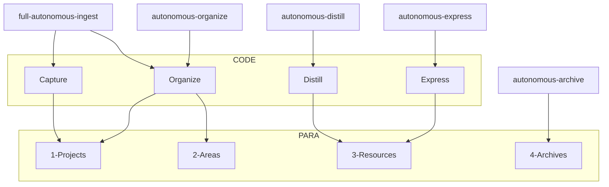

**TL;DR** — Obsidian vault (PARA + CODE) + Cursor (rules + skills) + Obsidian MCP server + Watcher. Preferred entry: Prompt-Crafter (“We are making a CODE/ROADMAP prompt”); manual triggers (INGEST MODE, EAT-QUEUE, etc.) are advanced. Backup/snapshot before destructive ops; Step 0 wrappers before queue; multi-run roadmap only (one-shot deprecated).

---

## Purpose

One note that explains how the system fits together for a maintainer or new reader: Obsidian vault (PARA + CODE) + Cursor (rules + skills) + Obsidian MCP server (tools) + Watcher (signals/queue).

## Key invariants / safety guarantees

- **Never delete notes** — only move to Archives or create snapshots; no destructive delete without user intent.
- **Never run destructive MCP operations** without backup (create_backup or ensure_backup) and, for moves, dry_run check first.
- **Never process files** already in Backups/, Logs/, or snapshot dirs; pipelines exclude these paths.
- **Always preserve** original file creation time in frontmatter when possible (e.g. `created` from file mtime or user input).

## Stack

- **Obsidian vault**: PARA (1-Projects, 2-Areas, 3-Resources, 4-Archives) + CODE (Capture → Organize → Distill → Express).
- **Cursor**: Rules (`.cursor/rules/always/`, `.cursor/rules/context/`), skills (`.cursor/skills/<name>/`), MCP client.
- **Core guardrails (always rules)**: `always/core-guardrails.mdc` and related always rules define persona and PARA constraints, shared confidence bands and refinement-loop behavior, MCP backup/snapshot gates, exclusions (Backups, Watcher files, watcher-protected notes), and the high-level Error Handling Protocol. All pipelines and skills are expected to align with this contract rather than hard-coding their own thresholds.
- **System funnels (always rules)**: `always/system-funnels.mdc` defines how instructions and prompts enter the system: question-led Prompt-Crafter as the **primary/preferred entry door**, and direct mode phrases (INGEST MODE, DISTILL MODE, EXPRESS MODE, ARCHIVE MODE, EAT-QUEUE/EAT-CACHE, PROCESS TASK QUEUE, ROADMAP MODE, RESUME-ROADMAP, RECAL-ROAD, etc.) as **manual/advanced** triggers. Funnels map these phrases into context rules (ingest-processing, para-zettel-autopilot, auto-distill, auto-express, auto-archive, auto-organize, auto-eat-queue, auto-queue-processor, auto-roadmap) while still enforcing core guardrails.
- **Obsidian MCP server**: obsidian-para-zettel-autopilot; tools for read, update, move, classify, distill, etc.
- **Watcher**: Watcher-Signal.md → Cursor; Watcher-Result.md; queue (`.technical/prompt-queue.jsonl`, Task-Queue.md).
- **Commander**: Optional **command orchestration layer** — surfaces manual triggers (queue, pipeline modes, roadmap tools) in customizable UI (mobile toolbar, macros, device-specific visibility). Commander-triggered runs log **commander_source: true** and **commander_macro** for MOC tracking. See Commander-Plugin-Usage and Vault-Change-Monitor Commander Dashboard.
- **Prompt-Crafter**: Laptop layer for MCP param assembly from config/templates; stabilizes ingest/organize via defaults and validation. Assembles params from Second-Brain-Config prompt_defaults and Templates/Prompt-Components; queue params pass-through and validation per Queue-Sources and auto-eat-queue. **Plan-mode crafting** (two kickoffs: CODE, ROADMAP) runs Q&A first, then optionally outputs a plan (Q&A + payload at bottom) and **appends** the payload to the queue (prompt-queue.jsonl or Task-Queue.md) after user confirmation; only vault write in this flow is that append. Plan-mode user flow and architecture diagrams (High/Mid/Detailed): see [[3-Resources/Second-Brain/Second-Brain-User-Flows/User-Flow-Prompt-Crafter-High-Level|User-Flow-Prompt-Crafter-*]] and [[3-Resources/Second-Brain/Second-Brain-User-Flows/Prompt-Crafter-Structure-High-Level|Prompt-Crafter-Structure-*]]. When a run uses a payload produced by the Plan-mode crafter, **crafted_params_conf_boost** (Parameters) applies.

## Component responsibilities

- **Obsidian vault**: Holds notes (PARA + CODE); all new files land in Ingest/; Backups/ is append-only; pipelines never process Backups/ or Logs/.
- **Cursor rules**: Always rules apply every run; context rules fire on phrase or glob; no shell cp/mv/rm on vault.
- **Cursor skills**: Execute pipeline steps (enrich, move, snapshot, etc.); read Second-Brain-Config where applicable (e.g. hub_names, batch_size_for_snapshot).
- **Obsidian MCP server**: Provides read/update/move/classify/distill/backup tools; backup gate before destructive ops; dry_run before move_note commit.
- **Watcher**: Writes Watcher-Signal; reads Watcher-Result; can append to prompt-queue; agent must not move/delete Watcher paths.
- **Commander**: Surfaces triggers in UI; logs commander_source and commander_macro for observability.

## Flow

User or Watcher triggers → phrase or glob match → Rules (always + context) → Pipeline selection → Skills + MCP tools in sequence → backup/snapshot before destructive steps → confidence gates and optional loop → move/log. See [[3-Resources/Second-Brain/Pipelines|Pipelines]]. **Decision Wrappers (clunk)**: Mid-band, low-confidence, error, and **phase-direction** (conceptual end-state options; technical in background) outcomes create wrappers under `Ingest/Decisions/` (Ingest-Decisions/, Roadmap-Decisions/, Refinements/, Low-Confidence/, Errors/); single dashboard at [[Ingest/Decisions/Wrapper-MOC|Wrapper-MOC]]. **EAT-QUEUE runs Step 0 first** (before reading the queue file): enumerate `Ingest/Decisions/**`, apply any wrapper with `approved: true` (move note to approved path, then move wrapper to `4-Archives/Ingest-Decisions/` with subfolders mirrored); then read and dispatch the rest of the queue. Apply when user sets `approved: true` and runs EAT-QUEUE. **Re-try:** Option R or `re-try: true` re-queues EXPAND-ROAD or TASK-TO-PLAN-PROMPT with guidance; capped by re_try_max_loops; on cap hit a cap-hit wrapper is created. **Session continuity:** Re-queue payloads inject session_success_hint (Watcher-Result) and git_diff_hint (code_execution when .git exists). **Provenance:** Phase-direction apply appends provenance callout and comment guidance to roadmap notes; plan evolution in 4-Archives/Ingest-Decisions/Roadmap-Decisions/. **Comment injection:** TASK-TO-PLAN-PROMPT template and code_comments config demand liberal comments (why, provenance_link); optional comment-fatigue stub logs #review-needed when over threshold. See Cursor-Skill-Pipelines-Reference apply-from-wrapper and Queue-Sources.

**Post-process stabilizers (variance dampeners):** Low-variance post-AI steps applied inside existing skills: (1) **Ingest/organize**: re-rank candidates by [[3-Resources/Second-Brain/PARA-Actionability-Rubric|PARA-Actionability-Rubric]] v1.0, then semantic fit, path depth, alphabetize; mandatory pad to 7 options (A–G) with deterministic fallbacks; set `heuristic_adjusted` / `heuristic_reason` on wrapper when order changed. (2) **Distill**: short-note core bias (config: `short_note_word_threshold`, `default_core_bias`); emoji fallback only when mobile context detected. (3) **Archive**: confidence floor +5–8% when age > no_activity_days and #stale or #review-later; never when status active/evergreen. (4) **Queue**: canonical order + TASK-ROADMAP bump when originating note conf ≥ 90% (after ORGANIZE, before DISTILL); log `queue_order_adjusted`, `reason: high-conf roadmap bump`. All gated by existing confidence and safety (no commit below 85%; snapshot/dry_run before move). See plan "Targeted heuristics for consistency" and [[3-Resources/Second-Brain/Pipelines#Post-process stabilizers|Pipelines § Post-process stabilizers]].

**Multi-run roadmap (default; one-shot deprecated):** **ROADMAP MODE** = **setup only**: Phase 0 (roadmap-state, decisions-log, distilled-core) + **workflow_state.md** (created by roadmap-generate-from-outline step 5b when missing) + roadmap-generate-from-outline. When roadmap-state already exists, do not run resume in ROADMAP MODE. **RESUME-ROADMAP** = **single continue entry**: one run = one action from **params.action** (default **deepen**). deepen → roadmap-resume (optional) + **roadmap-deepen** (one step: create next secondary/tertiary per Roadmap Structure, update workflow_state, **append next RESUME-ROADMAP when queue_next !== false** — required unless explicitly false; only skip when **queue_next === false**). Other actions: recal, revert-phase, sync-outputs, handoff-audit, resume-from-last-safe, expand. RECAL-ROAD, REVERT-PHASE, SYNC-PHASE-OUTPUTS, HANDOFF-AUDIT, RESUME-FROM-LAST-SAFE, EXPAND-ROAD are **aliases**: EAT-QUEUE rewrites to RESUME-ROADMAP with params.action set. State artifacts: roadmap-state.md, **workflow_state.md** (current_phase, current_subphase_index, status, iterations_per_phase, Log table), decisions-log.md, distilled-core.md, phase-X-output.md. **workflow_state ## Log timestamps** are in user local time when possible (queue `local_timestamp` or queue `timestamp` + Config `display_timezone`); otherwise server time. Run order is best preserved when the client (e.g. Watcher) provides `local_timestamp` or `display_timezone` is set (Parameters § Timestamp resolution). **Mandatory:** Snapshot state before and after every update; conf ≥85% before phase complete. **Hand-off gate** (config handoff_gate_enabled): handoff_readiness ≥85% or per-tech. One-shot **deprecated** (ROADMAP-ONE-SHOT). See [[3-Resources/Second-Brain/Roadmap-Quality-Guide|Roadmap-Quality-Guide]] and [[3-Resources/Second-Brain/Queue-Sources#RESUME-ROADMAP params (canonical)|Queue-Sources § RESUME-ROADMAP params]].

> [!danger] **ROADMAP MODE is now multi-run only.** One-shot is deprecated and will not receive updates. Use **ROADMAP-ONE-SHOT** if you must.

**Remaining gaps (mitigated):** Phase forks: heuristic (phase_fork_heuristic strict/off) or explicit phase_forks frontmatter. Prompt gating: optional prompt-decision wrappers post-TASK-TO-PLAN-PROMPT. Git continuity: code_execution git diff --summary with fallback to Versions/ or Errors.md. Scalability: re_try_max_loops, prune_candidates, age_days auto-archive.

**Mobile (migrated):** Mobile = **manual observation** + **filling Ingest folder** only. Queue and prompt crafting are **laptop-only**; prompt-queue.jsonl and Task-Queue.md are written only from laptop (Plan-mode crafter, Commander on laptop, or manual edit). See [[3-Resources/Second-Brain/Mobile-Migration-Spec|Mobile-Migration-Spec]].

## Unified Observability

- **Vault-Change-Monitor**: Single MOC at [3-Resources/Vault-Change-Monitor](3-Resources/Vault-Change-Monitor.md) aggregates last N log entries, timelines, Commander Dashboard (macros used, commander_source), and system health (health_check → MCP-Health-YYYY-MM). All pipeline logs use **consistent fields** for Dataview. See [Logs](3-Resources/Second-Brain/Logs.md) for log → MOC flow.
- **Evolution Monitoring**: Post-rollout, analyze [Feedback-Log](3-Resources/Feedback-Log.md) patterns (e.g. how often users refine previews, drift_avg trends, loop outcomes). Document findings in Backbone or a dedicated note; optional script or manual count. See plan "Depth Enhancements" for Evolution Monitoring.

## Safety

- **Backup-first**: BACKUP_DIR (external); create_backup or ensure_backup before destructive steps.
- **In-vault snapshots**: Per-Change and Batch under Backups/; append-only.
- **dry_run before move**: Always move_note(dry_run: true) then move_note(dry_run: false).
- **Error Handling Protocol**: Trace and summary to [[3-Resources/Errors|Errors.md]]; see [[.cursor/rules/always/mcp-obsidian-integration|mcp-obsidian-integration]]. On move failure (e.g. parent missing), use ensure_structure then retry; on dry_run risks, use propose_alternative_paths (backed by the ranked PARA proposal engine `propose_para_paths` on the MCP server) → calibrate_confidence → verify_classification.
- **No shell**: No cp/mv/rm on vault; all ops via MCP tools.

## PARA

1-Projects, 2-Areas, 3-Resources, 4-Archives; subfolder depth ≤4; project-id + themes drive paths.

## Restore and rollback

Restore is **user-triggered only** (e.g. auto-restore, snapshot-sweep rules). Per-change snapshots live in Backups/Per-Change; external backups in BACKUP_DIR; no auto-restore. Recovery procedures live in rules/skills.

## System flow (diagram)

For queue-driven runs, there is a **single orchestration chain** — **Main agent → Queue/Dispatcher → Pipeline subagent → (optional) nested subagent helper**; nested subagents never orchestrate on their own and only return structured results to their caller. See [[3-Resources/Second-Brain/Docs/Architecture|Docs/Architecture]] § Orchestration hierarchy for the dedicated diagram.

## Safety flow (diagram)

## PARA / CODE flow (diagram)

## Mermaid diagram refresh

**Manual steps**: After changing pipeline order, trigger mapping, or queue flow, refresh diagrams in: Queue-Sources (full queue processor, fast-path branch), Parameters (confidence bands, Watcher-Result), Pipelines (trigger → pipeline, ingest flowchart, overviews), Vault-Layout (folder tree, exclusions), Logs (log destinations, health check), Cursor-Skill-Pipelines-Reference (flowcharts). Edit Mermaid code blocks in place. **Optional script**: If a diagram generator is added (e.g. Python in `scripts/` or `code_execution/`), document its location and usage here.

## Links to all backbone docs

- [[3-Resources/Second-Brain/Docs/README|Docs/README]] — **Subagents / post-migration docs** (architecture, pipelines, rules, user flows)
- [[3-Resources/Second-Brain/Rules|Rules]]
- [[3-Resources/Second-Brain/Skills|Skills]]
- [[3-Resources/Second-Brain/Pipelines|Pipelines]]
- [[3-Resources/Second-Brain/Cursor-Skill-Pipelines-Reference|Cursor-Skill-Pipelines-Reference]] (canonical pipeline order, snapshot triggers, apply-from-wrapper)
- [[3-Resources/Second-Brain/Plugins|Plugins]]
- [[3-Resources/Second-Brain/MCP-Tools|MCP-Tools]]
- [[3-Resources/Second-Brain/Configs|Configs]]
- [[3-Resources/Second-Brain/Parameters|Parameters]]
- [[3-Resources/Second-Brain/Logs|Logs]]
- [[3-Resources/Second-Brain/Vault-Layout|Vault-Layout]]
- [[3-Resources/Second-Brain/Naming-Conventions|Naming-Conventions]]
- [[3-Resources/Second-Brain/Queue-Sources|Queue-Sources]]
- [[3-Resources/Second-Brain/Templates|Templates]]
- [[3-Resources/Second-Brain/Color-Coded-Highlighting|Color-Coded-Highlighting]]
- [[3-Resources/Second-Brain/Testing|Testing]]
- [[3-Resources/Second-Brain/Roadmap-Quality-Guide|Roadmap-Quality-Guide]] (multi-run quality, RECAL-ROAD, one-shot deprecated)
- [[3-Resources/Second-Brain/Cursor-Agent-Ingest-Workflow|Cursor-Agent-Ingest-Workflow]] (agent-output drop zone, direct move, tech_level)
- [[3-Resources/Archive-Prep-Checklist|Archive-Prep-Checklist]] (prep for manual pipeline testing; permanent vs archiveable)
- [[3-Resources/Deprecated-Vestigial-Audit|Deprecated-Vestigial-Audit]] (folder blacklist, MCP naming, audit pointers)

Master references: [[3-Resources/Second-Brain/Cursor-Skill-Pipelines-Reference|Cursor-Skill-Pipelines-Reference]] (canonical pipeline order and snapshot triggers), [[.cursor/rules/always/mcp-obsidian-integration|mcp-obsidian-integration]], [[3-Resources/Second-Brain-Config|Second-Brain-Config]].
