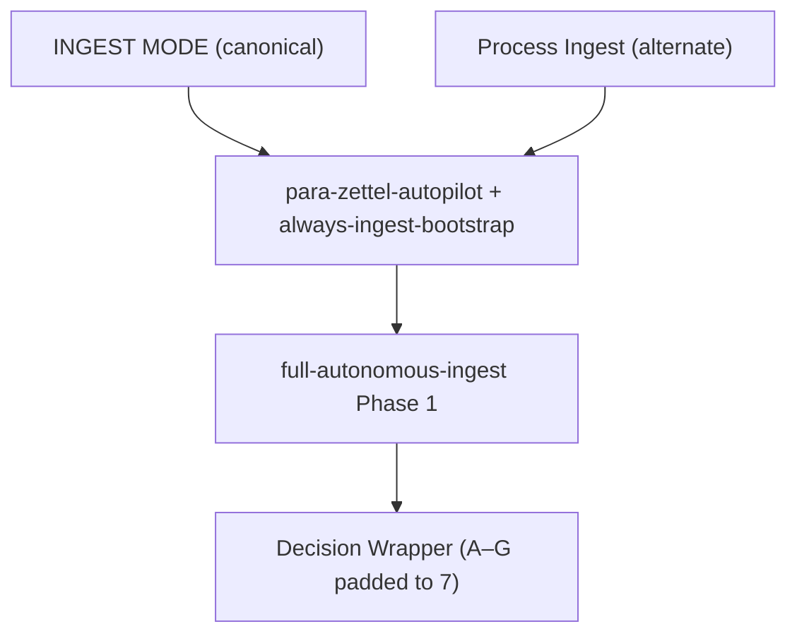

# Standardized Chat Prompts

Single reference for **what to paste or say in Cursor chat** to trigger pipelines with consistent params. Use canonical phrases (or aliases) so rules and pipelines dispatch predictably. Chat prompts and queue entries feed the same pipelines; queue carries structured params, chat uses Config defaults/fallback.

---

## Prompt crafting — question-led (Chat/Agent)

To **craft a prompt interactively** in Chat or Agent mode (not Cursor Plan mode), start with one of two kickoffs:

| You say | Kickoff | Funnel |
|--------|---------|--------|
| **We are making a CODE prompt** | CODE | Agent asks which pipeline/task mode (INGEST, ORGANIZE, DISTILL, EXPRESS, ARCHIVE, or task modes), then walks optionals in param-table order, then manual text phase. All questions are asked and answered **before** any plan or queue write. Then agent may show a plan (Q&A + payload at bottom) and asks the Final confirmation question ([[3-Resources/Second-Brain/User-Questions-and-Options-Reference#1-question-led-prompt-crafter-chatagent|User-Questions-and-Options-Reference]] §1 Message 9: A. yes — append | B. no — cancel | C. AI reasoning). On **confirm** (A): validate, route, read-append-write. On **decline**: do not write; payload remains in plan for copy-paste or manual add. |
| **We are making a ROADMAP prompt** | ROADMAP | Agent asks setup vs resume (ROADMAP MODE vs RESUME-ROADMAP). **If RESUME-ROADMAP (V4 order):** run **resume gate** (when prior locks exist), then **profile gate**, then "Which action?" (A. deepen | B. recal | C. Other), then **all** param optionals in §1 order with no skips, then manual text phase, then the Final confirmation (§1 Message 9). Do not ask "Which action?" before the gates. Same Q&A-first flow as above. |
| **We are making a prompt** (generic) | — | Agent **asks**: "Which kind? A. CODE B. ROADMAP" and does not guess. |

Crafting is **laptop-only**. All questions must be asked and answered **before** any summary or queue write. Format each question with **each option on its own line** (real newlines); see [[3-Resources/Second-Brain/User-Questions-and-Options-Reference|User-Questions-and-Options-Reference]] §1 for the exact layout. Then the agent may present a recap (Q&A + payload) and asks the Final question from User-Questions-and-Options-Reference §1 Message 9. On confirm (A): validate payload, route to correct queue file, read-append-write. On decline: do not write; payload remains in chat for copy-paste or manual add. Question order and param ownership are defined in [[3-Resources/Second-Brain/Second-Brain-User-Flows/Prompt-Crafter-Structure-Detailed#Plan-mode crafting entrypoints (two kickoffs)|Prompt-Crafter-Structure-Detailed]] and the [[3-Resources/Second-Brain/Prompt-Crafter-Param-Table|Prompt-Crafter-Param-Table]] (param table). **Prompt-Crafter is the primary, preferred entry door** for starting automation runs; the direct mode phrases in the tables below (INGEST MODE, DISTILL MODE, etc.) are treated as **manual/advanced** call formats that bypass Q&A and are intended for power users and Commander flows.

---

## Safety invariants

> [!warning] Triggers propose only
> **No move/rename without approved: true** (per [[3-Resources/Second-Brain/Pipelines|Pipelines]] § Phase 2). Backup/snapshot/dry_run always before commit (enforced by [[.cursor/rules/always/mcp-obsidian-integration|mcp-obsidian-integration]]). Chat prompts only start the pipeline; they do not auto-commit moves.

---

## Canonical vs alternate phrasing

| Canonical trigger | Alternate(s) | Pipeline |
|-------------------|--------------|----------|
| **INGEST MODE** | Process Ingest, run ingests | full-autonomous-ingest |
| **DISTILL MODE** | distill this note, refine this note | autonomous-distill |
| **EXPRESS MODE** | express this note, generate outline | autonomous-express |
| **ARCHIVE MODE** | archive this note, send to Archives | autonomous-archive |
| **ORGANIZE MODE** | re-organize this note, classify and move | autonomous-organize |
| **EAT-QUEUE** | Process queue, eat cache / EAT-CACHE | Queue processor |

Full mapping: [[3-Resources/Second-Brain/Pipelines#Trigger → pipeline|Pipelines § Trigger → pipeline]]. Aliases: [[3-Resources/Second-Brain/Queue-Alias-Table|Queue-Alias-Table]].

---

## Prompt → queue integration

When you **paste a chat prompt** in Cursor, the agent maps it to the same pipeline that a **queue entry** would trigger. Same mode, same rules; chat uses Config/default params when no queue payload is present.

| Chat phrase (example) | Queue mode (if appended to prompt-queue.jsonl) | Format reference |
|------------------------|-------------------------------------------------|------------------|
| INGEST MODE | `mode: "INGEST MODE"` | [[3-Resources/Second-Brain/Queue-Sources|Queue-Sources]] |
| Process Ingest | same as INGEST MODE (alias) | [[3-Resources/Second-Brain/Queue-Alias-Table|Queue-Alias-Table]] |
| DISTILL MODE | `mode: "DISTILL MODE"` | Queue-Sources |
| ORGANIZE MODE | `mode: "ORGANIZE MODE"` | Queue-Sources |

**Why this matters**: Missing or inconsistent params in queue entries (e.g. default vs crafted `rationale_style`) cause inconsistent MCP calls. Use standardized prompts (or Craft and Queue with validated params) so dispatch is stable.

---

## Example ready-to-paste strings

**Basic** (Config defaults apply):

```
INGEST MODE
```

**With params** (explicit; agent merges with Config):

```
INGEST MODE with params: { context_mode: strict-para, max_candidates: 7, rationale_style: concise }
```

**With guidance** (guidance-aware run when note has user_guidance or this is in queue prompt):

```
INGEST MODE with params: { context_mode: strict-para, max_candidates: 7 } and guidance: Prioritize subfolders under 1-Projects for time-bound content; explain rankings.
```

**Profiled** (e.g. project-priority from Config profiles):

```
ORGANIZE MODE with profile: project-priority → params: { context_mode: project-strict, max_candidates: 5 }
```

Copy-paste templates (optional): `Templates/Chat-Prompts/` (see [[3-Resources/Second-Brain/Templates#Chat-Prompts (copy-paste)|Templates § Chat-Prompts]]). Config: [[3-Resources/Second-Brain/Configs|Configs]] for `prompt_defaults` / reserved `chat_prompt_defaults`.

---

## Validation and fallback

Params are validated before use (macro paste, queue append, or EAT-QUEUE dispatch). Invalid values are replaced by fallback and logged.

| Param | Allowed | Fallback (if invalid) |
|-------|---------|------------------------|
| rationale_style | concise, detailed, bullet, technical | concise (log to Errors.md) |
| max_candidates | 5–10 (per MCP-Tools; doc ≤10) | 7 (pad per Pipelines) |
| context_mode | pipeline-specific (e.g. strict-para for ingest, organize for organize) | pipeline default (log if unknown) |

Source: [[3-Resources/Second-Brain/Second-Brain-User-Flows/Prompt-Crafter-Structure-Detailed#Validation rules (MCP-Tools alignment)|Prompt-Crafter-Structure-Detailed § Validation]]. Config defaults: [[3-Resources/Second-Brain/Configs|Configs]] `prompt_defaults`.

---

## Prompt → rule → pipeline (flow)



Rule and pipeline names: [[3-Resources/Second-Brain/Cursor-Skill-Pipelines-Reference|Cursor-Skill-Pipelines-Reference]]. Other triggers (DISTILL MODE, ORGANIZE MODE, etc.) map similarly per Pipelines § Trigger table.

---

## Where things live

- **Trigger table**: [[3-Resources/Second-Brain/Pipelines|Pipelines]] § Trigger → pipeline
- **Aliases**: [[3-Resources/Second-Brain/Queue-Alias-Table|Queue-Alias-Table]]
- **Queue format**: [[3-Resources/Second-Brain/Queue-Sources|Queue-Sources]]
- **Copy-paste templates**: `Templates/Chat-Prompts/` (optional); [[3-Resources/Second-Brain/Templates|Templates]] § Chat-Prompts
- **Config**: [[3-Resources/Second-Brain-Config|Second-Brain-Config]] `prompt_defaults`; reserved `chat_prompt_defaults` for chat-specific base strings if added later
- **User flows**: [[3-Resources/Second-Brain/Second-Brain-User-Flows/User-Flow-Chat-Prompts-High-Level|User-Flow-Chat-Prompts-High-Level]], -Mid-Level, -Detailed
