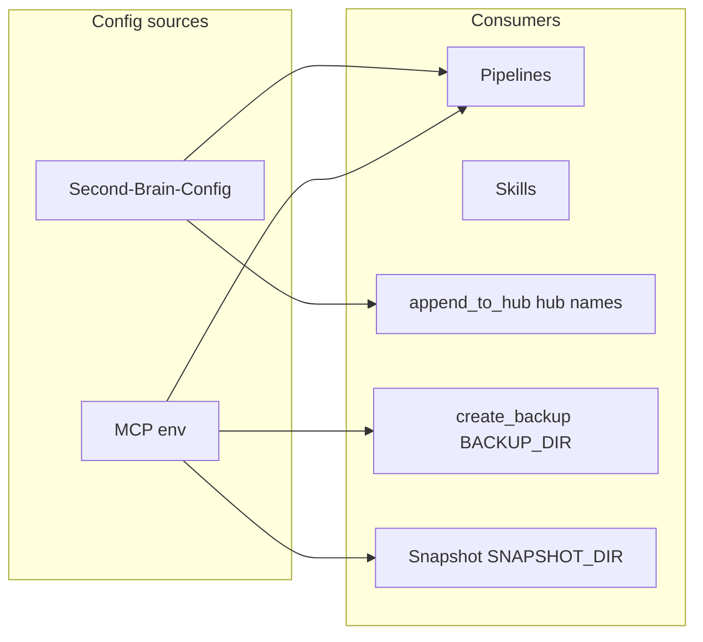

# Second Brain Configs

## Vault/config note

[[3-Resources/Second-Brain-Config|Second-Brain-Config]] — single source for pipelines/skills. **Responsibilities** (who consumes what):

- **hub_names**: Consumed by append_to_hub (projects, areas, resources, resurface hub names).
- **archive**: Consumed by archive-check (age_days e.g. 90, no_activity_days e.g. 60).
- **highlight**: Consumed by distill-highlight-color and layer-promote (default_key → Highlightr-Color-Key.md). See [[3-Resources/Second-Brain/Color-Coded-Highlighting|Color-Coded-Highlighting]].
- **depths**: async_preview_threshold (below this confidence, emit async preview, do not commit); batch_size_for_snapshot (above this batch size, use BATCH_SNAPSHOT_DIR); **highlight_coverage_min** (min % of meaningful spans for highlight — default 50; range 50–70%; see [[3-Resources/Second-Brain/Parameters#Coverage (highlight)|Parameters § Coverage (highlight)]]); commander_macro_limits, etc.
- **graph**: moc_strength (3) for MOC generation.
- **confidence_bands** (optional): mid min/max, high_threshold; rules and skills read when present; fallback to 68–84%, ≥85%.
- **prompt_defaults** (optional): Per-pipeline defaults (ingest, organize) and **profiles** (named overrides, e.g. project-priority). Consumed by prompt-crafter and rules (e.g. para-zettel-autopilot) for MCP pass-through; queue payload overrides take precedence. **Safety**: Non-destructive defaults only—params influence proposals but require approved: true for any move/rename per [[3-Resources/Second-Brain/Pipelines|Pipelines]] § Phase 2. No auto-approval injection.
- **chat_prompt_defaults** (reserved, optional): If added later, per-pipeline base chat strings and optional profiles for copy-paste or Commander "Craft Chat Prompt" macro; Commander / prompt-builder would read this. Same safety as prompt_defaults.

**Related**: [[3-Resources/Attachment-Subtype-Mapping|Attachment-Subtype-Mapping]] — extension → subtype (PDFs, Images, Audio, Documents, Other) for moving non-.md from Ingest/ to 5-Attachments/; consumed by ingest/non-markdown flow and move-attachment-to-99.

## MCP env

Set in `~/.cursor/mcp.json` under `obsidian-para-zettel-autopilot.env`. **Responsibilities**:

| Variable | Purpose | Responsibility |
|----------|---------|----------------|
| OBSIDIAN_API_KEY | API key from Local REST API plugin | MCP server uses for vault API calls |
| OBSIDIAN_REST_URL | Base URL (default http://127.0.0.1:27123) | REST endpoint for Obsidian |
| OBSIDIAN_VAULT_PATH | Absolute path to vault root | All path resolution relative to vault |
| BACKUP_DIR | External backups; required for destructive tools | create_backup / ensure_backup write here; last-resort recovery |
| SNAPSHOT_DIR | In-vault Per-Change snapshots (e.g. Backups/Per-Change) | obsidian-snapshot skill writes per-change snapshots; append-only |
| BATCH_SNAPSHOT_DIR | In-vault Batch snapshots (e.g. Backups/Batch) | obsidian-snapshot skill writes batch checkpoint notes |
| OBSIDIAN_CREATE_SKIP_BACKUP | Optional; skip backup for create mode | When creating new version files (mode: create) |
| MAX_BACKUP_AGE_MINUTES | Optional; for ensure_backup (e.g. 1440) | ensure_backup checks backup age; avoid redundant create_backup |

## Example config snippet (Second-Brain-Config)

```yaml
hub_names:
  projects: "Projects Hub"
  areas: "Areas Hub"
  resources: "Resources Hub"
  resurface: "Resurface Hub"
archive:
  age_days: 90
  no_activity_days: 60
highlight:
  default_key: "3-Resources/Highlightr-Color-Key.md"
depths:
  batch_size_for_snapshot: 5
  async_preview_threshold: 68
```

## Paths

- **BACKUP_DIR**: External, immutable-like; last-resort recovery.
- **SNAPSHOT_DIR**: In-vault; append-only; never edited by skills.
- **BATCH_SNAPSHOT_DIR**: In-vault; batch checkpoint notes.

See [[.cursor/rules/always/mcp-obsidian-integration|mcp-obsidian-integration]] snapshot configuration.

## Exclusions (canonical list)

Pipelines must **not** process notes matching:

- **Backups/** (any subtree: Per-Change, Batch, Versions)
- **\*\*/Log*.md** (e.g. Ingest-Log.md, Archive-Log.md, Express-Log.md, Backup-Log.md, Organize-Log.md)
- **\*\/* Hub.md** (e.g. Resources Hub.md, Projects Hub.md)
- **3-Resources/Second-Brain/tests/** (automated test suite; exclude from all pipelines)
- **Watcher paths**: `Ingest/watched-file.md`, `3-Resources/Watcher-Signal.md`, `3-Resources/Watcher-Result.md`
- **.technical/** (technical bin: Cursor queue, Watcher signals/results if moved; excluded from Obsidian index)
- Notes with frontmatter **watcher-protected: true**

Context rules (auto-archive, auto-distill, auto-organize, etc.) list these in their Excludes sections; this is the **canonical list**. See [[3-Resources/Second-Brain/Vault-Layout|Vault-Layout]] for folder tree and exclusions flow. Optional: maintain a machine-readable `exclusions.yaml` in this folder and reference it from rules.

## Cursor rules layout

- **Always**: `.cursor/rules/always/*.mdc` — applied every run.
- **Context**: `.cursor/rules/context/*.mdc` — triggered by globs or phrases.

## Config sources and consumers


