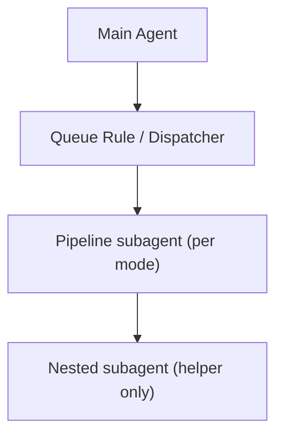

# Subagents Architecture

**Version: 2026-03 – post-subagent migration**

High-level architecture: main agent, dispatcher, queue processor, and pipeline subagents. Single Mermaid diagram and concise explanation of delegation flow.

---

## Overview

The **main agent** (Thoth-AI) always loads core guardrails, persona, and PARA. Then:

- **Queue triggers** (EAT-QUEUE, Process queue, EAT-CACHE, PROCESS TASK QUEUE): The **Dispatcher** routes to the **Queue rule** (`.cursor/rules/agents/queue.mdc`). The Queue rule runs in the main context: Step 0 (always-check wrappers), read prompt queue or task queue, parse/validate/order, **dispatch by mode** to the corresponding pipeline subagent or skill.
- **Direct triggers** (INGEST MODE, DISTILL MODE, etc.): **System Funnels** route the instruction; the main agent **delegates** to the matching pipeline subagent (or runs the legacy rule). No queue file is read for that single instruction.

---

## Mermaid diagram

```mermaid
flowchart LR
  User[User]
  MainAgent[Main Agent]
  Dispatcher[Dispatcher]
  QueueRule[Queue Rule]
  PipelineSubagents[Ingest | Distill | Express | Archive | Organize | Roadmap | Research]

  User -->|instruction| MainAgent
  MainAgent -->|"EAT-QUEUE / PROCESS TASK QUEUE"| Dispatcher
  Dispatcher --> QueueRule
  QueueRule -->|"dispatch by mode"| PipelineSubagents
  MainAgent -->|"INGEST MODE / DISTILL MODE / ..."| PipelineSubagents
  PipelineSubagents -->|"return: summary + Watcher-Result"| MainAgent
  MainAgent --> User
```

## Orchestration hierarchy (single orchestrator)



The **main agent + Queue rule** act as the **only orchestrators**: they read and write the prompt and task queues, decide which pipeline subagent to run, and append to Watcher-Result. **Pipeline subagents** execute a single mode per run, and any **nested subagents** they call are **helpers only**—they must not read or write queues, create Decision Wrappers, mutate roadmap state, or write Watcher-Result directly; instead they return structured results to their caller.

---

## Delegation flow

1. User says a trigger phrase (queue or direct).
2. **Dispatcher** (always rule): if phrase is EAT-QUEUE / Process queue / EAT-CACHE / PROCESS TASK QUEUE → load and follow **Queue rule**. Else, system-funnels map phrase to a pipeline.
3. **Queue rule** (when active): Step 0 (scan `Ingest/Decisions/`, apply approved wrappers, set approved_wrappers_remaining). Read queue file → parse, validate, dedup, order → for each entry: resolve params, normalize aliases (e.g. RECAL-ROAD → RESUME-ROADMAP + action recal), dispatch to subagent or skill. Append one line per requestId to `Watcher-Result.md`. Re-read queue, drop processed success IDs, write back (and optionally append CHECK_WRAPPERS if approved_wrappers_remaining).
4. **Pipeline subagent** (when delegated): Receives hand-off prompt (task, queue entry, invariants, state files, return format). Runs pipeline steps; before destructive steps: backup + per-change snapshot when confidence ≥85%. Returns one-paragraph summary, any wrapper/queue entry created, Success / #review-needed / failure; appends Watcher-Result line when requestId provided.

---

## Queue vs direct

| Trigger type | Router | Who runs pipeline |
|--------------|--------|-------------------|
| **Queue** (EAT-QUEUE, Process queue, EAT-CACHE, PROCESS TASK QUEUE) | Dispatcher → Queue rule | Queue rule dispatches each entry to the right subagent (or skill) by mode |
| **Direct** (INGEST MODE, DISTILL MODE, EXPRESS MODE, ARCHIVE MODE, ORGANIZE MODE, ROADMAP MODE, Resume roadmap) | System-funnels | Main agent delegates to the corresponding pipeline subagent (or legacy rule) |

---

## File locations

| Component | Location |
|-----------|----------|
| Queue rule | `.cursor/rules/agents/queue.mdc` |
| Pipeline subagents (prefer) | `.cursor/agents/<name>.md` (ingest, distill, express, archive, organize, roadmap, research) |
| Pipeline subagents (fallback) | `.cursor/rules/legacy-agents/<name>.mdc` |
| Safety contract | `3-Resources/Second-Brain/Subagent-Safety-Contract.md` |
| Dispatcher | `.cursor/rules/always/dispatcher.mdc` |
| System funnels | `.cursor/rules/always/system-funnels.mdc` |
