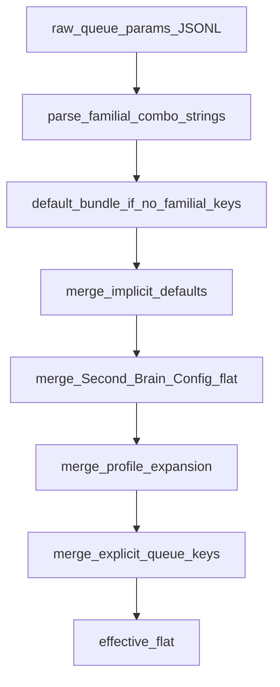

# Config Profiles (familial defaults)

**Version: 2026-04**

Canonical **familial** profile names for the Second Brain stack. Use these instead of hand-tuning scattered flat keys when you want a **deterministic** bundle that matches integration-branch behavior.

**Normative merge:** `[[3-Resources/Second-Brain/Second-Brain-Config|Second-Brain-Config]]` remains the single file; profiles **expand** into flat keys for **effective** runtime resolution (see **deepMerge** below). Raw flat keys stay supported for backward compatibility.

---

## Resolution flow

End-to-end resolution for one queue entry (Prompt Crafter step 9 and Queue **A.2** use the same merge):



**Default bundle (auto-applied):** when no familial keys are present after parsing, agents inject **`speed_mode: balance`**, **`repair_strategy: repair_first`**, **`validator_tier: forgiving`** before the profile-expansion merge. That aligns **effective** behavior with the documented default labels without requiring every JSONL line to repeat them.

**Example — single familial key:** `speed_mode: extreme` expands per the **`speed_mode` → flat** table (e.g. `pipeline_mode: extreme`, **`validator_profiles.extreme`** row, stricter nested budgets, GitForge **balance** with quality trace — see § **`speed_mode`** and **Pipeline-Validator-Profiles**). Other families remain at **default bundle** values unless also set.

**Merge order (later wins):** implicit defaults → **Second-Brain-Config** → profile expansion (from familial keys, including the default bundle) → explicit flat keys on the entry.

---

## `profiles` — families (expandable)

```yaml
profiles:
  speed_mode:
    fast:      # minimal helper / throughput bias
    balance:   # default — full helper graph + conditional L1 post-lv
    extreme:   # maximal nested validation + IRA cycles

  repair_strategy:
    repair_first:   # default — legacy throughput; A.4c repair-first slotting
    forward_first:  # blocking-repair preflight + forward-class initial pass

  validator_tier:
    aggressive:  # stricter Success gate on nested validators (tiered kill-switch off)
    forgiving:   # default — tiered nested Success gate (needs_work without high/block)
```

---

## Family → flat key mapping

### `speed_mode`

| Value | Primary flat keys |
|-------|---------------------|
| `fast` | `pipeline_mode: fast` (see `validator_profiles.fast`); GitForge: **skip** (`effective_pipeline_mode` **speed** → no **A.7a** `Task(gitforge)` per queue.mdc); `snapshot.batch_size_for_snapshot`: lower threshold bias toward **per-change** snapshots (use **3** when unset; operators may keep Config default **5**). |
| `balance` | `pipeline_mode: balance` (default `validator_profiles.balance`); GitForge **balance**; `batch_size_for_snapshot: 5` (Config default). |
| `extreme` | `pipeline_mode: extreme` (`validator_profiles.extreme`); GitForge **balance** with **`quality`** trace via `params.pipeline_mode` / `source_pipeline_mode`; **stricter** nested validator budgets (`target_nested_validator_passes: 4`, `l1_post_lv_policy: always`, `nested_ira_policy: always`). |

**Related:** `[[3-Resources/Second-Brain/Docs/Pipeline-Validator-Profiles|Pipeline-Validator-Profiles]]` (`pipeline_mode` → `validator_profiles` rows), `Second-Brain-Config` § **pipeline_mode and validator_profiles**, **gitforge** (fast skips).

### `repair_strategy`

| Value | Primary flat keys |
|-------|---------------------|
| `repair_first` | `queue.roadmap_pass_order: repair_first` (default); **Pass 3** repair drain: `queue.inline_a5b_repair_drain_enabled` **not false** (default on); `queue.inline_forward_followup_drain_enabled: false` unless operator enables forward follow-up. |
| `forward_first` | `queue.roadmap_pass_order: forward_first`; caps **`queue.max_forward_roadmap_dispatches_per_project_per_run`**, **`queue.max_repair_roadmap_dispatches_per_project_per_run`**, **`queue.max_blocking_repair_preflight_per_project_per_run`** per **Second-Brain-Config** / **Queue-Sources**; optional **`queue.inline_forward_followup_drain_enabled: true`** for Pass 3 forward wave. |

**Related:** `[[3-Resources/Second-Brain/Queue-Sources|Queue-Sources]]` § Roadmap multi-dispatch, **queue.mdc** **A.4c**.

### `validator_tier`

| Value | Primary flat keys |
|-------|---------------------|
| `forgiving` | `validator.tiered_blocks_enabled: true` (default) — **Tiered nested validator Success gate** per **Subagent-Safety-Contract** / **Validator-Tiered-Blocks-Spec**. |
| `aggressive` | `validator.tiered_blocks_enabled: false` — legacy strict **no Success** on historical hard mappings; use only when debugging. |

**Related:** `[[3-Resources/Second-Brain/Docs/Validator-Tiered-Blocks-Spec|Validator-Tiered-Blocks-Spec]]`, **Parameters** § Validator tiered blocks.

### Cross-cutting (all modes)

| Concept | Flat keys |
|---------|-----------|
| Pass 3 inline drain | `queue.inline_a5b_repair_drain_enabled`, `queue.inline_forward_followup_drain_enabled`, `queue.max_inline_a5b_repair_generations_per_run`, `queue.max_inline_forward_followup_generations_per_run`, `queue.pass3_drain_appended_until_empty`, … |
| Snapshots | `snapshot.batch_size_for_snapshot` |
| Confidence / mid-band loops | **Parameters** `confidence_bands`; **not** a single `refinement_loops_max` key in this vault — use **Second-Brain-Config** `depths` / roadmap iteration caps when tuning. |
| Queue continuation | `queue_continuation.*` under **Second-Brain-Config** / **Queue-Continuation-Spec** (empty-queue bootstrap, append flags). |

---

## deepMerge rules

**Order (later wins):** **defaults** (implicit) → **Second-Brain-Config** flat YAML → **profile expansion** (from familial keys, including the **default familial bundle** when the entry omits them) → **explicit queue entry / params** (flat keys on the JSONL line).

**Invariant:** Explicit keys on the queue entry **always** beat profile-derived keys; profile beats Config; Config beats implicit defaults. Same structure as **prompt_defaults.roadmap** + **`params.profile`** merge in **Second-Brain-Config** § **prompt_defaults** — extended to **queue** / **validator** / **snapshot** knobs for Layer 1.

**Implementation:** Agents apply merge **in memory** per entry; do **not** rewrite **Second-Brain-Config** from profiles.

---

## Usage examples

### Prompt Crafter / queue JSONL

Prefer familial keys on **`params`** (alongside `mode`, `project_id`, …). **Omitting** all three families is valid — **Layer 1** and the Prompt Crafter resolver still apply **`balance` + `repair_first` + `forgiving`** for effective knobs (see **Resolution flow**).

**Shorthand — one field, combo syntax:**

```json
{
  "mode": "RESUME_ROADMAP",
  "params": {
    "project_id": "sandbox-genesis-mythos-master",
    "action": "deepen",
    "speed_mode": "balance + repair_strategy: repair_first + validator_tier: forgiving"
  }
}
```

**Single profile:**

```json
"params": { "project_id": "…", "action": "deepen", "speed_mode": "extreme" }
```

**Explicit separate fields** (same effect as the combo line above):

```json
{
  "mode": "RESUME_ROADMAP",
  "params": {
    "project_id": "sandbox-genesis-mythos-master",
    "action": "deepen",
    "speed_mode": "balance",
    "repair_strategy": "repair_first",
    "validator_tier": "forgiving"
  }
}
```

Equivalent nested form:

```json
"params": {
  "profiles": { "speed_mode": "balance", "repair_strategy": "repair_first", "validator_tier": "forgiving" }
}
```

### Direct Config (operator)

Keep **Second-Brain-Config** as the **source of truth**; add **§ profiles** mirror (see **Second-Brain-Config**) for human-readable defaults. Override per-run via queue **params** as above.

---

## Resolver

Machine steps: **`.cursor/skills/config-resolve-profile/SKILL.md`**.
