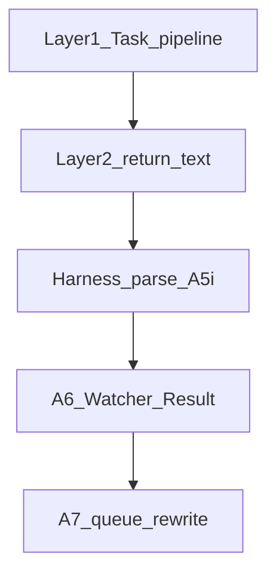

# Harness patterns and guidelines

**Version: 2026-04 – structure harness**

**Purpose:** Single normative reference for **repeatable structure** across Layer 2 pipelines, skills, and Layer 1 queue handling: numbered phases, safety gates, return payloads, and harness telemetry. Pipelines and rules implement this; see also [[3-Resources/Second-Brain/Docs/Subagent-Layers-Reference|Subagent-Layers-Reference]], [[.cursor/rules/agents/queue.mdc|queue.mdc]] **A.5i**.

| Topic | Doc |
|-------|-----|
| Layer index (L0–L2), TodoWrite, conditional musts | [[3-Resources/Second-Brain/Docs/Subagent-Layers-Reference|Subagent-Layers-Reference]] |
| Nested ledger schema | [[3-Resources/Second-Brain/Docs/Nested-Subagent-Ledger-Spec|Nested-Subagent-Ledger-Spec]] |
| Tiered validator, `primary_code`, scoped block | [[3-Resources/Second-Brain/Docs/Validator-Tiered-Blocks-Spec|Validator-Tiered-Blocks-Spec]] |
| Repair-first queue ordering | [[3-Resources/Second-Brain/Queue-Sources|Queue-Sources]] |
| Snapshot triggers | [[3-Resources/Second-Brain/Docs/Safety-Invariants|Safety-Invariants]] (Snapshot triggers) |
| Hand-off + Task harden | [[3-Resources/Second-Brain/Subagent-Safety-Contract|Subagent-Safety-Contract]] |
| Authoring new agents/skills | [[3-Resources/Second-Brain/Docs/Subagents/Creating-Subagents|Creating-Subagents]] |

---

## 1. Pipeline skeleton (Layer 2)

Ordered phases for **queue-dispatched** pipeline executors (ingest, roadmap, distill, express, archive, organize, research when eaten from queue):

| Phase | Requirement |
|-------|-------------|
| Hand-off | If dispatched from queue: refuse work if hand-off block missing per Subagent-Safety-Contract. |
| Backup | `obsidian_create_backup` / ensure_backup per MCP rule before destructive work. |
| Classify / enrich | Per pipeline (e.g. classify_para, frontmatter-enrich). |
| Primary confidence signal | One band table: high (≥85%) proceed with snapshot+destructive; mid (68–84%) one non-destructive loop max; low → wrappers / propose-only. See [[3-Resources/Second-Brain/Parameters|Parameters]] `confidence_bands`. |
| Snapshot | Per-change (and batch when batch size threshold) before destructive MCP per Safety-Invariants. |
| Destructive MCP | Only when high band + successful snapshot + gates pass. |
| Logs | Pipeline log + Backup-Log + Errors protocol on failure. |
| Run-Telemetry | `.technical/Run-Telemetry/` note: actor, project_id, queue_entry_id, timestamp, parent_run_id. |
| Return | Narrative summary + **mandatory** fenced YAML per §2. |

---

## 2. Subagent return contract extensions

### 2.1 Always (gated pipelines)

On **every** final return for modes listed in [[3-Resources/Second-Brain/Docs/Nested-Subagent-Ledger-Spec|Nested-Subagent-Ledger-Spec]] **Normative for**:

- Fenced YAML root **`nested_subagent_ledger:`** per that spec (include `not_applicable` rows when a step is exempt—never omit the block on false Success).

When the run used nested **`Task`** helpers via the harden pass:

- Footer or fenced block **`task_harden_result`** per [[3-Resources/Second-Brain/Subagent-Safety-Contract|Subagent-Safety-Contract]] (contract_satisfied, launch_mode, etc.).

### 2.2 `blocked_scope` (conditional)

| Rule | Text |
|------|------|
| Optional on the wire | Omit when **no** hard-block / tiered freeze path applies. |
| Normative when | **Hard block** or **tiered validator** outcome that freezes / scopes automation per [[3-Resources/Second-Brain/Docs/Validator-Tiered-Blocks-Spec|Validator-Tiered-Blocks-Spec]] §4 (Scoped block contract)—e.g. nested or final validator: `severity: high`, `recommended_action: block_destructive`, or `primary_code` in the unconditional hard set (`state_hygiene_failure`, `contradictions_detected`, `incoherence`, `safety_critical_ambiguity`). |
| `allowed_pivots` | Must align with **repair-first** ordering and allowed pivots in [[3-Resources/Second-Brain/Queue-Sources|Queue-Sources]] / Validator-Tiered-Blocks action matrix (e.g. `recal`, `handoff-audit`, `sync-outputs` when matrix allows). |

**Minimal shape (example):**

```yaml
blocked_scope:
  project_id: "..."
  validation_type: "roadmap_handoff_auto"
  primary_code: "contradictions_detected"
  freeze_deepen_advance: true
  allowed_pivots: ["recal", "handoff-audit"]
```

`primary_code` MUST use the closed set / precedence in Validator-Tiered-Blocks-Spec §2.

---

## 3. Skill-level harness (`SKILL.md`)

For **new** skills under `.cursor/skills/<name>/SKILL.md` that **mutate** vault notes, add a short **Harness** subsection (bullet or table):

| Field | Meaning |
|-------|---------|
| `vault_mutations` | `true` / `false` |
| `primary_confidence_signal` | If applicable (e.g. `path_conf`); else `-` |
| `snapshot_trigger` | `none` \| `per-change` \| `batch` \| `inherit-from-pipeline` |
| `destructive_actions` | List (e.g. move, rename, overwrite) or `none` |
| `exclusions` | Paths or globs the skill must not touch |

Read-only skills: `vault_mutations: false` (other fields optional).

---

## 4. Queue (Layer 1) harness telemetry

**Config:** `queue.harness_validation_mode`: `advisory` \| `strict` — see [[3-Resources/Second-Brain/Second-Brain-Config|Second-Brain-Config]] § **queue** and [[3-Resources/Second-Brain/Parameters|Parameters]]. **Default: `advisory`.**

**When:** Per **A.5i** in [[.cursor/rules/agents/queue.mdc|queue.mdc]] (after pipeline **`Task`** return handling **(b0)**–**(b1)** for the entry, before primary **Watcher-Result** line **(c)** / **A.6**).

**Parse:** Layer 2 return text for `nested_subagent_ledger`, **`blocked_scope`**, attestation invariants (Nested-Subagent-Ledger-Spec), and **`task_harden_result`** when the contract requires it.

| Outcome | Meaning |
|---------|--------|
| **pass** | Required blocks parse; attestation OK; **`blocked_scope`** present when §2.2 requires it (or not required). Proceed with **Watcher-Result** / **`processed_success_ids`** per existing **A.5** / **A.7**. |
| **advisory** | Harness gap (e.g. unparseable ledger, missing **`blocked_scope`** on hard-block path) logged to **Errors.md** and/or **`harness_outcome: advisory`** (or `harness_blocked_scope_missing: true`) in **Watcher-Result** **`trace`**—**do not** change consume/clear semantics beyond what **(b0)** already enforced. **Default** when `harness_validation_mode: advisory`. |
| **strict_fail** | **`harness_validation_mode: strict`**: treat as harness contract failure—apply **`nested_attestation_failure`** / refuse consumption parity with **(b0)(ii)–(iv)** as if **`strict_nested_ledger_all_pipelines`** / **`strict_nested_return_gates`** applied to the failing check, including missing **`blocked_scope`** when §2.2 requires it. |

### 4.1 Decision completeness signals (queue/harness)

For pipeline returns that add or amend `D-*` decisions, Layer 1 harness should carry decision completeness signals in parse-safe key/value fragments inside Watcher `trace` and (when needed) Errors:

| Signal | Meaning |
|-------|---------|
| `decision_option_class` | `explicit_options` \| `single_option` \| `deferred` |
| `decision_rationale_present` | `true` \| `false` |
| `decision_linkages_present` | `true` \| `false` |
| `decision_world_impact_required` | `true` \| `false` |
| `decision_world_impact_present` | `true` \| `false` |
| `decision_hygiene` | `pass` \| `needs_repair` |

Interpretation by mode:

- **Advisory mode (`harness_validation_mode: advisory`)**: retain normal consume behavior; emit `decision_hygiene=needs_repair` and log to Errors for follow-up.
- **Strict mode (`harness_validation_mode: strict`)**: when required fields are missing, treat as harness failure equivalent to `strict_fail` and block queue success consumption for that entry.

Minimum requirement for front-end/living-world decisions:

- `decision_world_impact_required=true`
- `decision_world_impact_present=true`
- and at least one linkage to a frontend flow artifact or markdown lore/codex hook.



---

## References

- [[3-Resources/Second-Brain/Cursor-Skill-Pipelines-Reference|Cursor-Skill-Pipelines-Reference]] — per-pipeline steps
- [[3-Resources/Second-Brain/Docs/Pipelines/Queue-Pipeline|Queue-Pipeline]] — Part A steps **A.0–A.7** + **A.5i**
