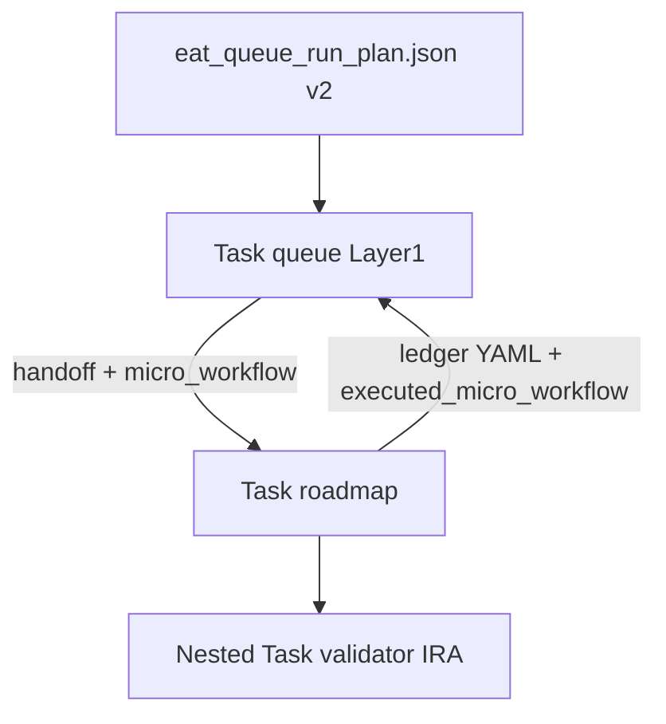

# Python queue orchestrator

Deterministic **`eat_queue_run_plan.json`** is produced by the **`scripts/eat_queue_core`** package (`python -m eat_queue_core plan`). Layer 1 (Queue subagent) may **consume** that file when [[3-Resources/Second-Brain/Second-Brain-Config|Second-Brain-Config]] **`queue.python_orchestrator_enabled`** is **`true`**. See [[.cursor/rules/agents/queue.mdc|queue.mdc]] **A.0.5**.

## Pre-run hook (recommended)

From the vault root, generate the plan **before** EAT-QUEUE. If `plan` exits non-zero, **stop** and fix the queue or plan; do not invoke **`Task(queue)`** with a stale or missing manifest.

```bash
python -m eat_queue_core plan \
  --queue .technical/prompt-queue.jsonl \
  --emit .technical/eat_queue_run_plan.json \
  --parent-run-id "$(date +eatq-%Y%m%dT%H%M%SZ)" \
  --verbose && echo "✅ Plan ready – now invoke EAT-QUEUE / Task(queue)"
```

Requires: `pip install -r scripts/eat_queue_core/requirements.txt` and `PYTHONPATH=scripts` (or equivalent) so `eat_queue_core` resolves.

## Testing the bridge

First runs should keep **`python_orchestrator_enabled: false`** in Config and validate **`eat_queue_core plan`** output only. Flip the flag to **`true`** only after you confirm **one clean repair cycle** end-to-end (plan → EAT-QUEUE → Watcher-Result → queue rewrite).

```bash
# Generate plan (from vault root)
PYTHONPATH=scripts python3 -m eat_queue_core plan \
  --queue .technical/prompt-queue.jsonl \
  --emit .technical/eat_queue_run_plan.json \
  --parent-run-id "eatq-$(date +%Y%m%dT%H%M%SZ)" \
  --verbose

# Then run EAT-QUEUE / Task(queue) as usual
```

## When to enable `python_orchestrator_enabled`

Keep **`false`** (default) until you have **tested a full EAT-QUEUE cycle** with the repair scenario and confirmed Watcher-Result / queue rewrite behavior. Then set **`true`** in Second-Brain-Config under the **`queue:`** block (see machine-readable YAML in Config).

## Safety

- **Flag off** or **plan file missing** → Layer 1 uses **legacy** LLM-driven ordering (**A.1** onward); no breaking change.
- **Flag on** and plan present → Layer 1 must follow **A.0.5** in `queue.mdc` (exact **`intents`** order; no overriding **`queue_pass_phase`**, **`pass_id`**, or **`dispatch_ordinal`** from the manifest).

## Plan schema (v2 — micro_workflow)

- **`schema_version`:** **`2`** — current. **`1`** may still be read for older manifests; intents without **`micro_workflow`** are **legacy** orchestrator shape (no strict micro-workflow enforcement).
- **`EatQueueRunPlan`:** **`parent_run_id`**, **`intents`**, **`consumed_ids`**, **`inline_pass3_drain`**, **`has_anticipatory_repair_slot`** (booleans).
- **`inline_pass3_drain`:** **`true`** when the plan includes at least one **`pass_id: pass3`** intent (repair-class) alongside Pass 1. Layer 1 must run **all** intents in order in the **same** EAT-QUEUE invocation — forward deepen first, then repair — and apply **A.7** using **`consumed_ids`** (all dispatched **`queue_entry_id`** values) so the queue does not require a second EAT-QUEUE for the repair line.
- **`has_anticipatory_repair_slot`:** **`true`** when Pass 3 was **pre-allocated** because the pre-run snapshot had **only** a deepen line (no repair yet). The matching **`DispatchIntent`** has **`is_anticipatory_drain: true`** and a **synthetic** **`queue_entry_id`**. Layer 1 **re-reads** the queue after Pass 1 and binds Pass 3 to the real repair line when L1 has appended it. See **A.0.5** in `queue.mdc`.
- **`DispatchIntent` (each intent):** **`micro_workflow`** (required non-empty list of strings when **`schema_version` is `2`**), optional **`allowed_sub_steps`**, **`strict_mode`** (boolean, default **true** in Python models when omitted from JSON — callers should pass explicitly in JSON for clarity), **`is_anticipatory_drain`** (when **`true`**, **`queue_entry_id`** is synthetic until Layer 1 resolves the real repair line after Pass 1 — see **A.0.5**).

**Central tables** (single source of truth): **`scripts/eat_queue_core/workflows.py`**

| Flow | Example `micro_workflow` |
|------|---------------------------|
| RESUME_ROADMAP deepen (forward / initial) | `roadmap_core`, `nested_validator_first`, `ira`, `nested_validator_second`, `l1_post_lv` |
| RESUME_ROADMAP repair-class dispatch (Pass 3 repair) | `validator`, `ira`, `final_validator` |
| Other actions | Same default as “other” row in code (non-empty; never an empty workflow) |

Logical labels map to **`nested_subagent_ledger`** **`steps[].step`** ids (e.g. **`validator`** → **`nested_validator_first`**, **`final_validator`** → **`nested_validator_second`**) — see **`MICRO_TO_LEDGER_STEP`** in **`workflows.py`**.

**Post-hoc validation:** **`eat_queue_core.ledger_validate.validate_ledger_steps_executed(expected_micro, yaml_text)`** checks ledger YAML against the expected sequence; **`validate_executed_micro_workflow`** checks top-level **`executed_micro_workflow`** in the roadmap return.

## Limitations (enforcement boundary)

- **`Task(roadmap)`**, **`Task(validator)`**, and **`Task(internal-repair-agent)`** remain **LLM subagents**. Python emits an exact manifest; Cursor rules and hand-offs narrow deviation, but **there is no compile-time guarantee** of “zero LLM deviation.” Enforcement is: (1) rule text + hand-off, (2) **post-hoc** checks (golden tests, optional CLI), (3) Layer 1 **`orchestrator_micro_workflow_violation`** when returns do not match **`micro_workflow`** under **`strict_mode: true`**.

## Runtime diagram



## Related

- [[Queue-Sources|Queue-Sources]] — prompt queue contract
- [[Subagent-Safety-Contract|Subagent-Safety-Contract]] — Task hand-off
