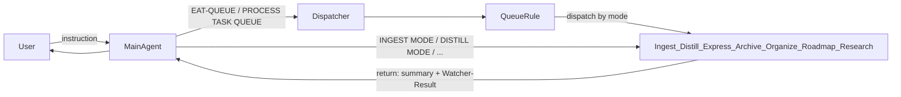

# Subagents Architecture

**Version: 2026-03 – post-subagent migration**

Mermaid diagram and explanation of how the main agent, dispatcher, queue rule, and pipeline subagents interact.

---

## Purpose

Single reference for the delegation flow: user instruction → main agent → dispatcher (for queue triggers) or system-funnels (for direct triggers) → Queue rule or pipeline subagent → return (summary + Watcher-Result).

---

## Overview

- **Main agent** (Thoth-AI) always loads core guardrails, persona, and PARA. It does not run pipeline logic itself; it either runs the **Queue rule** (for queue triggers) or **delegates** to a pipeline subagent (for direct triggers).
- **Dispatcher** (always rule): When the user says EAT-QUEUE, Process queue, EAT-CACHE, or PROCESS TASK QUEUE, the main agent loads and follows the **Queue rule** (`.cursor/rules/agents/queue.mdc`). The Queue rule runs in the main context: Step 0 (always-check wrappers), read queue, parse/validate/order, then **dispatch each entry** to the corresponding subagent or skill.
- **System-funnels** (always rule): For all other triggers (INGEST MODE, DISTILL MODE, etc.), the main agent delegates to `.cursor/agents/<name>.md` (or runs `.cursor/rules/legacy-agents/<name>.mdc`).
- **Pipeline subagents**: ingest, distill, express, archive, organize, roadmap, research. Each obeys [Subagent-Safety-Contract](../../Subagent-Safety-Contract.md); returns one-paragraph summary, any wrapper/queue entry, status; appends Watcher-Result line when requestId provided.

---

## Mermaid diagram

---

## Queue vs direct

| Trigger type | Router | Who runs pipeline |
|--------------|--------|-------------------|
| **Queue** (EAT-QUEUE, Process queue, EAT-CACHE, PROCESS TASK QUEUE) | Dispatcher → Queue rule | Queue rule dispatches each entry to the right subagent or skill by mode |
| **Direct** (INGEST MODE, DISTILL MODE, EXPRESS MODE, ARCHIVE MODE, ORGANIZE MODE, ROADMAP MODE, Resume roadmap) | System-funnels | Main agent delegates to the corresponding pipeline subagent (or legacy rule) |

---

## File locations

| Component | Location |
|-----------|----------|
| Queue rule | `.cursor/rules/agents/queue.mdc` |
| Pipeline subagents (prefer) | `.cursor/agents/<name>.md` |
| Pipeline subagents (fallback) | `.cursor/rules/legacy-agents/<name>.mdc` |
| Safety contract | `3-Resources/Second-Brain/Subagent-Safety-Contract.md` |
| Dispatcher | `.cursor/rules/always/dispatcher.mdc` |
| System funnels | `.cursor/rules/always/system-funnels.mdc` |
