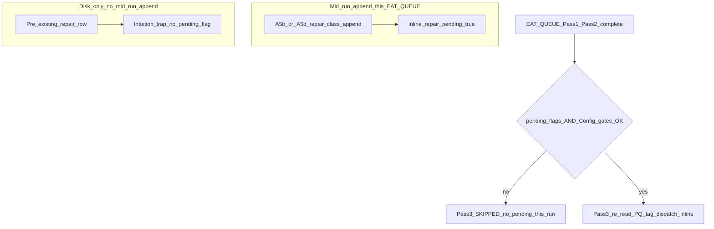
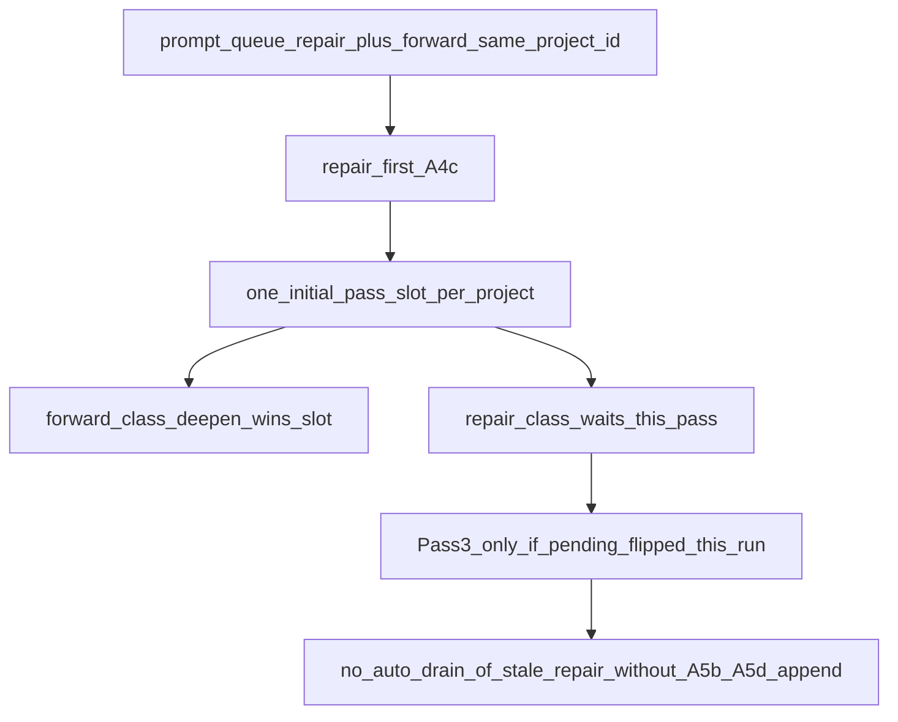

# EAT-QUEUE Pass 3 Operator Guide

**Version: 2026-04**

Why **Pass 3** (combined inline drain in Layer 1) sometimes **does not run** or **does nothing visible**, even when a **repair-class** line is already on `prompt-queue.jsonl`. Normative source: [[.cursor/rules/agents/queue.mdc|queue.mdc]] **A.4c**, **A.5.0**, **A.5b**, **A.5d**.

---

## What Pass 3 is

After **Pass 1 (initial)** and **Pass 2 (cleanup)** roadmap dispatches, Layer 1 may run a **bounded** **Pass 3** loop: **re-read** **PQ**, assign **`dispatch_pass: inline`** (repair-class) and optionally **`dispatch_pass: inline_forward`** (forward-class when Config allows), then dispatch **`Task(roadmap)`** for those lines **before** **A.7** queue rewrite — within caps and generation limits (**A.5.0**).

---

## Entry condition (contract)

Pass 3 runs only when **both** are true:

1. **Config gates:** `queue.inline_a5b_repair_drain_enabled` is not `false` (repair drain) **and/or** `queue.inline_forward_followup_drain_enabled === true` (forward follow-up drain). **Preferred:** familial shorthand such as **`speed_mode: balance + repair_strategy: repair_first`** (or omit familial keys — **Layer 1** applies that default bundle automatically) instead of setting **`queue.inline_*`** flags directly — see [[3-Resources/Second-Brain/Docs/Core/Config-Profiles|Config-Profiles]].
2. **Same-run pending flags:** `inline_repair_pending` **or** `inline_forward_followup_pending` was set **during this EAT-QUEUE run** by a qualifying mid-run append (see below).

If **no** pending flag is true, **Pass 3 is skipped** (“when both sides are false / no pending: skip Pass 3”).

**Normative boolean (A.5.0):**

`((inline_a5b_repair_drain_enabled !== false && inline_repair_pending) || (inline_forward_followup_drain_enabled === true && inline_forward_followup_pending))`

---

## Diagram A — Pass 3 gate (decision flow)

Exact condition ( **A.5.0** ): `((queue.inline_a5b_repair_drain_enabled !== false && inline_repair_pending) || (queue.inline_forward_followup_drain_enabled === true && inline_forward_followup_pending))`. If **both** sides of the OR are false, **skip Pass 3**.

**Takeaway:** “Repair already in the file” **does not** flip `inline_repair_pending` **by itself**. Pending comes from **this run’s** **A.5b** / **A.5d** (and related append paths per **queue.mdc**), not from stale rows left from a prior run.

---

## Where `inline_repair_pending` is set (same run)

Including but not limited to: **A.5b** / **A.5d** successful **repair-class** **`RESUME_ROADMAP`** append; PromptCraft recovery append when applicable. See **Pass 3 re-tag** and run-registry bullets in **A.5.0**.

---

## Diagram B — `repair_first` single-slot trap (intuition vs reality)

Under default **`queue.roadmap_pass_order: repair_first`** (**A.4c**), **exactly one** roadmap line per `project_id` is dispatchable in **`initial_pass`**; other roadmap lines for that project are **`none`** this run (no cleanup roadmap slots for that project in that configuration).

**Takeaway:** A **forward-class** deepen can consume the **only** initial slot while a **repair-class** line **waits**. Pass 3 still **does not** drain that stale repair unless **pending** was set by **mid-run append** logic (and tags/budgets allow).

---

## Telemetry pointers

- Optional: `queue_pass_phase=inline_skipped_no_slots` when Pass 3 runs but tags zero inline candidates (**A.5.0**).
- Watcher / audit: `queue_pass_phase=inline` or `inline_forward`; see [[3-Resources/Second-Brain/Queue-Sources|Queue-Sources]] § Observability.

---

## Remediation

- Adjust **`queue.roadmap_pass_order`**, per-project caps, or lane scope; use [[3-Resources/Second-Brain/Docs/Python-Queue-Orchestrator|Python-Queue-Orchestrator]] **full_cycle** when debugging plan parity.
- **Immediate remediation:** Run another **EAT-QUEUE** after any mid-run append (the new repair line will be tagged in the next Pass 1–2 if it wins the slot). For stubborn stalls, temporarily set `queue.inline_a5b_repair_drain_enabled: true` and `queue.inline_forward_followup_drain_enabled: true` in `Second-Brain-Config.md` (balance or extreme profile), then re-run.

---

## References

- [[.cursor/rules/agents/queue.mdc|queue.mdc]] — **A.4c**, **A.5.0**, **A.5b**, **A.5d**
- [[3-Resources/Second-Brain/Queue-Sources|Queue-Sources]] — roadmap multi-dispatch, Pass 3 summary
- [[3-Resources/Second-Brain/Docs/Validator-Tiered-Blocks-Spec|Validator-Tiered-Blocks-Spec]] — repair append and Pass 3
- [[3-Resources/Second-Brain/Docs/User-Flows/EAT-QUEUE-Flow|EAT-QUEUE-Flow]] — end-to-end EAT-QUEUE journey
