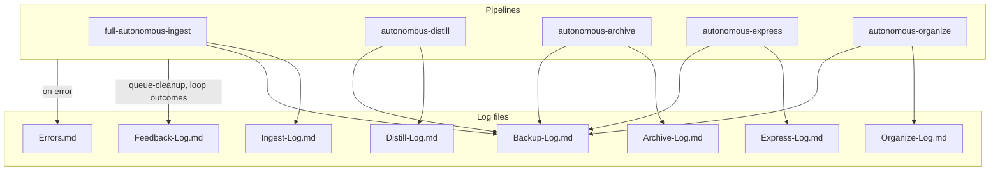
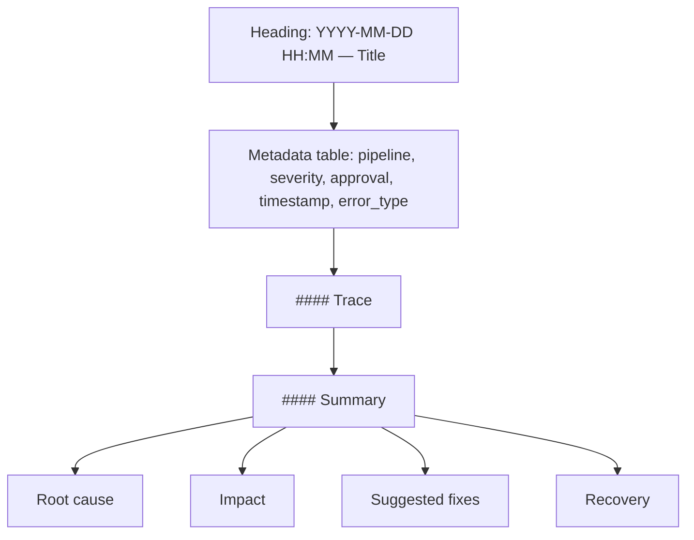
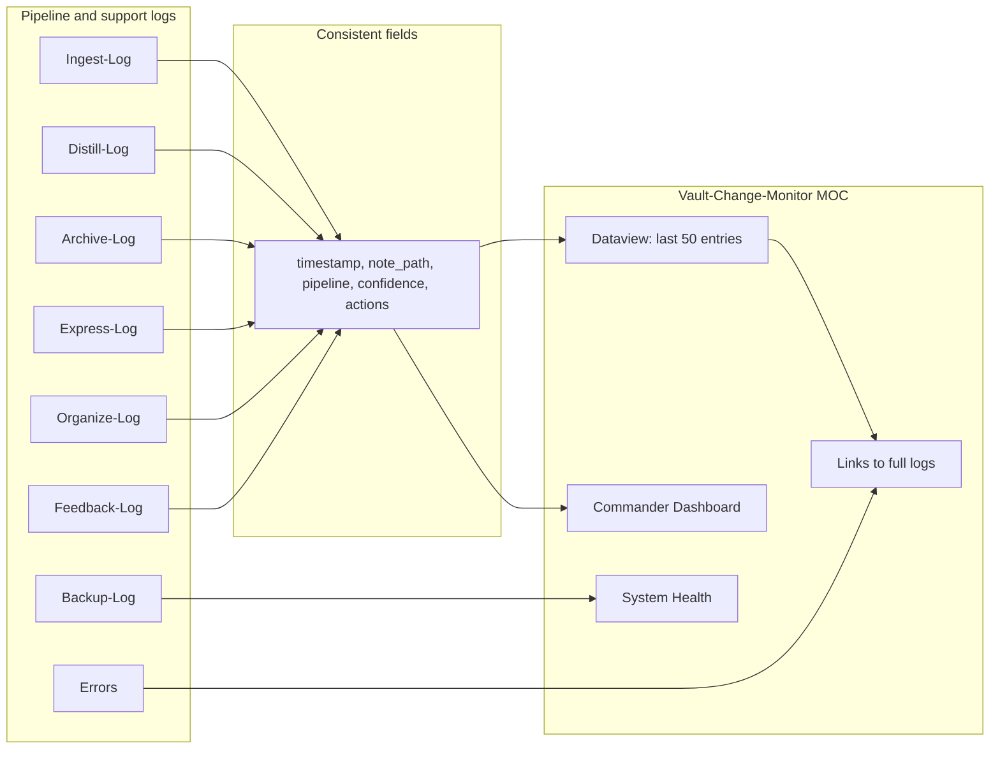
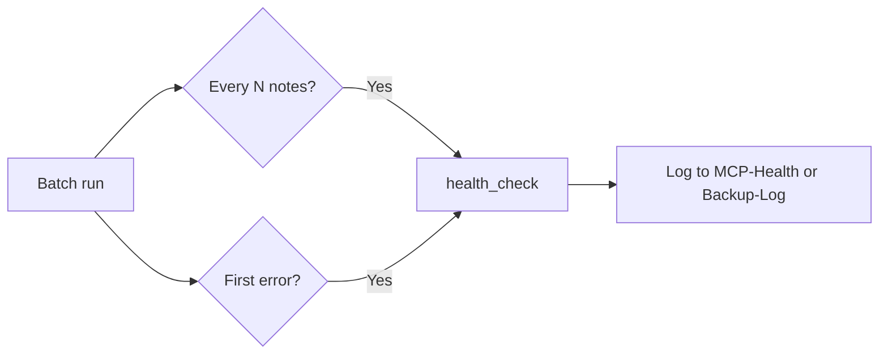

**TL;DR** — Pipeline logs live in 3-Resources (Ingest-Log, Distill-Log, Archive-Log, Express-Log, Organize-Log, Backup-Log, Errors.md, etc.); machine-only → `.technical/`. Use [Vault-Change-Monitor](3-Resources/Vault-Change-Monitor.md) as the MOC. Include backup and snapshot paths in log lines; Error entry structure: Heading, metadata table, Trace, Summary.

---

## Quick Reference — Log → location

| Log | Location |
|-----|----------|
| Ingest-Log | 3-Resources/Ingest-Log.md |
| Distill-Log | 3-Resources/Distill-Log.md |
| Archive-Log | 3-Resources/Archive-Log.md |
| Express-Log | 3-Resources/Express-Log.md |
| Organize-Log | 3-Resources/Organize-Log.md |
| Backup-Log | 3-Resources/Backup-Log.md |
| Errors | 3-Resources/Errors.md |

**Unified Dashboard**: [Vault-Change-Monitor](3-Resources/Vault-Change-Monitor.md) — last N entries, timelines, health. Include **snapshot path** in log line and in `obsidian_log_action` changes when per-change/batch snapshot was created (per [[3-Resources/Second-Brain/Pipelines#Snapshot triggers summary|Pipelines § Snapshot triggers]] and [[3-Resources/Second-Brain/Cursor-Skill-Pipelines-Reference#Snapshot triggers (all pipelines)|Cursor-Skill-Pipelines-Reference § Snapshot triggers]]).

---

## Pipeline logs (full table)

| Log | Location | What gets written | Responsibilities |
|-----|----------|-------------------|------------------|
| Ingest-Log | 3-Resources/Ingest-Log.md | timestamp, pipeline, note path, confidence, actions, backup/snapshot paths, flag; loop_* when applicable; **tech_level** for agent-output ingest | One line per note processed by full-autonomous-ingest — including **Phase 1 (propose + Decision Wrapper)** and **Phase 2 apply-mode** runs; must include backup_path and snapshot path when applicable, and should make Phase 1 vs Phase 2 clear in the actions/flag fields. **#cursor-agent-direct**: When a note from `Ingest/Agent-Output/` or with `agent-generated: true` is moved directly in Phase 1 (skip wrapper), append this flag and note path + target path; enables Dataview/MOC filtering (e.g. "agent-direct moves this week"). **Research notes** (from `Ingest/Agent-Research/`): may be logged with `research_query` or `linked_phase` (and `research_tools_used` when present) for traceability. `research_tools_used` may be e.g. `semantic_scholar`, `arxiv`, `crossref`, `web_search`, `firecrawl`, `browser_mcp`, `mcp_web_fetch`; legacy values `web`, `browse`, `freecrawl` remain valid. **tech_level**: For agent-output ingest, include when present (from frontmatter or queue payload) for progression audit. **CHECK_WRAPPERS**: Lines written by the CHECK_WRAPPERS / stale-wrapper flow use the same format and must be prefixed with `CHECK_WRAPPERS: ` for greppability (e.g. `grep "CHECK_WRAPPERS:" 3-Resources/Ingest-Log.md`). |
| Distill-Log | 3-Resources/Distill-Log.md | Same fields; pipeline = autonomous-distill | One line per note processed by autonomous-distill; coverage_adapted, perspective, lens when applicable; **heuristic** when post-process stabilizer applied (e.g. `heuristic: short-note-core-bias applied (248 words < 300)`). |
| Archive-Log | 3-Resources/Archive-Log.md | Same; pipeline = autonomous-archive | One line per note inspected/moved by autonomous-archive; backup and snapshot paths |
| Express-Log | 3-Resources/Express-Log.md | Same; pipeline = autonomous-express | One line per note processed by autonomous-express; version-snapshot path when created |
| Organize-Log | 3-Resources/Organize-Log.md | Same; pipeline = autonomous-organize | One line per note re-organized; backup and snapshot paths |
| Name-Review-Log | 3-Resources/Name-Review-Log.md | pipeline: name-review, note_path, suggested_name, applied, confidence, protection_triggered, old_stem | One line per note when NAME-REVIEW queue mode runs name-enhance batch |
| Backup-Log | 3-Resources/Backup-Log.md | Snapshot paths, batch checkpoints, backup_path from create_backup | Record snapshot paths and batch checkpoints; backup_path from create_backup; cross-post from pipeline logs when snapshots/backups involved |
| Feedback-Log | 3-Resources/Feedback-Log.md | Loop outcomes, user refinements, queue analytics; **#review-needed** from comment-fatigue heuristic and re-try cap exceed | Dataview-friendly; queue-cleanup and pipeline loops write here; create if missing; re-try cap hit and comment_fatigue_threshold exceed log here per plan §6.4 and §2 |
| Prompt-Log | 3-Resources/Prompt-Log.md | Crafted/merged params, validation outcome, merge trace | Append per craft/EAT-QUEUE when params used; Dataview aggregate in Vault-Change-Monitor MOC for "crafted runs this week" |
| Wrapper-Sync-Log | 3-Resources/Wrapper-Sync-Log.md | Watcher sync/skip/conflict lines (wrapper path, action, reason) | Watcher plugin appends every Decision Wrapper sync decision; append-only; conflicts also to Errors.md |
| Research-Log | 3-Resources/Research-Log.md | timestamp, project_id, linked_phase, outcome (notes_created \| empty \| failed \| exception), reason_if_not_notes_created, note_count | One line per research run (pre-deepen, RESEARCH-AGENT, gap-fill); research-agent-run appends when run finishes (success or empty/fail); optional: auto-roadmap / roadmap-deepen append when they invoke research. Enables "research ran, 0 notes" visibility without relying only on Errors.md. |
| Errors | 3-Resources/Errors.md | Pipeline errors; see Error entry structure below | Single place for pipeline errors; Error Handling Protocol; one entry per failure with Trace and Summary |
| (RECAL-ROAD / roadmap-audit) | Ingest-Log or Backup-Log | pipeline tag: roadmap-audit; RECAL-ROAD run; drift count; wrapper created | RECAL-ROAD and roadmap-audit: log to Ingest-Log.md with pipeline tag `roadmap-audit` (or Roadmap-Log if added later); roadmap-validate mismatches → Errors.md with #review-needed |
| (handoff-audit / decisions-log) | 1-Projects/…/Roadmap/decisions-log.md | timestamp, phase, readiness, gaps (array), actions; #handoff-review, #handoff-needed | Hand-off-audit skill appends one line per phase with `#handoff-review`, link to phase note, handoff_readiness, first 1–2 gaps; full trace path for auditability. Low band: append `#handoff-needed`. Aggregate in Vault-Change-Monitor via Dataview (e.g. TABLE handoff_readiness FROM 'Roadmap/' WHERE handoff_gaps). |
| (Validator / ROADMAP_HANDOFF_VALIDATE) | 1-Projects/…/Roadmap/handoff-validation-report-&lt;date&gt;.md + Run-Telemetry | Report note: summary, per-phase findings, cross-phase issues; Run-Telemetry: actor validator, required fields | Validator subagent writes one report note per run; no separate pipeline log file. Run-Telemetry note in .technical/Run-Telemetry/ per Subagent-Safety-Contract. |
| **Run-Telemetry** | `.technical/Run-Telemetry/` or **`.technical/Run-Telemetry/<parallel_track>/`** (`sandbox` / `godot`) when the Layer 1 hand-off includes **`parallel_track`** ([[3-Resources/Second-Brain/Docs/Dual-track-EAT-QUEUE-Operator|Dual-track-EAT-QUEUE-Operator]]) | One note per run (primary or subagent); **YAML frontmatter** + optional **body** (e.g. Roadmap **`## Nested subagent ledger`**) | **Required fields:** actor, project_id, queue_entry_id, timestamp; parent_run_id once primary sends it in the hand-off. **Optional (when available):** all other schema fields, with a short "source" note per field (e.g. model: from hand-off or Config; input_tokens: from API or estimated). Nested ledger: [[3-Resources/Second-Brain/Docs/Nested-Subagent-Ledger-Spec|Nested-Subagent-Ledger-Spec]]. Link to [[3-Resources/Telemetry-Dashboard|Telemetry-Dashboard]], [[3-Resources/Second-Brain/Parameters#Run-Telemetry|Parameters § Run-Telemetry]], and [[3-Resources/Second-Brain/Vault-Layout#.technical|Vault-Layout § .technical]] for full schema and rollout order. |
| **queue-continuation.jsonl** | .technical/ | Append-only JSONL; one object per processed queue entry when Config **`queue_continuation.continuation_log_enabled`** | Layer 1 merges **`queue_continuation`** from Roadmap return (if present) with dispatch metadata. Used for **empty-queue bootstrap** (A.1b) when enabled. Schema: [[3-Resources/Second-Brain/Docs/Queue-Continuation-Spec|Queue-Continuation-Spec]]. |
| **prompt-queue-audit.jsonl** | .technical/ | Append-only JSONL; **`line_removed`** + **`line_appended`** when Config **`queue.audit_log_enabled`** | Movement trace for **`prompt-queue.jsonl`**: payload snapshot, disposition, **`eat_queue_run_id`**, dispatch timing, **`spawned_line_ids`**. Schema: [[3-Resources/Second-Brain/Docs/Queue-Audit-Log-Spec|Queue-Audit-Log-Spec]]. Complements continuation + Watcher-Result. |
| **task-handoff-comms.jsonl** | .technical/ | Append-only JSONL; two objects per `Task` (`handoff_out`, `return_in`); verbatim prompt/return after sanitization | **Writers:** Layer 0 (dispatcher → `Task(queue)`), Layer 1 (all outbound `Task`: pipelines, post–little-val validator, PromptCraft, bootstrap), Layer 2 (nested `Task`: validator, IRA, research). **Links:** `parent_task_correlation_id` on helpers → `pipeline_task_correlation_id` from L1 hand-off. Schema: [[3-Resources/Second-Brain/Docs/Task-Handoff-Comms-Spec|Task-Handoff-Comms-Spec]]. Respects Config **`task_handoff_comms.enabled`**. |

## Run-Telemetry

Primary and subagents write **one note per run** to **.technical/Run-Telemetry/** (or **`.technical/Run-Telemetry/<parallel_track>/`** when **`parallel_track`** is **`sandbox`** or **`godot`** in the hand-off — see [[3-Resources/Second-Brain/Subagent-Safety-Contract|Subagent-Safety-Contract]] and [[3-Resources/Second-Brain/Docs/Dual-track-EAT-QUEUE-Operator|Dual-track-EAT-QUEUE-Operator]]) with YAML **frontmatter**. The **body** may include narrative sections when a pipeline requires them (Roadmap: **`## Nested subagent ledger`** per [[3-Resources/Second-Brain/Docs/Nested-Subagent-Ledger-Spec|Nested-Subagent-Ledger-Spec]]). **Required:** actor, project_id, queue_entry_id, timestamp; parent_run_id (from hand-off once primary sends it). **Optional (when available):** all other fields — including **`pipeline_mode_used`** / **`effective_profile_snapshot`** echo when the run used validator profiles ([[3-Resources/Second-Brain/Docs/Pipeline-Validator-Profiles|Pipeline-Validator-Profiles]]) — see table above and [[3-Resources/Second-Brain/Parameters#Run-Telemetry|Parameters § Run-Telemetry]] for required vs optional and source notes. Display: [[3-Resources/Telemetry-Dashboard|Telemetry-Dashboard]]. Contract: write required fields and any optional fields you have; omit the rest.

**Multi-phase EAT-QUEUE (Layer 1):** One **`eat_queue_run_id`** covers **initial**, **cleanup**, and **inline** (Pass 3 repair drain) roadmap phases when applicable ([[.cursor/rules/agents/queue.mdc|queue.mdc]] **A.4c** / **A.5.0**). The **Queue** subagent’s Run-Telemetry (when written) should tie **`parent_run_id`** / pipeline notes to that pass. **`dispatch_ledger`** ordinals are **global** across all passes (monotonic). Watcher-Result lines carry **`queue_pass_phase`**, **`dispatch_ordinal`**, **`roadmap_pass_order`** in **`message`** or **`trace`** when applicable — see [[3-Resources/Second-Brain/Queue-Sources|Queue-Sources]] § Observability.

### Success and error mapping

Map subagent return status to Run-Telemetry **success** and optional **error_category** / **error_message**:

- **Subagent return "Success"** (and no chain_request) → `success: "success"`.
- **"failure" or "#review-needed"** → `success: "failure"` or `"partial"`. When not success, primary (or subagent when it writes its own note) may set **error_category** (e.g. `tool_error`, `confidence-below-threshold`, `parse_error`, `mcp-api`) and a short, truncated **error_message** for root-cause. See Subagent-Safety-Contract: subagents use exact phrases **Success** or **failure** or **#review-needed** so the queue processor can set Run-Telemetry success and optional error fields.

### Phase 2 (cost and token split)

When a **rate table** exists (e.g. [[3-Resources/Second-Brain/Telemetry-Model-Rates|Telemetry-Model-Rates]] or Config), writers that have token estimates (e.g. roadmap-deepen) may populate **input_tokens** (e.g. = estimated_tokens), **output_tokens** (0 or rough completion estimate), **total_tokens**, and **cost_estimate_usd** (rate table × total_tokens) in the Run-Telemetry note. No new instrumentation required — reuse existing workflow_state/context numbers.

### Nested subagent ledger (roadmap) and Watcher `trace`

- **RoadmapSubagent** must emit **`nested_subagent_ledger`** (fenced YAML in the Task return) and duplicate the same object in the roadmap **Run-Telemetry** note body under **`## Nested subagent ledger`** (Summary, per-step headings, Raw YAML). Spec: [[3-Resources/Second-Brain/Docs/Nested-Subagent-Ledger-Spec|Nested-Subagent-Ledger-Spec]]; contract: [[3-Resources/Second-Brain/Subagent-Safety-Contract|Subagent-Safety-Contract]].
- **Layer 1 (EAT-QUEUE)** parses that ledger from the roadmap pipeline return and embeds **full YAML** in **`3-Resources/Watcher-Result.md`** **`trace`** for that `requestId`. If **`trace`** would exceed **~4000 characters**, truncate to **~3500** and point to the roadmap Run-Telemetry path for the full ledger (see [[.cursor/rules/agents/queue.mdc|queue.mdc]] **A.6**).
- **Task hand-off comms (canonical):** **`.technical/task-handoff-comms.jsonl`** — paired **`handoff_out`** / **`return_in`** per **`Task`** per [[3-Resources/Second-Brain/Docs/Task-Handoff-Comms-Spec|Task-Handoff-Comms-Spec]]; replaces the informal `dispatch_ledger` recommendation for durable transcripts.
- **Soft gate (v1):** Gated **Success** without a parseable ledger → **`error_type: nested_ledger_missing_or_unparseable`** in **Errors.md**; **`processed_success_ids`** policy unchanged until v2.

## Example log line

Format (align with [[3-Resources/Second-Brain/Cursor-Skill-Pipelines-Reference|Cursor-Skill-Pipelines-Reference]] log format):

`2026-03-01 14:30 | Excerpt: [first line or snippet] | PARA: Project | Changes: TL;DR added; Backup: /path/to/backup/Note.md; Snapshot: Backups/Per-Change/abc123.md | Confidence: 88% | Proposed MV: 1-Projects/MyProject/Note.md | Flag: none | Loop: attempted: false, band: none`

## Errors

Single place for pipeline errors: **3-Resources/Errors.md**. Create if missing. Reference Error Handling Protocol in [[.cursor/rules/always/mcp-obsidian-integration|mcp-obsidian-integration]]. **Test failures**: Automated test runs (see [[3-Resources/Second-Brain/Testing|Testing]]) can append failures to Errors.md for unified observability.

## Error entry structure

- **Heading**: `### YYYY-MM-DD HH:MM — Short Title`
- **Metadata table**: pipeline, severity, approval, timestamp, error_type
- **#### Trace**: Sanitized trace (no API keys)
- **#### Summary**: Root cause, Impact, Suggested fixes, Recovery

**Timestamp resolution (workflow_state):** For workflow_state ## Log timestamp resolution, error_type may be `timestamp-resolution`, `display_timezone_invalid`, or `timestamp_conversion_failed`. See [Errors.md](3-Resources/Errors.md) § Timestamp resolution.

## Research error entry format

Use this structure for all research-related entries in **3-Resources/Errors.md** so skill (research-agent-run) and callers (auto-roadmap, roadmap-deepen) write consistent, grep-friendly entries. Reference from research-agent-run Step 4 and from auto-roadmap § Pre-deepen (c), roadmap-deepen § step 4.5 gap-fill.

- **Heading**: `### YYYY-MM-DD HH:MM — research-empty | research-failed | research-skipped`
- **Metadata table**: `pipeline` (e.g. `research-agent-run`, `auto-roadmap`, `roadmap-deepen`), `linked_phase`, `project_id`, `error_type` (`research-empty` | `research-failed` | `research-skipped`), `timestamp`, optional `severity`
- **#### Trace**: Sanitized trace (no API keys); or reason string if no stack
- **#### Summary**: Root cause, impact, suggested fixes, recovery (brief)
- **Tags in body**: At least one of `#research-failed`, `#research-empty`, `#research-skipped` so Dataview/grep can filter

## Log rotation

- **Skill**: [[.cursor/skills/log-rotate/SKILL|log-rotate]] — when triggered (e.g. monthly or "Rotate logs" command), copy current Ingest-Log, Archive-Log, Distill-Log, Express-Log, Organize-Log, **Feedback-Log** to **3-Resources/Logs-Archive/<name>-YYYY-MM.md** and truncate or start fresh. Preserves history; reduces active log size. **Research-Log** may be included in the same rotation spec when extended.
- **Feedback-Log rotation**: Include Feedback-Log.md in the same rotation spec as other pipeline logs (e.g. monthly); see Feedback-Log.md for Dataview fields (drift_avg, loop_refinements_count, commander_macro).
- **Restore-queue**: User-maintained list (e.g. in Errors.md or **3-Resources/Restore-Queue.md**) of snapshot paths to restore. **List format**: one path per line, or a table with columns `snapshot_path`, `original_path` (optional). Processor reads the list and runs restore one-by-one: read snapshot content → write to original path (or specified target). No auto-restore. See [[.cursor/rules/always/mcp-obsidian-integration#Restore-queue mode|mcp-obsidian-integration]].

## Watcher-Result and wrapper creation

When any pipeline or the Error Handling Protocol **creates a Decision Wrapper** under `Ingest/Decisions/**`, append one line to **3-Resources/Watcher-Result.md**: `requestId: <id> | status: success | message: "created wrapper → Decisions/<subfolder>/<basename>" | trace: "" | completed: <ISO8601>`. Use queue entry `id` when run was queue-triggered; else synthetic id (e.g. `wrapper-<timestamp>`). See [[.cursor/rules/always/watcher-result-append|watcher-result-append]].

## Tiered validator / queue pivot (Layer 1)

When **EAT-QUEUE** runs the post–little-val hostile validator (**queue.mdc A.5b**), log short audit lines so operators can grep pivot behavior:

| Outcome | Where to log | Suggested gist |
|--------|----------------|----------------|
| **needs_work only** (no hard block) | Watcher-Result `segment: VALIDATE` | `needs_work; primary_code: …` — not a stop |
| **Hard block + repair appended** | Watcher-Result + optional **Feedback-Log** / **Prompt-Log** | `tiered_repair_queued: recal\|handoff-audit; primary_code: …; new_queue_id: …` |
| **Hard block, repair not appended** | **Errors.md** + Feedback-Log + Watcher-Result | `#review-needed`; `queue_failed` on rewrite |
| **Chain: dependency failed** | Watcher-Result with `chain_id` / `segment` | `chain aborted` |

Cross-ref: [[3-Resources/Second-Brain/Docs/Validator-Tiered-Blocks-Spec|Validator-Tiered-Blocks-Spec]], [[3-Resources/Second-Brain/Queue-Sources#Tiered validator queue fields (Layer 1)|Queue-Sources § Tiered validator queue fields]].

## Vault-Change-Monitor blocks (Plan Evolution, Pending Re-Tries)

When building or updating the [Vault-Change-Monitor](3-Resources/Vault-Change-Monitor.md) MOC (or [Ingest/Decisions/Wrapper-MOC](Ingest/Decisions/Wrapper-MOC.md)), include:

- **Context utilization (roadmap):** Link to each in-progress project's workflow_state; transclude the ## Log section for at least one project. **Avg Util this Phase** = average Ctx Util % over last N rows to flag shallow runs. When **Util Delta %** or trend **> +10%** per run (or util_delta > 15%), roadmap-deepen adds #review-needed and appends to Errors.md; see Vault-Change-Monitor § Util Spikes This Week and Errors.md for `util-spike-detected` lines.

- **Plan Evolution:** `TABLE file.link AS "Wrapper", used_at, approved_option, project-id FROM "4-Archives/Ingest-Decisions/Roadmap-Decisions" WHERE processed = true SORT used_at DESC LIMIT 20` — optionally **GROUP BY project-id** for per-project views (Dataview). Tracks applied phase-direction and roadmap wrappers as plan evolution history.
- **Pending Re-Tries:** `LIST FROM "Ingest/Decisions" WHERE re-try = true AND (processed != true OR !processed) SORT file.mtime DESC` — flag #review-needed for visibility. Overlord dashboard: list all pending wrappers across Ingest/Decisions/ (Ingest-Decisions, Roadmap-Decisions, Refinements, Low-Confidence, Errors) by clunk_severity and wrapper_type.

**Watcher-Result** as inject source: session_success_hint for re-queue payloads is read from last 1–3 success lines of Watcher-Result.md. See Queue-Sources § Re-queue / continuity. When queue ordering is adjusted by the post-process stabilizer (high-conf roadmap bump), log `queue_order_adjusted: true`, `reason: high-conf roadmap bump` in Watcher-Result or queue processor log.

**Mobile stub:** When mobile is in scope, append re-try summary to Mobile-Pending-Actions.md after appending a re-try queue entry; document in Queue-Sources or Logs. Currently out of scope; stub only.

## Observability

- Optional **3-Resources/MCP-Health-YYYY-MM.md** (monthly rotation).
- When to call **health_check**: e.g. every N notes in a batch or on first error. Log result to MCP-Health-YYYY-MM or Backup-Log.
- **Queue backlog**: When queue backlog > N (e.g. 5), optionally append a Watcher-Signal line to nudge processing. Document only; actual nudge can be Watcher or cron.

## Log destinations (diagram)

## Error entry structure (diagram)

## Log → MOC flow (Unified Dashboard)

## Health check flow

