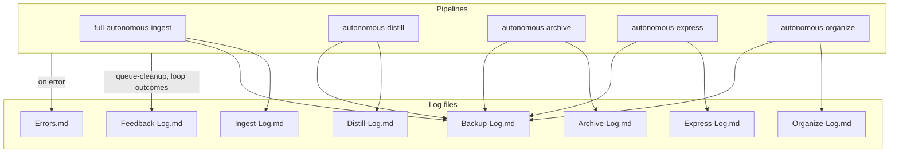
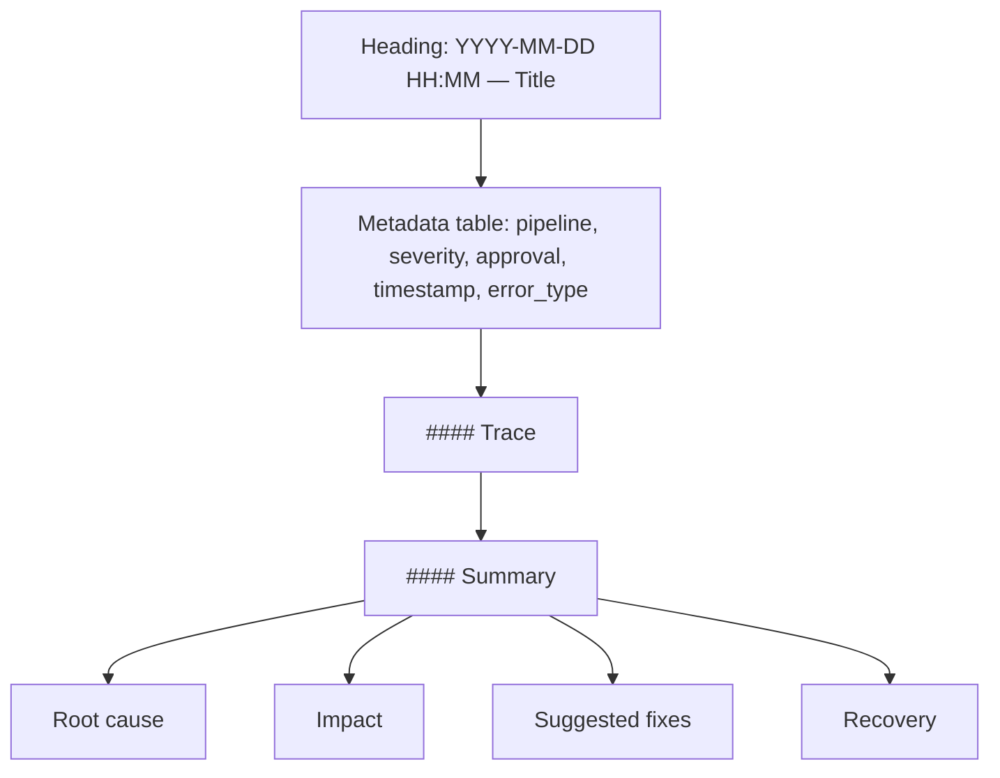
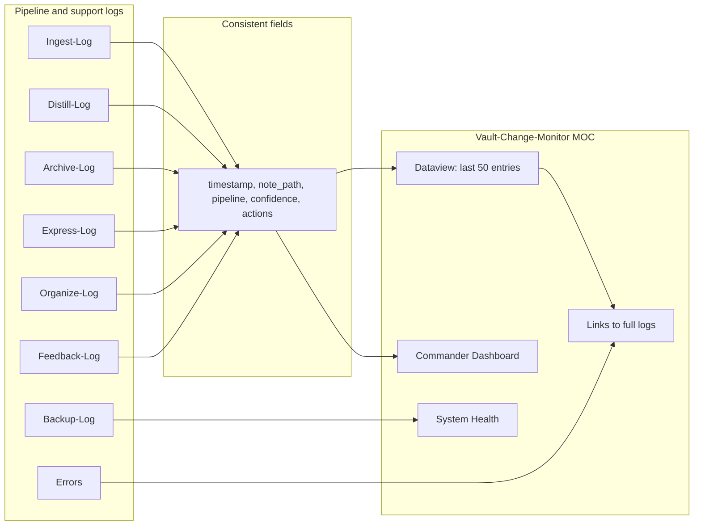
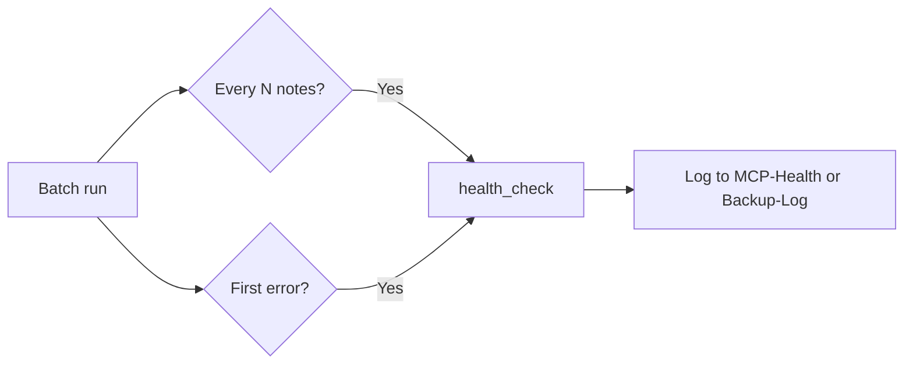

# Second Brain Logs

**Cursor-generated or machine-only files** → `.technical/` (excluded from Obsidian index to keep vault clean). Pipeline logs below stay in 3-Resources for Dataview/MOC.

**Unified Dashboard**: Use [Vault-Change-Monitor](3-Resources/Vault-Change-Monitor.md) as the single MOC for last N entries, timelines, Commander Dashboard, and health summaries. All logs write **consistent fields** (timestamp, note_path, pipeline, confidence, actions) so Dataview can aggregate. See diagram below for log → MOC flow. When to log **snapshot path**: per [[3-Resources/Second-Brain/Pipelines#Snapshot triggers summary|Pipelines § Snapshot triggers summary]] and [[3-Resources/Second-Brain/Cursor-Skill-Pipelines-Reference#Snapshot triggers (all pipelines)|Cursor-Skill-Pipelines-Reference § Snapshot triggers]]; include snapshot path in log line and in `obsidian_log_action` changes string whenever a per-change or batch snapshot was created.

## Pipeline logs

| Log | Location | What gets written | Responsibilities |
|-----|----------|-------------------|------------------|
| Ingest-Log | 3-Resources/Ingest-Log.md | timestamp, pipeline, note path, confidence, actions, backup/snapshot paths, flag; loop_* when applicable | One line per note processed by full-autonomous-ingest — including **Phase 1 (propose + Decision Wrapper)** and **Phase 2 apply-mode** runs; must include backup_path and snapshot path when applicable, and should make Phase 1 vs Phase 2 clear in the actions/flag fields. **CHECK_WRAPPERS**: Lines written by the CHECK_WRAPPERS / stale-wrapper flow use the same format and must be prefixed with `CHECK_WRAPPERS: ` for greppability (e.g. `grep "CHECK_WRAPPERS:" 3-Resources/Ingest-Log.md`). |
| Distill-Log | 3-Resources/Distill-Log.md | Same fields; pipeline = autonomous-distill | One line per note processed by autonomous-distill; coverage_adapted, perspective, lens when applicable; **heuristic** when post-process stabilizer applied (e.g. `heuristic: short-note-core-bias applied (248 words < 300)`). |
| Archive-Log | 3-Resources/Archive-Log.md | Same; pipeline = autonomous-archive | One line per note inspected/moved by autonomous-archive; backup and snapshot paths |
| Express-Log | 3-Resources/Express-Log.md | Same; pipeline = autonomous-express | One line per note processed by autonomous-express; version-snapshot path when created |
| Organize-Log | 3-Resources/Organize-Log.md | Same; pipeline = autonomous-organize | One line per note re-organized; backup and snapshot paths |
| Name-Review-Log | 3-Resources/Name-Review-Log.md | pipeline: name-review, note_path, suggested_name, applied, confidence, protection_triggered, old_stem | One line per note when NAME-REVIEW queue mode runs name-enhance batch |
| Backup-Log | 3-Resources/Backup-Log.md | Snapshot paths, batch checkpoints, backup_path from create_backup | Record snapshot paths and batch checkpoints; backup_path from create_backup; cross-post from pipeline logs when snapshots/backups involved |
| Feedback-Log | 3-Resources/Feedback-Log.md | Loop outcomes, user refinements, queue analytics; **#review-needed** from comment-fatigue heuristic and re-try cap exceed | Dataview-friendly; queue-cleanup and pipeline loops write here; create if missing; re-try cap hit and comment_fatigue_threshold exceed log here per plan §6.4 and §2 |
| Prompt-Log | 3-Resources/Prompt-Log.md | Crafted/merged params, validation outcome, merge trace | Append per craft/EAT-QUEUE when params used; Dataview aggregate in Vault-Change-Monitor MOC for "crafted runs this week" |
| Wrapper-Sync-Log | 3-Resources/Wrapper-Sync-Log.md | Watcher sync/skip/conflict lines (wrapper path, action, reason) | Watcher plugin appends every Decision Wrapper sync decision; append-only; conflicts also to Errors.md |
| Errors | 3-Resources/Errors.md | Pipeline errors; see Error entry structure below | Single place for pipeline errors; Error Handling Protocol; one entry per failure with Trace and Summary |

## Example log line

Format (align with [[3-Resources/Second-Brain/Cursor-Skill-Pipelines-Reference|Cursor-Skill-Pipelines-Reference]] log format):

`2026-03-01 14:30 | Excerpt: [first line or snippet] | PARA: Project | Changes: TL;DR added; Backup: /path/to/backup/Note.md; Snapshot: Backups/Per-Change/abc123.md | Confidence: 88% | Proposed MV: 1-Projects/MyProject/Note.md | Flag: none | Loop: attempted: false, band: none`

## Errors

Single place for pipeline errors: **3-Resources/Errors.md**. Create if missing. Reference Error Handling Protocol in [[.cursor/rules/always/mcp-obsidian-integration|mcp-obsidian-integration]]. **Test failures**: Automated test runs (see [[3-Resources/Second-Brain/Testing|Testing]]) can append failures to Errors.md for unified observability.

## Error entry structure

- **Heading**: `### YYYY-MM-DD HH:MM — Short Title`
- **Metadata table**: pipeline, severity, approval, timestamp, error_type
- **#### Trace**: Sanitized trace (no API keys)
- **#### Summary**: Root cause, Impact, Suggested fixes, Recovery

## Log rotation

- **Skill**: [[.cursor/skills/log-rotate/SKILL|log-rotate]] — when triggered (e.g. monthly or "Rotate logs" command), copy current Ingest-Log, Archive-Log, Distill-Log, Express-Log, Organize-Log, **Feedback-Log** to **3-Resources/Logs-Archive/<name>-YYYY-MM.md** and truncate or start fresh. Preserves history; reduces active log size.
- **Feedback-Log rotation**: Include Feedback-Log.md in the same rotation spec as other pipeline logs (e.g. monthly); see Feedback-Log.md for Dataview fields (drift_avg, loop_refinements_count, commander_macro).
- **Restore-queue**: User-maintained list (e.g. in Errors.md or **3-Resources/Restore-Queue.md**) of snapshot paths to restore. **List format**: one path per line, or a table with columns `snapshot_path`, `original_path` (optional). Processor reads the list and runs restore one-by-one: read snapshot content → write to original path (or specified target). No auto-restore. See [[.cursor/rules/always/mcp-obsidian-integration#Restore-queue mode|mcp-obsidian-integration]].

## Watcher-Result and wrapper creation

When any pipeline or the Error Handling Protocol **creates a Decision Wrapper** under `Ingest/Decisions/**`, append one line to **3-Resources/Watcher-Result.md**: `requestId: <id> | status: success | message: "created wrapper → Decisions/<subfolder>/<basename>" | trace: "" | completed: <ISO8601>`. Use queue entry `id` when run was queue-triggered; else synthetic id (e.g. `wrapper-<timestamp>`). See [[.cursor/rules/always/watcher-result-append|watcher-result-append]].

## Vault-Change-Monitor blocks (Plan Evolution, Pending Re-Tries)

When building or updating the [Vault-Change-Monitor](3-Resources/Vault-Change-Monitor.md) MOC (or [Ingest/Decisions/Wrapper-MOC](Ingest/Decisions/Wrapper-MOC.md)), include:

- **Plan Evolution:** `TABLE file.link AS "Wrapper", used_at, approved_option, project-id FROM "4-Archives/Ingest-Decisions/Roadmap-Decisions" WHERE processed = true SORT used_at DESC LIMIT 20` — optionally **GROUP BY project-id** for per-project views (Dataview). Tracks applied phase-direction and roadmap wrappers as plan evolution history.
- **Pending Re-Tries:** `LIST FROM "Ingest/Decisions" WHERE re-try = true AND (processed != true OR !processed) SORT file.mtime DESC` — flag #review-needed for visibility. Overlord dashboard: list all pending wrappers across Ingest/Decisions/ (Ingest-Decisions, Roadmap-Decisions, Refinements, Low-Confidence, Errors) by clunk_severity and wrapper_type.

**Watcher-Result** as inject source: session_success_hint for re-queue payloads is read from last 1–3 success lines of Watcher-Result.md. See Queue-Sources § Re-queue / continuity. When queue ordering is adjusted by the post-process stabilizer (high-conf roadmap bump), log `queue_order_adjusted: true`, `reason: high-conf roadmap bump` in Watcher-Result or queue processor log.

**Mobile stub:** When mobile is in scope, append re-try summary to Mobile-Pending-Actions.md after appending a re-try queue entry; document in Queue-Sources or Logs. Currently out of scope; stub only.

## Observability

- Optional **3-Resources/MCP-Health-YYYY-MM.md** (monthly rotation).
- When to call **health_check**: e.g. every N notes in a batch or on first error. Log result to MCP-Health-YYYY-MM or Backup-Log.
- **Queue backlog**: When queue backlog > N (e.g. 5), optionally append a Watcher-Signal line to nudge processing. Document only; actual nudge can be Watcher or cron.

## Log destinations (diagram)

## Error entry structure (diagram)

## Log → MOC flow (Unified Dashboard)

## Health check flow

