**TL;DR** — Obsidian MCP server **obsidian-para-zettel-autopilot**; tool names and params match descriptors in `mcps/user-obsidian-para-zettel-autopilot/tools/*.json`. Core: read/update/move/classify; Backup: create_backup, ensure_backup before destructive; dry_run before move_note; para-type/project-id/status set after move.

---

# Second Brain MCP Tools

Server: **obsidian-para-zettel-autopilot** (configured in `~/.cursor/mcp.json`; descriptors in project `mcps/user-obsidian-para-zettel-autopilot/tools/*.json`). **Tool names and parameters below match those descriptors;** for full schemas (arguments, types), read the corresponding `*.json` file.

## Tool groups

| Group | Tools (exact MCP names) | Responsibilities |
|-------|-------------------------|------------------|
| **Core** | obsidian_read_note, obsidian_update_note, obsidian_search_replace, obsidian_list_notes, obsidian_global_search, obsidian_manage_frontmatter, obsidian_manage_tags | Content read/update/search_replace; discovery via list_notes/global_search; metadata via manage_frontmatter/manage_tags |
| **Backup** | obsidian_create_backup, obsidian_ensure_backup | create_backup: full backup before destructive run; ensure_backup: check existing backup age (e.g. max_age_minutes); required before destructive tools |
| **Move/structure** | obsidian_move_note, obsidian_rename_note, obsidian_ensure_structure | move_note: dry_run then commit; after commit set para-type (and when under 1-Projects/ project-id, when under 4-Archives/ status: archived) from new path via manage_frontmatter; ensure_structure: create target parent path (folder_path) before move when parent missing |
| **Folder ops** | obsidian_ensure_structure, obsidian_remove_empty_folder | ensure_structure: create parent path; remove_empty_folder: remove empty folder (dry_run default true, then commit); used by archive-ghost-folder-sweep; extensible to post-organize cleanup |
| **PARA/organize** | obsidian_classify_para, obsidian_subfolder_organize, propose_para_paths | classify_para: para-type, themes, project-id; subfolder_organize: target path from para-type + project-id + themes (max 4 levels); propose_para_paths: ranked PARA path proposals with human-readable reasons (wrapper/midband/organize/fallback modes) |
| **Content** | obsidian_split_atomic, obsidian_distill_note, obsidian_append_to_hub, obsidian_suggest_connections | split_atomic: split on headings; distill_note: progressive layers; append_to_hub: cross-note append; suggest_connections: related notes, optional auto_insert |
| **Tasks** | obsidian_create_task_note, append_tasks, find_parent | create_task_note / append_tasks for task-reroute; find_parent to resolve Area/Project for task notes |
| **Confidence** | calibrate_confidence, verify_classification, propose_alternative_paths | Mid-band fallback: propose_alternative_paths → calibrate_confidence → verify_classification → dry_run again |
| **Batch** | obsidian_garden_review, obsidian_curate_cluster | garden_review: orphans, distill_candidates; curate_cluster: gaps, merges, synthesis by tag/folder |
| **MOC** | obsidian_append_to_moc, obsidian_generate_moc | Append to MOC or generate MOC (topic, path, tag/folder, content) |
| **Other** | obsidian_log_action, obsidian_delete_note, obsidian_refactor_to_zettel, bootstrap_project_batch, confirm_bootstrap, obsidian_list_projects, health_check | log_action: record pipeline action; include backup_path and snapshot path in changes string when applicable; health_check: server status, metrics, serverIdentifier |

## Important parameters

- **obsidian_move_note**: `dry_run` (true = preview only; always dry_run first, then commit).
- **obsidian_classify_para**: `mode` — area_first, conservative, liberal, balancer.
- **obsidian_update_note**: `mode` — overwrite, create (create for new version files; server skips destination backup).
- **obsidian_ensure_backup**: `max_age_minutes` (e.g. 1440 for 24h); use before long batches or after gap to avoid redundant create_backup.
- **obsidian_log_action**: Include backup path and snapshot path in the `changes` string (no dedicated backup_path param); pipelines log to Ingest-Log, Distill-Log, etc.
- **obsidian_remove_empty_folder**: `folder_path` (required, vault-relative); `dry_run` (default true — report effects only; always dry_run first, then commit with dry_run: false if OK); `recursive` (default false). Server enforces empty-check and blacklist (PARA roots, Templates, Backups, etc.). Used by archive-ghost-folder-sweep; extensible to other pipelines.

**Full parameter and return schemas:** See `mcps/user-obsidian-para-zettel-autopilot/tools/<tool_name>.json` for each tool.

## Queue JSONL — pre-append validation (PromptCraft / Layer 1)

**Not an MCP tool:** Shallow validation **before** Layer 1 appends lines produced by **PromptCraftSubagent** (when **Second-Brain-Config** `recovery_pre_append_lint_enabled` is true). For each suggested line:

1. Parse as single-line JSON; reject if parse fails.
2. Require string **`mode`** present and in the known mode set per [[3-Resources/Second-Brain/Queue-Sources|Queue-Sources]] (after normalization).
3. If **`params`** present, require object type; run the same param contract checks as EAT-QUEUE pre-dispatch where applicable ([[3-Resources/Second-Brain/MCP-Tools|MCP-Tools]] + Queue-Sources).
4. Reject lines that reuse the **same `id`** as the triggering queue entry (fresh `id` required).

Failures add synthetic entries to PromptCraft-equivalent **`lint_blockers`** and **must not** be appended. Full behavioral spec: [[3-Resources/Second-Brain/Docs/Prompt-Craft-Subagent|Prompt-Craft-Subagent]].

**Optional queue-line keys (Layer 1 A.4c / A.5.0, not MCP tools):** Producers may set **`queue_agent_may_skip_if_stall`** (bool), **`params.queue_blocking_repair`** (bool), and **`params.stall_skip_confirmed`** (bool) on **`prompt-queue.jsonl`** lines per [[3-Resources/Second-Brain/Queue-Sources|Queue-Sources]] § Roadmap multi-dispatch / Stall skip. These affect dispatch order and stall-skip policy only; they do not change MCP tool schemas.

**Research agent (external fetch):** The **research-agent-run** skill uses a **vault-first** step (Obsidian MCP: list_notes, read_note, global_search for project-linked context), then **raw-index lookup** (read `Ingest/Agent-Research/Raw/Raw-Index.md` for vault-first at fetch), then **fetch**:

- **Discovery:** web_search (Cursor built-in); **Semantic Scholar MCP** (when `semantic-scholar` in research_tools; academic or paper-suited queries); **arXiv MCP** (when `arxiv` in research_tools); **Crossref** or academic-search aggregator (when `crossref` in research_tools). Limit total discovery calls (e.g. 3–5); respect rate limits per [[3-Resources/Second-Brain/Research-Stack-Rate-Limits|Research-Stack-Rate-Limits]].
- **Extraction:** **Firecrawl MCP (self-hosted)** when `firecrawl` in research_tools; on missing/error → **Browser MCP or browser-tools** when `browser` in research_tools; on missing/error → **mcp_web_fetch**. If all fail for a URL, keep snippet and note "full page unavailable". No BrowserAct.
- **Academic:** When run is academic, prefer Semantic Scholar / arXiv / Crossref when in research_tools; else web_search with `site:arxiv.org` / `site:pubmed.ncbi.nlm.nih.gov` etc.
- **Gap-fill mode:** when **params.gaps** is present (from roadmap-deepen or Commander "Queue Research: Gaps"), ~70% of queries target gaps; returns structured **gap_fills** (gap_id, filled_markdown, sources, fill_conf) for inline injection. Optional **research_verify** re-queries 1–2 sources; discard fill if confidence below 68%.
- **Raw storage and vault-first at fetch:** When **store_raw** is true (default), the skill writes raw scraped content to `Ingest/Agent-Research/Raw/` (one note per run with sections `## Source: <url>`) and updates **Raw-Index.md** (table `| url | path | date |`). Before fetching a URL, the skill checks the index; if the URL is present, it reads the raw note via **obsidian_read_note** and uses that content instead of re-fetching. Uses **obsidian_ensure_structure**, **obsidian_update_note** / create for Raw/ and index.
- **workflow_state:** roadmap-deepen writes **last_ctx_util_pct** to workflow_state frontmatter after each Log append; optional **injected_research_paths** persisted when RESEARCH-AGENT completes.

Setup requires the MCPs below in Cursor config (`~/.cursor/mcp.json` or project MCP). See **Research stack setup** below and [[3-Resources/Second-Brain/Research-Stack-Rate-Limits|Research-Stack-Rate-Limits]]. See [[.cursor/skills/research-agent-run/SKILL]] and [[Parameters#Research (pre-deepen)]].

### Research stack setup (install and configure each MCP)

Document and perform setup so the new tools are available. Add each server to Cursor `~/.cursor/mcp.json` (or project MCP config).

| MCP | Install | Config | Verify |
|-----|---------|--------|--------|
| **Semantic Scholar MCP** | Clone/install from a chosen repo (e.g. `akapet00/semantic-scholar-mcp`); run via uvx/Python/Docker per repo README. | Add server block to mcp.json with `command` (and args) or `url` if stdio/server. Optional env `SEMANTIC_SCHOLAR_API_KEY` for higher rate limit (100 req/s vs 100/5min). | Tool(s) such as `search_paper` appear in Cursor and respond. |
| **arXiv MCP** | e.g. `andybrandt/mcp-simple-arxiv`; run via uvx/pip/npx/Docker per repo. | Add to mcp.json with repo's `command` (and working directory if needed). No API key. | Search tool returns arXiv results. |
| **Crossref (or Academic Search MCP)** | Standalone: install Crossref MCP per repo; set polite pool (mailto in request). Aggregator: install "Academic Search MCP" that aggregates Semantic Scholar + Crossref. | Add to mcp.json; document which tools map to Crossref. | DOI lookup or list/query tools work. |
| **Firecrawl MCP (self-hosted)** | Run Firecrawl backend locally (per Firecrawl self-host/Docker docs); install **firecrawl/firecrawl-mcp-server** (or equivalent) pointed at local instance. | Add to mcp.json with `command` (and env for Firecrawl URL if needed). No hosted credits. | Scrape (or equivalent) tool returns content for a test URL. |
| **Browser MCP or browser-tools** | Pick one: Browser MCP (browsermcp.io / GitHub) or **AgentDeskAI/browser-tools-mcp** per README. Ensure browser runtime (e.g. Chromium) available. | Add to mcp.json with repo's `command`. | Navigate/scrape can fetch a page. Document chosen option so skill references correct tool names. |

**Tool names per server:** Document in this file or in the skill the exact tool names each server exposes (e.g. `search_paper`, `scrape`, `browser_navigate`) so research-agent-run can call them. Link to [[3-Resources/Second-Brain/Research-Stack-Rate-Limits|Research-Stack-Rate-Limits]] for operator awareness.

**Session continuity (git_diff_hint):** When the vault has `.git`, the agent may use **code_execution** (read-only) to run `git diff --summary` (or `git log -3 --oneline`) and inject a short summary into `params.git_diff_hint` when building re-try or TASK-TO-PLAN-PROMPT queue payloads. No new MCP tool; document in Queue-Sources and Logs. If no .git or command fails, fallback to obsidian_list_notes on Versions/ or log to Errors.md.

Env and config: [[3-Resources/2026-02-25-config-reference-obsidian-para-zettel-mcp|config-reference]] or [[Ingest/CONFIG-REFERENCE|CONFIG-REFERENCE]].

## Usage examples

- **Ingest sequence**: obsidian_create_backup → obsidian_classify_para → (skills use obsidian_update_note, obsidian_manage_frontmatter) → obsidian_subfolder_organize → obsidian_split_atomic → obsidian_distill_note → obsidian_append_to_hub → obsidian_move_note(path, new_path, dry_run: true) → obsidian_move_note(path, new_path, dry_run: false) → obsidian_log_action (with backup path in changes).
- **Move with missing parent**: Call obsidian_ensure_structure(folder_path: target_parent) to create the full parent path, then obsidian_move_note(path, new_path, dry_run: true) → review effects → obsidian_move_note(..., dry_run: false).

## Tool groups (diagram)

```mermaid
flowchart TB
  subgraph Core [Core]
    obsidian_read_note[obsidian_read_note]
    obsidian_update_note[obsidian_update_note]
    obsidian_search_replace[obsidian_search_replace]
    obsidian_list_notes[obsidian_list_notes]
    obsidian_global_search[obsidian_global_search]
    obsidian_manage_frontmatter[obsidian_manage_frontmatter]
    obsidian_manage_tags[obsidian_manage_tags]
  end
  subgraph Backup [Backup]
    obsidian_create_backup[obsidian_create_backup]
    obsidian_ensure_backup[obsidian_ensure_backup]
  end
  subgraph Move [Move/structure]
    obsidian_move_note[obsidian_move_note]
    obsidian_rename_note[obsidian_rename_note]
    obsidian_ensure_structure[obsidian_ensure_structure]
  end
  subgraph FolderOps [Folder ops]
    obsidian_remove_empty_folder[obsidian_remove_empty_folder]
  end
  subgraph PARA [PARA/organize]
    obsidian_classify_para[obsidian_classify_para]
    obsidian_subfolder_organize[obsidian_subfolder_organize]
    propose_para_paths[propose_para_paths]
  end
  subgraph Content [Content]
    obsidian_split_atomic[obsidian_split_atomic]
    obsidian_distill_note[obsidian_distill_note]
    obsidian_append_to_hub[obsidian_append_to_hub]
    obsidian_suggest_connections[obsidian_suggest_connections]
  end
  subgraph Tasks [Tasks]
    obsidian_create_task_note[obsidian_create_task_note]
    append_tasks[append_tasks]
    find_parent[find_parent]
  end
  subgraph Confidence [Confidence]
    calibrate_confidence[calibrate_confidence]
    verify_classification[verify_classification]
    propose_alternative_paths[propose_alternative_paths]
  end
  subgraph Batch [Batch]
    obsidian_garden_review[obsidian_garden_review]
    obsidian_curate_cluster[obsidian_curate_cluster]
  end
  subgraph MOC [MOC]
    obsidian_append_to_moc[obsidian_append_to_moc]
    obsidian_generate_moc[obsidian_generate_moc]
  end
  subgraph Other [Other]
    obsidian_log_action[obsidian_log_action]
    obsidian_delete_note[obsidian_delete_note]
    obsidian_refactor_to_zettel[obsidian_refactor_to_zettel]
    bootstrap_project_batch[bootstrap_project_batch]
    confirm_bootstrap[confirm_bootstrap]
    obsidian_list_projects[obsidian_list_projects]
    health_check[health_check]
  end
```

## Typical ingest MCP sequence

## propose_para_paths (ranked PARA proposals)

**Purpose**: Unified ranked PARA path proposals with human-readable reasons, built on top of subfolder_organize. **MCP tool name:** `propose_para_paths` (descriptor: `propose_para_paths.json`).

**Parameters**:

- `path` (string, required): note path (vault-relative).
- `context_mode` (string, enum): `"wrapper"` (concise one-liners for Decision Wrappers), `"midband"` (refinement loop), `"organize"` (balanced re-org/archive suggestions), `"fallback"` (move-failure proposals).
- `rationale_style` (string, enum, optional): `"concise"` (≤ ~80 chars; default), `"detailed"`, `"bullet"`, `"technical"`. Defaults to concise when omitted.
- `max_candidates` (string): `"3"`–`"8"` (default `"5"`; server clamps to a safe range).

**Returns**:

- `candidates`: array of `{ path, score (0–100), reason_short, rationale, confidence_breakdown }`.
- `recommended_index`: 0-based index of best candidate (or `-1` when none).
- `overall_confidence`: float/int (0–100) overall proposal strength (typically top score).
- `meta`: `{ weights_used, debug_info? }`.

**Fallback behavior**:

- When the engine cannot produce good multi-candidate output (very low `overall_confidence` or empty `candidates`), callers for ingest wrappers should:
  - Treat the result as **low-quality** and fall back to obsidian_subfolder_organize to obtain a single structural default path.
  - Mark wrappers with `proposal_quality: "low"` and surface a callout so users know they are seeing a single default path that needs manual review.
- **Wrapper must have 7 options:** For Decision Wrappers, the template has slots A–G. The API may return fewer than 7 (or 0) candidates. Callers **must pad to 7** using deterministic fallback paths (e.g. direct under each PARA root + basename, then 3-Resources/Unfiled/, 4-Archives/Ingest-YYYY-MM-DD/, then 1-Projects/Unsorted-Projects/, 2-Areas/Unsorted-Areas/, 3-Resources/Unsorted-Resources/, 4-Archives/Ingest-Default-Fallback/) so every wrapper displays exactly 7 choices. **Post-process stabilizer:** After receiving candidates, re-rank by [[3-Resources/Second-Brain/PARA-Actionability-Rubric|PARA-Actionability-Rubric]] v1.0 → semantic fit → path depth → alphabetize; when re-ranking changed order, set on wrapper `heuristic_adjusted: true`, `heuristic_reason: "tie-breaker applied per PARA rubric v1.0"`. See para-zettel-autopilot.mdc § Decision Wrapper creation and [[3-Resources/Second-Brain/Audit-Decision-Wrapper-Missing-Options-2026-03-05]].
