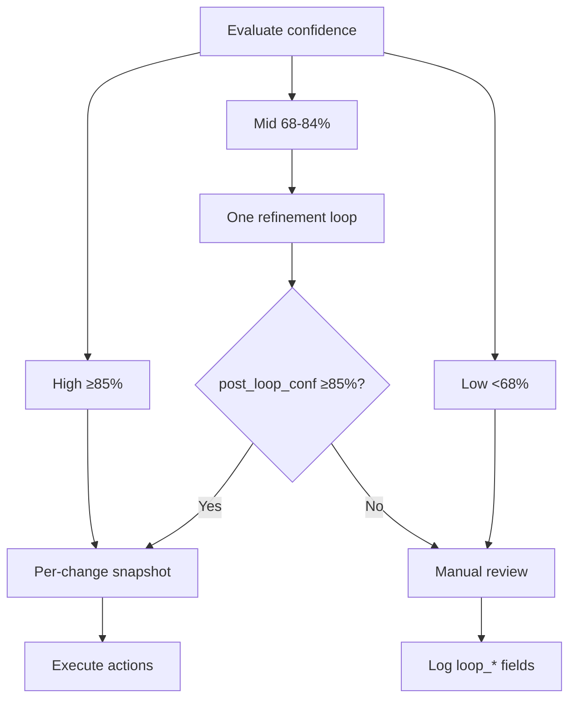
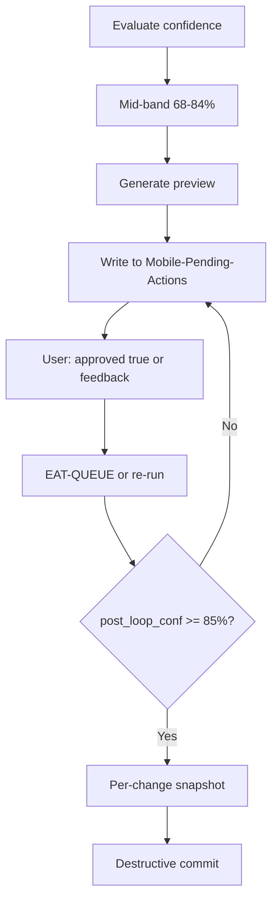
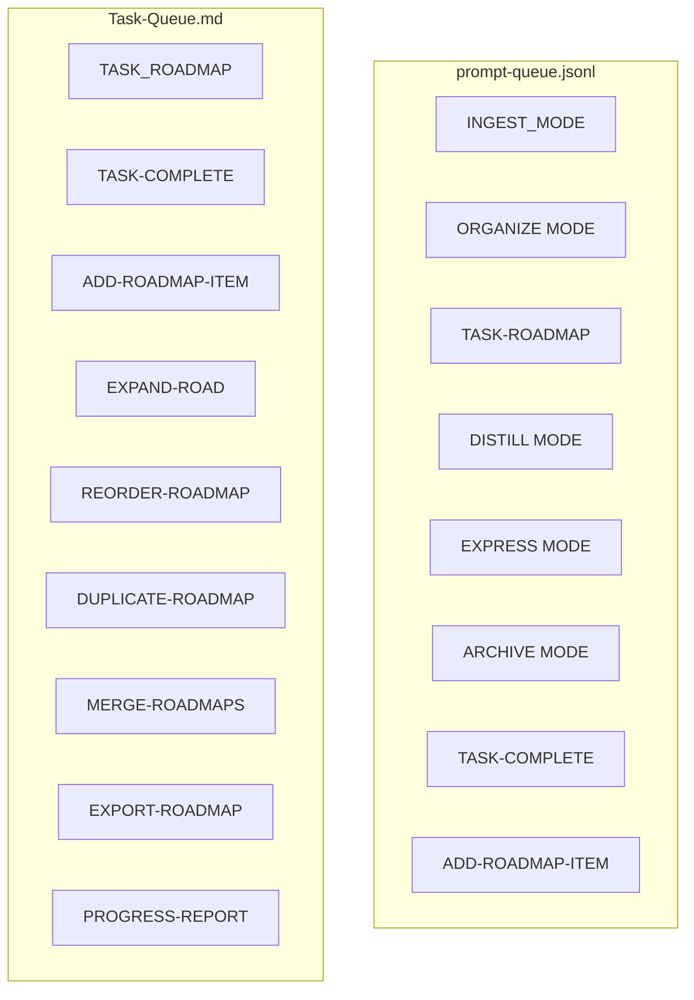

**TL;DR** — Confidence bands: High ≥85% (destructive after snapshot), Mid 68–84% (one refinement loop), Low <68% (propose-only). Tunable via Second-Brain-Config. RESUME_ROADMAP params (action, queue_next, enable_context_tracking, …) and context-utilization tracking; research/gap params; roadmap config (drift_score_threshold, conf_phase_complete_threshold).

---

## Quick Reference — Confidence bands

| Band | Range | Behavior |
|------|-------|----------|
| **High** | ≥85% | Destructive actions allowed after per-change snapshot; dry_run then commit |
| **Mid** | 68–84% | Single non-destructive refinement loop; proceed only if post_loop_conf ≥85% |
| **Low** | <68% | Propose only; no destructive actions; user decision flows |

**Tunable**: `confidence_bands` in [[3-Resources/Second-Brain-Config|Second-Brain-Config]] (e.g. `mid: [80, 90]`, `high_threshold: 90`). Optional **crafted_params_conf_boost** (0–10); **loop-skip: true** skips mid-band loop.

---

## Safety

> [!warning] **Destructive actions only at ≥85%** and only after per-change snapshot. Mid-band: at most one refinement loop; if post_loop_conf ≤ pre_loop_conf, fall back to user decision (no destructive step). RESUME-ROADMAP: **queue_next** absent/undefined = true (pipeline may append follow-up); **enable_context_tracking** default-on (only explicit false disables).

### Pipeline validator profiles (`pipeline_mode`)

**Full spec:** [[3-Resources/Second-Brain/Docs/Pipeline-Validator-Profiles|Pipeline-Validator-Profiles]].

- **Config:** [[3-Resources/Second-Brain-Config|Second-Brain-Config]] → `pipeline_mode` (`quality` | `balance` | `speed`, default **`balance`**) and **`validator_profiles`** (per-mode rows: `l1_post_lv_policy`, `nested_ira_policy`, `research_synthesis_depth`, `target_nested_validator_passes`, plus balance-only research escalation keys).
- **Queue override:** **`params.pipeline_mode`** on a queue line overrides top-level `pipeline_mode` when valid.
- **Hand-off:** Queue merges **`effective_pipeline_mode`** and **`effective_profile_snapshot`** into **`layer1_resolver_hints`** (RESUME_ROADMAP / chains) and **`## effective_pipeline_profile`** (ROADMAP_MODE). Roadmap and Research **must** use the snapshot; see `queue.mdc` A.5.

**Threshold table (balance defaults; speed profile may differ in Config):**

| Key | Default (balance) | Notes |
|-----|-------------------|--------|
| `research_full_if_run_confidence_below` | **80** | Force full `research_synthesis` when run confidence &lt; this (tunable **75**). |
| `research_full_every_n_runs` | **3** | Every Nth successful research run per `project_id` → full cycle (**4** in speed profile for fewer deep passes). |
| `research_full_if_prior_roadmap_validator_stronger_than_log_only` | **true** | Prior roadmap validator stronger than `log_only` → full. |

**Safety escalation:** Hard validator signals (`severity: high`, `block_destructive`, tiered hard `primary_code`) **force** full nested + L1 paths regardless of profile; see Pipeline-Validator-Profiles §5.

### Nested validator → IRA (`ira_after_first_pass`) — fallback

- **Who invokes IRA:** Layer 2 pipeline subagent via nested `Task`; Queue does not run IRA. See [[3-Resources/Second-Brain/Subagent-Safety-Contract|Subagent-Safety-Contract]].
- **Primary control:** **`nested_ira_policy`** in **`effective_profile_snapshot`** (`always` ≈ ira after every first pass; `clean_skip` ≈ legacy false; `medium_or_higher` = speed). When snapshot is present, **roadmap/research use `nested_ira_policy`**, not this key alone.
- **Fallback Config:** `nested_validator.ira_after_first_pass` (default **false** in this vault) when no profile snapshot is merged.
- **Queue override:** Optional **`params.ira_after_first_pass`** still applies as an explicit per-entry override when documented in the agent hand-off contract.

---

## Confidence bands (detailed)

| Band | Range | Behavior | Responsibilities |
|------|-------|----------|------------------|
| **High** | ≥85% | Destructive actions allowed after per-change snapshot; dry_run then commit for move | Pipelines may run destructive steps only in this band; skills read high_threshold from config if set |
| **Mid** | 68–84% | Single non-destructive refinement loop; proceed only if post_loop_conf ≥85% | Single refinement loop per note; loop_* fields written to pipeline log; async preview option |
| **Low** | <68% | Propose only; no destructive actions; manual review | No loop; propose-only; log for manual review; user can add approved: true and re-run EAT-QUEUE |

**Consistency**: All pipeline context rules (auto-archive, auto-organize, auto-distill, auto-express, ingest) use the same **68–84%** mid-band; there is no 72% floor variant.

**Tunable**: Optional `confidence_bands` in [[3-Resources/Second-Brain-Config|Second-Brain-Config]] (e.g. `mid: [80, 90]`, `high_threshold: 90`). Rules and skills read when present; fallback to above. Optional **`crafted_params_conf_boost`** (integer 0–10, e.g. 5): when crafted params are used (queue params, prompt-crafter assembly, or **question-led crafted payload**), add this % to pre_loop_conf floor; default 0 if unset. See confidence-loops.

**Non-destructive lower (optional)**: Config **`non_destructive_lower`** (e.g. 75) allows metadata-only or preview-only steps at a lower threshold than 85%. **Pros**: Faster depth runs (e.g. previews, metadata updates without structural edits). **Cons**: More steps may run before user review; ensure previews are always emitted when confidence <85%. **Safety**: Destructive actions remain ≥85% + snapshot; undo via snapshots when needed.

**Loop-skip**: Frontmatter `loop-skip: true` (or `skip_refinement_loop: true`) — when set, skip the mid-band refinement loop for that note (trusted path). See [[.cursor/rules/always/confidence-loops|confidence-loops]].

**RESUME_ROADMAP params contract:** When mode is RESUME_ROADMAP, EAT-QUEUE validates **params.action** against allowed enum (deepen | recal | revert-phase | sync-outputs | handoff-audit | resume-from-last-safe | expand | **advance-phase** | **compact-depth** | **unfreeze_conceptual** | **bootstrap-execution-track**). Invalid action → reject entry, log to Errors.md. **`bootstrap-execution-track`** initializes `Roadmap/Execution/` and sets **`roadmap_track: execution`** on `roadmap-state.md` per [[3-Resources/Second-Brain/Docs/Dual-Roadmap-Track|Dual-Roadmap-Track]]; it does **not** unfreeze or overwrite frozen conceptual notes — use the Vault-Layout freeze checklist and **`unfreeze_conceptual`** when needed. **action** default: deepen. **queue_next** (bool): when **absent** or **undefined**, treat as **true** (pipeline **must** append a follow-up RESUME_ROADMAP when caps and context threshold allow; required unless explicitly false); only when **explicitly false** does the pipeline skip appending a follow-up. **Normative alignment:** See [[3-Resources/Second-Brain/Queue-Sources|Queue-Sources]] § **`effective_followup_required`** — Layer 2 returns **`queue_followups.next_entry`** when required; Layer 1 **A.5c.1** may synthesize one line if Layer 2 omits it (Config **`queue.synthesize_followup_when_queue_next_true`**, default **true**). **Consumption guard:** Layer 1 must not consume a non-terminal RESUME_ROADMAP success if no continuation line exists after A.5c/A.5c.1/A.5c.2; this holds even when `little_val_ok` is null/absent on a success return. The agent (in crafter or auto-roadmap) must never set `queue_next: false` based solely on stall patterns, low confidence, high iterations, drift, or any other runtime metric unless the handoff gate condition is explicitly met or the user has chosen false via the crafter’s explicit “Other” path and confirmed it. Other params: phase (required when action is revert-phase), granularity, sectionOrTaskLocator, userText, focus, handoff_gate, min_handoff_conf, enable_context_tracking, context_util_threshold, context_token_per_char, context_window_tokens, **roadmap_track** (optional `conceptual` \| `execution`; one-run override for which workflow/state files roadmap-deepen uses — canonical source remains `roadmap-state.md` when absent), **confirm_unfreeze** (required when action is `unfreeze_conceptual`), optional **paths** (scope-limited conceptual note paths). Params are merged from queue entry + Config `prompt_defaults.roadmap`, but **auto-roadmap always derives an effective context-tracking flag as default-on**: tracking is enabled when `enable_context_tracking` is absent, and disabled **only** when a specific RESUME-ROADMAP entry explicitly sets `enable_context_tracking: false`. A config value `prompt_defaults.roadmap.enable_context_tracking: false` is treated as misconfiguration and ignored for the effective flag. See Queue-Sources and auto-roadmap.

**Dynamic vs static RESUME-ROADMAP params:** Dynamic per-iteration params (derived inside `effectiveParams` on each deepen run, never written back into queue entries as sticky overrides) include **token_cap**, **research_max_tokens**, **research_synth_cap_tokens**, **research_result_limit**, **max_depth**, **branch_factor**, **batch_subphases**, **granularity**, and the effective `enable_research` / action choice when `action: "auto"`. Static or sticky params (per project or crafted run) include **queue_next** (sticky-true except when suppressed by handoff gate or explicit false via crafter/wrapper), **profile** name, hard caps such as **context_window_tokens**, the effective **enable_context_tracking** flag, and the **highlight_angles set** (weights may be dynamic but the set itself is not auto-extended mid-run). Any param that influences safety gates (snapshots, destructive vs non-destructive, context tracking on/off, hard window limits) must not be made dynamic in a way that bypasses the existing rules in this file and in `auto-roadmap` / `roadmap-deepen`.

**Queue next-need resolver (anti-spin):** Queue may compute structural next action before roadmap dispatch (no hard iteration/recal caps).
- `queue.roadmap_next_need_enabled` (default true): enables resolver for RESUME_ROADMAP.
- `queue.roadmap_next_need_prefer_track_when_sparse` (default true): when decomposition is sparse and user did not lock track, bias to conceptual track.
- `queue.roadmap_next_need_min_structural_delta` (default 8): minimum structural delta needed to continue same action class in synthesized follow-ups; below threshold, pivot to next need class.
- Resolver hints (`effective_action`, `effective_target`, `need_class`, `delta_basis`) are advisory inputs to RoadmapSubagent and must not bypass explicit user params or safety gates.
- Spin + alignment observability knobs: `queue.spin_detection_enabled`, `queue.spin_detection_streak_threshold`, `queue.spin_detection_require_same_need_class`, and `queue.resolver_alignment_warn_only`.
- Gate-block pivot knobs: `queue.gate_block_detection_enabled`, `queue.gate_block_streak_threshold`, `queue.prefer_track_shift_on_gate_block`, `queue.gate_block_same_track_cooldown_runs`.
- Repeated medium-gap escalation knobs (conceptual only): `queue.conceptual_force_build_on_repeated_gap` (default true in this vault) and `queue.medium_gap_escalation_threshold` (default 4). When enabled and threshold is met on the same conceptual spine for `safety_unknown_gap` / `missing_roll_up_gates`, Layer 1 escalates to forced named-artifact build guidance instead of generic recal-only churn.
- Durable gate streak file: `queue.gate_state_path` (default `.technical/queue-gate-state.json`) — schema [[3-Resources/Second-Brain/Docs/Queue-Gate-State-Spec|Queue-Gate-State-Spec]]. **A.5f** runs `scripts/queue-gate-compute.py record-outcome` when `gate_block_detection_enabled` is true (see `queue.mdc`).
- **Queue audit log (movement / timing):** `queue.audit_log_enabled` (default **true**), `queue.audit_log_path` (default `.technical/prompt-queue-audit.jsonl`), `queue.audit_log_payload_mode` (`full` \| `metadata_only`). Layer 1 appends **`line_removed`** and **`line_appended`** JSONL per [[3-Resources/Second-Brain/Docs/Queue-Audit-Log-Spec|Queue-Audit-Log-Spec]] with **`eat_queue_run_id`**, **`disposition_completed_iso`**, optional **`dispatch_started_iso`**, **`dispatch_completed_iso`**, and payload copies. Complements **queue-continuation.jsonl** (continuation semantics) and **Watcher-Result**.
- **Roadmap pass order / repair drain:** `queue.roadmap_pass_order` (`repair_first` \| `forward_first`), caps **`max_forward_roadmap_dispatches_per_project_per_run`**, **`max_repair_roadmap_dispatches_per_project_per_run`**, **`max_blocking_repair_preflight_per_project_per_run`**, **`inline_a5b_repair_drain_enabled`**, **`max_inline_a5b_repair_generations_per_run`**, **`roadmap_refresh_between_roadmap_dispatches`**, **`stall_skip_enabled`**, **`stall_skip_min_hard_block_returns_per_run`** — see [[3-Resources/Second-Brain-Config|Second-Brain-Config]] § **`queue`** and [[3-Resources/Second-Brain/Queue-Sources|Queue-Sources]] § Roadmap multi-dispatch. **Forward inline follow-up drain (Pass 3 extension):** **`inline_forward_followup_drain_enabled`** (default **false**), **`max_inline_forward_followup_dispatches_per_project_per_run`**, **`max_inline_forward_followup_generations_per_run`**, **`inline_forward_drain_appended_ids_only`** (default **true**). **Generate-eat parity (Pass 3 + mid-run appends):** **`pass3_drain_appended_until_empty`** (default **false**), **`pass3_drain_generation_slack`**, **`max_midrun_jsonl_appends_per_eat_queue_run`**, **`max_roadmap_task_invocations_per_eat_queue_run`**, **`pass3_inline_repair_uses_separate_budget`**, **`max_pass3_inline_repair_dispatches_per_project_per_run`**, **`max_pass3_inline_forward_dispatches_per_project_per_run`** — see Queue-Sources § generate-eat parity and **`queue.mdc` A.5.0**. **Hard-block repair integrity:** **`assert_a5b_repair_after_hard_block`** (default **true** in Config). Observability: [[3-Resources/Second-Brain/Logs|Logs]] § Run-Telemetry multi-phase note; **`queue_pass_phase`** includes **`inline_forward`** when forward drain runs.
- Deterministic pivot helper: `queue.deterministic_gate_script_enabled` (default **false**) — when **true**, Layer 1 must also run **`report`** (pre–Task roadmap) and **`validate-line`** (pre–A.5c append). Path: `queue.deterministic_gate_script_path` (default **`scripts/queue-gate-compute.py`**).
- Task handoff comms / run telemetry are audit sources for `resolver_alignment` and drift diagnosis; structural_state remains the primary decision source.
- Policy intent: suppress same-track deepen/recal churn under repeated gate-block signatures, but allow (and prefer) strategic track pivot when not user-locked.
- Detection precedence: gate signature is computed from strongest available runtime evidence (`failed_reason` -> `post_little_val_hard_block_consumed` -> validator `primary_code` -> hard-block `reason_codes`).

**Iteration guidance (roadmap):** Config **`prompt_defaults.roadmap.iteration_guidance_ranges`** (depth_1: [10,15], depth_2: [8,12], depth_3: [5,10], depth_4_plus: [3,6]) — per-depth expected iteration ranges; guidance only, no automatic block. Smart dispatch and roadmap-deepen use **current_depth** (from current_subphase_index) to select range. Optional **`max_iterations_per_phase`** in Config (default **80**) acts as a hard ceiling when set; when unset, there is no block from count alone. New `workflow_state.md` files created by **roadmap-generate-from-outline** seed frontmatter with `max_iterations_per_phase: 80` so old lower caps are not silently reused.

**Context utilization tracking (roadmap):** When the **effective** `enable_context_tracking` flag is true for a RESUME-ROADMAP deepen run (derived by auto-roadmap as default-on; see above), **roadmap-deepen** estimates **processing context utilization** for each deepen run and logs it into the **active** workflow state file (`workflow_state.md` or `Roadmap/Execution/workflow_state-execution.md` per dual track). The **context-tracking postcondition is mandatory** after every deepen: auto-roadmap must re-read the **first** `## Log` table's last row and, when tracking was on, treat "-" in the four context columns as a hard failure (Errors.md, queue_failed, #review-needed). The **canonical** log is the **first** `## Log` table in workflow_state (the one that immediately follows the first frontmatter); all appends and last-row parsing use only that table. All timestamps recorded in `workflow_state ## Log` are intended to be in the **local timezone of this machine** (e.g. EDT for this vault); if the underlying environment runs in UTC, the implementation must normalize to local **on write** (convert UTC → local) so the table matches your wall-clock times.

**Timestamp resolution (workflow_state ## Log):** The Timestamp column is resolved in order: (1) queue entry **`local_timestamp`** (string, format `YYYY-MM-DD HH:MM`) when present and valid — use as-is; (2) queue entry **`timestamp`** (UTC ISO 8601) + Config **`display_timezone`** (IANA, e.g. `America/New_York`) — convert UTC to that zone and format as `YYYY-MM-DD HH:MM`; (3) server "now" (fallback). Invalid **local_timestamp** (wrong format or garbage) → fall through to (2) or (3); optionally log `timestamp-resolution | local_timestamp invalid, using fallback` to Errors.md. Invalid **display_timezone** or conversion throw (e.g. unknown IANA name) → log to Errors.md with `error_type: display_timezone_invalid` and **#review-needed**; use server time for that run and do not fail the pipeline. Run order is best preserved when the client provides `local_timestamp` (e.g. Watcher) or `display_timezone` is set. See Queue-Sources § queue entry fields and Logs.md / Errors.md for error entry formats.

- **Config keys (with defaults, overrideable via queue params for thresholds/heuristics):**
  - `prompt_defaults.roadmap.context_util_threshold` (**80**) — utilization % above which deepen is paused and **RECAL-ROAD** is queued instead of another deepen.
  - `prompt_defaults.roadmap.recal_util_high_threshold` (**70**) — when context_util_pct ≥ this value, queue RECAL-ROAD (tunable auto-RECAL gate; use the lower of this and context_util_threshold).
  - `prompt_defaults.roadmap.recal_if_util_below_pct` (**20**) — if context_util_pct < this for consecutive runs, queue RECAL (low-util recal).
  - `prompt_defaults.roadmap.recal_if_util_low_consecutive_runs` (**3**) — number of consecutive low-util runs that trigger low-util RECAL.
  - `prompt_defaults.roadmap.context_token_per_char` (**0.25**) — chars → tokens heuristic (approx. 4 characters per token); used to estimate token usage without a tokenizer.
  - `prompt_defaults.roadmap.context_window_tokens` (**128000**) — assumed model context window size used as the denominator when computing utilization.
  - `prompt_defaults.roadmap.enable_context_tracking` (**true**, informational) — documents the intended default-on behavior but is **not** allowed to globally disable tracking; the effective flag is computed per run by auto-roadmap and can only be turned off via an explicit `enable_context_tracking: false` on a RESUME_ROADMAP queue entry.
  - **high_util_conf_boost** (optional, int 5–8, cap +10%) — when util ≥ 50%, apply this % to the **next post_loop_conf floor** (e.g. in confidence-loops or deepen postcondition); log the bump in loop_* fields. See confidence-loops.
  - **inject_extra_state**, **token_cap** (e.g. 50000) — when inject_extra_state is true, roadmap-deepen pulls distilled-core, decisions-log tail, siblings, and (phase ≥5) prior-phase batch; cap total injected tokens; document in Queue-Sources and roadmap-deepen.
  - **max_depth**, **branch_factor** (default 4 for phases ≥3) — per-phase depth and children per node; see roadmap-deepen and Queue-Sources.
- **Estimation formula (processing/input-side only):**
  - Let **`total_chars`** be the sum of character lengths for:
    - The assembled prompt text for the deepen step (user + roadmap-specific guidance),
    - `workflow_state.md`,
    - `roadmap-state.md`,
    - `distilled-core.md`,
    - Any phase/secondary/tertiary notes read for this deepen iteration.
  - Estimated tokens: `estimated_tokens = total_chars * context_token_per_char`.
  - Utilization %:  
    `context_util_pct = min(100, round(100 * estimated_tokens / context_window_tokens))`.
  - Leftover %: `leftover_pct = 100 - context_util_pct`.
- **Gate behavior:** When the effective `enable_context_tracking` flag is true and `context_util_pct > context_util_threshold`, **roadmap-deepen does not queue another deepen**. Instead it:
  - Queues a **RECAL-ROAD** entry (alias of RESUME_ROADMAP with `params.action: "recal"`) with `reason: "high-context-utilization"` and `util_percent` set to the computed utilization.
  - Updates the latest `workflow_state ## Log` row so **Ctx Util %**, **Leftover %**, **Threshold**, and **Est. Tokens / Window** (e.g. `104832 / 128000`) are filled, and **Status / Next** reflects `RECAL-ROAD queued` / `paused-high-util`. Newer implementations are encouraged to use a **single, extended row schema** per iteration that includes local **Start** / **Completion** timestamps and **Duration sec** alongside these context fields so you can audit both **how much** context was used and **how long** each deepen took.
  - Optionally sets `workflow_state` frontmatter `status` to `blocked` with a short reason, and appends a warning callout to the roadmap log (or Ingest-Log) so the pressure is visible.
  - When tracking is disabled for a given run (only when a RESUME-ROADMAP queue entry passes `enable_context_tracking: false`), Ctx Util %, Leftover %, Threshold, and Est. Tokens / Window remain `"-"` and no gate is applied for that run. A config value `prompt_defaults.roadmap.enable_context_tracking: false` is treated as a validation warning and ignored for the effective flag.

**roadmap-next-step wrapper:** **wrapper_type: roadmap-next-step** — option letters (A–G, 0) map to actions (e.g. A = deepen, B = recal, C = advance-phase, D = raise cap and continue, E = revert-phase, F = sync-outputs then deepen, 0 = re-wrap). Archive path after processing: `4-Archives/Ingest-Decisions/Roadmap-Decisions/`. **Rationale callout required:** every roadmap-next-step (and stall/pre-create) wrapper must include a short "Why uncertain" callout in the body (e.g. `> **Why uncertain:** …`); use "Architect:"-style one-line thought. See Cursor-Skill-Pipelines-Reference apply-from-wrapper table.

**action: compact-depth:** Trigger when current_depth ≥ 4 and new task ≥ 70% similar to sibling; params: parent (or current_subphase_index), candidates (list of note paths). Skill merges duplicates into one note, archives originals under `Ingest/Decisions/Compact/` (or `4-Archives/.../Compact/`). Document in Cursor-Skill-Pipelines-Reference roadmap actions table.

**Roadmap (multi-run only, one-shot deprecated):** Multi-run is the **only supported mode**. One-shot is **deprecated**: trigger **ROADMAP-ONE-SHOT** or queue payload `one_shot: true` logs a deprecation warning and runs classic generate only (no state, no distill; not maintained). Use multi-run for better quality. See auto-roadmap rule, [Roadmap-Quality-Guide](3-Resources/Second-Brain/Roadmap-Quality-Guide.md), and Multi-Run Roadmap plan. **Roadmap config block** (in [Second-Brain-Config](3-Resources/Second-Brain-Config.md) or Parameters): `roadmap.default_mode: multi-run`, `roadmap.one_shot_deprecated: true`, `roadmap.conf_phase_complete_threshold: 85`, **`roadmap.drift_score_threshold: 0.08`** (drift above this forces RECAL wrapper; log exact drift score in consistency report), **`roadmap.auto_apply_safe_threshold: 82`** (single-option wrappers ≥82% may auto-apply with snapshot + log), **`roadmap.ignored_wrappers_auto_revert: 3`** (after this many ignored recal wrappers for same roadmap, auto-revert to last high-conf phase). Recal triggers: every 3 phases, or any phase conf < 88%, or drift > drift_score_threshold.

**Dual roadmap track (conceptual vs execution):** See [[3-Resources/Second-Brain/Vault-Layout|Vault-Layout]] § Dual roadmap track, Conceptual-Amendments, **Conceptual-Decision-Records**, and [[3-Resources/Second-Brain/Docs/Dual-Roadmap-Track|Dual-Roadmap-Track]] (Definitions). **Watcher / queue (conceptual):** Post–little-val **`roadmap_handoff_auto`** messaging and Config **`queue.conceptual_execution_only_advisory_codes`**, **`queue.conceptual_pseudo_code_advisory_codes`**, **`conceptual_force_build_on_repeated_gap`**, **`medium_gap_escalation_threshold`** — see [[3-Resources/Second-Brain/Queue-Sources|Queue-Sources]] § Conceptual track: Watcher-Result prefix and Config.

**Erratum (2026-03-30):** An earlier draft inverted policy (“allow repair only when execution gap”). Correct policy: **repair churn on conceptual is acceptable** where tiering allows; **execution-only** advisory primaries (`missing_roll_up_gates`, `safety_unknown_gap`) are **fenced** via **`queue.conceptual_execution_only_advisory_codes`** and **A.5b.0** so they do **not** auto-append repair JSONL on **needs-work-only** conceptual outcomes. **Pseudo-code** family primaries use **`queue.conceptual_pseudo_code_advisory_codes`** for **A.5b.0d** Watcher tagging; they are **not** in the execution-only fence, so **hard-block** repair append is **not** suppressed by **A.5b.0** for those codes.

**Post–little-val (Layer 1 — A.5b) — hard block vs needs_work vs A.5b.0:**
- **Hard block:** `severity: high`, `recommended_action: block_destructive`, or `primary_code` in the unconditional hard set (`state_hygiene_failure`, `contradictions_detected`, `incoherence`, `safety_critical_ambiguity`). **Repair append** (**A.5b.1–3**) follows **Repair append** when tiering and **A.5b.0b** allow. **A.5b.0** applies only when the verdict is **not** a hard block **and** `primary_code` is in **`queue.conceptual_execution_only_advisory_codes`** — so execution-only **needs-work** skips repair append; **hard blocks** with execution-only `primary_code` are **not** skipped by **A.5b.0** (see [[.cursor/rules/agents/queue.mdc|queue.mdc]] **A.5b.0**).
- **Needs-work-only:** No hard block. **A.5b.0** skips **A.5b.1–3** when **`effective_track: conceptual`** and **`primary_code`** ∈ **`queue.conceptual_execution_only_advisory_codes`**. **Pseudo-code** primaries (**`conceptual_pseudo_code_advisory_codes`**) are **not** in that fence — optional **`conceptual_track_compliant`** tag (**A.5b.0d**).
- **needs_work-only repair append (optional branch, caps):** Not implemented — deferred; hard-block + fence semantics above are the supported path.

- **`roadmap_track`** (on `roadmap-state.md`): `conceptual` (default when absent) \| `execution`. When `execution`, RESUME-ROADMAP deepen uses `Roadmap/Execution/workflow_state-execution.md`, `roadmap-state-execution.md`, and creates notes under `Roadmap/Execution/…`.
- **`conceptual_frozen_at`** (optional on `roadmap-state.md`): ISO timestamp when the human froze the conceptual map and switched to execution.
- **`frozen`** + **`roadmap_track: conceptual`** (on individual conceptual roadmap notes): agents must not apply destructive MCP (overwrite body, move, rename, split, structural distill) except via **RESUME_ROADMAP `params.action: unfreeze_conceptual`** with explicit approval. Post-freeze design changes use **`Roadmap/Conceptual-Amendments/`** companion notes (see Vault-Layout).
- **`roadmap.conceptual_decision_record_mode`** ([[3-Resources/Second-Brain-Config|Second-Brain-Config]] **`roadmap`** block): **`off`** \| **`best_effort`** \| **`required`**. Controls atomized **Conceptual-Decision-Records** after conceptual **deepen** (see Vault-Layout). Optional queue override: **`params.conceptual_decision_record_mode`**. Current default in this vault config is **`required`**.
- **`roadmap.conceptual_non_advance_force_threshold`**: consecutive conceptual runs with no machine cursor advance before forcing forward structural deepen attempt (default **2**).
- **`roadmap.conceptual_force_scaffold_on_block`**: when true, conceptual blocked-write runs must emit a conversion-ready scaffold artifact (in active phase note or `Roadmap/Conceptual-Amendments/`).
- **`conceptual_counterpart`** (execution notes): wikilink or path to the matching conceptual note.
- **`execution_mirror`** (conceptual notes, optional): wikilink to the execution mirror.

**Conceptual autopilot (design authority — `effective_track: conceptual`):** On the conceptual track, **`## Conceptual autopilot`** rows in **`decisions-log.md`** are **authority for the chosen next roadmap action** (deepen / recal / etc.), not mere commentary. RoadmapSubagent **must not** create **roadmap-next-step** Decision Wrappers solely for low confidence or iteration stall; it **must** pick the next action (prefer **`layer1_resolver_hints.effective_action`** / **`need_class`**) and **append** a bullet under **`1-Projects/<project_id>/Roadmap/decisions-log.md` → `## Conceptual autopilot`**. Each row should include: **timestamp (ISO 8601)**, **`queue_entry_id`**, **`effective_track`**, **`chosen_action`** (enum), **evidence** (resolver hints, optional **`primary_code`** / **`reason_codes`** from nested validator), **`execution_gaps_advisory: true|false`** when validator reported execution-only **`needs_work`**, and **wikilinks** to **`.technical/Validator/roadmap-auto-validation-*.md`** and/or **handoff-audit** outputs when used for the pick. When **roadmap-deepen** creates a **Conceptual-Decision-Record**, append a grep-stable **`Decision record (deepen):`** line with a wikilink to that note (see [[3-Resources/Second-Brain/Docs/Decisions-Log-Operator-Pick-Convention|Decisions-Log-Operator-Pick-Convention]] § Decision record lines). **Human or major fork** decisions may also use grep-stable **Conceptual authority decision** lines (see [[3-Resources/Second-Brain/Docs/Decisions-Log-Operator-Pick-Convention|Decisions-Log-Operator-Pick-Convention]]). **Execution-facing** commitments (repo/PR picks) remain **`Operator pick logged`** where applicable. **Forward-first rule:** absent hard conceptual blockers (`incoherence`, `contradictions_detected`, `state_hygiene_failure`, `safety_critical_ambiguity`), conceptual autopilot prefers structural deepen over recal tails. **Scaffold fallback:** if conceptual structural writes are blocked (for example frozen note), emit a conversion-ready scaffold artifact (`Mock Scaffold`, tasks, acceptance criteria, artifact names) in the phase note or as a `Conceptual-Amendments` companion note. **Design-handoff stop:** use **`roadmap.conceptual_design_handoff_min_readiness`** (Second-Brain-Config; default **75**) as a **secondary** signal; **primary** conceptual completion is [[3-Resources/Second-Brain/Docs/Conceptual-Execution-Handoff-Checklist|Conceptual-Execution-Handoff-Checklist]] NL completeness (rollup / REGISTRY-CI / HR remain **advisory** on conceptual). **Terminal return:** **`queue_continuation.suppress_reason: conceptual_target_reached`** (or **`target_reached`** with **`rationale_short`** naming conceptual design-handoff) + **`suppress_followup: true`** so Layer 1 **A.5c.1** does not synthesize deepen/recal churn. Before suggesting **`bootstrap-execution-track`** or flip, evaluate **NL checklist** completion across the phase tree.

**Conceptual subphase exit (slice-level — distinct from `conceptual_target_reached`):** Stops **infinite polish on the same `current_subphase_index`** when the **current slice note** (the roadmap note for `workflow_state.current_subphase_index` on the conceptual tree) already meets slice completion criteria, or when **roadmap-deepen** reports **`stagnation_suspected: true`**, or when **`conceptual_max_deepen_per_subphase`** is exceeded (structural forward forced in deepen). **Not** project-wide completion; **does not** set terminal **`conceptual_target_reached`**. **Config** ([[3-Resources/Second-Brain-Config|Second-Brain-Config]] **`roadmap`** block): **`conceptual_subphase_exit_enabled`** (default **true** — set **false** only if you want conservative polish-only behavior on the same slice), **`conceptual_subphase_exit_override_high_util_recal`** (default **true** — allows next-node deepen rewrite even when deepen emitted RECAL-only due to high util, unless hard blocker exists), **`conceptual_subphase_min_readiness`** (default **75**, floor on **that note’s** `handoff_readiness`), **`conceptual_max_deepen_per_subphase`** (**0** = cap disabled; otherwise count **`## Log`** rows for the same subphase cursor), **`stagnation_window_runs`** / **`stagnation_confidence_delta_max_percent`** (stagnation flag from deepen), **`conceptual_nonblocking_gap_prefixes`** (optional string array; `handoff_gaps` lines starting with these prefixes are ignored for **blocking** slice exit). **Precedence (normative):** hard conceptual blocker (`incoherence`, `contradictions_detected`, `state_hygiene_failure`, `safety_critical_ambiguity`) > slice-exit rewrite > high-util recal advisory. **Predicate (normative for RoadmapSubagent):** applies when **`effective_track === conceptual`**, **`params.action: deepen`**, **`roadmap.conceptual_subphase_exit_enabled`**, and no hard conceptual blocker is known this run — **also** when deepen return includes **`stagnation_suspected: true`** or **`conceptual_deepen_cap_reached: true`** even if the slice-readiness checklist is not fully met (forced move-on). **Slice note checks (when not stagnation/cap triggered):** **`handoff_readiness` ≥ `conceptual_subphase_min_readiness`**; [[3-Resources/Second-Brain/Docs/Conceptual-Execution-Handoff-Checklist|Conceptual-Execution-Handoff-Checklist]] sections for **that note only**; remaining **`handoff_gaps`** either empty or only **nonblocking** per prefix list. **When true:** RoadmapSubagent **rewrites** **`queue_followups.next_entry`** to **`action: deepen`** targeting the **next structural node**. Use **`next_structural_target_hint`** when it names a **different** next subphase; **if the hint is stale or same-slice, still exit** — derive **`params.next_subphase_index`** from Roadmap Structure / phase MOC **sibling order** deterministically. Set **`params.subphase_slice_exit_applied: true`**, **`params.next_subphase_index`**, and **`params.user_guidance`** (or **`prompt`**) stating slice exit reason (readiness vs stagnation vs cap), prior subphase, and next target; add **`#review-needed`** on the slice note when forcing exit on thin checklist. Set `params.subphase_slice_exit_overrode_recal: true` when this rewrite replaced a high-util recal tail; append **`decisions-log.md` § Conceptual autopilot** with **`subphase_slice_exit: true`**, **`chosen_action: deepen`**, evidence. **`queue_continuation.suppress_followup: false`** when a **`next_entry`** is emitted. **Layer 1:** Optional **`queue.conceptual_subphase_exit_l1_guard_enabled`** plus **`queue.conceptual_same_subphase_streak_threshold`** (default **2**) apply defense-in-depth anti-churn pivot only; **primary** policy remains Layer 2. See [[3-Resources/Second-Brain/Queue-Sources|Queue-Sources]] **`effective_followup_required`** (still **true** when a valid **`next_entry`** exists).

**Diminishing returns (advisory):** Config under `prompt_defaults.roadmap` — `diminishing_returns_advisory_enabled`, `diminishing_returns_window_runs`, `diminishing_returns_confidence_epsilon`, `diminishing_returns_same_target_streak`. When enabled, **roadmap-deepen** may append `advisory: diminishing-returns-suspected (…)` to **Status / Next** on the workflow log row; **no** auto phase-advance or auto-freeze. See Second-Brain-Config.

**Control plane v2 — conceptual vs execution progression gates:** On **`effective_track: conceptual`**, **phase advance** (late phases) and **deepen pre-create** do **not** require depth-4 pseudo-code when [[3-Resources/Second-Brain/Docs/Control-Plane-Heuristics-v2|Control-Plane-Heuristics-v2]] and skills **roadmap-advance-phase** / **roadmap-deepen** apply dual-track branches; **execution** track keeps pseudo-code / technical depth gates. Roadmap **Task** returns carry **`control_plane_observability`** for Layer 1 **A.5e** (continuation merge: **`gate_waived`**, **`waiver_reason`**, caps, stagnation severity) and **A.5h** (nightly ledger row when enabled). See also [[3-Resources/Second-Brain/Docs/Dual-Roadmap-Track|Dual-Roadmap-Track]] (control plane pointer).

**Anti-Circling & Overnight Safety:** Bounded progress when many **EAT-QUEUE** runs are queued (e.g. overnight). Canonical numeric defaults live in [[3-Resources/Second-Brain-Config|Second-Brain-Config]].

- **`roadmap.conceptual_max_deepen_per_subphase`** (default **8** in this vault): maximum **`workflow_state ## Log`** rows that **roadmap-deepen** counts as targeting the **same** `current_subphase_index` before forcing **structural forward** (skip refine-in-place loop) and cooperating with **subphase slice exit**. Set **0** to disable the cap.
- **`queue.max_roadmap_task_invocations_per_eat_queue_run`** (default **25**): hard fuse — Layer 1 **must not** call **`Task(roadmap)`** once this count of roadmap Task invocations is reached in a **single** prompt-queue EAT-QUEUE session; remaining lines stay on disk for the **next** session. Audit: **`entry_skipped_no_dispatch`** with **`reason: roadmap_invocation_cap_exceeded`** (see [[3-Resources/Second-Brain/Docs/Queue-Audit-Log-Spec|Queue-Audit-Log-Spec]]). Watcher / Errors: `eat_queue_roadmap_task_cap`.
- **`roadmap.stagnation_window_runs`** / **`roadmap.stagnation_confidence_delta_max_percent`**: **roadmap-deepen** sets structured **`stagnation_suspected: true`** when the last *N* log rows share the same Target/subphase streak and numeric Confidence rise across the window is **&lt;** the max delta — surfaced on the Roadmap Task return for **(3d) slice exit** (no Validator emission required). See [[3-Resources/Second-Brain/Docs/Validator-Tiered-Blocks-Spec|Validator-Tiered-Blocks-Spec]] §9.
- **Audit dispositions** (prompt-queue-audit `line_removed` and related): `partial_success_consumed`, `capped_mid_run_stopped`, `roadmap_invocation_cap_exceeded` (when used as disposition on a removed line per spec), `stagnation_triggered`; optional fields `blocked_subphase`, `iterations_this_run`, `stagnation_triggered` (bool) — see Queue-Audit-Log-Spec.
- **Risk:** Slice exit under cap/stagnation may leave a **thin NL checklist** on the prior slice — use **`#review-needed`** on the slice note when appropriate; the **next** queue line should carry explicit **`params.user_guidance` / `prompt`** (reason: cap vs stagnation, prior `next_subphase_index`, next path).

**Pre-freeze vs post-freeze pipeline matrix (conceptual notes):**

| Pipeline | Pre-freeze conceptual | Post-freeze (`frozen: true`) |
|----------|------------------------|------------------------------|
| RESUME_ROADMAP deepen (conceptual track) | Writes allowed | Blocked on frozen targets |
| New notes under **`Roadmap/Conceptual-Amendments/`** | Create when folder exists | **Create** allowed (atomized companion; one note per section change) |
| New notes under **`Roadmap/Conceptual-Decision-Records/`** | Create when folder exists | **Create** allowed (atomized companion; one note per meaningful conceptual decision; rationale/PMG/validation) |
| RESUME_ROADMAP (execution track) | N/A (writes under `Execution/`) | Reads conceptual for context; no conceptual destructive writes |
| DISTILL / EXPRESS / ORGANIZE | Full passes | Destructive blocked; advisory / read-only OK |
| INGEST | Enrich links | May edit only non-frozen notes (hubs, Ingest); not frozen conceptual |
| Garden / VALIDATE `roadmap_mirror_integrity` (optional) | Link health | Same; reports broken `conceptual_counterpart` |

**Cross-pipeline interlinking:** Ingest and organize repair **`conceptual_counterpart`** / **`execution_mirror`** on execution notes; express **related-content-pull** should include the conceptual counterpart; research vault-first prefers conceptual paths when deepening execution. See [[3-Resources/Second-Brain/Cursor-Skill-Pipelines-Reference|Cursor-Skill-Pipelines-Reference]] § Dual roadmap graph.

**Hand-off readiness (roadmap):** When `handoff_gate_enabled` is true (Second-Brain-Config roadmap block), a parallel gate evaluates whether the phase trace is delegatable to a junior dev (traceability, pseudo-code, interfaces, acceptance criteria, no open forks). **Bands (aligned with core):** **High ≥85%** → allow phase complete; **Mid 70–84%** → one (or two) refinement loop(s) with auto-stub attempts; **Low &lt;70%** → create wrapper + `#handoff-needed` in log. Phase complete only when conf ≥85% **and** (when gate enabled) handoff_readiness ≥85% (or per-tech override from `handoff_thresholds_by_tech`). See Hand-off Readiness Integration plan.

**Canonical target (RESUME_ROADMAP, outside setup):** **Primary** = handoff-ready: when handoff gate is enabled, target reached when for every phase 1..current_phase, handoff_readiness ≥ min_handoff_conf (default 85%) on the phase note; run hand-off-audit for any phase missing handoff_readiness. **Fallback** = structural checklist: when gate is disabled or not evaluated, target reached when status complete, current_phase 6, full tree, depth ≥4 pseudo-code under 5–6 (no handoff requirement). See [Roadmap-Quality-Guide § Roadmap automation target](3-Resources/Second-Brain/Roadmap-Quality-Guide.md). **Dual track:** When **`effective_track`** is **`conceptual`** (Queue-Sources § **`effective_track` resolution`), treat **target reached** primarily as **NL completeness** per [[3-Resources/Second-Brain/Docs/Conceptual-Execution-Handoff-Checklist|Conceptual-Execution-Handoff-Checklist]] (every phase/subphase behavior described in natural language), plus outline/decision stability and coherent decomposition — **do not** require execution-only rollup / HR / REGISTRY-CI thresholds as completion gates. **`handoff_readiness`** floor remains an **additional** signal, not a substitute for the checklist. When **`effective_track`** is **`execution`**, retain handoff-readiness / **`min_handoff_conf`** and execution gate language as the primary completion story.

**Validator (subagent):** The Validator subagent runs hostile-review validation types (read-only on inputs except the explicit report output path). **Config:** [Second-Brain-Config](3-Resources/Second-Brain-Config.md) § validator — each validation type may specify **model** (Cursor model id, e.g. `grok-code`) or `"auto"`. **High-stakes types** (e.g. roadmap_handoff) use a **fixed model** for stable critique and no sampling variance; **low-stakes** types may use `"auto"` for cost. **Validation types:** `roadmap_handoff` — final pass on roadmap when complete; produces one handoff-readiness report at `1-Projects/<project_id>/Roadmap/handoff-validation-report-<date>.md`. **Queue mode:** ROADMAP_HANDOFF_VALIDATE with params `project_id` (required), optional `roadmap_dir`, `phase_range`. Queue passes model from config when dispatching; Subagent-Safety-Contract: validator is read-only on input artifacts except the explicit output path. **Manual trigger only:** No pipeline or subagent may append ROADMAP_HANDOFF_VALIDATE; entries are created only by user, Prompt Crafter, or Commander macro, so the massive validation sweep runs only when explicitly requested and always uses the configured fixed model. In addition, liberal auto types (`research_synthesis`, `distill_readability`, `ingest_classification`, `organize_path`, `express_summary`, `archive_candidate`, `roadmap_handoff_auto`, **`recovery_outcome`**) may be used both as **nested validators** inside pipelines (where applicable) and as **queue-driven VALIDATE runs**; all share the same severity / recommended_action contract from Validator-Reference. **`recovery_outcome`** judges whether a **PromptCraft**-driven recovery cleared the original failure (before vs after). **PromptCraft recovery flags** (root-level in Second-Brain-Config): `recovery_auto_craft_enabled`, `recovery_auto_append`, `max_prompt_craft_per_correlation_per_run`, `recovery_pre_append_lint_enabled`, **`post_little_val_repair_use_prompt_craft`** (A.5b PromptCraft-first repair with **minimal deterministic fallback** in queue.mdc) — see [[3-Resources/Second-Brain/Docs/Prompt-Craft-Subagent|Prompt-Craft-Subagent]]. See Queue-Sources, validator.mdc, and Cursor-Skill-Pipelines-Reference.

**Validator tiered blocks + repair-first queue:** Canonical spec: [[3-Resources/Second-Brain/Docs/Validator-Tiered-Blocks-Spec|Validator-Tiered-Blocks-Spec]]. **Config** ([Second-Brain-Config](3-Resources/Second-Brain-Config.md)): `validator.tiered_blocks_enabled` (default **true**) — when true, after the **final** nested `roadmap_handoff_auto` pass, roadmap may return **Success** if verdict is **`needs_work`** without **`severity: high`** or **`recommended_action: block_destructive`** (and little val ok). When false, treat nested validator as strict no-Success on any historical “hard” mapping you used before tiering (prefer still blocking on `high` / `block_destructive` only). **`validator.max_incoherence_retries`** (default **1**) — cap guided retries when `primary_code` / `reason_codes` include `incoherence`. **Procedure:** Roadmap subagent (`.cursor/agents/roadmap.md` § **Incoherence bounded retry**, mirrored in `roadmap.mdc`) resolves budget `R` from the queue entry’s **`incoherence_retries_remaining`** or this Config key; on nested hard-block with **`incoherence`** and `R > 0`, returns **`#review-needed`** with **`queue_followups`** (`RESUME_ROADMAP` **`recal`** default, repair priority fields, **`incoherence_retries_remaining: R - 1`**). Layer 1 **repair-first** sort, post–little-val decrement for **`incoherence`** repair lines, and fields **`queue_priority`** / **`validator_repair_followup`** are in Queue-Sources and `queue.mdc` **A.5b**.

**Research (pre-deepen, RESUME-ROADMAP / RESEARCH-AGENT):** When **action: deepen** and research is enabled (params.enable_research or auto-detect from phase content), research-agent-run runs before roadmap-deepen. **Depth gate:** util-based pre-deepen research and mid-deepen gap-fill research are only eligible when **`current_depth ≥ 2`** (secondary or deeper, derived from `current_subphase_index` as `1 + count('.')`); primary phase containers at depth 1 are intentionally excluded so high-level planning stays internal. **Params (Queue modes, inline-only; async deprecated):**  
- **enable_research** (bool) — when true or auto-detect from phase, run research-agent-run before deepen.  
- **research_queries** (array, optional) — explicit queries; may be strings or objects `{ query, slot?, intent?, prefer? }`; when absent, derived from phase/outline content. Skill: Step 1 (query gen), Step 2 (per-query prefer), Step 3 (slot/intent).
- **research_result_preference** (array, optional) — `official_docs` | `recent` | `with_code` | `diverse` | `academic`; default absent = current behavior. Skill: Step 2 (rank/select discovery results), Step 3 (synthesis instruction).
- **candidate_urls** (array, optional) — URLs to extract first; may be strings or `{ url, weight?, intent?, slot? }`. Skill: Step 2 (extract first), Step 3 (primary vs supplemental).
- **research_focus** (optional) — `junior_handoff` | `cto_brief` | `spike_proposal` | `risk_maximal`; default absent = current behavior. Steers synthesis audience. Skill: Step 3 (prepend audience/tone line).
- **avoid_duplicate_headings** (array, optional) — section titles to avoid duplicating; merged with auto-derived list in Step 0.
- **research_max_escalations** (optional) — `0` | `1` | `2`. Default **1** for crafted/manual entries; **default 0 for pre-deepen** (auto-roadmap may inject 0) unless phase or project is marked research-heavy (e.g. frontmatter `research_heavy: true`). Step 1b (request-sanity): agent may revise queries/intent up to this many times before fetch; structured JSON. When **research_strategy** exists: `quick` → force 0; `critique_heavy` or `deep` → allow 2.
- **research_timing** (e.g. `"pre-secondary"`) — when to run research relative to deepen granularity.
- **research_result_limit** (default **3–5**, may be bumped to **5–7** when util-triggered) — max results per query / total fetch calls.  
- **research_auto_keywords** (array; default `["web","papers","examples","benchmarks"]`) — phrases on the phase note that auto-trigger research when present.  
- **research_tools** (array; default `["web","firecrawl"]`) — which fetch tools to use. Allowed: `web`, `semantic-scholar`, `arxiv`, `crossref`, `firecrawl`, `browser`. Normalize: `freecrawl`/`browse` → `firecrawl`; `x` → academic. Discovery: web_search, Semantic Scholar, arXiv, Crossref per research_tools; extraction: Firecrawl MCP (self-hosted) then Browser MCP or mcp_web_fetch fallback. See [[3-Resources/Second-Brain/Research-Stack-Rate-Limits|Research-Stack-Rate-Limits]] for rate limits.  
- **research_distill** (bool; default false; when true append DISTILL MODE for new research notes).  
- **research_max_tokens** (default **15000** — soft cap on synthesized output **per note**; truncate if exceeded to avoid context overflow).  
- **research_synth_cap_tokens** (default **10000** — **per-run** synthesis cap; if combined synthesized content exceeds this, truncate/summarize so the injected block stays under this limit; see research-agent-run).  
- **store_raw** (default **true**): when true, research-agent-run writes raw scraped content to `Ingest/Agent-Research/Raw/` and updates Raw-Index for vault-first deduplication. When false, skip writing raw notes and index update; vault-first lookup in Step 2 still runs (reuse existing raw from index).  
- **raw_max_chars_per_source** (optional): cap length of each block's content when writing to the raw note; truncate with a one-line note if exceeded. Reduces vault size; see research-agent-run Step 5b.  
- **Vault-first at fetch:** research-agent-run Step 0b loads `Ingest/Agent-Research/Raw/Raw-Index.md` (url → path). In Step 2, before fetching a URL, the skill checks the index; if the URL is present, it reads the raw note and uses that content instead of re-fetching, avoiding duplicate raw storage and duplicate fetch.  
- **research_util_threshold** (default **30**): when the last workflow_state log row Ctx Util % is a number and `< research_util_threshold`, and **`current_depth ≥ 2`** (secondary or deeper), auto-roadmap may auto-set `enable_research` internally (unless `params.enable_research === false`).  
- **research_cooldown** (default **1**): only trigger research every N iterations within the current phase; auto-roadmap checks `iterations_per_phase[current_phase] % research_cooldown === 0` before enabling from util. Default 1 = once per iteration (no cooldown skip).  
- **async_research** (optional, bool — deprecated/no-op): accepted for backward compatibility but ignored by auto-roadmap; pre-deepen research always runs inline. Existing entries with `async_research: true` behave as if it were false.
- **research_conf_veto_threshold** (default **85**): util-based research is enabled only when last row confidence **&lt;**
 this value (quality veto). So research fills "cheap but shaky" drafts, not short-but-complete ones.
- **Gap detection (roadmap deepen):** Used in roadmap-deepen step 4.5 and by research-agent-run when **params.gaps** is present.
  - **gap_min_words** (default **30**): section body word count below this flags a gap (thin_explanation or inferred type).
  - **gap_soft_floor** (default **40**), **gap_severity_threshold** (default **60**): severity ≥ threshold → trigger outward research; severity in [soft_floor, threshold) → log only.
  - **research_gap_markers** (array; default `["pseudo-code", "edges", "examples", "TODO"]`): headings containing these with insufficient body content flag a gap; overridable per project.
  - **gap_detection_mode** (default **heuristic**): reserve **semantic** for future optional pass (LLM/embedding completeness check).
  - **max_gap_queries_per_deepen** (default **3**), **max_gap_fills_per_run** (default **2–3**): cap queries and fills per deepen run.
  - **handoff_auto_redeepen** (bool, default **true**), **handoff_auto_redeepen_threshold** (default **90**): when handoff completeness score &lt; threshold, auto-append RESUME_ROADMAP to queue (§ post-injection audit).
  - **research_verify** (bool, default **false**): when true, run post-synth verification mini-loop (re-query 1–2 sources; discard fill if conf &lt; 68%).
See auto-roadmap pre-deepen hook, research-agent-run skill, and Queue-Sources § RESUME_ROADMAP params for the util-based trigger and async flow. **Research stack rate limits:** [[3-Resources/Second-Brain/Research-Stack-Rate-Limits]] (operator awareness; skill respects research_result_limit and avoids burst).

**Run-Telemetry (primary + subagents):** Primary and each subagent write **one note per run** to **.technical/Run-Telemetry/** per run. **Required:** actor, project_id, queue_entry_id, timestamp; parent_run_id once primary sends it in the hand-off. **Optional (when available):** everything else, with short source notes (e.g. model: from hand-off or Config; input_tokens: from API or estimated). Write required fields and **any optional fields you have**; omit the rest. Rollout: Phase 1 — parent_run_id (primary adds to hand-off), success (+ error_category/error_message), model (if in hand-off); Phase 2 — roadmap maps estimated_tokens, util_pct, context_window into note, input_tokens/output_tokens/total_tokens, cost_estimate_usd from rate table; later — real API tokens, reasoning_steps, retry_count, duration_sec when instrumentation exists. See [[3-Resources/Second-Brain/Logs#Run-Telemetry|Logs § Run-Telemetry]] and [[3-Resources/Second-Brain/Vault-Layout|Vault-Layout]] § .technical/Run-Telemetry.

**Task hand-off comms:** Verbatim Cursor **`Task`** prompt/return pairs append to **`.technical/task-handoff-comms.jsonl`** (see [[3-Resources/Second-Brain/Docs/Task-Handoff-Comms-Spec|Task-Handoff-Comms-Spec]]; Second-Brain-Config **`task_handoff_comms`**). Complements Run-Telemetry (per-run notes) and **`nested_subagent_ledger`** (structured return).

**Queue continuation (optional mirror in Run-Telemetry):** When emitting [[3-Resources/Second-Brain/Docs/Queue-Continuation-Spec|Queue-Continuation-Spec]] **`queue_continuation`**, Roadmap may duplicate these as optional frontmatter keys for Dataview: **`queue_continuation_eligible`** (bool), **`queue_continuation_suppress_reason`** (string), **`queue_continuation_completed_iso`** (string). **Canonical** durable log for bootstrap remains **`.technical/queue-continuation.jsonl`** when **`queue_continuation.continuation_log_enabled`** in Config.

**Empty-queue forced fallback (optional):** `queue_continuation.empty_queue_bootstrap_force_when_unfinished` allows one A.1b forced bootstrap candidate when strict `continuation_eligible` checks return none, as long as a recent continuation row has `project_id` and the project's `Roadmap/roadmap-state.md` status is not `complete`. Optional lookback override: `queue_continuation.empty_queue_bootstrap_force_max_age_minutes`.

**roadmap_test_thresholds** (optional, in Second-Brain-Config or Parameters): Block for multi-run roadmap test suite — e.g. `flip_rate_max: 5` (target &lt;5% flip rate on stable resumes), `min_avg_conf_post_resume: 85` (abort or flag test run if avg confidence post-resume below this). See [[3-Resources/Second-Brain/Testing#Multi-run roadmap testing|Testing § Multi-run roadmap testing]].

**Wrapper auto-apply (optional):** Config **`aggressive_auto_apply_threshold`** (e.g. 82) in [Second-Brain-Config](3-Resources/Second-Brain/Second-Brain-Config.md): when a Decision Wrapper has only one high-confidence option and confidence ≥ this value, pipeline may auto-apply with per-change snapshot and log "auto-approved safe fix". Default off or 85 to stay conservative. Reduces wrapper fatigue on multi-run roadmap and other pipelines.

Primary signals per pipeline: `ingest_conf`, `path_conf`, `archive_conf`, `express_conf`, `distill_conf`. See [[.cursor/rules/always/confidence-loops|confidence-loops]].

## Coverage (highlight)

**distill-highlight-color** (and highlight pass in ingest) targets **50–70%** of meaningful spans in a note. Config and logging:

- **Config**: [[3-Resources/Second-Brain-Config|Second-Brain-Config]] **`depths.highlight_coverage_min`** (e.g. 50) — minimum % of meaningful content to highlight; range typically 50–70%. Skill may adapt within range from content length/complexity.
- **Logging**: Pipeline log (e.g. [[3-Resources/Distill-Log|Distill-Log]]) should include **coverage %** and, when the skill adapts within the range, **`coverage_adapted`** (e.g. 62%). Enables MOC aggregation (e.g. Vault-Change-Monitor).
- **Observability**: Distill-Log line fields: `coverage_adapted`, `perspective`, `lens` when applicable. See [[3-Resources/Second-Brain/Logs|Logs]] and [[.cursor/skills/distill-highlight-color/SKILL|distill-highlight-color]].

## prompt_defaults (Config)

**prompt_defaults** in [[3-Resources/Second-Brain-Config|Second-Brain-Config]] are read by the prompt-crafter and rules (e.g. para-zettel-autopilot) for MCP pass-through; queue payload overrides take precedence. Crafted payloads may omit keys (B or C choice); consumers treat absent as default per Second-Brain-Config. Per-pipeline blocks (ingest, organize) and **profiles** (named overrides) allow "click options" without tags. If the block overfits to ingest, generalize to **mcp_defaults** keyed by tool/pipeline.

**Ingest auto-apply policy (separate from wrapper approval):** `prompt_defaults.ingest.auto_apply_agent_generated_without_wrapper` (bool; default true in this vault) controls whether eligible agent-generated notes can use the Phase 1 direct-move branch without creating a wrapper. This includes `Ingest/Agent-Output/` and `Ingest/Agent-Research/` when ingest direct-move gates are met (not FORCE-WRAPPER, ingest_conf ≥85%, single clear target). This setting does **not** redefine wrapper semantics: `approved: true` still means an approved Decision Wrapper under `Ingest/Decisions/**`.

**Ingest validator block toggle (auto-apply branch):** `prompt_defaults.ingest.validator_block_agent_generated_without_wrapper` (bool; default false in this vault). When false, `ingest_classification` validator results are advisory-only for the eligible agent-generated direct-move branch; they are logged but do not hard-block movement on that branch. Normal ingest and wrapper/apply-mode paths remain hard-blocked by high-severity validator verdicts.

## Optional frontmatter: user_guidance

- **user_guidance** (optional, plain text, multi-line): **Pure human input** — single source of truth for refinement instructions when re-processing a note (approved proposal, decision note, ASYNC-LOOP). Used when the note is processed in a guidance-aware run; see [[.cursor/rules/always/guidance-aware|guidance-aware]]. Queue entry `prompt` is the fallback when present and the note has no `user_guidance`. **YAML-block safe:** Supports YAML block syntax (`|`) for readability; agent parses as a single string. Avoid nested YAML inside it (escape if needed). Prevents frontmatter parser confusion on re-reads. **AI reasoning from C choices must never be appended to `user_guidance`; it lives in `agent_reasoning` on queue entries and in the crafter scratchpad instead.**
- **guidance_conf_boost** (optional, integer 0–20, e.g. 15): When present and guidance is followed, add that % to the final confidence score for this run (capped at 95%). **Hard-cap:** Total boost is always ≤20%; values >20 in frontmatter are treated as 20. Helps push marginal notes over the 85% move threshold without faking safety.
- **clear_guidance_after_run** (optional, in Second-Brain-Config): When `true`, pipeline may clear or archive `user_guidance` after a successful guidance-aware run. Implementation is a follow-up; rule documents the contract.
- **decision_candidate** (optional, boolean): Set by the ingest pipeline when classification/path is low-confidence (ingest_conf < 72 or mid-band failure when config allows). Indicates the note needs user guidance; user adds `user_guidance` and `approved: true`, then runs EAT-QUEUE for guidance-aware re-processing.
- **decision_priority** (optional, high | medium | low): Auto-set by ingest when creating a decision candidate: **high** when triggered from low band (<72), **medium** when triggered from mid-band failure (`post_loop_conf ≤ pre_loop_conf`). Enables Dataview-sorting of pending decisions.
- **low_conf_decision_threshold_mid** (optional, in Second-Brain-Config): When `true`, also mark as decision candidate when mid-band loop fails (`post_loop_conf ≤ pre_loop_conf`). **Default false** to avoid over-triggering on marginal notes.

## Queue-only field: agent_reasoning

- **agent_reasoning** (queue entry field, not frontmatter): AI-only reasoning text produced when the user picks **C** (AI reasoning) for a crafter question. The question-led Prompt-Crafter accumulates 1–3 sentence snippets per param (capped by `crafting.max_reasoning_sentences` from Config) into `agent_reasoning` on the queue payload and into its internal scratchpad (`agent_reasoning_log`). Pipelines treat this field as **advisory context only**: it may be included in guidance-aware runs and logs, but it must never be merged into `user_guidance`, must not affect confidence bands directly, and must not bypass snapshot/dry_run safety gates. Existing queue entries without `agent_reasoning` remain valid and continue to rely on `prompt` / legacy merged guidance.

## Loop fields (for logs / Dataview)

- loop_attempted (true/false)
- loop_band ("68-84" | "none")
- pre_loop_conf, post_loop_conf (0–100)
- loop_outcome (increased | flat | decreased)
- loop_type (ingest-refine | organize-path | archive-refine | express-soft | distill-depth)
- loop_reason (short text)

## Decision Wrapper frontmatter (clunk)

- **wrapper_type**: `ingest-decision` | `roadmap-decision` | **phase-direction** | **`handoff-readiness`** | `mid-band-refinement` | `low-confidence` | `error` | `force-wrapper` | `task-decision`. Determines apply semantics when user sets `approved: true` and runs EAT-QUEUE (see apply-from-wrapper table in [[3-Resources/Second-Brain/Cursor-Skill-Pipelines-Reference|Cursor-Skill-Pipelines-Reference]]). **phase-direction**: roadmap/phase forks; options A–G are conceptual end-state descriptions (what the situation is after each choice; no tech jargon); technical resolution stored in frontmatter (e.g. technical_by_option) for provenance; apply appends provenance + comment guidance to target roadmap note; wrapper archived to 4-Archives/Ingest-Decisions/Roadmap-Decisions/.
- **clunk_severity**: `low` | `medium` | `high`. Inferred at wrapper creation from band/error type (e.g. mid-band → medium; low-confidence → high; error backup/snapshot failure → high). Used for prioritization in [[Ingest/Decisions/Wrapper-MOC|Wrapper-MOC]] and Dataview.
- **re-try** (optional, boolean): Manual only; set true (or check option R) to re-queue EXPAND-ROAD or TASK-TO-PLAN-PROMPT with guidance. Step 0 appends queue entry and archives wrapper; capped by **re_try_max_loops** (Second-Brain-Config § queue, default 3). On cap hit, a cap-hit wrapper is created (A: Force approve, B: Prune branch, 0: Re-wrap full phase).
- **re_try_count** (optional, integer): Tracks re-try sequence for this thread (same section/phase_path). When re_try_count >= re_try_max_loops, re-try is aborted and cap-hit wrapper created. Set when creating wrappers from queue payloads that carried re_try_count.

## Re-queue and roadmap (queue / archive)

- **re_try_max_loops**: In [[3-Resources/Second-Brain-Config|Second-Brain-Config]] § queue; default 3. Cap on re-try spins per thread; on exceed: log #review-needed to Feedback-Log, create cap-hit wrapper, do not append queue entry.
- **phase_fork_heuristic**: In Second-Brain-Config § roadmap; `"strict"` (scan expanded output for "or"/"vs"/"options:" → set phase_forks, auto-queue Phase Direction Wrapper) or `"off"` (only explicit phase_forks frontmatter triggers wrapper). See expand-road-assist SKILL.
- **prune_candidates** (frontmatter array): Section IDs or paths marked for auto-archive when re-try count >2 or age_days exceeded. ARCHIVE MODE (autonomous-archive) auto-archives these when > age_days. See Queue-Sources and Vault-Layout.
- **age_days**: In Second-Brain-Config § archive (e.g. 90). Used with prune_candidates for auto-archive of dead re-try branches.

## Comment and code_comments

- **comment_fatigue_threshold**: In Parameters or Second-Brain-Config; e.g. 50 (comments per file). Post-apply check in auto-eat-queue: if comments-per-file > threshold, log #review-needed to Feedback-Log.md. Stub; full heuristic (scan codebase) implement when needed. See plan §6.4.
- **code_comments** (Second-Brain-Config): density (medium | high | minimal), required_sections (e.g. ["why", "provenance_link"]), optional_sections, provenance_format. Merged into TASK-TO-PLAN-PROMPT template by task-to-prompt handler.

## Queue modes

- **Prompt queue** (`.technical/prompt-queue.jsonl`): INGEST_MODE, **FORCE_WRAPPER**, ORGANIZE_MODE, TASK_ROADMAP, **RESEARCH_AGENT**, **EXPAND_ROAD** (expand-road-assist; re-try can append), **TASK_TO_PLAN_PROMPT** (task → Cursor-ready prompt), DISTILL_MODE, EXPRESS_MODE, ARCHIVE_MODE, **AUDIT_CONTEXT**, TASK_COMPLETE, ADD_ROADMAP_ITEM, **SEEDED_ENHANCE**, **BATCH_DISTILL**, **BATCH_EXPRESS**, **ASYNC_LOOP**, **NAME_REVIEW**, **GARDEN_REVIEW**, **CURATE_CLUSTER**, etc.
- **Task queue** (Task-Queue.md): TASK_ROADMAP, TASK_COMPLETE, ADD_ROADMAP_ITEM, EXPAND_ROAD, REORDER_ROADMAP, DUPLICATE_ROADMAP, MERGE_ROADMAPS, EXPORT_ROADMAP, PROGRESS_REPORT.

See [[3-Resources/Task-Queue|Task-Queue]].

## EAT-QUEUE BREAK-SPIN (Layer 0 / Layer 1)

Keys live under **`queue`** in [[3-Resources/Second-Brain-Config|Second-Brain-Config]]:

- **`break_spin_prefer_alternate_deepen`** (default **true**): When **`operator_break_spin`** is true and **`suggested_deepen_targets`** is non-empty, Layer 1 sets **`effective_action: deepen`** on an alternate target (not the circled locus).
- **`break_spin_recal_fallback_when_no_alternate`** (default **true**): When **no** alternate targets, Layer 1 sets **`effective_action: recal`** as fallback; when **false**, Layer 1 sets **`no_gain_signal: true`** for Roadmap terminal **`suppress_reason: no_gain_pending_user_gates`**.
- **`layer0_escalation_enabled`** (default **false**): When **true**, Layer 0 (dispatcher) may prepend lines from **`layer0_no_gain_voice_lines`** or **`layer0_no_gain_voice_vault_path`** after **`Task(queue)`** when **`## layer0_queue_signals`** indicates **`no_gain_terminal`** or **`break_spin_zero_alternates`** — **user chat only**; not Watcher/subagents.

## Queue decisions preflight (Layer 1)

Keys live under **`queue.decisions_preflight`** in [[3-Resources/Second-Brain-Config|Second-Brain-Config]] (nested under **`queue`**):

- **`enabled`** (default **false**): When **true** and **`on_drift`** is not **`off`**, the Queue subagent runs **A.4b** after **A.4** (ordering + roadmap per-project dispatchability map) and before **A.5**: read-only **`.cursor/skills/decisions-preflight/SKILL.md`** once per **dispatchable** `project_id` for this EAT-QUEUE run; cache YAML-shaped output in run memory **`decisions_preflight_by_project_id`**. When **A.2** fast-path skips **A.3**–**A.4** (exactly one valid queue line), **A.4b** still runs for a single roadmap-eligible line with resolvable **`project_id`** (see **queue.mdc** **A.4b** fast-path bullet).
- **`on_drift`**: **`inject_handoff`** | **`inject_only`** | **`off`**. **`off`**: skip skill, merge, and Watcher from this step. **`inject_only`** is treated like **`inject_handoff`** in v1 (merge YAML into roadmap **Task** hand-off).
- **`apply_to_modes`** (optional): List of normalized mode strings; only projects whose **dispatchable** roadmap queue line matches (after **A.2** single-mode normalization; chains: primary segment) run preflight. Default when absent: **`ROADMAP_MODE`**, **`RESUME_ROADMAP`** (and chain primaries **`RESUME_ROADMAP`**).
- **`tracked_decision_ids`**: e.g. `D-044`, `D-032` — passed to the skill for grep-stable extraction per [[3-Resources/Second-Brain/Docs/Decisions-Log-Operator-Pick-Convention|Decisions-Log-Operator-Pick-Convention]].
- **`stale_scan_paths`**: Paths under `1-Projects/<project_id>/Roadmap/` (e.g. **`roadmap-state.md`**, **`distilled-core.md`**) to compare against resolved picks; **read-only**.
- **`watcher_result_on_stale`** (default **true** in sample Config): When **true** and any cached preflight has non-empty **`stale_surfaces`**, Layer 1 appends one meta line to **Watcher-Result** (`requestId: decisions-preflight-<ISO8601>`, …).

**Hand-off merge:** Layer 1 appends **`## handoff_addendum.decisions_preflight`** plus fenced **yaml** to **`Task(roadmap)`** prompts (after telemetry, before todo-orchestrator block). **Roadmap subagent** surfaces this block first for deepen/recal/etc. (see **agents/roadmap.md**). Rollback handler: **auto-eat-queue** § **4b**.

## Queue nested attestation (Layer 1)

Keys live under **`queue`** in [[3-Resources/Second-Brain-Config|Second-Brain-Config]]:

- **`strict_nested_return_gates`** (default **false**): When **true**, the Queue **must not** add an entry to **`processed_success_ids`** if the pipeline return indicates success with **`little_val_ok: true`** but (1) **`validator_context`** is missing or invalid for a gated mode (INGEST_MODE, ARCHIVE MODE, ORGANIZE MODE, DISTILL_MODE / BATCH_DISTILL, EXPRESS_MODE / BATCH_EXPRESS, ROADMAP_MODE, RESUME_ROADMAP, RESEARCH_AGENT / RESEARCH_GAPS), or (2) parseable **`nested_subagent_ledger`** violates **Attestation invariants** for **(b0)(iii)** (e.g. **`nested_validator_first`**, **`nested_validator_second`**, **`ira_post_first_validator`**, or **`research_pre_deepen`** with **`outcome: invoked_ok`** or **`invoked_empty_ok`** and **`task_tool_invoked: false`** — **`error_type: ledger_semantic_attestation_failure`**), or (3) **(b0)(iv)** finds **`outcome: skipped`** + **`task_tool_invoked: false`** on a **required** row for those same **`step`** ids without an allowlisted **`detail.reason_code`** per [[3-Resources/Second-Brain/Docs/Nested-Subagent-Ledger-Spec|Nested-Subagent-Ledger-Spec]] — **`error_type: ledger_nested_helper_skip_without_attempt`**. **(b0)(iv)** with strict gates also runs when the return is **`#review-needed`** with **`little_val_ok: true`** (only **(iv)** is widened to review-needed; **(i)–(iii)** remain on the Success + **`little_val_ok: true`** tranche). **Option A:** the **(b0)** checks apply only to the gated mode list in `queue.mdc` (not every queue mode). When **false** (legacy), `queue.mdc` may skip the post–little-val validator and still consume; Layer 1 **should** emit **soft** logs when **`validator_context`** is absent (**`validator_context_missing_soft`**), hollow ledger (**`ledger_semantic_attestation_soft`**), or skip-without-attempt (**`ledger_nested_helper_skip_without_attempt_soft`**). **Migration:** run with **false** until returns reliably include **`validator_context`** and honest ledgers, then set **true**.
- **`strict_nested_ledger_all_pipelines`** (default **false**): When **true**, same strict refusal when **`nested_subagent_ledger`** is missing or unparseable on gated modes (extends roadmap-only soft gate to all helper pipelines). See [[3-Resources/Second-Brain/Docs/Nested-Subagent-Ledger-Spec|Nested-Subagent-Ledger-Spec]], `queue.mdc` **A.5** / **A.6**.

**Continuation log:** On strict attestation failure, when **`queue_continuation.continuation_log_enabled`** is **true**, Layer 1 appends **`.technical/queue-continuation.jsonl`** with **`suppress_reason: nested_attestation_failure`**, **`source: layer1_nested_gate_failure`**, **`continuation_eligible: false`** ([[3-Resources/Second-Brain/Docs/Queue-Continuation-Spec|Queue-Continuation-Spec]]).

## Watcher-Result line

Format: `requestId: <id> | status: success|failure | message: "..." | trace: "..." | completed: <ISO8601>`

**Example**: `requestId: req-1 | status: success | message: "Note moved to 1-Projects/MyProject/Note.md" | trace: "" | completed: 2026-03-01T14:35:00.000Z`

## Log line fields

timestamp, pipeline, note path, confidence, actions taken/skipped, backup path, snapshot path(s), flag; plus loop_* when applicable. For autonomous-distill: also **coverage %**, **coverage_adapted** (when highlight coverage was adapted within 50–70%), **perspective**, **lens**; **heuristic** when a post-process stabilizer was applied (e.g. short-note-core-bias). For queue processor: **queue_order_adjusted**, **reason** when high-conf roadmap bump applied. Reference [[3-Resources/Second-Brain/Cursor-Skill-Pipelines-Reference|Cursor-Skill-Pipelines-Reference]] for Log format.

## Confidence bands and loop (diagram)

## Async-Loop Flow (mid-band with preview)

When async refinement is enabled for mid-band:

**async_preview_threshold** (in Second-Brain-Config depths): Below this confidence, always emit async preview and do not commit. Document in Configs.md.

## Tuning cheat sheet

Quick reference for common adjustments (in [[3-Resources/Second-Brain-Config|Second-Brain-Config]] or MCP env):

- **Snapshots too frequent** → Increase `batch_size_for_snapshot` (e.g. from 5 to 10) so batch snapshots are used for larger batches; per-change only for smaller runs.
- **More aggressive async previews** → Lower `async_preview_threshold` (e.g. from 85 to 68) so more notes get async preview and do not commit until user approves.
- **Longer project lifecycle before archive** → Change `archive.age_days` (e.g. 90 → 180) so notes stay in active PARA longer before archive-check considers them.
- **MOC / hub order** → `hub_names` order affects which hub is preferred when appending; adjust order for MOC priority.
- **Confidence bands** → Optional `confidence_bands.mid: [min, max]` and `confidence_bands.high_threshold`; rules and skills read when present.
- **PARA proposals** → `propose_para_paths` uses engine-level params `context_mode`, `rationale_style`, and `max_candidates` to tailor PARA suggestions for wrappers, mid-band refinement, organize/archive advice, and manual \"Suggest PARA homes\" flows. See MCP-Tools for full contract.

## Watcher-Result structure

## Queue modes (two branches)

Prompt-queue also supports: SEEDED-ENHANCE, BATCH-DISTILL, BATCH-EXPRESS, ASYNC-LOOP, NAME-REVIEW (see [[3-Resources/Second-Brain/Queue-Sources|Queue-Sources]]).

