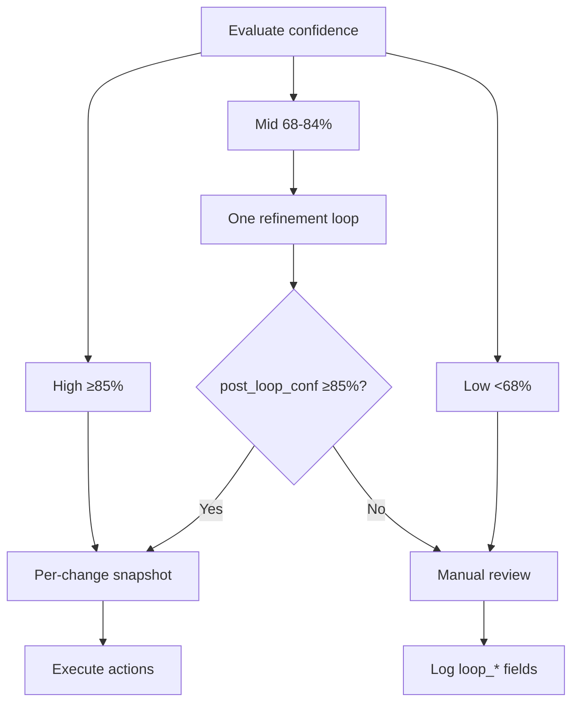
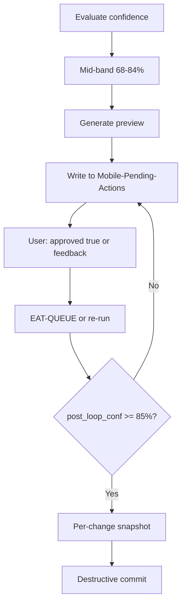
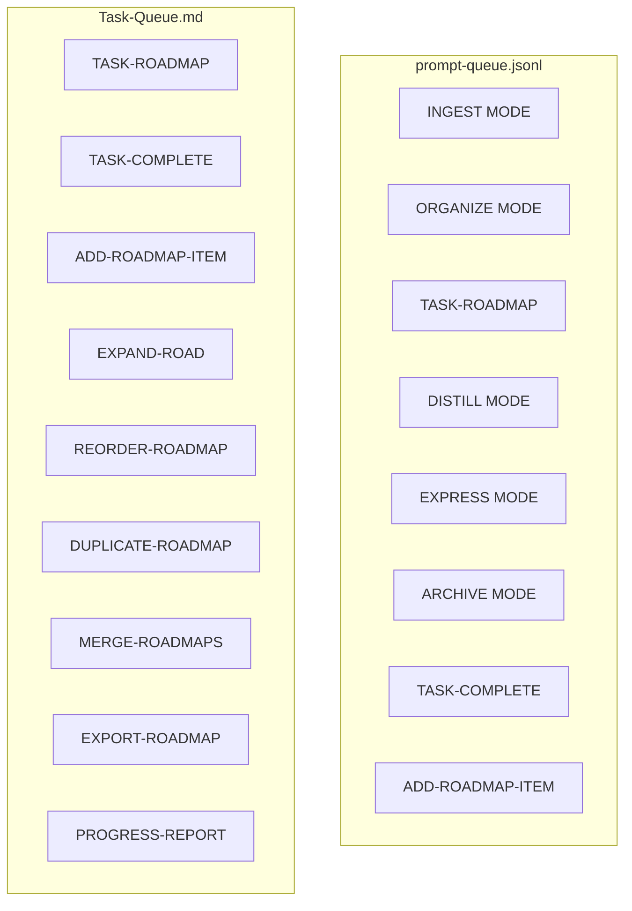

# Second Brain Parameters

## Confidence bands

| Band | Range | Behavior | Responsibilities |
|------|-------|----------|------------------|
| **High** | ≥85% | Destructive actions allowed after per-change snapshot; dry_run then commit for move | Pipelines may run destructive steps only in this band; skills read high_threshold from config if set |
| **Mid** | 68–84% | Single non-destructive refinement loop; proceed only if post_loop_conf ≥85% | Single refinement loop per note; loop_* fields written to pipeline log; async preview option |
| **Low** | <68% | Propose only; no destructive actions; manual review | No loop; propose-only; log for manual review; user can add approved: true and re-run EAT-QUEUE |

**Consistency**: All pipeline context rules (auto-archive, auto-organize, auto-distill, auto-express, ingest) use the same **68–84%** mid-band; there is no 72% floor variant.

**Tunable**: Optional `confidence_bands` in [[3-Resources/Second-Brain-Config|Second-Brain-Config]] (e.g. `mid: [80, 90]`, `high_threshold: 90`). Rules and skills read when present; fallback to above. Optional **`crafted_params_conf_boost`** (integer 0–10, e.g. 5): when crafted params are used (queue params or prompt-crafter), add this % to pre_loop_conf floor; default 0 if unset. See confidence-loops.

**Non-destructive lower (optional)**: Config **`non_destructive_lower`** (e.g. 75) allows metadata-only or preview-only steps at a lower threshold than 85%. **Pros**: Faster depth runs (e.g. previews, metadata updates without structural edits). **Cons**: More steps may run before user review; ensure previews are always emitted when confidence <85%. **Safety**: Destructive actions remain ≥85% + snapshot; undo via snapshots when needed.

**Loop-skip**: Frontmatter `loop-skip: true` (or `skip_refinement_loop: true`) — when set, skip the mid-band refinement loop for that note (trusted path). See [[.cursor/rules/always/confidence-loops|confidence-loops]].

Primary signals per pipeline: `ingest_conf`, `path_conf`, `archive_conf`, `express_conf`, `distill_conf`. See [[.cursor/rules/always/confidence-loops|confidence-loops]].

## Coverage (highlight)

**distill-highlight-color** (and highlight pass in ingest) targets **50–70%** of meaningful spans in a note. Config and logging:

- **Config**: [[3-Resources/Second-Brain-Config|Second-Brain-Config]] **`depths.highlight_coverage_min`** (e.g. 50) — minimum % of meaningful content to highlight; range typically 50–70%. Skill may adapt within range from content length/complexity.
- **Logging**: Pipeline log (e.g. [[3-Resources/Distill-Log|Distill-Log]]) should include **coverage %** and, when the skill adapts within the range, **`coverage_adapted`** (e.g. 62%). Enables MOC aggregation (e.g. Vault-Change-Monitor).
- **Observability**: Distill-Log line fields: `coverage_adapted`, `perspective`, `lens` when applicable. See [[3-Resources/Second-Brain/Logs|Logs]] and [[.cursor/skills/distill-highlight-color/SKILL|distill-highlight-color]].

## prompt_defaults (Config)

**prompt_defaults** in [[3-Resources/Second-Brain-Config|Second-Brain-Config]] are read by the prompt-crafter and rules (e.g. para-zettel-autopilot) for MCP pass-through; queue payload overrides take precedence. Per-pipeline blocks (ingest, organize) and **profiles** (named overrides) allow "click options" without tags. If the block overfits to ingest, generalize to **mcp_defaults** keyed by tool/pipeline.

## Optional frontmatter: user_guidance

- **user_guidance** (optional, plain text, multi-line): Single source of truth for refinement instructions when re-processing a note (approved proposal, decision note, ASYNC-LOOP). Used when the note is processed in a guidance-aware run; see [[.cursor/rules/always/guidance-aware|guidance-aware]]. Queue entry `prompt` is the fallback when present and the note has no `user_guidance`. **YAML-block safe:** Supports YAML block syntax (`|`) for readability; agent parses as a single string. Avoid nested YAML inside it (escape if needed). Prevents frontmatter parser confusion on re-reads.
- **guidance_conf_boost** (optional, integer 0–20, e.g. 15): When present and guidance is followed, add that % to the final confidence score for this run (capped at 95%). **Hard-cap:** Total boost is always ≤20%; values >20 in frontmatter are treated as 20. Helps push marginal notes over the 85% move threshold without faking safety.
- **clear_guidance_after_run** (optional, in Second-Brain-Config): When `true`, pipeline may clear or archive `user_guidance` after a successful guidance-aware run. Implementation is a follow-up; rule documents the contract.
- **decision_candidate** (optional, boolean): Set by the ingest pipeline when classification/path is low-confidence (ingest_conf < 72 or mid-band failure when config allows). Indicates the note needs user guidance; user adds `user_guidance` and `approved: true`, then runs EAT-QUEUE for guidance-aware re-processing.
- **decision_priority** (optional, high | medium | low): Auto-set by ingest when creating a decision candidate: **high** when triggered from low band (<72), **medium** when triggered from mid-band failure (`post_loop_conf ≤ pre_loop_conf`). Enables Dataview-sorting of pending decisions.
- **low_conf_decision_threshold_mid** (optional, in Second-Brain-Config): When `true`, also mark as decision candidate when mid-band loop fails (`post_loop_conf ≤ pre_loop_conf`). **Default false** to avoid over-triggering on marginal notes.

## Loop fields (for logs / Dataview)

- loop_attempted (true/false)
- loop_band ("68-84" | "none")
- pre_loop_conf, post_loop_conf (0–100)
- loop_outcome (increased | flat | decreased)
- loop_type (ingest-refine | organize-path | archive-refine | express-soft | distill-depth)
- loop_reason (short text)

## Decision Wrapper frontmatter (clunk)

- **wrapper_type**: `ingest-decision` | `roadmap-decision` | **phase-direction** | `mid-band-refinement` | `low-confidence` | `error` | `force-wrapper` | `task-decision`. Determines apply semantics when user sets `approved: true` and runs EAT-QUEUE (see apply-from-wrapper table in [[3-Resources/Second-Brain/Cursor-Skill-Pipelines-Reference|Cursor-Skill-Pipelines-Reference]]). **phase-direction**: roadmap/phase forks; options A–G are conceptual end-state descriptions (what the situation is after each choice; no tech jargon); technical resolution stored in frontmatter (e.g. technical_by_option) for provenance; apply appends provenance + comment guidance to target roadmap note; wrapper archived to 4-Archives/Ingest-Decisions/Roadmap-Decisions/.
- **clunk_severity**: `low` | `medium` | `high`. Inferred at wrapper creation from band/error type (e.g. mid-band → medium; low-confidence → high; error backup/snapshot failure → high). Used for prioritization in [[Ingest/Decisions/Wrapper-MOC|Wrapper-MOC]] and Dataview.
- **re-try** (optional, boolean): Manual only; set true (or check option R) to re-queue EXPAND-ROAD or TASK-TO-PLAN-PROMPT with guidance. Step 0 appends queue entry and archives wrapper; capped by **re_try_max_loops** (Second-Brain-Config § queue, default 3). On cap hit, a cap-hit wrapper is created (A: Force approve, B: Prune branch, 0: Re-wrap full phase).
- **re_try_count** (optional, integer): Tracks re-try sequence for this thread (same section/phase_path). When re_try_count >= re_try_max_loops, re-try is aborted and cap-hit wrapper created. Set when creating wrappers from queue payloads that carried re_try_count.

## Re-queue and roadmap (queue / archive)

- **re_try_max_loops**: In [[3-Resources/Second-Brain-Config|Second-Brain-Config]] § queue; default 3. Cap on re-try spins per thread; on exceed: log #review-needed to Feedback-Log, create cap-hit wrapper, do not append queue entry.
- **phase_fork_heuristic**: In Second-Brain-Config § roadmap; `"strict"` (scan expanded output for "or"/"vs"/"options:" → set phase_forks, auto-queue Phase Direction Wrapper) or `"off"` (only explicit phase_forks frontmatter triggers wrapper). See expand-road-assist SKILL.
- **prune_candidates** (frontmatter array): Section IDs or paths marked for auto-archive when re-try count >2 or age_days exceeded. ARCHIVE MODE (autonomous-archive) auto-archives these when > age_days. See Queue-Sources and Vault-Layout.
- **age_days**: In Second-Brain-Config § archive (e.g. 90). Used with prune_candidates for auto-archive of dead re-try branches.

## Comment and code_comments

- **comment_fatigue_threshold**: In Parameters or Second-Brain-Config; e.g. 50 (comments per file). Post-apply check in auto-eat-queue: if comments-per-file > threshold, log #review-needed to Feedback-Log.md. Stub; full heuristic (scan codebase) implement when needed. See plan §6.4.
- **code_comments** (Second-Brain-Config): density (medium | high | minimal), required_sections (e.g. ["why", "provenance_link"]), optional_sections, provenance_format. Merged into TASK-TO-PLAN-PROMPT template by task-to-prompt handler.

## Queue modes

- **Prompt queue** (`.technical/prompt-queue.jsonl`): INGEST MODE, **FORCE-WRAPPER**, ORGANIZE MODE, TASK-ROADMAP, **EXPAND-ROAD** (expand-road-assist; re-try can append), **TASK-TO-PLAN-PROMPT** (task → Cursor-ready prompt), DISTILL MODE, EXPRESS MODE, ARCHIVE MODE, TASK-COMPLETE, ADD-ROADMAP-ITEM, **SEEDED-ENHANCE**, **BATCH-DISTILL**, **BATCH-EXPRESS**, **ASYNC-LOOP**, **NAME-REVIEW**, **GARDEN-REVIEW**, **CURATE-CLUSTER**, etc.
- **Task queue** (Task-Queue.md): TASK-ROADMAP, TASK-COMPLETE, ADD-ROADMAP-ITEM, EXPAND-ROAD, REORDER-ROADMAP, DUPLICATE-ROADMAP, MERGE-ROADMAPS, EXPORT-ROADMAP, PROGRESS-REPORT.

See [[3-Resources/Task-Queue|Task-Queue]].

## Watcher-Result line

Format: `requestId: <id> | status: success|failure | message: "..." | trace: "..." | completed: <ISO8601>`

**Example**: `requestId: req-1 | status: success | message: "Note moved to 1-Projects/MyProject/Note.md" | trace: "" | completed: 2026-03-01T14:35:00.000Z`

## Log line fields

timestamp, pipeline, note path, confidence, actions taken/skipped, backup path, snapshot path(s), flag; plus loop_* when applicable. For autonomous-distill: also **coverage %**, **coverage_adapted** (when highlight coverage was adapted within 50–70%), **perspective**, **lens**; **heuristic** when a post-process stabilizer was applied (e.g. short-note-core-bias). For queue processor: **queue_order_adjusted**, **reason** when high-conf roadmap bump applied. Reference [[3-Resources/Second-Brain/Cursor-Skill-Pipelines-Reference|Cursor-Skill-Pipelines-Reference]] for Log format.

## Confidence bands and loop (diagram)

## Async-Loop Flow (mid-band with preview)

When async refinement is enabled for mid-band:

**async_preview_threshold** (in Second-Brain-Config depths): Below this confidence, always emit async preview and do not commit. Document in Configs.md.

## Tuning cheat sheet

Quick reference for common adjustments (in [[3-Resources/Second-Brain-Config|Second-Brain-Config]] or MCP env):

- **Snapshots too frequent** → Increase `batch_size_for_snapshot` (e.g. from 5 to 10) so batch snapshots are used for larger batches; per-change only for smaller runs.
- **More aggressive async previews** → Lower `async_preview_threshold` (e.g. from 85 to 68) so more notes get async preview and do not commit until user approves.
- **Longer project lifecycle before archive** → Change `archive.age_days` (e.g. 90 → 180) so notes stay in active PARA longer before archive-check considers them.
- **MOC / hub order** → `hub_names` order affects which hub is preferred when appending; adjust order for MOC priority.
- **Confidence bands** → Optional `confidence_bands.mid: [min, max]` and `confidence_bands.high_threshold`; rules and skills read when present.
- **PARA proposals** → `propose_para_paths` uses engine-level params `context_mode`, `rationale_style`, and `max_candidates` to tailor PARA suggestions for wrappers, mid-band refinement, organize/archive advice, and manual \"Suggest PARA homes\" flows. See MCP-Tools for full contract.

## Watcher-Result structure

## Queue modes (two branches)

Prompt-queue also supports: SEEDED-ENHANCE, BATCH-DISTILL, BATCH-EXPRESS, ASYNC-LOOP, NAME-REVIEW (see [[3-Resources/Second-Brain/Queue-Sources|Queue-Sources]]).

