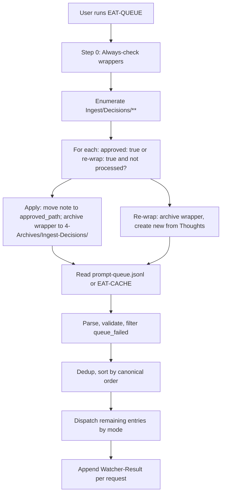
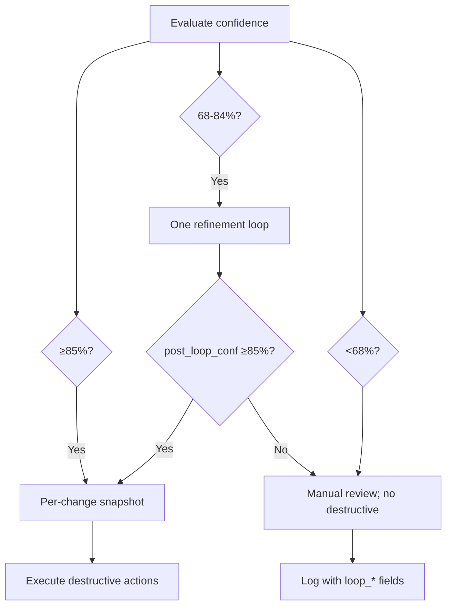

# Second Brain Pipelines

Trigger → pipeline mapping and flow summaries. Canonical order and skill chains in [[3-Resources/Second-Brain/Cursor-Skill-Pipelines-Reference|Cursor-Skill-Pipelines-Reference]]. For a compact **trigger cheat sheet** (spoken trigger → what happens → use-case), see [[3-Resources/Second-Brain/README#Trigger cheat sheet|README § Trigger cheat sheet]].

## Trigger → pipeline

| Trigger / phrase | Rule(s) | Pipeline | Responsibility |
|------------------|---------|----------|----------------|
| INGEST MODE, process Ingest, run ingests | always-ingest-bootstrap, para-zettel-autopilot | full-autonomous-ingest | **Phase 1** (on `Ingest/*.md`): Capture → classify → organize → distill → hub → **create/refresh a Decision Wrapper with multiple candidate paths (A–G)**; no move/rename yet. **Phase 2** (apply-mode via EAT-QUEUE): when a wrapper under `Ingest/Decisions/**` (e.g. `Ingest-Decisions/`) has `approved: true`, EAT-QUEUE + feedback-incorporate run a guidance-aware ingest apply pass that moves/renames the original note out of Ingest/ into the user-approved PARA path only (no roadmap tree creation from ingest; use ROADMAP MODE – generate from outline for that). See [para-zettel-autopilot.mdc](.cursor/rules/context/para-zettel-autopilot.mdc) and [Guidance-Aware Run Contract](.cursor/rules/always/guidance-aware.mdc). |
| Ingest/*.md (open or batch) | para-zettel-autopilot | full-autonomous-ingest | Same as above |
| EAT-QUEUE, Process queue, eat cache / EAT-CACHE | auto-eat-queue | Queue processor | Read queue → validate → dedup/sort → dispatch by mode → Watcher-Result |
| PROCESS TASK QUEUE | auto-queue-processor | Task/roadmap queue | Task-Queue.md modes: TASK-ROADMAP, TASK-COMPLETE, ADD-ROADMAP-ITEM, etc. |
| DISTILL MODE, distill note/vault | auto-distill | autonomous-distill | Refine note: layers → highlight → layer-promote → TL;DR wrap → readability-flag |
| BATCH-DISTILL (queue) | auto-eat-queue | autonomous-distill on batch | Same pipeline on multiple notes from queue |
| ARCHIVE MODE, archive, #eaten | auto-archive | autonomous-archive | archive-check → path under 4-Archives/ → resurface-mark → summary-preserve → move |
| EXPRESS MODE, express note | auto-express | autonomous-express | version-snapshot → related-content → outline → CTA |
| **SCOPING MODE** / **SCOPING** (queue) | auto-eat-queue | Queue alias: DISTILL MODE then EXPRESS MODE on same note (PMG) | Resolve source_file as PMG path; run autonomous-distill then autonomous-express; research-scope runs inside express. Optional: SCOPING MODE \<path-to-pmg\>. |
| BATCH-EXPRESS (queue) | auto-eat-queue | autonomous-express on batch | Same pipeline on multiple notes from queue |
| ORGANIZE MODE, re-organize | auto-organize | autonomous-organize | Re-classify and move within PARA; optional name-enhance and rename |
| NAME-REVIEW (queue) | auto-eat-queue | name-enhance batch | Name re-evaluation; optional scope (folder/paths); optional explicit_rename_request |
| **FORCE-WRAPPER** (queue) | auto-eat-queue | Pipeline inferred from source_file with force_wrapper | Create Decision Wrapper instead of destructive step; apply when user approves wrapper (Step 0). See [[3-Resources/Second-Brain/Cursor-Skill-Pipelines-Reference#Decision Wrappers (clunk)|Decision Wrappers (clunk)]] and apply-from-wrapper table. |
| SEEDED-ENHANCE (queue) | auto-eat-queue | highlight-seed-enhance | User <mark> as cores; extend with AI highlights |
| ASYNC-LOOP (queue) | auto-eat-queue | Re-process after async preview | Re-run after user approved or feedback |
| HIGHLIGHT PERSPECTIVE: [lens] | auto-highlight-perspective | Highlight pass with perspective | Set context; run distill with lens for distill-highlight-color |
| **SWITCH HIGHLIGHT ANGLE: [angle]** | auto-highlight-perspective / highlight-perspective-layer | Set angle; re-run or CSS switch | Set highlight_active_angle; re-run highlight for that angle or CSS/Dataview-driven |
| **HIGHLIGHT MULTI-ANGLE: [list]** | auto-highlight-perspective / highlight-perspective-layer | Multi-angle batch | Queue per-angle runs or single batch; write highlight_angles |
| DISTILL LENS: [angle] | auto-distill-perspective | autonomous-distill with lens | Set distill_lens; depth/TL;DR indicators by angle |
| EXPRESS VIEW: [angle] | auto-express-view | autonomous-express with view | Set express_view; shape outline and Related section |
| **GARDEN REVIEW**, run garden review, orphans and distill candidates, garden health, vault orphans, distill candidates sweep | **auto-garden-review** | Garden review flow | obsidian_garden_review → report → feed to distill/organize batches; queue mode **GARDEN-REVIEW** |
| **CURATE CLUSTER** #tag, suggest gaps and merges, cluster curate #tag, theme gaps #tag, merge suggestions 3-Resources/… | **auto-curate-cluster** | Curate cluster flow | obsidian_curate_cluster → analyze report (gaps/merges/synthesis); optional split/MOC/merge; queue mode **CURATE-CLUSTER** |

For roadmap **structure** (master vs phase vs sub-phase notes, frontmatter contract, and Dataview blocks), see [[3-Resources/Roadmap-Standard-Format|Roadmap-Standard-Format]].

## Decision Wrappers (clunk)

Wrappers are the canonical "please look at me" surface for outcomes that did not reach ≥85% post-loop confidence or hit a safety gate. **When created**: ingest Phase 1 (A–G); **FORCE-WRAPPER** (queue); mid-band (post_loop_conf <85%) → `Ingest/Decisions/Refinements/`; low-confidence (<68%) → `Ingest/Decisions/Low-Confidence/`; error/safety-gate → `Ingest/Decisions/Errors/`. **Apply**: EAT-QUEUE Step 0 when `approved: true`; behavior by `wrapper_type` and `pipeline` (apply-from-wrapper table in [[3-Resources/Second-Brain/Cursor-Skill-Pipelines-Reference|Cursor-Skill-Pipelines-Reference]]). **Wrapper MOC**: [[Ingest/Decisions/Wrapper-MOC]] lists pending by `clunk_severity` and `wrapper_type`. **Frontmatter**: `wrapper_type`, `clunk_severity: low|medium|high`. Watcher-Result line when a wrapper is created: `message: "created wrapper → Decisions/<subfolder>/<basename>"`.

## Sub-pipelines (phases, for debugging)

Same execution order; clearer phases:

- **ingest-core**: backup → classify_para → frontmatter-enrich → name-enhance (propose only when vague/untitled) → subfolder-organize → (confidence/loop). Stops before any split or move.
- **ingest-post-process (Phase 1)**: split_atomic → split-link-preserve → distill_note → distill-highlight-color → next-action-extract → task-reroute → append_to_hub → log_action → create/refresh Decision Wrapper (via **propose_para_paths** in `"wrapper"` mode → fill `Templates/Decision-Wrapper.md` A–G with exactly 7 options; pad to 7 with fallback paths when API returns fewer; no single-option fallback) for relocation. Moves/renames occur only in a **separate Phase 2 apply-mode ingest** run driven by approved Decision Wrappers.

Use when debugging: e.g. "ingest-core ran; post-process failed at distill."

## Pipeline summaries

- **full-autonomous-ingest**: **Phase 1 (propose + wrapper)**: Backup → classify_para → frontmatter-enrich → name-enhance (propose only; suggested_name used in path proposal) → subfolder-organize → (confidence/loop) → split_atomic → split-link-preserve → distill_note → distill-highlight-color → next-action-extract → task-reroute → append_to_hub → log_action → create/refresh Decision Wrapper (**propose_para_paths** max 7 ranked candidates in `"wrapper"` mode → `Templates/Decision-Wrapper.md` A–G, no single-option fallback) . **Phase 2 (apply-mode, via approved wrapper + EAT-QUEUE)**: guidance-aware ingest run that, after snapshots and confidence checks, calls **obsidian_ensure_structure**(folder_path: parent of target) so the path exists, then performs `move_note` (dry_run then commit), then post-move para-type (and project-id when under 1-Projects/) sync per mcp-obsidian-integration, and optional `rename_note` to move from Ingest/ into the user-approved PARA path.
- **autonomous-distill**: Backup → (auto-layer-select, optional distill_lens) → distill layers → distill-highlight-color → (highlight-perspective-layer) → layer-promote → distill-perspective-refine → callout-tldr-wrap → readability-flag.
- **autonomous-archive**: Backup → classify_para → archive-check → subfolder-organize → resurface-candidate-mark → summary-preserve → ensure_structure(parent of target) → move_note (dry_run then commit) → post-move para-type and status: archived per mcp-obsidian-integration → log_action.
- **autonomous-express**: Backup → version-snapshot → related-content-pull → express-mini-outline → express-view-layer (when express_view set) → call-to-action-append.
- **autonomous-organize**: Backup → classify_para → frontmatter-enrich → subfolder-organize → name-enhance (context organize; opportunistic rename) → ensure_structure(parent of target) → move_note (dry_run then commit) → post-move para-type and project-id (when under 1-Projects/) per mcp-obsidian-integration → log_action.
- **Queue processor**: **Step 0 (always-check wrappers)** — enumerate `Ingest/Decisions/**`; for each wrapper with `approved: true` or `re-wrap: true` and not processed, apply (move note to approved path, then move wrapper to `4-Archives/Ingest-Decisions/` with subfolders mirrored) or run re-wrap branch. Then: read `.technical/prompt-queue.jsonl` or EAT-CACHE → validate → (fast-path: single entry → dispatch) → dedup → sort by canonical order → dispatch by mode → Watcher-Result; optional queue-cleanup after clear. See [[3-Resources/Second-Brain/Queue-Sources|Queue-Sources]].

## Snapshot triggers summary

Per-change snapshots and batch checkpoints are created via the **obsidian-snapshot** skill. When to create them (confidence ≥85% for destructive steps):

| Pipeline | Per-change triggers | Batch frequency |
|----------|----------------------|------------------|
| full-autonomous-ingest | Before split_atomic, distill_note (when rewriting), append_to_hub, task-reroute (target note), **and—only in Phase 2 apply-mode—before move_note and rename_note** | Every 5 notes |
| autonomous-distill | Before first structural rewrite (distill layers, highlight-perspective-layer, layer-promote, distill-perspective-refine, heavy update_note) | ~Every 3 notes |
| autonomous-archive | After archive-check ≥85% but before subfolder-organize, summary-preserve, move | Once per archive sweep |
| autonomous-express | Before large appends (related-content-pull, express-mini-outline, express-view-layer, call-to-action-append); alongside version-snapshot | Optional per batch |
| autonomous-organize | Before obsidian_rename_note and before obsidian_move_note (when confidence ≥85% for each) | ~Every 3 notes |

Full detail: [[3-Resources/Second-Brain/Cursor-Skill-Pipelines-Reference#Snapshot triggers (all pipelines)|Cursor-Skill-Pipelines-Reference § Snapshot triggers]].

## Usage examples

- **Ingest**: Add `My-Note.md` to Ingest/, run **INGEST MODE** (or Process Ingest). The note is classified, frontmatter enriched, path proposed, and (when confidence allows) split/distilled/hub-appended; a Decision Wrapper under `Ingest/Decisions/` is created/updated with multiple candidate destinations. After you check an option and set `approved: true` in the wrapper, the next EAT-QUEUE run applies the decision and moves/renames the original note into 1-Projects/…, 2-Areas/…, or 3-Resources/… with snapshots and dry_run safety.
- **Distill**: Open a note in 1-Projects/… or 2-Areas/…, say **DISTILL MODE – safe batch autopilot**. The note gets distill layers, highlight colors, layer promotion, TL;DR callout, and readability flag.
- **Archive**: Say **ARCHIVE MODE – safe batch autopilot** on a folder (or scope). Notes with no open tasks, status complete, and meeting age threshold are moved to 4-Archives/ with summary preserved.
- **Express**: Open a distilled note, say **EXPRESS MODE – safe batch autopilot**. Version snapshot is created, related content and mini-outline are appended, and a CTA callout is added at the end.
- **Organize**: Say **ORGANIZE MODE – safe batch autopilot** (optionally "on 1-Projects/MyProject"). Notes are re-classified, frontmatter enriched, and moved to a new path within PARA if confidence ≥85%.

### On-demand PARA suggestions (manual, non-moving)

- **Manual “Suggest PARA homes”**: From any note (Ingest or existing PARA), you can ask the agent to **suggest PARA destinations without moving the note**. The agent calls `propose_para_paths` with an appropriate `context_mode` (e.g. `"manual"` or `"organize"`) and `max_candidates` (typically 3–5), then surfaces the ranked candidates plus their one-line `reason_short` explanations in a short report or callout. This is advisory only; no `move_note` runs unless you later approve a Decision Wrapper or run an organize/archive pipeline.
- **Garden review & orphans**: When Garden review or CHECK_WRAPPERS flow identifies an orphan or true-orphan note, the agent may call `propose_para_paths(context_mode: "manual")` on the recovered companion note to suggest likely new homes. Suggestions can be written into a Wrapper state block or surfaced in a report for manual follow-up; archive/move remains user-approved.

## Non-markdown ingest (auto-move to 5-Attachments)

Non-.md files in Ingest/ get a companion .md and then the **original file is automatically moved** to `5-Attachments/[subtype]/` (PDFs/, Images/, Audio/, Documents/, Other/) when backup and move succeed. Flow: validate source under Ingest/, resolve destination conflicts (rename with timestamp if target exists), ensure_structure, create_backup, then move_note; on success the companion gets a success callout and no #needs-manual-move; on failure the file stays in Ingest/ with #needs-manual-move and a failure callout. Subtype comes from [[3-Resources/Attachment-Subtype-Mapping|Attachment-Subtype-Mapping]] or the rule table. Optional fallback: **move-attachment-to-99** skill (user-invoked only) when the MCP server does not support moving binaries. Error Handling Protocol and categorized failures: see [[.cursor/rules/always/mcp-obsidian-integration#Error Handling Protocol|mcp-obsidian-integration]].

## Confidence and safety

- **High (≥85%)**: Destructive actions allowed only after per-change snapshot; dry_run before move then commit.
- **Mid (68–84%)**: Single non-destructive refinement loop; re-score; proceed only if post_loop_conf ≥85%. If the loop decays (post_loop_conf < pre_loop_conf or stays below the commit threshold), fall back to **user-decision flows** instead of auto-applying changes.
- **Low (<68%)**: Propose only; no destructive actions; hand off to **user-decision flows** — for ingest this means creating/updating a Decision Wrapper under `Ingest/Decisions/`, for other pipelines it means async preview + `approved: true` re-runs — rather than relying on bare `#review-needed` alone.
- **Param'd MCP calls**: Always **ensure_backup** (or create_backup) before any MCP call that uses queue `params` or prompt-crafter output; pipelines must not skip backup when running with crafted params.
- Reference [[.cursor/rules/always/confidence-loops|confidence-loops]] and [[.cursor/rules/always/mcp-obsidian-integration|mcp-obsidian-integration]].

## Post-process stabilizers (variance dampeners)

Post-AI, low-variance steps run **inside** existing skills (no new skill files). All respect confidence and safety (no commit below 85%; snapshot/dry_run before move).

| Area | Where | What |
|------|--------|------|
| **Ingest/organize** | subfolder-organize (after propose_para_paths) | Re-rank by [[3-Resources/Second-Brain/PARA-Actionability-Rubric|PARA-Actionability-Rubric]] v1.0 → semantic fit → path depth → alphabetize; **mandatory pad to 7** (A–G) with deterministic fallbacks; set `heuristic_adjusted`, `heuristic_reason` on wrapper when order changed. |
| **Distill** | distill-highlight-color or layer-promote | Short-note core bias (config: `short_note_word_threshold`, `default_core_bias`); emoji fallback **only** when mobile context detected; log e.g. `heuristic: short-note-core-bias applied (248 words < 300)`. |
| **Archive** | archive-check | Confidence floor +5–8% when age > no_activity_days **and** (#stale or #review-later); **never** when status active/evergreen. |
| **Queue** | auto-eat-queue Step 4 (Ordering) | When originating note conf ≥ 90%, bump TASK-ROADMAP (and EXPAND-ROAD / TASK-TO-PLAN-PROMPT) after ORGANIZE, before DISTILL; log `queue_order_adjusted: true`, `reason: high-conf roadmap bump`. |

See [[3-Resources/Second-Brain/Backbone#Post-process stabilizers (variance dampeners)|Backbone § Post-process stabilizers]] and plan "Targeted heuristics for consistency".

## Decision Wrapper (no default path)

Wrappers must **not** be created with default `approved_option` or `approved_path` in the template or by the pipeline. Ingest apply (move/rename) runs only on explicit user choice: the user checks one option A–G and sets `approved: true` (Watcher then syncs option + path into frontmatter), or the user sets `re-wrap: true` for a re-wrap. This prevents accidental auto-approval.

**Safety invariant — Watcher never approves:** Watcher **only** syncs `approved_option` + `approved_path` when `approved: true` is **already set by the user**. Watcher **never** sets `approved: true` itself — that remains a manual user action (frontmatter edit or Commander macro). This prevents accidental auto-approval loops even if Watcher logic evolves later.

## Canonical pipeline order


## Full ingest flowchart (two-phase, Decision Wrapper–gated)

**Phase 1** never moves or renames; the note stays in Ingest/ until the user approves a wrapper and runs EAT-QUEUE. **Phase 2** runs only when EAT-QUEUE Step 0 finds a wrapper with `approved: true` and applies move/rename, then archives the wrapper to `4-Archives/Ingest-Decisions/`.

```mermaid
flowchart TD
  Start[list_notes Ingest]
  Start --> Backup[create_backup]
  Backup --> Bootstrap{Optional bootstrap_project_batch}
  Bootstrap --> Classify[classify_para]
  Classify --> Frontmatter[frontmatter_enrich]
  Frontmatter --> Subfolder[subfolder_organize]
  Subfolder --> ConfGate{ingest_conf?}
  ConfGate -->|"≥85%"| Snap1[Per-change snapshot (in-note)]
  ConfGate -->|"68-84%"| Loop[Self-critique loop]
  ConfGate -->|"<68%"| Wrapper[Decision Wrapper (low-confidence)]
  Loop --> PostConf{post_loop_conf ≥85%?}
  PostConf -->|Yes| Snap1
  PostConf -->|No| Wrapper
  Snap1 --> Split[split_atomic]
  Split --> SplitLink[split_link_preserve]
  SplitLink --> Distill[distill_note]
  Distill --> Highlight[distill_highlight_color]
  Highlight --> NextAct[next_action_extract]
  NextAct --> TaskReroute[task_reroute]
  TaskReroute --> Hub[append_to_hub]
  Hub --> Log[log_action]
  Log --> DecWrap[Create/refresh Decision Wrapper (propose_para_paths max 7 → A–G)]
  DecWrap --> NoMove[Phase 1 ends: no move/rename; note stays in Ingest/]
  NoMove --> UserChoice[User checks A–G, sets approved: true]
  UserChoice --> EAT[User runs EAT-QUEUE]
  EAT --> Step0[Step 0: always-check wrappers first]
  Step0 --> ApplyRun[Apply-mode ingest: backup, snapshot, move/rename to approved_path]
  ApplyRun --> MoveSnap[dry_run then commit; wrapper → 4-Archives/Ingest-Decisions/]
  MoveSnap --> Done[Note in PARA; wrapper archived]
```

## Distill / Archive / Express / Organize (overview)


## EAT-QUEUE flow (Step 0 before queue)



## Confidence band flow


