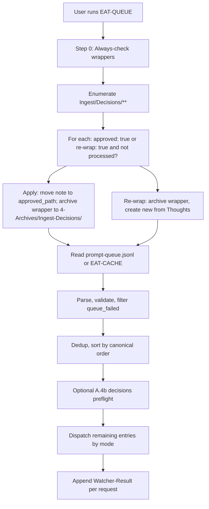

**TL;DR** — Trigger → pipeline mapping and flow summaries; canonical skill order and snapshot triggers live in [[3-Resources/Second-Brain/Cursor-Skill-Pipelines-Reference|Cursor-Skill-Pipelines-Reference]]. Use the Quick Reference and EAT-QUEUE diagram to see how triggers dispatch; Step 0 always checks wrappers before processing the queue. Optional **A.4b decisions preflight** (Config **`queue.decisions_preflight`**) runs after ordering when enabled; see [[3-Resources/Second-Brain/Parameters|Parameters]] § Queue decisions preflight. **Dual roadmap track** (conceptual vs execution, frozen conceptual, unfreeze mode, **Conceptual-Decision-Records** rationale notes): [[3-Resources/Second-Brain/Docs/Dual-Roadmap-Track|Dual-Roadmap-Track]] and Cursor-Skill-Pipelines-Reference § Dual roadmap graph.

---

## Quick Reference Table

| Trigger Phrase | Pipeline | Rule(s) | Confidence Gate | Safety Step First |
|----------------|----------|---------|------------------|--------------------|
| INGEST_MODE, process Ingest | full-autonomous-ingest | always-ingest-bootstrap, para-zettel-autopilot | Phase 1 → wrapper; Phase 2 apply when approved | create_backup |
| EAT-QUEUE, Process queue, EAT-CACHE | Queue processor (Queue subagent) | dispatcher.mdc → **`Task(queue)`**; auto-eat-queue runs **inside** that subagent | — | Step 0 wrappers first; then dry_run pattern per mode |
| DISTILL MODE | autonomous-distill | auto-distill | ≥85% destructive | create_backup; snapshot before rewrite |
| ARCHIVE MODE | autonomous-archive | auto-archive | ≥85% move | create_backup; snapshot before move |
| EXPRESS MODE | autonomous-express | auto-express | ≥85% appends | version-snapshot; backup |
| ORGANIZE MODE | autonomous-organize | auto-organize | ≥85% move/rename | create_backup; dry_run before move |
| ATOMIZE MODE, atomize this note | autonomous-atomize | AtomizeSubagent | ≥85% split | create_backup; snapshot before split_atomic |
| ROADMAP_MODE | Setup only (Phase 0) | auto-roadmap | — | workflow_state created if missing |
| RESUME_ROADMAP, Resume roadmap | Single continue (one action/run) | auto-roadmap | conf ≥85% phase complete | snapshot state before/after update |
| RESUME_ROADMAP (`action: unfreeze_conceptual`) | Clear `frozen` on conceptual Roadmap notes (excl. Execution/) | auto-roadmap → RoadmapSubagent | confirm_unfreeze latch | backup + per-change snapshot per note |
| RESUME_ROADMAP (`action: bootstrap-execution-track`) | Create `Roadmap/Execution/` state; set `roadmap_track: execution` on conceptual `roadmap-state.md` | RoadmapSubagent | does not unfreeze conceptual notes | templates + Vault-Layout freeze checklist |
| RESUME_ROADMAP (`action` missing / `auto`, **`effective_track: conceptual`**) | **Conceptual autopilot:** smart dispatch picks next action without roadmap-next-step wrappers on low confidence; logs **`Roadmap/decisions-log.md` § Conceptual autopilot**; terminal **`conceptual_target_reached`** stops **A.5c.1** synthesis; optional **Conceptual subphase exit** rewrites follow-up to the **next structural node** when slice predicate holds (can override high-util recal tails when configured) ([[3-Resources/Second-Brain/Parameters|Parameters]] § Conceptual subphase exit) | RoadmapSubagent + queue **A.5c.1** | **`roadmap.conceptual_design_handoff_min_readiness`** (default 75); **`roadmap.conceptual_subphase_exit_enabled`** (default true); **`roadmap.conceptual_subphase_exit_override_high_util_recal`** (default true); **`queue.conceptual_same_subphase_streak_threshold`** (default 2); coherence hard-stops only | execution track keeps wrappers + **`min_handoff_conf`** |

**Dual track:** **`effective_track`** (Queue-Sources) drives **`layer1_resolver_hints`**, gate keys (**`queue.gate_key_includes_track`**), Validator catalog (**conceptual_v1** / **execution_v1**), and Layer 1 **A.5b.0** repair skip for conceptual + execution-only primary codes. **Conceptual autopilot** (Parameters § Conceptual autopilot, **roadmap.mdc** smart dispatch): no Decision Wrapper on low confidence or stall; **`queue_continuation.suppress_reason: conceptual_target_reached`** is terminal for follow-up synthesis.

**Recovery (PromptCraft):** Layer 2 may emit **`prompt_craft_request`** + **`ira_repair_bundle`** on hard failure after IRA; Layer 1 may call **`Task(prompt_craft)`** when Config allows (**queue.mdc A.5d**). Post–little-val roadmap repair may use PromptCraft first when **`post_little_val_repair_use_prompt_craft`** is **true** (**A.5b**), else **A.5b.3** minimal line only. **Queue continuation:** Roadmap returns **`queue_continuation`** YAML; Layer 1 may append **`.technical/queue-continuation.jsonl`** (**A.5e**) and, when the prompt queue is empty, run **A.1b** empty-queue bootstrap (optional PromptCraft **`empty_queue_bootstrap`**). **Deterministic gate pivot:** when **`queue.deterministic_gate_script_enabled`** is **true**, Layer 1 runs **`scripts/queue-gate-compute.py`** (**report** / **validate-line**); **A.5f** persists streaks via **`record-outcome`** when **`queue.gate_block_detection_enabled`** (see [[3-Resources/Second-Brain/Docs/Queue-Gate-State-Spec|Queue-Gate-State-Spec]]). Does **not** replace question-led crafter. Specs: [[3-Resources/Second-Brain/Docs/Prompt-Craft-Subagent|Prompt-Craft-Subagent]], [[3-Resources/Second-Brain/Docs/Queue-Continuation-Spec|Queue-Continuation-Spec]].

---

## Mermaid — EAT-QUEUE flow (Step 0 before queue)

Logical steps below run **inside the Queue/Dispatcher subagent** after **dispatcher.mdc** routes **EAT-QUEUE** to **`Task(subagent_type: queue)`** (parent Layer 0 does not execute this graph inline).



---

## Mermaid — Full ingest flowchart (two-phase, Decision Wrapper–gated)

**Phase 1** never moves or renames; the note stays in Ingest/ until the user approves a wrapper and runs EAT-QUEUE. **Phase 2** runs only when EAT-QUEUE Step 0 finds a wrapper with `approved: true` and applies move/rename, then archives the wrapper to `4-Archives/Ingest-Decisions/`.

```mermaid
flowchart TD
  Start[list_notes Ingest]
  Start --> Backup[create_backup]
  Backup --> Bootstrap{Optional bootstrap_project_batch}
  Bootstrap --> Classify[classify_para]
  Classify --> Frontmatter[frontmatter_enrich]
  Frontmatter --> Subfolder[subfolder_organize]
  Subfolder --> ConfGate{ingest_conf?}
  ConfGate -->|"≥85%"| Snap1[Per-change snapshot (in-note)]
  ConfGate -->|"68-84%"| Loop[Self-critique loop]
  ConfGate -->|"<68%"| Wrapper[Decision Wrapper (low-confidence)]
  Loop --> PostConf{post_loop_conf ≥85%?}
  PostConf -->|Yes| Snap1
  PostConf -->|No| Wrapper
  Snap1 --> Split[split_atomic]
  Split --> SplitLink[split_link_preserve]
  SplitLink --> Distill[distill_note]
  Distill --> Highlight[distill_highlight_color]
  Highlight --> NextAct[next_action_extract]
  NextAct --> TaskReroute[task_reroute]
  TaskReroute --> Hub[append_to_hub]
  Hub --> Log[log_action]
  Log --> DecWrap[Create/refresh Decision Wrapper (propose_para_paths max 7 → A–G)]
  DecWrap --> NoMove[Phase 1 ends: no move/rename; note stays in Ingest/]
  NoMove --> UserChoice[User checks A–G, sets approved: true]
  UserChoice --> EAT[User runs EAT-QUEUE]
  EAT --> Step0[Step 0: always-check wrappers first]
  Step0 --> ApplyRun[Apply-mode ingest: backup, snapshot, move/rename to approved_path]
  ApplyRun --> MoveSnap[dry_run then commit; wrapper → 4-Archives/Ingest-Decisions/]
  MoveSnap --> Done[Note in PARA; wrapper archived]
```

---

## Safety Invariants

> [!warning] **Backup and snapshot**
> Per-change snapshot required (confidence ≥85%) before any destructive step: split_atomic, distill_note rewrite, append_to_hub, task-reroute target, move_note, rename_note. Pipeline order and snapshot triggers: [[3-Resources/Second-Brain/Cursor-Skill-Pipelines-Reference#Snapshot triggers (all pipelines)|Cursor-Skill-Pipelines-Reference § Snapshot triggers]].

> [!warning] **dry_run before move**
> Always ensure_structure(parent of target), then move_note with dry_run: true; review effects; then dry_run: false. Post-move: set para-type (and project-id under 1-Projects/, status: archived under 4-Archives/) on the note at new path.

> [!warning] **Step 0 before queue**
> EAT-QUEUE always runs Step 0 first: enumerate Ingest/Decisions/**, apply wrappers with approved: true or re-wrap: true, then read and dispatch prompt-queue.jsonl. No default approved_option/approved_path in wrapper template; Watcher never sets approved: true.

---

## Snapshot triggers summary

| Pipeline | Per-change triggers | Batch frequency |
|----------|----------------------|------------------|
| full-autonomous-ingest | Before split_atomic, distill_note (when rewriting), append_to_hub, task-reroute (target note), **and—only in Phase 2 apply-mode—before move_note and rename_note** | Every 5 notes |
| autonomous-atomize | Before obsidian_split_atomic (source note) | ~Every 3–5 notes (or when batch of ATOMIZE_MODE runs) |
| autonomous-distill | Before first structural rewrite (distill layers, highlight-perspective-layer, layer-promote, distill-perspective-refine, heavy update_note) | ~Every 3 notes |
| autonomous-archive | After archive-check ≥85% but before subfolder-organize, summary-preserve, move | Once per archive sweep |
| autonomous-express | Before large appends (related-content-pull, express-mini-outline, express-view-layer, call-to-action-append); alongside version-snapshot | Optional per batch |
| autonomous-organize | Before obsidian_rename_note and before obsidian_move_note (when confidence ≥85% for each) | ~Every 3 notes |
| autonomous-roadmap (multi-run) | Before every roadmap-state.md update (roadmap-resume, phase completion); before phase-X-output overwrite (roadmap-phase-output-sync auto_refresh); before hand-off-audit frontmatter write (phase note) | Per phase or RECAL run |

Full detail: [[3-Resources/Second-Brain/Cursor-Skill-Pipelines-Reference#Snapshot triggers (all pipelines)|Cursor-Skill-Pipelines-Reference § Snapshot triggers]].

---

## Detailed Breakdown

### Trigger → pipeline (full table)

> [!abstract]- Trigger → pipeline (all modes)
> | Trigger / phrase | Rule(s) | Pipeline | Responsibility |
> |------------------|---------|----------|----------------|
> | INGEST_MODE, process Ingest, run ingests | always-ingest-bootstrap, para-zettel-autopilot | full-autonomous-ingest | **Phase 1** (on `Ingest/*.md`): Capture → classify → organize → distill → hub → **create/refresh a Decision Wrapper with multiple candidate paths (A–G)**; no move/rename yet. **Phase 2** (apply-mode via EAT-QUEUE): when a wrapper under `Ingest/Decisions/**` (e.g. `Ingest-Decisions/`) has `approved: true`, EAT-QUEUE + feedback-incorporate run a guidance-aware ingest apply pass that moves/renames the original note out of Ingest/ into the user-approved PARA path only (no roadmap tree creation from ingest; use ROADMAP MODE – generate from outline for that). See [para-zettel-autopilot.mdc](.cursor/rules/context/para-zettel-autopilot.mdc) and [Guidance-Aware Run Contract](.cursor/rules/always/guidance-aware.mdc). |
> | Ingest/*.md (open or batch) | para-zettel-autopilot | full-autonomous-ingest | Same as above |
> | EAT-QUEUE, Process queue, eat cache / EAT-CACHE | auto-eat-queue | Queue processor | Read queue → validate → dedup/sort → dispatch by mode → Watcher-Result |
> | PROCESS TASK QUEUE | auto-queue-processor | Task/roadmap queue | Task-Queue.md modes: TASK_ROADMAP, TASK_COMPLETE, ADD_ROADMAP_ITEM, etc. |
> | DISTILL MODE, distill note/vault | auto-distill | autonomous-distill | Refine note: layers → highlight → layer-promote → TL;DR wrap → readability-flag |
> | ATOMIZE MODE, atomize this note | AtomizeSubagent | autonomous-atomize | Split multi-idea notes into atomic notes and wire `split_from` / `## Splits` (`split-link-preserve`); no moves/renames; callable from Ingest/ or directly on PARA notes |
> | BATCH-DISTILL (queue) | auto-eat-queue | autonomous-distill on batch | Same pipeline on multiple notes from queue |
> | ARCHIVE MODE, archive, #eaten | auto-archive | autonomous-archive | archive-check → path under 4-Archives/ → resurface-mark → summary-preserve → move |
> | EXPRESS MODE, express note | auto-express | autonomous-express | version-snapshot → related-content → outline → CTA |
> | **SCOPING MODE** / **SCOPING** (queue) | auto-eat-queue | Queue alias: DISTILL MODE then EXPRESS MODE on same note (PMG) | Resolve source_file as PMG path; run autonomous-distill then autonomous-express; research-scope runs inside express. Optional: SCOPING MODE \<path-to-pmg\>. |
> | BATCH-EXPRESS (queue) | auto-eat-queue | autonomous-express on batch | Same pipeline on multiple notes from queue |
> | ORGANIZE MODE, re-organize | auto-organize | autonomous-organize | Re-classify and move within PARA; optional name-enhance and rename |
> | NAME-REVIEW (queue) | auto-eat-queue | name-enhance batch | Name re-evaluation; optional scope (folder/paths); optional explicit_rename_request |
> | **FORCE-WRAPPER** (queue) | auto-eat-queue | Pipeline inferred from source_file with force_wrapper | Create Decision Wrapper instead of destructive step; apply when user approves wrapper (Step 0). See [[3-Resources/Second-Brain/Cursor-Skill-Pipelines-Reference#Decision Wrappers (clunk)|Decision Wrappers (clunk)]] and apply-from-wrapper table. |
> | SEEDED-ENHANCE (queue) | auto-eat-queue | highlight-seed-enhance | User <mark> as cores; extend with AI highlights |
> | ASYNC-LOOP (queue) | auto-eat-queue | Re-process after async preview | Re-run after user approved or feedback |
> | HIGHLIGHT PERSPECTIVE: [lens] | auto-highlight-perspective | Highlight pass with perspective | Set context; run distill with lens for distill-highlight-color |
> | **SWITCH HIGHLIGHT ANGLE: [angle]** | auto-highlight-perspective / highlight-perspective-layer | Set angle; re-run or CSS switch | Set highlight_active_angle; re-run highlight for that angle or CSS/Dataview-driven |
> | **HIGHLIGHT MULTI-ANGLE: [list]** | auto-highlight-perspective / highlight-perspective-layer | Multi-angle batch | Queue per-angle runs or single batch; write highlight_angles |
> | DISTILL LENS: [angle] | auto-distill-perspective | autonomous-distill with lens | Set distill_lens; depth/TL;DR indicators by angle |
> | EXPRESS VIEW: [angle] | auto-express-view | autonomous-express with view | Set express_view; shape outline and Related section |
> | **GARDEN REVIEW**, run garden review, orphans and distill candidates, garden health, vault orphans, distill candidates sweep | **auto-garden-review** | Garden review flow | obsidian_garden_review → report → feed to distill/organize batches; queue mode **GARDEN-REVIEW** |
> | **CURATE CLUSTER** #tag, suggest gaps and merges, cluster curate #tag, theme gaps #tag, merge suggestions 3-Resources/… | **auto-curate-cluster** | Curate cluster flow | obsidian_curate_cluster → analyze report (gaps/merges/synthesis); optional split/MOC/merge; queue mode **CURATE-CLUSTER** |
> | **ROADMAP_MODE** | **auto-roadmap** | Setup only | Phase 0 (roadmap-state, decisions-log, distilled-core) + **workflow_state.md** (created by roadmap-generate-from-outline if missing) + roadmap-generate-from-outline. When roadmap-state already exists, do not run resume — only ensure workflow_state exists or exit. No continue logic in ROADMAP_MODE. |
> | **RESUME_ROADMAP**, **Resume roadmap** | **auto-roadmap** | Single continue (one action per run) | **params.action** (default: **deepen**). When **params.enable_research** (or auto-detect from phase) and the current roadmap position is **secondary or deeper** (**`current_depth ≥ 2`**), run **pre-deepen research** (research-agent-run → write to Ingest/Agent-Research/, queue INGEST_MODE, inject into deepen); primary phase containers at depth 1 do not auto-trigger external research. **Gap-triggered outward research:** deepen runs **gap detection** on the draft (step 4.5); when high-severity gaps exist at `current_depth ≥ 2` and research enabled, research-agent-run **gap-fill** mode runs and results are injected as ## External Grounding / Filled Gap sections before the note is written (internal refinement loop, not a new pipeline). **Resume from last injected:** workflow_state (or state note) can persist **injected_research_paths** so the next RESUME_ROADMAP run loads them if the queue batch failed. deepen → roadmap-resume (optional) + **roadmap-deepen** (one step: create next secondary/tertiary, update workflow_state, optional queue append). recal → roadmap-audit; revert-phase → roadmap-revert; sync-outputs → roadmap-phase-output-sync; handoff-audit → hand-off-audit; resume-from-last-safe → find safe phase then deepen; expand → expand-road-assist. RECAL-ROAD, SYNC-PHASE-OUTPUTS, REVERT-PHASE, HANDOFF-AUDIT, RESUME-FROM-LAST-SAFE, EXPAND-ROAD are **aliases**: EAT-QUEUE rewrites to RESUME-ROADMAP with params.action set. One-shot **deprecated** (ROADMAP-ONE-SHOT). **Success contract:** see [[3-Resources/Second-Brain/Mode-Success-Contracts|Mode-Success-Contracts]] — each run must end in **advance**, **follow-up queue**, **Decision Wrapper**, or **high-severity error**; silent no-op runs are treated as failures. |
> | **RESEARCH_AGENT**, **Queue Research: Phase** | **ResearchSubagent** (agents/research.mdc) | research-agent-run | Query → fetch → synthesize; write to Ingest/Agent-Research/; queue INGEST_MODE (and optionally DISTILL_MODE) for new notes; Commander macro "Queue Research: Phase". |
> | **AUDIT-CONTEXT** (queue) | auto-eat-queue | context-vs-pipeline-audit | Compare workflow_state context vs Distill/Express logs; output to Audit-Context-Focus.md. Queue once roadmap systems are stable. |
>
> For roadmap **structure** (master vs phase vs sub-phase notes, frontmatter contract, and Dataview blocks), see [[4-Archives/Resources/Roadmap-Standard-Format|Roadmap-Standard-Format]] (archived reference).

### Decision Wrappers (clunk)

Wrappers are the canonical "please look at me" surface for outcomes that did not reach ≥85% post-loop confidence or hit a safety gate. **When created**: ingest Phase 1 (A–G); **FORCE-WRAPPER** (queue); mid-band (post_loop_conf <85%) → `Ingest/Decisions/Refinements/`; low-confidence (<68%) → `Ingest/Decisions/Low-Confidence/`; error/safety-gate → `Ingest/Decisions/Errors/`. **Apply**: EAT-QUEUE Step 0 when `approved: true`; behavior by `wrapper_type` and `pipeline` (apply-from-wrapper table in [[3-Resources/Second-Brain/Cursor-Skill-Pipelines-Reference|Cursor-Skill-Pipelines-Reference]]). **Wrapper MOC**: [[Ingest/Decisions/Wrapper-MOC]] lists pending by `clunk_severity` and `wrapper_type`. **Frontmatter**: `wrapper_type`, `clunk_severity: low|medium|high`. Watcher-Result line when a wrapper is created: `message: "created wrapper → Decisions/<subfolder>/<basename>"`.

**No default path:** Wrappers must **not** be created with default `approved_option` or `approved_path` in the template or by the pipeline. Watcher **only** syncs `approved_option` + `approved_path` when `approved: true` is **already set by the user**; Watcher **never** sets `approved: true` itself.

### Sub-pipelines (phases, for debugging)

- **ingest-core**: backup → classify_para → frontmatter-enrich → name-enhance (propose only when vague/untitled) → subfolder-organize → (confidence/loop). Stops before any split or move.
- **ingest-post-process (Phase 1)**: (Atomize sub-pipeline) split_atomic → split-link-preserve → distill_note → distill-highlight-color → next-action-extract → task-reroute → append_to_hub → log_action → create/refresh Decision Wrapper (via **propose_para_paths** in `"wrapper"` mode → fill `Templates/Decisions/Decision-Wrapper.md` A–G with exactly 7 options; pad to 7 with fallback paths when API returns fewer; no single-option fallback) for relocation. Moves/renames occur only in a **separate Phase 2 apply-mode ingest** run driven by approved Decision Wrappers.

Use when debugging: e.g. "ingest-core ran; post-process failed at distill."

### Pipeline summaries (one-line each)

- **full-autonomous-ingest**: Phase 1 (propose + wrapper; post-process uses Atomize sub-pipeline for split + link wiring) → Decision Wrapper A–G; Phase 2 (apply-mode via EAT-QUEUE) → move/rename to approved path. See diagram above.
- **autonomous-atomize**: Backup → optional classify → confidence gate → per-change snapshot → obsidian_split_atomic → split-link-preserve → log + Run-Telemetry; no moves/renames or PARA reclassification.
- **autonomous-distill**: Backup → (auto-layer-select, optional distill_lens) → distill layers → distill-highlight-color → (highlight-perspective-layer) → layer-promote → distill-perspective-refine → callout-tldr-wrap → readability-flag.
- **autonomous-archive**: Backup → classify_para → archive-check → subfolder-organize → resurface-candidate-mark → summary-preserve → ensure_structure(parent of target) → move_note (dry_run then commit) → post-move para-type and status: archived → log_action.
- **autonomous-express**: Backup → version-snapshot → related-content-pull → express-mini-outline → express-view-layer (when express_view set) → call-to-action-append.
- **autonomous-organize**: Backup → classify_para → frontmatter-enrich → subfolder-organize → name-enhance (context organize; opportunistic rename) → ensure_structure(parent of target) → move_note (dry_run then commit) → post-move para-type and project-id → log_action.
- **Queue processor**: Step 0 (always-check wrappers) → then read `.technical/prompt-queue.jsonl` or EAT-CACHE → validate → dedup → sort by canonical order → dispatch by mode → Watcher-Result. See [[3-Resources/Second-Brain/Queue-Sources|Queue-Sources]].

---

## Confidence and safety

- **High (≥85%)**: Destructive actions allowed only after per-change snapshot; dry_run before move then commit.
- **Mid (68–84%)**: Single non-destructive refinement loop; re-score; proceed only if post_loop_conf ≥85%. If the loop decays (post_loop_conf < pre_loop_conf or stays below the commit threshold), fall back to **user-decision flows** instead of auto-applying changes.
- **Low (<68%)**: Propose only; no destructive actions; hand off to **user-decision flows** — for ingest this means creating/updating a Decision Wrapper under `Ingest/Decisions/`, for other pipelines it means async preview + `approved: true` re-runs — rather than relying on bare `#review-needed` alone.
- **Param'd MCP calls**: Always **ensure_backup** (or create_backup) before any MCP call that uses queue `params` or prompt-crafter output; pipelines must not skip backup when running with crafted params.
- Reference [[.cursor/rules/always/confidence-loops|confidence-loops]] and [[.cursor/rules/always/mcp-obsidian-integration|mcp-obsidian-integration]].

---

## Post-process stabilizers (variance dampeners)

Post-AI, low-variance steps run **inside** existing skills (no new skill files). All respect confidence and safety (no commit below 85%; snapshot/dry_run before move).

| Area | Where | What |
|------|--------|------|
| **Ingest/organize** | subfolder-organize (after propose_para_paths) | Re-rank by [[3-Resources/Second-Brain/PARA-Actionability-Rubric|PARA-Actionability-Rubric]] v1.0 → semantic fit → path depth → alphabetize; **mandatory pad to 7** (A–G) with deterministic fallbacks; set `heuristic_adjusted`, `heuristic_reason` on wrapper when order changed. |
| **Distill** | distill-highlight-color or layer-promote | Short-note core bias (config: `short_note_word_threshold`, `default_core_bias`); emoji fallback **only** when mobile context detected; log e.g. `heuristic: short-note-core-bias applied (248 words < 300)`. |
| **Archive** | archive-check | Confidence floor +5–8% when age > no_activity_days **and** (#stale or #review-later); **never** when status active/evergreen. |
| **Queue** | auto-eat-queue Step 4 (Ordering) | When originating note conf ≥ 90%, bump TASK_ROADMAP (and EXPAND_ROAD / TASK_TO_PLAN_PROMPT) after ORGANIZE, before DISTILL; log `queue_order_adjusted: true`, `reason: high-conf roadmap bump`. |

See [[3-Resources/Second-Brain/Backbone#Post-process stabilizers (variance dampeners)|Backbone § Post-process stabilizers]] and plan "Targeted heuristics for consistency".

---

## Examples / Triggers

- **Ingest**: Add `My-Note.md` to Ingest/, run **INGEST_MODE** (or Process Ingest). The note is classified, frontmatter enriched, path proposed, and (when confidence allows) split/distilled/hub-appended; a Decision Wrapper under `Ingest/Decisions/` is created/updated with multiple candidate destinations. After you check an option and set `approved: true` in the wrapper, the next EAT-QUEUE run applies the decision and moves/renames the original note into 1-Projects/…, 2-Areas/…, or 3-Resources/… with snapshots and dry_run safety.
- **Distill**: Open a note in 1-Projects/… or 2-Areas/…, say **DISTILL MODE – safe batch autopilot**. The note gets distill layers, highlight colors, layer promotion, TL;DR callout, and readability flag.
- **Archive**: Say **ARCHIVE MODE – safe batch autopilot** on a folder (or scope). Notes with no open tasks, status complete, and meeting age threshold are moved to 4-Archives/ with summary preserved.
- **Express**: Open a distilled note, say **EXPRESS MODE – safe batch autopilot**. Version snapshot is created, related content and mini-outline are appended, and a CTA callout is added at the end.
- **Organize**: Say **ORGANIZE MODE – safe batch autopilot** (optionally "on 1-Projects/MyProject"). Notes are re-classified, frontmatter enriched, and moved to a new path within PARA if confidence ≥85%.

> [!tip] **On-demand PARA suggestions (manual, non-moving)**  
> From any note (Ingest or existing PARA), ask the agent to **suggest PARA destinations without moving the note**. The agent calls `propose_para_paths` with `context_mode` (e.g. `"manual"` or `"organize"`) and `max_candidates` (typically 3–5), then surfaces ranked candidates + `reason_short`. No move unless you later approve a Decision Wrapper or run organize/archive.

---

## Non-markdown ingest (auto-move to 5-Attachments)

Non-.md files in Ingest/ get a companion .md and then the **original file is automatically moved** to `5-Attachments/[subtype]/` (PDFs/, Images/, Audio/, Documents/, Other/) when backup and move succeed. Flow: validate source under Ingest/, resolve destination conflicts (rename with timestamp if target exists), ensure_structure, create_backup, then move_note; on success the companion gets a success callout and no #needs-manual-move; on failure the file stays in Ingest/ with #needs-manual-move and a failure callout. Subtype from [[3-Resources/Attachment-Subtype-Mapping|Attachment-Subtype-Mapping]] or the rule table. Optional fallback: **move-attachment-to-99** skill (user-invoked only) when the MCP server does not support moving binaries. Error Handling Protocol: [[.cursor/rules/always/mcp-obsidian-integration#Error Handling Protocol|mcp-obsidian-integration]].

---

## Additional diagrams (reference)

> [!abstract]- Canonical pipeline order
> ```mermaid
> flowchart LR
>   A[INGEST_MODE]
>   B[ORGANIZE MODE]
>   C[TASK_ROADMAP]
>   D[DISTILL MODE]
>   E[EXPRESS MODE]
>   F[ARCHIVE MODE]
>   G[TASK-COMPLETE]
>   H[ADD-ROADMAP-ITEM]
>   A --> B --> C --> D --> E --> F --> G --> H
> ```
>
> ```mermaid
> flowchart TD
>   Eval[Evaluate confidence]
>   Eval --> High{≥85%?}
>   Eval --> Mid{68-84%?}
>   Eval --> Low{<68%?}
>   High -->|Yes| Snapshot[Per-change snapshot]
>   Snapshot --> Actions[Execute destructive actions]
>   Mid -->|Yes| Loop[One refinement loop]
>   Loop --> PostHigh{post_loop_conf ≥85%?}
>   PostHigh -->|Yes| Snapshot
>   PostHigh -->|No| Manual[Manual review; no destructive]
>   Low --> Manual
>   Manual --> Log[Log with loop_* fields]
> ```

> [!abstract]- Distill / Archive / Express / Organize (overview)
> See [[3-Resources/Second-Brain/Cursor-Skill-Pipelines-Reference|Cursor-Skill-Pipelines-Reference]] for full pipeline flowcharts (distill, archive, express, organize chains).

---

## Troubleshooting

- **Pipeline not running:** Confirm trigger phrase (e.g. INGEST_MODE, EAT-QUEUE) and that the queue file is readable (`.cursorignore` must not hide `.technical/prompt-queue.jsonl`). For ingest, note must be under Ingest/ (excluding Ingest/Decisions/).
- **Note stuck in Ingest:** Phase 1 does not move notes. Open the Decision Wrapper in `Ingest/Decisions/Ingest-Decisions/`, check one option A–G (or set `approved_path`), set `approved: true`, then run **EAT-QUEUE** so Step 0 applies the move and archives the wrapper.
- **Move fails "parent does not exist":** Call `obsidian_ensure_structure`(folder_path: parent of target) before move; see MCP fallback table in mcp-obsidian-integration.

---

## Cross-references

- **Canonical skill order and snapshot triggers:** [[3-Resources/Second-Brain/Cursor-Skill-Pipelines-Reference|Cursor-Skill-Pipelines-Reference]]
- **Trigger cheat sheet (compact):** [[3-Resources/Second-Brain/README#Trigger cheat sheet|README § Trigger cheat sheet]]
- **Queue modes and routing:** [[3-Resources/Second-Brain/Queue-Sources|Queue-Sources]]
- **Validator tiered blocks / repair-first queue:** [[3-Resources/Second-Brain/Docs/Validator-Tiered-Blocks-Spec|Validator-Tiered-Blocks-Spec]]; examples: [[3-Resources/Second-Brain/Docs/Queue-Pivot-Examples|Queue-Pivot-Examples]]
- **Confidence bands:** [[3-Resources/Second-Brain/Parameters|Parameters]]; [[.cursor/rules/always/confidence-loops|confidence-loops]]
- **Decision Wrappers apply-from-wrapper:** [[3-Resources/Second-Brain/Cursor-Skill-Pipelines-Reference#Decision Wrappers (clunk)|Cursor-Skill-Pipelines-Reference § Decision Wrappers]]
- **Roadmap structure:** [[4-Archives/Resources/Roadmap-Standard-Format|Roadmap-Standard-Format]]
- **Mode success contract:** [[3-Resources/Second-Brain/Mode-Success-Contracts|Mode-Success-Contracts]]
