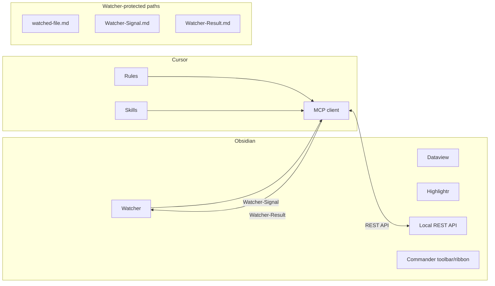

# Second Brain Plugins

## Obsidian (required)

| Plugin | Role | Responsibilities |
|--------|------|------------------|
| **Dataview** | Queries, dashboards, log aggregation | Queries and dashboards (e.g. Vault-Change-Monitor); agent does not modify Dataview query blocks in notes |
| **Highlightr** | Highlight colors; master key in [[3-Resources/Highlightr-Color-Key|Highlightr-Color-Key]]; project highlight_key in skills. Agent uses `data-highlight-source="agent"`. CSS: `data-drift-level` (0=core → 3=fade). See [[3-Resources/Second-Brain/Color-Coded-Highlighting|Color-Coded-Highlighting]]. | Renders highlight colors; agent sets data-highlight-source and class from master key or highlight_key; skills apply colors, plugin renders |
| **Obsidian Local REST API** | MCP server talks to vault (read, update, move, etc.); API key in MCP env | MCP uses for all vault read/update/move; API key in ~/.cursor/mcp.json env; required for pipelines |
| **Watcher** | Watcher-Signal.md → Cursor; Watcher-Result.md; queue; fixed paths | Writes signal; reads result; agent must not move/delete Watcher paths or watcher-protected notes |

## Obsidian (optional)

| Plugin | Role | Responsibilities |
|--------|------|------------------|
| **Commander** | Place Watcher/queue and roadmap commands in ribbon, status bar, or mobile toolbar; macros for pipeline triggers; commander_source/commander_macro logging. See [[3-Resources/Commander-Plugin-Usage|Commander-Plugin-Usage]]. | Surfaces triggers in UI; agent logs commander_source and commander_macro when run was Commander-triggered |
| **Commando** (optional) | Enhances Commander macros; optional for timed chains. | Add to Plugins only if needed. |
| **Templater**, **Tasks**, **QuickAdd**, **Excalidraw** | Optional; templates and task management. | Optional; not required for Second-Brain pipelines. |

## Usage example

After a pipeline run, open **Vault-Change-Monitor** (Dataview dashboard) to see last N log entries from Ingest-Log, Distill-Log, etc. Check **Watcher-Result.md** for the requestId and status (success/failure) and completed timestamp to confirm the run finished and inspect any trace on failure.

## Cursor

- **Rules**: `.cursor/rules/always/` and `.cursor/rules/context/`
- **Skills**: `.cursor/skills/<name>/SKILL.md`
- **MCP**: `~/.cursor/mcp.json` — server `obsidian-para-zettel-autopilot`

## Watcher contract

- Pipelines must **not** move or delete: `Ingest/watched-file.md`, `3-Resources/Watcher-Signal.md`, `3-Resources/Watcher-Result.md`, or any note with frontmatter `watcher-protected: true`.
- See [[3-Resources/Watcher-Plugin-Usage|Watcher-Plugin-Usage]] and [[.cursor/rules/always/watcher-result-append|watcher-result-append]].

## Component and data flow

