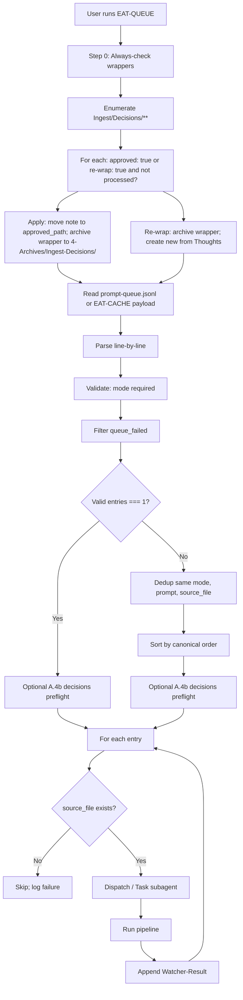
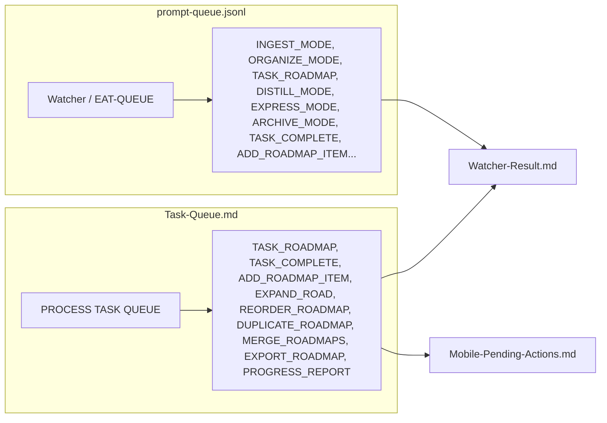

**TL;DR** — prompt-queue.jsonl (`.technical/`) for pipeline modes (INGEST_MODE, DISTILL_MODE, RESUME_ROADMAP, etc.); Task-Queue.md (`3-Resources/`) for task/roadmap modes (TASK_ROADMAP, TASK_COMPLETE, ADD_ROADMAP_ITEM, …). Validate before append; read-then-append only; on RESUME_ROADMAP append remove stale RESUME_ROADMAP lines then append.

---

## Quick Reference — Mode → file

| Mode type | Append to |
|-----------|-----------|
| INGEST_MODE, ROADMAP_MODE, RESUME_ROADMAP, DISTILL_MODE, EXPRESS_MODE, ORGANIZE_MODE, ARCHIVE_MODE, ATOMIZE_MODE, RESEARCH_AGENT, SEEDED_ENHANCE, … | `.technical/prompt-queue.jsonl` |
| TASK_ROADMAP, TASK_COMPLETE, ADD_ROADMAP_ITEM, EXPAND_ROAD, REORDER_ROADMAP, DUPLICATE_ROADMAP, MERGE_ROADMAPS, EXPORT_ROADMAP, PROGRESS_REPORT | `3-Resources/Task-Queue.md` |

---

## EAT-QUEUE BREAK-SPIN

**Trigger:** User says **EAT-QUEUE BREAK-SPIN** (or **Process queue** with **BREAK-SPIN**) — same **EAT-QUEUE** pass as usual; [[.cursor/rules/always/dispatcher.mdc|dispatcher]] routes to **`Task(queue)`**.

**Layer 0:** Optionally includes **`## operator_break_spin`** (fenced **`yaml`**) in the Queue hand-off: **`operator_break_spin: true`**, optional **`break_spin_preferred_action`**, **`break_spin_pivot_to_track`**, **`break_spin_target_queue_entry_id`**, **`break_spin_rationale`**, **`break_spin_circled_locus`**. After **`Task(queue)`** returns, optional **loud** user-facing lines only when **`queue.layer0_escalation_enabled`** — parse **`## layer0_queue_signals`** in the Queue return ([[.cursor/agents/queue.md|agents/queue.md]]); **never** put loud copy in **Watcher-Result** `message`.

**Layer 1:** Merges BREAK-SPIN into **`layer1_resolver_hints`** ([[.cursor/rules/agents/queue.mdc|queue.mdc]] — alternate **deepen** targets first; **`recal`** only when **no** alternates and **`queue.break_spin_recal_fallback_when_no_alternate`** is **true**, or operator override).

**Layer 2:** [[.cursor/agents/roadmap.md|agents/roadmap.md]] — **`operator_break_spin`** precedence; terminal **`queue_continuation.suppress_reason: no_gain_pending_user_gates`** when **`no_gain_signal`** (see [[3-Resources/Second-Brain/Docs/Queue-Continuation-Spec|Queue-Continuation-Spec]]).

**Config:** [[3-Resources/Second-Brain-Config|Second-Brain-Config]] § **`queue.break_spin_*`**, **`queue.layer0_*`**.

---

## Safety — Queue append

> [!warning] **Validation before append**: `mode` present and known; `params` object if present; valid one-line JSON. **Read-then-append**: Read full file → append one newline + one JSONL line → write back. **On decline**: Do not write; payload in plan for copy-paste. **RESUME_ROADMAP append**: Remove existing lines with `mode === "RESUME_ROADMAP"` then append the new line.

---

## PromptCraft recovery

**Craft ownership:** **PromptCraftSubagent** owns **machine craft** (merge-aware params, `user_guidance` / `prompt` text, per-mode lint). **Layer 1 (Queue)** owns **when** to append, **read-append-write**, **repair-first sort**, **caps**, and **thin repair policy** (`params.action` for post–little-val: `recal` vs `handoff-audit` vs `sync-outputs`). **Minimal deterministic JSONL** (fallback) lives in **queue.mdc A.5b.3** — used when craft is off, PromptCraft fails, or lint blocks; it is **not** duplicate “full craft,” only an escape hatch.

**Purpose (A.5d):** After a **Layer 2** pipeline **Task** returns **`failure`** or **`#review-needed`** with structured **`prompt_craft_request`** (including **`ira_repair_bundle`**), **Layer 1** may invoke **PromptCraftSubagent** via **`Task(prompt_craft)`** to produce **merge-aware, linted** suggested JSONL line(s). **PromptCraft never writes the queue**; only **Layer 1** performs read-append-write. **IRA** and **nested Validator** must not call PromptCraft.

**Purpose (A.5b):** After **post–little-val** hard block on roadmap repair-eligible entries, **Layer 1** **must** still enqueue a repair line when policy says so (unless incoherence budget exhausted). If **`post_little_val_repair_use_prompt_craft`** is **true**, **Task(prompt_craft)** runs first with **`craft_source: a5b_post_little_val`**; on any failure, use **A.5b.3 minimal fallback**. If **false**, use **A.5b.3** only.

**Config (Second-Brain-Config):** `recovery_auto_craft_enabled` (default **false**) gates **A.5d** after pipeline return with **`prompt_craft_request`**. `recovery_auto_append` (default **false**) gates appending **A.5d** suggested lines without review. `post_little_val_repair_use_prompt_craft` (default **false**) gates **A.5b** PromptCraft-first repair craft. `max_prompt_craft_per_correlation_per_run` (default **1**) caps craft per correlation id (**A.5d:** `error_correlation_id`; **A.5b:** `<queue_entry_id>-post-little-val-repair`). `recovery_pre_append_lint_enabled` (default **true**) runs shallow JSONL/mode validation before append.

**Manual (Layer 0):** Phrases **REPAIR CRAFT**, **PROMPT CRAFT RECOVERY** → parent agent calls **`Task`** with **subagent_type `prompt_craft`** (or **generalPurpose** with PromptCraft preamble if the host enum lacks `prompt_craft`) and a hand-off built from pasted **`prompt_craft_request`** YAML or from [[3-Resources/Second-Brain/Subagent-Safety-Contract|Subagent-Safety-Contract]] § PromptCraft. Layer 0 does **not** append the queue; operator or Layer 1 applies lines.

**Post-recovery validation:** After crafted lines are **eaten** and executed, optional **`VALIDATE`** with **`params.validation_type: "recovery_outcome"`** runs the **recovery outcome** hostile pass (see [[3-Resources/Second-Brain/Validator-Reference|Validator-Reference]] § recovery_outcome). Model: **Second-Brain-Config** `validator.recovery_outcome.model`.

**Full spec:** [[3-Resources/Second-Brain/Docs/Prompt-Craft-Subagent|Prompt-Craft-Subagent]]; orchestration: [[.cursor/rules/agents/queue.mdc|agents/queue.mdc]] **A.5b** (post–little-val repair), **A.5d** (pipeline failure craft).

---

## Prompt-queue audit (movement trace)

**Append-only:** `.technical/prompt-queue-audit.jsonl` (when Second-Brain-Config **`queue.audit_log_enabled`** is true). Layer 1 writes **`line_removed`** (consumed ids after **A.7**) and **`line_appended`** (mid-run appends) per [[3-Resources/Second-Brain/Docs/Queue-Audit-Log-Spec|Queue-Audit-Log-Spec]] — full payload or **`metadata_only`** via **`queue.audit_log_payload_mode`**, plus **`eat_queue_run_id`** and dispatch timing fields. **Not** a substitute for **queue-continuation.jsonl** (suppress/bootstrap semantics) or **Watcher-Result** (outcome lines). Cursor: whitelist **`!.technical/prompt-queue-audit.jsonl`** in root `.cursorignore` beside **`prompt-queue.jsonl`**.

## Queue continuation (machine-readable)

**Spec:** [[3-Resources/Second-Brain/Docs/Queue-Continuation-Spec|Queue-Continuation-Spec]] — structured **`queue_continuation`** object on **RoadmapSubagent** returns; durable **`.technical/queue-continuation.jsonl`** when **`queue_continuation.continuation_log_enabled`** in [[3-Resources/Second-Brain-Config|Second-Brain-Config]]; **A.1b** empty-queue bootstrap when **`empty_queue_bootstrap_enabled`** (tail **`empty_queue_bootstrap_tail_lines`**, TTL **`empty_queue_bootstrap_max_age_minutes`**). If strict `continuation_eligible` filtering produces no candidate, optional forced fallback **`empty_queue_bootstrap_force_when_unfinished`** may seed one continuation for projects whose `Roadmap/roadmap-state.md` is not `complete` (lookback override: **`empty_queue_bootstrap_force_max_age_minutes`**). If still no record, optional **`empty_queue_bootstrap_prompt_craft_on_no_record`** invokes PromptCraft with unresolved-roadmap hints, and **`empty_queue_bootstrap_deterministic_when_no_record`** provides a final deterministic one-line fallback. **PromptCraft** uses **`craft_source: empty_queue_bootstrap`** and no-record path **`craft_source: empty_queue_bootstrap_no_record`**. Does not replace **`queue_followups`** / **`queue_next`**. **Gate streak persistence:** [[3-Resources/Second-Brain/Docs/Queue-Gate-State-Spec|Queue-Gate-State-Spec]] (**`queue.gate_state_path`**); Layer 1 **A.5f** + optional **`scripts/queue-gate-compute.py`** when Config **`queue.gate_block_detection_enabled`** / **`queue.deterministic_gate_script_enabled`** (see **queue.mdc**).

**Cursor visibility:** Add `!.technical/queue-continuation.jsonl` beside `prompt-queue.jsonl` in root `.cursorignore` if the file is treated as excluded.

---

## Legacy mode normalization (read-time)

Existing queue files (`.technical/prompt-queue.jsonl`) and Task-Queue.md may contain **legacy** mode strings (hyphens or spaces). The queue processor **normalizes on read**: when parsing each line, map known old forms to the canonical underscored name before dispatch. Examples: `RESUME-ROADMAP` → `RESUME_ROADMAP`, `INGEST MODE` → `INGEST_MODE`, `RESEARCH-AGENT` → `RESEARCH_AGENT`, `TASK-ROADMAP` → `TASK_ROADMAP`. After a transition period, support for legacy names can be removed. Document the full mapping in the queue rule (queue.mdc) and in Queue-Alias-Table.

---

## Chain modes (Phase 3)

A **chain mode** is a single queue entry whose `mode` string contains one or more hyphens: `PRIMARY_MODE-DEP1-DEP2-...`. The first segment is the **primary** mode (the pipeline that runs last, with context from the others). The remaining segments are **dependency** pipeline modes run **in order** before the primary. The queue processor **does not append** separate queue lines for dependencies; it expands the chain entry into multiple Task-tool calls: run each dependency in order, collect results, then run the primary with a hand-off that includes all collected results. One chain entry → one id in processed_success_ids when the full chain completes.

**Format:** `PRIMARY_MODE-DEP1-DEP2-...`  
**Execution order:** DEP1 → DEP2 → … → PRIMARY (dependencies first, then primary).

**Allowed segment names (after first):** Shorthand tokens map to canonical modes: `RESEARCH` → RESEARCH_AGENT, `INGEST` → INGEST_MODE. Other segment names (e.g. DISTILL, EXPRESS) may be added; when unknown, log and skip that segment or reject the chain.

**Examples:**

| Mode (in queue) | Execution |
|-----------------|-----------|
| `RESUME_ROADMAP-RESEARCH` | Run RESEARCH_AGENT (with source_file/params from chain entry), collect result; then run RESUME_ROADMAP with hand-off containing research results. |
| `RESUME_ROADMAP-RESEARCH-INGEST` | Run RESEARCH_AGENT, then INGEST_MODE (e.g. for new research notes), then RESUME_ROADMAP with hand-off containing research + ingest context. |

Chain modes append to **`.technical/prompt-queue.jsonl`** (same as other pipeline modes). Validation: `mode` must match a known single mode or a known chain pattern (primary segment must be a valid mode; dependency segments must be in the allowed segment list). See Queue-Alias-Table for trigger phrases and queue.mdc A.5 for parse and dispatch.

---

## prompt-queue.jsonl

- **Location**: `.technical/prompt-queue.jsonl` (folder excluded from Obsidian via Settings → Files & Links → Excluded files; see Vault-Layout)
- **Used by**: Watcher (appends), EAT-QUEUE (reads and clears passed entries). **Cursor must read this file**: ensure `.cursorignore` does not hide it — add `!.technical/prompt-queue.jsonl` so the queue is not treated as empty when running EAT-QUEUE. **Verified**: `.cursorignore` at repo root contains that exception (after `.technical/**` and `*.jsonl`), so the queue file is visible to Cursor.
- **Format**: One JSON object per line; fields: `mode`, `prompt`, `source_file`, `id` (requestId). Optional top-level **`queue_agent_may_skip_if_stall`** (bool) — Layer 1 stall-skip contract per § **Stall skip** above. Optional **`params.queue_blocking_repair`** (bool) — marks a repair-class line as **blocking** for **`forward_first`** preflight ordering. Optional **`params.stall_skip_confirmed`** (bool) — operator confirms stall skip allowed without waiting for in-run hard-block tally. Optional **`params`** object (e.g. `{ "context_mode": "strict-para", "max_candidates": 7 }`) — crafter injects from Config if absent; EAT-QUEUE validates against [[3-Resources/Second-Brain/MCP-Tools|MCP-Tools]] contracts before dispatch and logs mismatches to Errors.md. Optional **`timestamp`** (ISO 8601 UTC, e.g. when the entry was queued) and **`local_timestamp`** (string, format `YYYY-MM-DD HH:MM` in user local time). When present, pipelines that write user-facing timestamps (e.g. workflow_state ## Log) use them per Parameters § Timestamp resolution. Optional **`agent_reasoning`** string (or array of short strings) carries **AI-only** reasoning snippets from C choices during prompt crafting; it must never contain human-typed guidance. **Follow-up entries:** When a pipeline run needs to enqueue a follow-up (e.g. next RESUME_ROADMAP or RECAL-ROAD), the pipeline returns a follow-up request (e.g. `queue_followups.next_entry`) and the **Queue/Dispatcher** appends the new line. Follow-ups must **not** copy `timestamp` or `local_timestamp` from the triggering entry — those are per-entry metadata for "when this run was queued," not params to forward. When the run is **guidance-aware** (see [[.cursor/rules/always/guidance-aware|guidance-aware]]), the **`prompt`** field is used as user refinement guidance when the note at `source_file` has no `user_guidance` frontmatter. Queue entries may carry **`prompt`** (or merged user_guidance) that includes older crafter-generated reasoning when the user chose C (AI reasoning) for a param; new question-led crafter runs should instead place C-choice explanations into `agent_reasoning` only. Question-led Prompt Crafter v2 MAY also emit an optional **`param_meta`** overlay alongside `params`: `param_meta: { <paramName>: { description: string, defaultWhenC: string, usedBy?: string } }`. Processors and pipelines MUST treat both `param_meta` and `agent_reasoning` as **advisory-only decoration** — it is safe to ignore them and they MUST NOT change validation, routing, or safety behavior; the primary contract remains `mode` + `params`.
- **Params fallback chain** (precedence): 1. Queue entry params 2. user_guidance frontmatter (merge) 3. Config prompt_defaults/profiles 4. MCP tool defaults (e.g. max_candidates: 3 per MCP-Tools). Crafted payloads may omit keys (B or C choice); consumers treat absent as default per Second-Brain-Config. **Re-queue / continuity:** When building re-try or TASK_TO_PLAN_PROMPT payloads, inject **session_success_hint** (last 1–3 success lines from Watcher-Result.md) and **git_diff_hint** (from code_execution `git diff --summary` when vault has .git; else fallback to Versions/ or log to Errors.md) into `params` so the agent has minimal session memory. **previous_decisions**: array of short strings from recent approved wrappers (cap 5–10). Document in Logs.md.
- **Roadmap multi-dispatch (Layer 1 A.4c / A.5.0):** Second-Brain-Config **`queue.roadmap_pass_order`** controls how many **`RESUME_ROADMAP`** / **`RESUME_ROADMAP-*`** lines per **`project_id`** may run in **one** EAT-QUEUE invocation. **`repair_first`** (default): **one** roadmap dispatch per project per run (after repair-first sub-sort) — legacy behavior. **`forward_first`**: **initial pass** — up to **`queue.max_blocking_repair_preflight_per_project_per_run`** **blocking-repair** lines (repair-class with **`params.queue_blocking_repair: true`** or **`params.action`** `recal` / `handoff-audit`), then up to **`queue.max_forward_roadmap_dispatches_per_project_per_run`** **forward-class** lines (not repair-class); **cleanup pass** — up to **`queue.max_repair_roadmap_dispatches_per_project_per_run`** additional **repair-class** lines. Non-roadmap modes still dispatch in **initial pass** only (canonical order). **`queue.roadmap_refresh_between_roadmap_dispatches`** (default true): re-read roadmap state between roadmap **`Task`** calls. See [[.cursor/rules/agents/queue.mdc|agents/queue.mdc]] **A.4c**, **A.5.0**.
- **Stall skip (optional queue line):** Top-level or **`params`**: **`queue_agent_may_skip_if_stall: true`** — Layer 1 may **omit** **`Task(roadmap)`** when **`queue.stall_skip_enabled`** and (**`params.stall_skip_confirmed: true`** OR in-run **`hard_block_return_count[queue_entry_id] ≥ queue.stall_skip_min_hard_block_returns_per_run`** after prior repair-class hard blocks). Line **stays** in the queue; Watcher **`status: success`**, **`message`** prefix **`skipped: hard_block_stall`**; audit **`entry_skipped_no_dispatch`**. **Never** stall-skip without this flag.
- **Observability (multi-phase):** Watcher-Result lines for roadmap dispatches **should** include **`queue_pass_phase=initial|cleanup`**, **`dispatch_ordinal=N`**, **`roadmap_pass_order=repair_first|forward_first`** in **`message`** or **`trace`** (still only **`status: success|failure`**). **`dispatch_ledger`** entries include **`queue_pass_phase`**. See [[3-Resources/Second-Brain/Logs|Logs]] § Run-Telemetry, [[3-Resources/Second-Brain/Docs/Queue-Audit-Log-Spec|Queue-Audit-Log-Spec]].
- **Laptop-only queue writes:** prompt-queue.jsonl and Task-Queue.md are written **only from the laptop** (Plan-mode crafter, Commander macros on laptop, or manual edit). Mobile does not append; mobile = observe + fill Ingest only. See [[3-Resources/Second-Brain/Mobile-Migration-Spec|Mobile-Migration-Spec]].
- **Origin:** Queue entries for prompt-queue.jsonl are **typically created by the question-led Prompt-Crafter** (preferred/primary entry door) or by Watcher/Commander on laptop. Direct mode phrases (INGEST_MODE, DISTILL_MODE, etc.) are **manual/advanced** entry points and should be reserved for trusted laptop usage; they are normalized into modes here and dispatched by the **Queue/Dispatcher subagent** ([[.cursor/rules/agents/queue.mdc|agents/queue.mdc]]) after routing via [[.cursor/rules/always/dispatcher.mdc|dispatcher]] and [[.cursor/rules/always/system-funnels.mdc|system-funnels]].
- **tech_level (prompt-queue contract)**: When **Second-Brain-Config** has `roadmap_tech_progression: true`, EAT-QUEUE may **inject** into `params` for **INGEST_MODE** entries a **tech_level** value derived from the note’s phase: `high-concept` (phases 1–2), `mid-tech` (phases 3–4), `pseudo-code` (phase 5+). Phase is inferred from note path (e.g. Phase-1, Phase-2) or frontmatter (roadmap-level, phase). The **IngestSubagent** (agents/ingest.mdc) uses tech_level for the Cursor-agent direct-move exception (tech_level > 1 and mid-band confidence → refinement loop; see [[3-Resources/Second-Brain/Cursor-Agent-Ingest-Workflow]]).
- **Contract validation**: EAT-QUEUE **rejects** invalid params pre-dispatch (e.g. rationale_style not in ['concise','detailed','bullet','technical'] per MCP-Tools); append to Errors.md.
- **Modes**: **INGEST_MODE** (handled by **IngestSubagent** agents/ingest.mdc — Phase 1 full-autonomous-ingest, Phase 2 apply-mode), **ROADMAP_MODE** (setup only; Phase 0 + roadmap-generate-from-outline; execution delegated to **RoadmapSubagent** agents/roadmap.mdc; does not append RESUME_ROADMAP), **FORCE_WRAPPER**, **RESEARCH_AGENT** (handled by **ResearchSubagent** agents/research.mdc: resolve project_id + linked_phase; research-agent-run → write to Ingest/Agent-Research/; queue INGEST_MODE and optionally DISTILL_MODE for new notes; Errors backstop when 0 notes; payload: source_file or project_id + params.phase / params.linked_phase, optional params.research_queries), **AUDIT_CONTEXT** (context-vs-pipeline-audit: workflow_state vs Distill/Express logs → Audit-Context-Focus.md; payload: source_file or project_id), (run pipeline inferred from source_file but create Decision Wrapper instead of destructive step; see apply-from-wrapper in Pipelines reference), **RESUME_ROADMAP** (execution delegated to **RoadmapSubagent** agents/roadmap.mdc; roadmap-resume: load state, build hand-off with distilled-core first; source_file or project_id; optional **`params.roadmap_track`** `conceptual` \| `execution` overrides active track for one deepen run per roadmap-deepen; **`params.action: unfreeze_conceptual`** performs conceptual unfreeze under the same funnel with **`params.confirm_unfreeze: true`** and optional **`params.paths`**; optional payload: **`focus`** `"handoff-readiness"`, **`handoff_focus`** true, **`handoff_gate`** true, **`min_handoff_conf`** 85 — when set, processor injects hand-off-audit and enforces hand-off gate; pass-through to roadmap-resume/auto-roadmap), **HANDOFF-AUDIT** (alias → RESUME_ROADMAP params.action handoff-audit), **ROADMAP_HANDOFF_VALIDATE** (Validator subagent: final validation pass on roadmap → one handoff-readiness report; params: **project_id** required, optional **roadmap_dir**, **phase_range**; execution delegated to ValidatorSubagent agents/validator.mdc; queue passes **model** from Second-Brain-Config § validator.roadmap_handoff.model; report path per Vault-Layout). **Manual trigger only:** No pipeline or subagent may append ROADMAP_HANDOFF_VALIDATE. Entries are created only by user (manual queue edit), Prompt Crafter, or Commander macro. The full validation sweep runs only when explicitly requested and always uses the configured fixed model (e.g. grok-code) for stability; this protects cost and ensures the hostile pass is intentional. **RESUME-FROM-LAST-SAFE** (alias → RESUME_ROADMAP params.action resume-from-last-safe), **RECAL-ROAD** (alias → RESUME_ROADMAP params.action recal), **SYNC-PHASE-OUTPUTS** (alias → RESUME_ROADMAP params.action sync-outputs), **REVERT-PHASE** (alias → RESUME_ROADMAP params.action revert-phase), **ROADMAP_UNFREEZE_CONCEPTUAL** (legacy compatibility alias → RESUME_ROADMAP params.action unfreeze_conceptual), **ROADMAP_ONE_SHOT** (deprecated: one-shot roadmap generate only; log deprecation warning; use multi-run for better quality), **ORGANIZE_MODE**, **TASK_ROADMAP**, **NORMALIZE_MASTER_GOAL** (normalize-master-goal: restructure PMG at source_file to [[Templates/Master-Goal]]; backup + snapshot before write; used by ROADMAP_MODE or on demand), **EXPAND_ROAD** (alias → RESUME_ROADMAP params.action expand), **TASK_TO_PLAN_PROMPT** (turn roadmap task into Cursor-ready prompt; re-try can append; see Templates/Planning-Prompt-Task.md), **DISTILL_MODE**, **EXPRESS_MODE**, **SCOPING_MODE** (queue alias: run DISTILL_MODE then EXPRESS_MODE on same note — PMG path from source_file or payload; research-scope runs inside express), **ARCHIVE_MODE**, **TASK_COMPLETE**, **ADD_ROADMAP_ITEM**, **SEEDED_ENHANCE**, **BATCH_DISTILL**, **BATCH_EXPRESS**, **ASYNC_LOOP** (re-process after async preview), **NAME_REVIEW** (name-enhance batch; optional scope), **GARDEN_REVIEW** (auto-garden-review: obsidian_garden_review → feed to distill/organize batches), **CURATE_CLUSTER** (auto-curate-cluster: obsidian_curate_cluster → gaps/merges/synthesis). Optional future: **ARCHIVE-GHOST-SWEEP**. Re-queue caps/prunes via Parameters (re_try_max_loops, prune_candidates, age_days). See Parameters.md and auto-eat-queue for canonical order.
  - **ROADMAP_HANDOFF_VALIDATE optional param**: `params.roadmap_level` (canonical `"primary" | "secondary" | "tertiary"`). If omitted, ValidatorSubagent infers from the validated phase note frontmatter key `roadmap-level` when present; otherwise defaults conservatively.
**RESUME_ROADMAP params (canonical):** RESUME_ROADMAP is the **canonical roadmap continuation mode**; one run = one action from **params.action**. Default **action: deepen**. **queue_next** (bool): when **absent** or **undefined**, treat as **true** (a follow-up RESUME_ROADMAP is **required** when under caps and below context threshold; required unless explicitly false); only when **explicitly false** does the system suppress follow-up. Under the current orchestration model, pipeline subagents do **not** write queue files; they return a follow-up request (e.g. `queue_followups.next_entry`) and the **Queue/Dispatcher** appends the new line. **The agent (in crafter or auto-roadmap) must never set `queue_next: false` based solely on stall patterns, low confidence, high iterations, drift, or any other runtime metric unless the handoff gate condition is explicitly met or the user has chosen false via the crafter’s explicit “Other” path and confirmed it.** Params: **action**, **phase**, **granularity**, **sectionOrTaskLocator**, **userText**, **queue_next**, **focus**, **handoff_gate**, **min_handoff_conf**, **enable_context_tracking**, **context_util_threshold**, **context_token_per_char**, **context_window_tokens**, **inject_extra_state** (bool; when true, pull distilled-core, decisions-log tail, siblings, and when phase ≥5 prior-phase batch; target 40–50% util), **token_cap** (e.g. 50000; max tokens for injected block), **max_depth** (optional; derive from phase when absent: 1–2→2, 3–4→3, 5–6→4), **branch_factor** (default 4 for phases ≥3), **batch_subphases** (array e.g. ["3.2","3.3","3.4"]), **highlight_angles** (array e.g. ["narrative","tech","edge-cases"]), **recal_util_high_threshold** (default 70), optional **roadmap_track** (`conceptual` \| `execution`; when present on the entry, acts as **track lock** for **`effective_track`** per § below). **params.action** may be **`bootstrap-execution-track`** to bootstrap `Roadmap/Execution/` and set **`roadmap_track: execution`** on `roadmap-state.md` per [[3-Resources/Second-Brain/Docs/Dual-Roadmap-Track|Dual-Roadmap-Track]] and Vault-Layout. Optional **profile** (string; name of a profile under `prompt_defaults.profiles`). When `params.profile` is present and matches a key in `prompt_defaults.profiles`, the dispatcher may use that profile block to **pre-fill missing keys only** (merge order: `effectiveParams = deepMerge(prompt_defaults.roadmap, prompt_defaults.profiles[params.profile], queueParams)`); **queueParams from the crafter always win** for any key they contain. When `params.profile` does **not** match a configured profile name, the dispatcher MUST treat the profile as missing (equivalent to no profile for merging), leave `params.profile` as-is for logging, and continue using only `prompt_defaults.roadmap` + explicit queue params; the run must not fail or silently substitute another profile.

### `effective_track` resolution (conceptual vs execution)

Layer 1 and RoadmapSubagent **must** agree on which track is active for **gates**, **validator profile**, **blocked_track**, and **file paths**. Compute once per dispatch:

| Step | Source | Rule |
|------|--------|------|
| 1 | `1-Projects/<project_id>/Roadmap/roadmap-state.md` frontmatter | **`state_track`** = `roadmap_track` if present and valid (`conceptual` \| `execution`); else **`conceptual`** (explicit default — not silent). |
| 2 | Merged queue entry **`params.roadmap_track`** | If the queue entry **includes** the key **`roadmap_track`** (value `conceptual` or `execution`), **`track_lock_explicit`** = **true** and **`queue_track_param`** = that value. If the key is **absent**, **`track_lock_explicit`** = **false** and **`queue_track_param`** = null. |
| 3 | **`effective_track`** | If **`queue_track_param`** is non-null → **`effective_track` = `queue_track_param`** (one-run or crafter lock). Else **`effective_track` = `state_track`**. |

**Hand-off:** Layer 1 **`## layer1_resolver_hints`** YAML **must** include **`state_track`**, **`effective_track`**, and (when applicable) **`queue_track_param`**. RoadmapSubagent **`validator_context`** for **`roadmap_handoff_auto`** **must** include **`effective_track`** so the Validator and post–little-val tiering can apply the correct gate catalog ([[3-Resources/Second-Brain/Docs/Roadmap-Gate-Catalog-By-Track|Roadmap-Gate-Catalog-By-Track]]).

**`blocked_track` for anti-spin:** Set **`blocked_track`** in **`gate_block_signal`** and durable gate state to **`effective_track`** (not only queue default).

**Next-Need Resolver (state-driven anti-spin):** When Config `queue.roadmap_next_need_enabled` is true, Layer 1 computes a read-only structural snapshot before dispatching RESUME_ROADMAP and adds resolver hints to the roadmap hand-off:
- `need_class`: `missing_structure` | `stale_outputs` | `incoherence` | `phase_gate_ready` | `gate_block`
- `effective_action`: selected from need_class (deepen/expand, sync-outputs, recal, advance-phase)
- `effective_target`: preferred phase/subphase/note scope
- `delta_basis`: compact structural delta rationale
RoadmapSubagent should prefer these hints when action is missing/auto. This mechanism replaces repeated recal churn with structural pivoting and uses no fixed max-iteration/max-recal caps.

**Conceptual `effective_target` guard:** When **`effective_track`** is **`conceptual`**, **`effective_target`** must not be **only** execution-closure artifacts (rollup/REGISTRY-CI/HR); prioritize structural phase/subphase work and [[3-Resources/Second-Brain/Docs/Conceptual-Execution-Handoff-Checklist|NL completeness]] (see `queue.mdc` Next-Need Resolver).

### Conceptual track: Watcher-Result prefix and Config (post–little-val)

When **`roadmap_handoff_auto`** runs after **`little_val_ok: true`** on **`effective_track: conceptual`**, human-facing lines must not read like repeated “full handoff failed” when the only driver is execution-deferred debt.

- **Watcher-Result (`segment: VALIDATE`):** If post–little-val is **needs-work-only** (not a hard block per `queue.mdc` A.5b) and resolved **`primary_code`** is listed in **`queue.conceptual_skip_auto_repair_primary_codes`** ([[3-Resources/Second-Brain-Config|Second-Brain-Config]] § `queue`), **`message` must** begin with: **`execution-deferred (advisory); out of scope for conceptual completion —`** (then severity, codes, report path). If a **hard block** applies **and** **`reason_codes`** also list execution-deferred codes, state the hard-block outcome first, then note that execution-deferred codes are advisory on conceptual ( **`queue.mdc` A.5b.0a** ).
- **Validator reports:** **`roadmap_handoff_auto`** written reports must include the conceptual banner lines in **`validator.mdc`** (execution-deferred-only vs mixed verdict).
- **Config knobs:** **`queue.conceptual_skip_auto_repair_primary_codes`** (defaults include **`missing_roll_up_gates`**, **`safety_unknown_gap`**); **`queue.conceptual_force_build_on_repeated_gap`** (default **false** — no auto-escalation into rollup/CI artifact chases on conceptual); **`queue.medium_gap_escalation_threshold`** (default **4** when escalation is re-enabled). See **`queue.mdc` A.5b.0**, **A.5b.5**, **A.6**.

- Optional spin signal fields in Layer 1 observability: `spin_signal.flat_delta_streak`, `spin_signal.suspected_spin`, `gate_block_signal` (`gate_signature`, `gate_streak`, `blocked_track`, `pivot_to_track`), and `resolver_alignment` (hint vs returned action consistency).
- Gate signature precedence for automatic detection: `failed_reason` (mandatory little-val/nested-validator) -> `suppress_reason` (`post_little_val_hard_block_consumed`) -> validator `primary_code` -> first hard-block `reason_codes[]`.

**VALIDATE (canonical validator mode):** `mode: "VALIDATE"` is the **general-purpose validator mode** used by pipelines to request a hostile review for a specific `validation_type`. Every VALIDATE entry **must** include `params.validation_type` plus any type-specific params required by that validation_type’s schema (see the Validator canonical implementation spec and Validator-Reference). The queue processor dispatches VALIDATE entries to the **ValidatorSubagent** (subagent_type `validator`) and reads the model from Second-Brain-Config (§ `validator.<validation_type>.model`) so each type can use either `"auto"` or a fixed model. VALIDATE supports the types listed in [[3-Resources/Second-Brain/Validator-Reference|Validator-Reference]] (including **`recovery_outcome`** for post–PromptCraft audits). Older “Phase 1 / Phase 2” wording in this paragraph is superseded by Validator-Reference as the canonical list.

**`ira_after_first_pass` (optional, all pipeline modes that use nested validator + IRA):** Boolean. When **`false`**, opts into **legacy** behavior: skip IRA and the **second** nested validator pass if the **first** pass is clean `log_only` with no actionable gaps. When absent, use Config **`nested_validator.ira_after_first_pass`** (default **true** = always IRA + second pass after first nested validator). Merge: effective **false** only if `params.ira_after_first_pass === false` **or** Config is false. **Clarification:** This flag is read **inside** the pipeline run. The Queue **never** dispatches IRA; nested **validator → IRA → second validator** happens as nested **Task** calls from the pipeline subagent, not as separate queue entries. See Parameters.md § Nested validator → IRA and Subagent-Safety-Contract.

**Post-pipeline validator (hostile pass after little val):** Once per pipeline run, **after** the pipeline returns **Success** and **little_val_ok: true**, the queue runs the **ValidatorSubagent** once **before** adding the entry to processed_success_ids and continuing. **This Queue-triggered Validator pass does not invoke IRA** and does not replace the pipeline’s internal nested validator→IRA cycle; it is an additional observability pass only (see `queue.mdc` A.6). No sampling; no cap (post-pipeline validator runs do **not** count toward `validator.global_max_per_run`). Pipeline return must include **validator_context** with `validation_type` and type-specific params so the queue can build the validator hand-off. **Mode → validation_type** (pipelines supply this in validator_context): INGEST_MODE → `ingest_classification` (source_file, para_type, proposed_path, ingest_conf); DISTILL_MODE / BATCH_DISTILL → `distill_readability` (source_file); EXPRESS_MODE / BATCH_EXPRESS → `express_summary` (source_file, optional publish_flag); ARCHIVE_MODE → `archive_candidate` (source_file, archive_conf); ORGANIZE_MODE → `organize_path` (source_file, proposed_path, para_type, project_id, path_conf); ROADMAP_MODE / RESUME_ROADMAP (including `params.action: unfreeze_conceptual`) → `roadmap_handoff_auto` (project_id, state file paths, **`effective_track`** from § **`effective_track` resolution**); RESEARCH_AGENT → `research_synthesis` (project_id, synth_note_paths or source_file). **Ingest exception:** for agent-generated direct-move policy runs (`Ingest/Agent-Output/` or `Ingest/Agent-Research/`, or `agent-generated: true`) when `prompt_defaults.ingest.validator_block_agent_generated_without_wrapper: false`, ingest validator verdicts are advisory-only and must not hard-block that direct-move branch. See Subagent-Safety-Contract § Pipeline return and § Post–little-val hostile validator.

**Nested attestation (strict consumption — Second-Brain-Config § `queue`):** When **`queue.strict_nested_return_gates`** is **false** (default), `queue.mdc` may **skip** the post-pipeline validator and **still consume** the entry if **`validator_context`** is missing (legacy). Layer 1 **should** log a **soft** signal (Feedback-Log / Errors.md) when **`little_val_ok: true`** but **`validator_context`** is absent for a gated pipeline mode (**`error_type: validator_context_missing_soft`**). When a parseable **`nested_subagent_ledger`** shows **hollow** rows (**`invoked_ok`** / **`invoked_empty_ok`** with **`task_tool_invoked: false`** on mandated helper **`step`** ids per [[3-Resources/Second-Brain/Docs/Nested-Subagent-Ledger-Spec|Nested-Subagent-Ledger-Spec]] **Attestation invariants**), Layer 1 **should** soft-log (**`ledger_semantic_attestation_soft`**) and still consume unless strict gates are on. When **`queue.strict_nested_return_gates`** is **true**, missing or invalid **`validator_context`** for those modes → **do not** consume; **`queue_failed: true`**; Watcher-Result **failure**; optional **`.technical/queue-continuation.jsonl`** row with **`suppress_reason: nested_attestation_failure`** (see [[3-Resources/Second-Brain/Docs/Queue-Continuation-Spec|Queue-Continuation-Spec]]). The same strict refusal applies when **(b0)(iii)** detects hollow ledger attestation (**`error_type: ledger_semantic_attestation_failure`**). When **`queue.strict_nested_ledger_all_pipelines`** is **true**, the same strict treatment applies to missing or unparseable **`nested_subagent_ledger`** on gated modes (see Nested-Subagent-Ledger-Spec). **Operators:** set **`strict_nested_return_gates: true`** when pipeline returns reliably include honest **`validator_context`** and ledgers; see Parameters.md § Queue nested attestation.

**Dynamic vs static RESUME-ROADMAP params:** Dynamic per-iteration params (re-derived inside `effectiveParams`, not stickied in queue entries) include **token_cap**, **research_max_tokens**, **research_synth_cap_tokens**, **research_result_limit**, **max_depth**, **branch_factor**, **batch_subphases**, **granularity**, and the effective `enable_research` / action choice when `action: "auto"`. Static or sticky params (per project or crafted run) include **queue_next** (sticky-true except when suppressed by handoff gate or explicit false via crafter/wrapper), **profile** name, hard caps such as **context_window_tokens**, the effective **enable_context_tracking** flag, and the **highlight_angles set** (weights may be dynamic but the set itself is not auto-extended mid-run). Any param that influences safety gates (snapshots, destructive vs non-destructive, context tracking on/off, hard window limits) must not be made dynamic in a way that bypasses the existing rules in Parameters and auto-roadmap.

**Single-entry roadmap funnel (V4 — session ends after append):** (1) **ROADMAP_MODE (setup)** never appends a RESUME_ROADMAP entry after it runs; after setup append the crafting session **ends** (V4 session-end message, no follow-up questions). (2) The first resume after setup is created when the user starts a **new** crafter session and chooses RESUME_ROADMAP. (3) Subsequent resume entries are enqueued by the **Queue/Dispatcher** based on pipeline follow-up requests (using params from the entry that just ran; **required** when **queue_next !== false**) or by a new crafted entry (crafter removes existing RESUME_ROADMAP lines then appends). See § Question-led crafter: Remove stale on RESUME_ROADMAP append.

### `effective_followup_required` (RESUME_ROADMAP, Layer 1)

Canonical predicate for **whether a successful roadmap dispatch must leave at least one new JSONL line** (via Layer 2 **`queue_followups`** or Layer 1 **A.5c.1 synthesis**). See [[.cursor/rules/agents/queue.mdc|agents/queue.mdc]] **A.5c** / **A.5c.1**.

**`effective_followup_required` is true** when all hold:

1. After read-time normalization, the dispatched **primary** mode is **`RESUME_ROADMAP`** (chain entries: primary segment).
2. The queue entry’s **`params.queue_next`** is **not** **`false`** (absent / undefined = true).
3. The **RoadmapSubagent** Task return is treated as **Success** for consumption (same disposition that adds the entry id to **`processed_success_ids`** — prose status **Success** with nested attestation passes per Config). **`little_val_ok` may be null/absent on some success returns and does not waive the follow-up requirement.**

**`effective_followup_required` is false** when any **terminal suppress** condition holds (no deepen/recal follow-up required; Layer 1 **must not** synthesize):

| Condition | Typical `queue_continuation.suppress_reason` (if emitted) | Notes |
|-----------|-----------------------------------------------------------|--------|
| **`queue_next: false`** on the queue entry | `explicit_queue_next_false` | User/crafter opt-out. |
| Canonical roadmap **target reached** (victory / complete) | `target_reached` | Termination behavior; no RESUME_ROADMAP follow-up. |
| **Conceptual** design-handoff target reached (Parameters § Conceptual autopilot) | `conceptual_target_reached` | Same as terminal suppress for Layer 1 **A.5c.1**; no synthetic deepen/recal tail. |
| **Handoff gate** satisfied and policy suppresses follow-up | `handoff_gate` | Per Roadmap-Quality-Guide / auto-roadmap. |
| **Hard ceiling** or **context gate** with **no** follow-up line (e.g. blocked deepen and no RECAL request) | `hard_ceiling` | If roadmap-deepen still returns a **RECAL** `next_entry`, a line exists — not terminal. |
| Run was **repair-only** / expand-only with no queued next | `repair_only` | Terminal for non-`RESUME_ROADMAP` contexts; for successful `RESUME_ROADMAP` with `queue_next !== false`, Layer 1 treats this as non-terminal and synthesizes the next continuation when missing. |
| **A.5b** appended a post–little-val repair line for this entry | `post_little_val_hard_block_consumed` | Original entry consumed; repair line is the continuation. |
| **A.5.0** stall-skip (no **Task**; line remains on disk) | `explicit_skip_stall` | Not Success consumption; continuation row **`continuation_eligible: false`**; empty-queue bootstrap excludes (Queue-Continuation-Spec). |
| Pipeline **failure**, **`#review-needed`** without a valid **`queue_followups.next_entry`**, or **nested attestation failure** | `pipeline_failure`, `nested_attestation_failure` | Not a Success consumption path for this predicate. |
| **Incoherence** budget **`R === 0`** and no other mandated **`queue_followups`** | (often `#review-needed`) | Manual/crafter intervention. |
| **`queue_followups.suppress_next: true`** with a reason consistent with terminal policy | varies | Layer 2 explicit suppress. |

**Enforcement:**

- **Layer 2 (primary):** RoadmapSubagent **must** include **`queue_followups.next_entry`** in the Task return when **`effective_followup_required`** would be true after the run — forward **roadmap-deepen**’s follow-up payload; **`queue_continuation.suppress_followup`** must be **`false`** when **`next_entry`** is emitted. **Conceptual subphase exit** ([[3-Resources/Second-Brain/Parameters|Parameters]] § Conceptual subphase exit): when **`roadmap.conceptual_subphase_exit_enabled`** is **true**, Layer 2 may **rewrite** **`next_entry`** to advance to the **next structural slice** (still **`mode: RESUME_ROADMAP`**, **`params.action: deepen`**). When **`roadmap.conceptual_subphase_exit_override_high_util_recal`** is true, this rewrite may replace high-util RECAL tails unless a hard blocker exists. **`effective_followup_required`** remains **true** whenever a valid **`next_entry`** is emitted; it is **not** a terminal suppress (unlike **`conceptual_target_reached`**). See [[.cursor/agents/roadmap|agents/roadmap.md]] § **(3d)**.
- **Layer 1 (safety net):** If **`effective_followup_required`** is true and, after **A.5c** merge rules, **no** valid follow-up line was appended (missing **`queue_followups`**, missing **`next_entry`**, or duplicate-id suppression only — do not duplicate an id already on disk), and Second-Brain-Config **`queue.synthesize_followup_when_queue_next_true`** is not **`false`**, append **one** synthesized **`RESUME_ROADMAP`** line per **A.5c.1** in `queue.mdc`, and log **`error_type: queue_next_contract_violation_recovered`** to **Errors.md** or Feedback-Log.
- **Layer 1 (defense-in-depth anti-churn):** With **`queue.conceptual_subphase_exit_l1_guard_enabled`** and **`roadmap.conceptual_subphase_exit_enabled`** both true, Layer 1 must preserve Layer-2 subphase-exit fields (`subphase_slice_exit_applied`, `next_subphase_index`) and enforce same-subphase streak pivot using **`queue.conceptual_same_subphase_streak_threshold`** (default 2): repeated same-slice conceptual follow-ups without hard blockers are rewritten to next-node deepen with trace tag `[layer1_same_subphase_pivot]`.
- **Layer 1 (post-success assertion):** If Second-Brain-Config **`queue.assert_followup_presence_after_resume_success`** is **true**, Layer 1 must re-read queue after A.5c/A.5c.1 and assert at least one same-project `RESUME_ROADMAP` continuation remains before consuming the success entry; if absent, append one synthesized line (A.5c.2) and log **`error_type: queue_next_post_success_assertion_recovered`**.
- **Layer 1 (consumption guard):** For non-terminal `RESUME_ROADMAP` success with `queue_next !== false`, Layer 1 must not consume if no continuation line exists after A.5c/A.5c.1/A.5c.2. Mark `queue_failed: true`, log **`error_type: resume_success_without_followup_blocked`**, and leave the entry for repair/retry.
- **Watcher operator alarm (guard hit):** On `resume_success_without_followup_blocked`, append a Watcher-Result **failure** line with message prefix **`OPERATOR ALARM: resume success blocked — missing non-terminal follow-up`** (include `queue_entry_id` and `project_id`).
- **Layer 1 delta guard:** If `queue.roadmap_next_need_min_structural_delta` is configured and current `delta_basis` is below threshold, avoid synthesizing the same action class repeatedly; pivot to the next ranked need class action.
- **Layer 1 spin guard:** If `queue.spin_detection_enabled` and `flat_delta_streak >= queue.spin_detection_streak_threshold` (and same-need requirement passes when enabled), treat as suspected spin and force class pivot unless user-locked.
- **Layer 1 gate-block guard:** If `queue.gate_block_detection_enabled` and repeated gate signature crosses `queue.gate_block_streak_threshold`, suppress same-track deepen/recal repeats and prefer cross-track pivot (`conceptual`↔`execution`) when `queue.prefer_track_shift_on_gate_block` is true and no explicit track lock exists.
- **Follow-up override invariant:** For `need_class: gate_block`, Layer 1 may override Layer 2 `queue_followups.next_entry` when it would continue same-track deepen/recal churn; override must preserve `queue_next` intent while changing only track/action class needed to break the gate loop.
- **Conceptual forward-lube guard:** With `queue.conceptual_forward_prefer_deepen: true`, synthesized follow-ups on `effective_track: conceptual` default to `params.action: deepen` unless hard blocker evidence exists (`incoherence`, `contradictions_detected`, `state_hygiene_failure`, `safety_critical_ambiguity`) or the user explicitly locked a repair action.
- **Conceptual repeated-medium-gap escalation:** With `queue.conceptual_force_build_on_repeated_gap: true`, when conceptual runs repeatedly return medium `needs_work` with primary_code `safety_unknown_gap` or `missing_roll_up_gates` on the same spine for `>= queue.medium_gap_escalation_threshold`, Layer 1 escalates from generic repair wording to forced named-artifact materialization guidance (e.g. `G-P4.1-ROLLUP-GATE-02` class artifacts, CI registry stubs, witness appendix) and sets repair-priority follow-up metadata.
- **Conceptual scaffold expectation (strict path):** With `queue.require_conceptual_scaffold_on_block: true`, when a conceptual roadmap return reports structural block/no-advance, Layer 1 requires scaffold evidence in return text (`mock scaffold`/`conversion-ready`/`Conceptual-Amendments` artifact path); if missing, treat as failure (`conceptual_scaffold_missing_on_block`) instead of consuming success.

**When does the system stop appending (or use queue_next: false)?** (1) **Explicit false:** User sets **queue_next: false** via the question-led crafter (param 18) or manual queue edit — system must not enqueue a follow-up. (2) **Target reached:** auto-roadmap uses **canonical target (primary)** when handoff gate is on (handoff_readiness ≥ min_handoff_conf for every phase 1..current_phase) or **canonical fallback** when gate is off (structural checklist: status complete, current_phase 6, full tree, depth ≥4 under 5–6). When either is satisfied it runs **termination behavior** (roadmap-state.status complete, victory banner, archive wrappers) and exits without enqueueing any follow-up RESUME_ROADMAP. (3) **Handoff gate:** When handoff_gate is enabled and conditions are explicitly met, the system may suppress the follow-up (effective_queue_next = false); the agent must never set queue_next: false from stalls, low confidence, or drift alone — only from handoff gate or user choice. (4) **Hard ceiling / high-util / RECAL:** When max_iterations_per_phase is hit, or context-util ≥ threshold, roadmap-deepen does not request another deepen follow-up; it may request a **RECAL-ROAD** (alias → RESUME_ROADMAP action recal) or create a Decision Wrapper instead. No RESUME_ROADMAP line with queue_next: false is written — the system simply does not enqueue a deepen follow-up in those cases.  
**Research (pre-deepen):**  
- **enable_research** (bool; when true or auto-detect from phase, run research-agent-run before deepen).  
- **research_queries** (array, optional): may be strings or objects `{ query, slot?, intent?, prefer? }`; when absent, derived from phase/outline.
- **research_result_preference** (array, optional): `official_docs` | `recent` | `with_code` | `diverse` | `academic`; used by skill Step 2/3.
- **candidate_urls** (array, optional): URLs to extract first; may be strings or `{ url, weight?, intent?, slot? }`.
- **research_focus** (optional): `junior_handoff` | `cto_brief` | `spike_proposal` | `risk_maximal`; steers synthesis audience (Step 3).
- **research_max_escalations** (optional): `0` | `1` | `2`; default **1** for crafted/manual entries; **pre-deepen may inject 0** unless phase/project marked research-heavy. Request-sanity step (Step 1b): agent may revise queries/intent up to this many times before fetch; structured JSON output. When **research_strategy** exists: `quick` → force 0 (skip Step 1b); `critique_heavy` or `deep` → allow 2.
- **research_timing** (e.g. "pre-secondary").
- **research_result_limit** (default 3–5; util-triggered runs may use 5–7).  
- **research_auto_keywords** (array; default ["web","papers","examples","benchmarks"] for auto-detect).  
- **research_tools** (array; default ["web","firecrawl"]); discovery: web_search, Semantic Scholar, arXiv, Crossref per research_tools; extraction: Firecrawl MCP then Browser MCP or mcp_web_fetch fallback; no BrowserAct.  
- **research_distill** (bool; default false; when true append DISTILL_MODE for new research notes).  
- **research_max_tokens** (default 15000; soft cap on synthesized output per note).  
- **research_synth_cap_tokens** (default 10000; per-run synthesis cap; if combined synthesized content exceeds this, truncate/summarize the injected block).  
- **research_util_threshold** (default 30; when last workflow_state Ctx Util % is a valid number and `< threshold` and current_phase > 2, auto-roadmap may auto-enable research from util, subject to cooldown and opt-out).  
- **research_cooldown** (default 1; only auto-trigger research from util every N iterations in that phase, via `iterations_per_phase[current_phase] % research_cooldown === 0`; 1 = once per iteration).  
- **async_research** (optional, bool — **deprecated/no-op**): accepted in params for backward compatibility but ignored by auto-roadmap; pre-deepen research always runs inline. Existing entries with `async_research: true` behave as if it were false.
- **RESEARCH-GAPS** (alias): Same as RESEARCH_AGENT with **params.gaps** set (from gap detection on current phase note). Commander macro "Queue Research: Gaps" scans the phase note, runs gap detection, and appends RESEARCH_AGENT with `gaps` and `origin: "commander-gaps"`. See Queue-Alias-Table.

**RESEARCH_AGENT payload (query context and result-selection):** When dispatching RESEARCH_AGENT, the queue processor must pass the entry's **full `params`** object in the hand-off (no stripping of unknown keys). Supported params (all optional; absent = current behavior): **research_queries** — array of strings or array of objects `{ query, slot?, intent?, prefer? }`; used by skill Step 1 (query gen), Step 2 (per-query prefer), Step 3 (slot/intent for synthesis). **research_result_preference** — array of `official_docs` | `recent` | `with_code` | `diverse` | `academic`; used by Step 2 (rank/select discovery results), Step 3 (synthesis instruction). **candidate_urls** — array of URL strings (or objects with `url`, `weight?`, `intent?`, `slot?`); extract first, then discovery if needed; used by Step 2, Step 3. **research_focus** — `junior_handoff` | `cto_brief` | `spike_proposal` | `risk_maximal`; steers synthesis audience; used by Step 3. **avoid_duplicate_headings** — array of strings; merged with auto-derived "Do not duplicate" in Step 0. **research_max_escalations** — `0` | `1` | `2` (default 1; pre-deepen may inject 0); request-sanity Step 1b; structured JSON; when research_strategy present: quick→0, critique_heavy/deep→2. See Parameters § Research and Research-Pipeline § Query context and result selection.

**Research agent: linked_phase and post-run check.** When RESUME_ROADMAP has **enable_research: true**, **linked_phase** for pre-deepen research is derived in auto-roadmap from **workflow_state** (current_phase + current_subphase_index → e.g. `Phase-1-1`, `Phase-1-1-2`). If workflow_state is missing or current_phase/current_subphase_index invalid, research is skipped and an error is logged (#research-skipped); deepen still runs. After a run, check **Errors.md** for **#research-failed**, **#research-empty**, or **#research-skipped** (and **Research-Log** if used) to confirm whether research ran or was skipped.

RECAL-ROAD, EXPAND-ROAD, etc. are aliases (normalized to RESUME_ROADMAP with params.action). See Queue-Alias-Table and auto-roadmap. **DEEPEN-AGGRESSIVE** alias: RESUME_ROADMAP deepen with inject_extra_state, token_cap 50000, branch_factor 4, highlight_angles ["narrative","tech","edge"]; expect util 45–65%.

- **Result**: Processed in canonical pipeline order; results appended to Watcher-Result.md
- **Responsibilities**: Watcher/Commander on **laptop** append entries; **EAT-QUEUE** is routed by the **dispatcher** to the **Queue/Dispatcher subagent** (agents/queue.mdc), which reads prompt-queue.jsonl, validates, dedups, sorts, and dispatches by mode; processor writes one line per request to Watcher-Result.md; optional queue-cleanup marks failed entries and appends to Errors.md. Mobile does not append to queue (mobile = observe + fill Ingest).

## Task-Queue.md

- **Location**: `3-Resources/Task-Queue.md`
- **Used by**: PROCESS TASK QUEUE / EAT-QUEUE
- **Format**: Same line format (JSON-like per line). **Structure**: Optional YAML frontmatter (`---` … `---`), then optional heading (e.g. `# Task Queue`), then **body**: one JSON object per line. Queue entries are lines in the body only; do not insert inside frontmatter or inside a heading line. question-led prompt crafter appends after the last body line. When the file is missing, create with minimal structure (e.g. `---\n---\n\n` or `# Task Queue\n\n` then the JSON line) so the file stays parseable.
- **Modes**: TASK_ROADMAP, TASK_COMPLETE, ADD_ROADMAP_ITEM, EXPAND_ROAD, REORDER_ROADMAP, DUPLICATE_ROADMAP, MERGE_ROADMAPS, EXPORT_ROADMAP, PROGRESS_REPORT
- **Result**: Watcher-Result.md and Mobile-Pending-Actions.md
- **Responsibilities**: Task toolbar / Commander append entries; **PROCESS TASK QUEUE** is routed by the **dispatcher** to the **Queue/Dispatcher subagent** (agents/queue.mdc), which reads Task-Queue.md, dispatches by mode; task/roadmap skills (task-complete-validate, add-roadmap-append, expand-road-assist, etc.) consume; results to Watcher-Result.md and Mobile-Pending-Actions.md (e.g. pending banner cleanup).

## Question-led crafter: queue routing and append

When the **question-led prompt crafter** appends a crafted payload after user confirmation:

- **Routing**: Append to **`3-Resources/Task-Queue.md`** if and only if `mode` is one of: **TASK_ROADMAP**, **TASK_COMPLETE**, **ADD_ROADMAP_ITEM**, **EXPAND_ROAD**, **REORDER_ROADMAP**, **DUPLICATE_ROADMAP**, **MERGE_ROADMAPS**, **EXPORT_ROADMAP**, **PROGRESS_REPORT**. For all other modes (INGEST_MODE, **ROADMAP_MODE**, RESUME_ROADMAP, **chain modes** e.g. RESUME_ROADMAP-RESEARCH, RESUME_ROADMAP-RESEARCH-INGEST, DISTILL_MODE, EXPRESS_MODE, ORGANIZE_MODE, ARCHIVE_MODE, RESEARCH_AGENT, SEEDED_ENHANCE, etc.), append to **`.technical/prompt-queue.jsonl`**. No other files.
- **Validation before append**: (a) `mode` present and non-empty string; (b) `mode` is a known mode (includes **ROADMAP_MODE**, RESUME_ROADMAP, and all other prompt-queue modes); (c) if `params` is present, it is an object; (d) payload serializes to valid one-line JSON. If validation fails, do not append; surface error and leave payload in chat/recap for user correction.
- **On decline**: If the user declines to append (no / skip / copy only), do not write; payload remains in the summary/recap for copy-paste or manual add.
- **Read-then-append**: Read full file → append exactly one newline + one JSONL line → write back. Never overwrite the file with only the new line; preserve all existing lines. On write failure, report error and leave payload in plan; optionally log to Errors.md with pipeline `question-led-crafter`, stage `queue_append`.
- **Remove stale on RESUME_ROADMAP append:** When appending a crafted RESUME_ROADMAP entry, first remove all existing lines in `.technical/prompt-queue.jsonl` whose parsed `mode` is exactly `"RESUME_ROADMAP"` (parse each line as JSON; only drop if parse succeeds, object has `mode` string, and `mode === "RESUME_ROADMAP"`; preserve unparseable lines and lines with any other mode). Then append the new RESUME_ROADMAP line. Ensures one clear resume chain; re-triggering the crafter for a new resume replaces any auto-appended or older crafted resume entries. Commander- or Watcher-appended RESUME_ROADMAP entries are also removed when the user crafts a new RESUME_ROADMAP via the question-led crafter and confirms append.

## Example queue lines

**prompt-queue.jsonl** (one JSON object per line):

```json
{"mode":"DISTILL_MODE","source_file":"1-Projects/MyProject/Note.md","id":"req-1"}
{"mode":"SEEDED_ENHANCE","source_file":"2-Areas/Area/Note.md","id":"req-2"}
{"mode":"INGEST_MODE","source_file":"Ingest/My-Note.md","id":"req-3","params":{"context_mode":"strict-para","max_candidates":7}}
```

**Task-Queue.md** (same JSON-like line format; mode determines which skill runs):

- TASK_COMPLETE: `{"mode":"TASK_COMPLETE","source_file":"1-Projects/X/Roadmap.md","task_id":"^block-id"}`
- ADD_ROADMAP_ITEM: `{"mode":"ADD_ROADMAP_ITEM","source_file":"1-Projects/X/Roadmap.md","prompt":"New phase description"}`

## When to use which

- **Chat prompts** (paste in Cursor) and **queue entries** (EAT-QUEUE) both feed the same pipelines; queue carries structured params, chat uses Config defaults/fallback. See [[3-Resources/Second-Brain/Chat-Prompts|Chat-Prompts]] for canonical phrases and prompt → queue mode mapping.
- **Watcher** appends to prompt-queue (or equivalent).
- **Task toolbar commands** append to Task-Queue.
- Reference [[.cursor/rules/context/auto-eat-queue|auto-eat-queue]] and [[.cursor/rules/context/auto-queue-processor|auto-queue-processor]].
- **Alias reference**: [[3-Resources/Second-Brain/Queue-Alias-Table|Queue-Alias-Table]] — trigger phrases and command aliases mapped to processor and mode.

## Fast-path for single entry

When **valid entry count === 1**, the processor skips dedup and sort and dispatches immediately. Preserves full dedup/sort for batch.

## Unified option (optional)

Single append-only file (e.g. Task-Queue.md with JSON lines for both pipeline and task modes) reduces Watcher branches. Current two-file design remains supported. If merging, update Watcher to append to one file only.

## Queue-cleanup

- **Skill**: [[.cursor/skills/queue-cleanup/SKILL|queue-cleanup]] — slot after dedup in auto-eat-queue.
- **Trigger**: When `auto_cleanup_after_process: true` in Second-Brain-Config, runs after each EAT-QUEUE; else only when user runs "Clear queue" or "Queue cleanup".
- **Behavior**: Auto-mark failed entries `queue_failed: true`; append short summary to [[3-Resources/Errors|Errors.md]] for review.

## Optional queue entry fields (context-aware defaults)

Queue entries may include `source_file`, `project_id`, `cursor_line`. The processor uses these for defaults (e.g. primary path from current note, section from cursor). Document in Watcher/plugin so payload can pass cursor context.

**idempotency_key:** When a subagent appends queue entries as part of a **chain** (e.g. Roadmap appends RESEARCH_AGENT for pre-deepen), it SHOULD set **idempotency_key** to a unique value (e.g. `"<original_entry_id>-research-pre-deepen"`). The queue processor **deduplicates on read** for the current logical run: if an entry's idempotency_key matches one already processed in this run, skip or merge instead of running again. Prevents duplicate dependency runs if a subagent crashes mid-chain and the entry is re-processed. See Subagent-Safety-Contract § Subagent chaining.

## Tiered validator queue fields (Layer 1)

Authoritative behavior: [[3-Resources/Second-Brain/Docs/Validator-Tiered-Blocks-Spec|Validator-Tiered-Blocks-Spec]]; processor steps: `.cursor/rules/agents/queue.mdc` **A.4** (repair-first sub-sort), **A.5b** (post–little-val), **A.7** (rewrite).

**Optional top-level or `params` fields** (prompt-queue JSONL lines):

| Field | Purpose |
|--------|---------|
| **`blocked_scope`** | Object (e.g. `{ "project_id", "phase_ids", "paths" }`) copied from pipeline/validator return when a hard block applies; helps humans and future tooling scope what is frozen. |
| **`validator_followup`** | Boolean or short string — marks that this line exists because of a validator-driven pivot (documentation / analytics). |
| **`queue_priority`** | String **`"repair"`** or integer (lower = earlier). Repair lines SHOULD use **`"repair"`** or set **`validator_repair_followup: true`**. |
| **`validator_repair_followup`** | Boolean — when **true**, entry sorts with repair-first group for same `project_id` (see queue.mdc A.4). |
| **`incoherence_retries_remaining`** | Number — remaining budget for guided **incoherence** repair passes. **Roadmap pipeline:** at run start, if absent, treat as Config **`validator.max_incoherence_retries`**. When the **final** nested validator hard-blocks with **`primary_code: incoherence`** and `R > 0`, Roadmap returns **`queue_followups.next_entry`** with **`incoherence_retries_remaining: R - 1`** (see `.cursor/agents/roadmap.md` § **Incoherence bounded retry** and `roadmap.mdc`). **Layer 1 (A.5b):** when appending post–little-val repair for **`incoherence`**, set the same field on the new line using `(entry.incoherence_retries_remaining ?? max_incoherence_retries) - 1`; if that value is negative, do **not** append (budget exhausted). |

**A.7 tiered policy (processed_success_ids):** When post–little-val yields a **hard block** and **A.5b** successfully **appends** a **repair** line for the same intent, the **original** queue entry id is **consumed** (included in `processed_success_ids`); the new repair line has a **new** `id`. Do **not** set `queue_failed: true` on the original entry for that reason alone. If hard block occurs and **no** repair line can be appended (missing `project_id`, non-roadmap `validation_type`, I/O failure), the processor SHOULD set **`queue_failed: true`** on the original line (or log **Errors.md** + **#review-needed**) so the user sees a stuck entry.

**Chain modes:** If dependencies complete and the **primary** is hard-blocked at post–little-val, **do not re-run** dependencies; consume the **chain** entry id per the same A.7 policy when repair is appended. If a **dependency** fails, abort the rest of the chain for that `chain_id` without consuming the chain entry.

### Example JSONL — repair after `contradictions_detected` (post–little-val)

After a **RESUME_ROADMAP** deepen run, Layer 1 appends something like:

```json
{"mode":"RESUME_ROADMAP","id":"projA-repair-recal-20260320-1","project_id":"my-project","params":{"action":"handoff-audit","blocked_scope":{"project_id":"my-project","phase_ids":["Phase-2"]},"user_guidance":"Post-lv validator report: [[.technical/Validator/roadmap-handoff-auto-<timestamp>.md]] primary_code: contradictions_detected"},"queue_priority":"repair","validator_repair_followup":true}
```

Alternative: same with `"action":"recal"` and `prompt` citing the report path instead of `params.user_guidance`.

## Decision workflow (guidance-aware, Decision Wrapper–gated ingest)

When the user approves a **Decision Wrapper** under `Ingest/Decisions/**` (check one option, optionally edit Thoughts, and set `approved: true`), the macro or manual edit can also ensure `user_guidance` reflects their reasoning (e.g. `Move to Phase-2-Terrain3D using option B because...`). **Watcher** (when `approved: true` is already set) syncs the checked option into frontmatter `approved_option` and `approved_path`; conflicts and sync decisions are logged to Wrapper-Sync-Log.md. **Option A (always-check)**: On every EAT-QUEUE run, auto-eat-queue runs **step 0** first: it enumerates `Ingest/Decisions/**` (e.g. `Ingest-Decisions/`) and, for each wrapper with `approved: true` or `re-wrap: true` and not yet processed, uses `feedback-incorporate` to resolve `approved_option` / `approved_path` into `hard_target_path` (or re-wrap intent). If **re-wrap: true** or **approved_option: 0** (reject all), step 0 runs the **re-wrap branch**: archive the current wrapper to `4-Archives/Ingest-Decisions/Re-Wrap/Ingest-Decisions/`, then create a new wrapper with Thoughts as seed and a link to the archived wrapper. Otherwise it runs **apply-mode INGEST** on the original note (move/rename to approved path only, with backup and dry_run), marks the wrapper processed, and **moves the wrapper to `4-Archives/Ingest-Decisions/`** (mirroring the live subfolder) so the Decision folder stays uncluttered. Roadmap tree creation is no longer triggered from ingest; use ROADMAP MODE – generate from outline (or a dedicated queue mode) for that. Processed wrappers are kept for training/history and are never auto-deleted. This runs **regardless of whether the queue file contains a `CHECK_WRAPPERS` entry**, so approved wrappers are never stuck. Ingest Phase 1 still ensures a `CHECK_WRAPPERS` queue entry exists when a new wrapper is created (for visibility); if any approved-but-unprocessed wrappers remain after step 0, step 8 appends a fresh `CHECK_WRAPPERS` entry to the queue file for the next run.

**Decision candidates (ingest):** Original Ingest notes may still be marked `decision_candidate: true` by the ingest pipeline, and relocation for those notes flows through Decision Wrappers. The primary path is the `CHECK_WRAPPERS` queue entry described above; optionally, auto-eat-queue’s pre-dispatch scan may also inject in-memory INGEST MODE entries that point directly at wrappers with `decision_candidate: true`, `approved: true`, and `user_guidance` (or `#guidance-aware`). Users do **not** need to hand-edit prompt-queue.jsonl. **Inject or act only if** the wrapper and original file still exist at their paths and are not excluded (e.g. not under Backups/, not watcher-protected). **Explicit exception:** The ingest policy may direct-move eligible agent-generated notes (including `Ingest/Agent-Research/`) in Phase 1 without wrapper creation when direct-move gates are satisfied. This exception does not change wrapper meaning: `approved: true` remains wrapper-only.

## Inline fallback (optional)

For simpler actions (e.g. Add Item), an **inline queue** format can bypass the modal: in-note line `#queued-add: New item description` or `#queued-expand: Section name — bullet1; bullet2`. "Add Item" toolbar can offer a toggle "Quick add (inline)" that inserts such a line; queue processor or a separate sweep parses and creates entries. See [[3-Resources/Mobile-Toolbar-Task-Commands|Mobile-Toolbar-Task-Commands]].

## Full queue processor flow

**Step 0 runs first**, before reading the queue file. Approved wrappers are applied (move note → archive wrapper to `4-Archives/Ingest-Decisions/` with subfolders mirrored); then the queue file is read and processed.

**Decisions preflight (optional):** When Second-Brain-Config **`queue.decisions_preflight.enabled`** is **true** and **`on_drift`** is not **`off`**, the canonical Queue subagent (**agents/queue.mdc** **A.4b**) runs after **A.4** (ordering + roadmap per-project dispatchability) and before dispatch: read-only compare of **Roadmap/decisions-log.md** operator picks vs **`stale_scan_paths`**; merge a **yaml** digest into **`Task(roadmap)`** hand-offs under **`## handoff_addendum.decisions_preflight`**. Convention: [[3-Resources/Second-Brain/Docs/Decisions-Log-Operator-Pick-Convention|Decisions-Log-Operator-Pick-Convention]]. Parameters: [[3-Resources/Second-Brain/Parameters|Parameters]] § Queue decisions preflight.



## Commander-Sourced Modes

When queue entries are added via Commander (e.g. macro "Queue Highlight: Combat"), format requirements for macro-appended entries:

| Field | Required | Description |
|-------|----------|-------------|
| **commander_source** | true | Set to `true` when the entry was created by a Commander macro or command. |
| **commander_macro** | string (optional) | Name of the macro (e.g. "Queue Perspective Highlight", "Async Approve") for MOC tracking. |
| **mode** | string | One of the canonical modes (INGEST_MODE, DISTILL_MODE, SEEDED_ENHANCE, BATCH_DISTILL, etc.). |
| **prompt** / **source_file** | as per queue format | Same as non-Commander entries; payload shape unchanged. |

Pipeline logs and Feedback-Log can aggregate by commander_macro for observability (e.g. "Macros used this week"). See Commander-Plugin-Usage and Vault-Change-Monitor Commander Dashboard.

## Two entry points



## Canonical order (horizontal)


