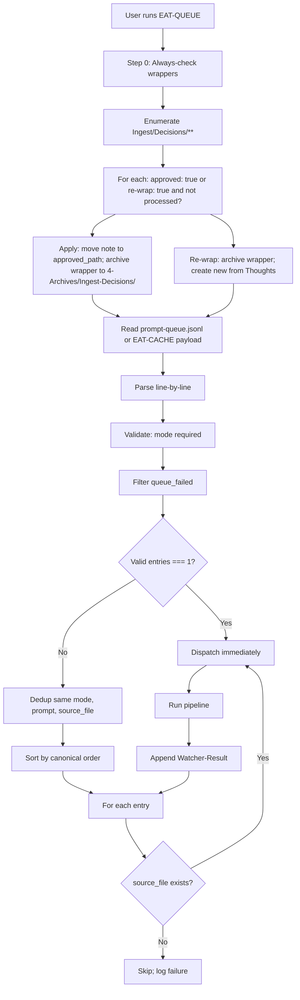
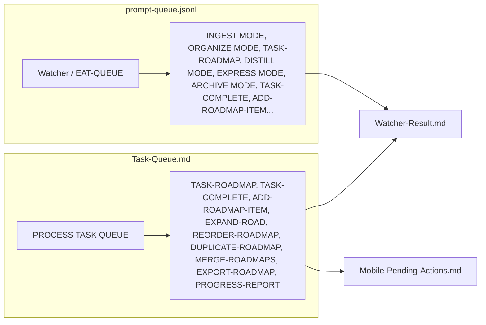

# Second Brain Queue Sources

## prompt-queue.jsonl

- **Location**: `.technical/prompt-queue.jsonl` (folder excluded from Obsidian via Settings → Files & Links → Excluded files; see Vault-Layout)
- **Used by**: Watcher (appends), EAT-QUEUE (reads and clears passed entries). **Cursor must read this file**: ensure `.cursorignore` does not hide it — add `!.technical/prompt-queue.jsonl` so the queue is not treated as empty when running EAT-QUEUE. **Verified**: `.cursorignore` at repo root contains that exception (after `.technical/**` and `*.jsonl`), so the queue file is visible to Cursor.
- **Format**: One JSON object per line; fields: `mode`, `prompt`, `source_file`, `id` (requestId). Optional **`params`** object (e.g. `{ "context_mode": "strict-para", "max_candidates": 7 }`) — crafter injects from Config if absent; EAT-QUEUE validates against [[3-Resources/Second-Brain/MCP-Tools|MCP-Tools]] contracts before dispatch and logs mismatches to Errors.md. When the run is **guidance-aware** (see [[.cursor/rules/always/guidance-aware|guidance-aware]]), the **`prompt`** field is used as user refinement guidance when the note at `source_file` has no `user_guidance` frontmatter.
- **Params fallback chain** (precedence): 1. Queue entry params 2. user_guidance frontmatter (merge) 3. Config prompt_defaults/profiles 4. MCP tool defaults (e.g. max_candidates: 3 per MCP-Tools). **Re-queue / continuity:** When building re-try or TASK-TO-PLAN-PROMPT payloads, inject **session_success_hint** (last 1–3 success lines from Watcher-Result.md) and **git_diff_hint** (from code_execution `git diff --summary` when vault has .git; else fallback to Versions/ or log to Errors.md) into `params` so the agent has minimal session memory. **previous_decisions**: array of short strings from recent approved wrappers (cap 5–10). Document in Logs.md. **Mobile stub:** When mobile is in scope, append re-try summary to Mobile-Pending-Actions.md (stub).
- **Contract validation**: EAT-QUEUE **rejects** invalid params pre-dispatch (e.g. rationale_style not in ['concise','detailed','bullet','technical'] per MCP-Tools); append to Errors.md.
- **Modes**: INGEST MODE, **FORCE-WRAPPER** (run pipeline inferred from source_file but create Decision Wrapper instead of destructive step; see apply-from-wrapper in Pipelines reference), ORGANIZE MODE, TASK-ROADMAP, **EXPAND-ROAD** (expand-road-assist; re-try can append this to prompt-queue), **TASK-TO-PLAN-PROMPT** (turn roadmap task into Cursor-ready prompt; re-try can append; see Templates/Planning-Prompt-Task.md), DISTILL MODE, EXPRESS MODE, **SCOPING MODE** / **SCOPING** (queue alias: run DISTILL MODE then EXPRESS MODE on same note — PMG path from source_file or payload; research-scope runs inside express), ARCHIVE MODE, TASK-COMPLETE, ADD-ROADMAP-ITEM, **SEEDED-ENHANCE**, **BATCH-DISTILL**, **BATCH-EXPRESS**, **ASYNC-LOOP** (re-process after async preview), **NAME-REVIEW** (name-enhance batch; optional scope), **GARDEN-REVIEW** (auto-garden-review: obsidian_garden_review → feed to distill/organize batches), **CURATE-CLUSTER** (auto-curate-cluster: obsidian_curate_cluster → gaps/merges/synthesis). Optional future: **ARCHIVE-GHOST-SWEEP**. Re-queue caps/prunes via Parameters (re_try_max_loops, prune_candidates, age_days). See Parameters.md and auto-eat-queue for canonical order.
- **Result**: Processed in canonical pipeline order; results appended to Watcher-Result.md
- **Responsibilities**: Watcher/Commander append entries; EAT-QUEUE (auto-eat-queue) reads, validates, dedups, sorts, and dispatches by mode; processor writes one line per request to Watcher-Result.md; optional queue-cleanup marks failed entries and appends to Errors.md.

## Task-Queue.md

- **Location**: `3-Resources/Task-Queue.md`
- **Used by**: PROCESS TASK QUEUE / EAT-QUEUE
- **Format**: Same line format (JSON-like per line)
- **Modes**: TASK-ROADMAP, TASK-COMPLETE, ADD-ROADMAP-ITEM, EXPAND-ROAD, REORDER-ROADMAP, DUPLICATE-ROADMAP, MERGE-ROADMAPS, EXPORT-ROADMAP, PROGRESS-REPORT
- **Result**: Watcher-Result.md and Mobile-Pending-Actions.md
- **Responsibilities**: Task toolbar / Commander append entries; PROCESS TASK QUEUE (auto-queue-processor) reads Task-Queue.md, dispatches by mode; task/roadmap skills (task-complete-validate, add-roadmap-append, expand-road-assist, etc.) consume; results to Watcher-Result.md and Mobile-Pending-Actions.md (e.g. pending banner cleanup).

## Example queue lines

**prompt-queue.jsonl** (one JSON object per line):

```json
{"mode":"DISTILL MODE","source_file":"1-Projects/MyProject/Note.md","id":"req-1"}
{"mode":"SEEDED-ENHANCE","source_file":"2-Areas/Area/Note.md","id":"req-2"}
{"mode":"INGEST MODE","source_file":"Ingest/My-Note.md","id":"req-3","params":{"context_mode":"strict-para","max_candidates":7}}
```

**Task-Queue.md** (same JSON-like line format; mode determines which skill runs):

- TASK-COMPLETE: `{"mode":"TASK-COMPLETE","source_file":"1-Projects/X/Roadmap.md","task_id":"^block-id"}`
- ADD-ROADMAP-ITEM: `{"mode":"ADD-ROADMAP-ITEM","source_file":"1-Projects/X/Roadmap.md","prompt":"New phase description"}`

## When to use which

- **Chat prompts** (paste in Cursor) and **queue entries** (EAT-QUEUE) both feed the same pipelines; queue carries structured params, chat uses Config defaults/fallback. See [[3-Resources/Second-Brain/Chat-Prompts|Chat-Prompts]] for canonical phrases and prompt → queue mode mapping.
- **Watcher** appends to prompt-queue (or equivalent).
- **Task toolbar commands** append to Task-Queue.
- Reference [[.cursor/rules/context/auto-eat-queue|auto-eat-queue]] and [[.cursor/rules/context/auto-queue-processor|auto-queue-processor]].
- **Alias reference**: [[3-Resources/Second-Brain/Queue-Alias-Table|Queue-Alias-Table]] — trigger phrases and command aliases mapped to processor and mode.

## Fast-path for single entry

When **valid entry count === 1**, the processor skips dedup and sort and dispatches immediately. Preserves full dedup/sort for batch.

## Unified option (optional)

Single append-only file (e.g. Task-Queue.md with JSON lines for both pipeline and task modes) reduces Watcher branches. Current two-file design remains supported. If merging, update Watcher to append to one file only.

## Queue-cleanup

- **Skill**: [[.cursor/skills/queue-cleanup/SKILL|queue-cleanup]] — slot after dedup in auto-eat-queue.
- **Trigger**: When `auto_cleanup_after_process: true` in Second-Brain-Config, runs after each EAT-QUEUE; else only when user runs "Clear queue" or "Queue cleanup".
- **Behavior**: Auto-mark failed entries `queue_failed: true`; append short summary to [[3-Resources/Errors|Errors.md]] for review.

## Optional queue entry fields (context-aware defaults)

Queue entries may include `source_file`, `project_id`, `cursor_line`. The processor uses these for defaults (e.g. primary path from current note, section from cursor). Document in Watcher/plugin so payload can pass cursor context.

## Decision workflow (guidance-aware, Decision Wrapper–gated ingest)

When the user approves a **Decision Wrapper** under `Ingest/Decisions/**` (check one option, optionally edit Thoughts, and set `approved: true`), the macro or manual edit can also ensure `user_guidance` reflects their reasoning (e.g. `Move to Phase-2-Terrain3D using option B because...`). **Watcher** (when `approved: true` is already set) syncs the checked option into frontmatter `approved_option` and `approved_path`; conflicts and sync decisions are logged to Wrapper-Sync-Log.md. **Option A (always-check)**: On every EAT-QUEUE run, auto-eat-queue runs **step 0** first: it enumerates `Ingest/Decisions/**` (e.g. `Ingest-Decisions/`) and, for each wrapper with `approved: true` or `re-wrap: true` and not yet processed, uses `feedback-incorporate` to resolve `approved_option` / `approved_path` into `hard_target_path` (or re-wrap intent). If **re-wrap: true** or **approved_option: 0** (reject all), step 0 runs the **re-wrap branch**: archive the current wrapper to `4-Archives/Ingest-Decisions/Re-Wrap/Ingest-Decisions/`, then create a new wrapper with Thoughts as seed and a link to the archived wrapper. Otherwise it runs **apply-mode INGEST** on the original note (move/rename to approved path only, with backup and dry_run), marks the wrapper processed, and **moves the wrapper to `4-Archives/Ingest-Decisions/`** (mirroring the live subfolder) so the Decision folder stays uncluttered. Roadmap tree creation is no longer triggered from ingest; use ROADMAP MODE – generate from outline (or a dedicated queue mode) for that. Processed wrappers are kept for training/history and are never auto-deleted. This runs **regardless of whether the queue file contains a `CHECK_WRAPPERS` entry**, so approved wrappers are never stuck. Ingest Phase 1 still ensures a `CHECK_WRAPPERS` queue entry exists when a new wrapper is created (for visibility); if any approved-but-unprocessed wrappers remain after step 0, step 8 appends a fresh `CHECK_WRAPPERS` entry to the queue file for the next run.

**Decision candidates (ingest):** Original Ingest notes may still be marked `decision_candidate: true` by the ingest pipeline, but **relocation now always flows through Decision Wrappers**. The primary path is the `CHECK_WRAPPERS` queue entry described above; optionally, auto-eat-queue’s pre-dispatch scan may also inject in-memory INGEST MODE entries that point directly at wrappers with `decision_candidate: true`, `approved: true`, and `user_guidance` (or `#guidance-aware`). Users do **not** need to hand-edit prompt-queue.jsonl. **Inject or act only if** the wrapper and original file still exist at their paths and are not excluded (e.g. not under Backups/, not watcher-protected).

## Inline fallback (optional)

For simpler actions (e.g. Add Item), an **inline queue** format can bypass the modal: in-note line `#queued-add: New item description` or `#queued-expand: Section name — bullet1; bullet2`. "Add Item" toolbar can offer a toggle "Quick add (inline)" that inserts such a line; queue processor or a separate sweep parses and creates entries. See [[3-Resources/Mobile-Toolbar-Task-Commands|Mobile-Toolbar-Task-Commands]].

## Full queue processor flow

**Step 0 runs first**, before reading the queue file. Approved wrappers are applied (move note → archive wrapper to `4-Archives/Ingest-Decisions/` with subfolders mirrored); then the queue file is read and processed.



## Commander-Sourced Modes

When queue entries are added via Commander (e.g. macro "Queue Highlight: Combat"), format requirements for macro-appended entries:

| Field | Required | Description |
|-------|----------|-------------|
| **commander_source** | true | Set to `true` when the entry was created by a Commander macro or command. |
| **commander_macro** | string (optional) | Name of the macro (e.g. "Queue Perspective Highlight", "Async Approve") for MOC tracking. |
| **mode** | string | One of the canonical modes (INGEST MODE, DISTILL MODE, SEEDED-ENHANCE, BATCH-DISTILL, etc.). |
| **prompt** / **source_file** | as per queue format | Same as non-Commander entries; payload shape unchanged. |

Pipeline logs and Feedback-Log can aggregate by commander_macro for observability (e.g. "Macros used this week"). See Commander-Plugin-Usage and Vault-Change-Monitor Commander Dashboard.

## Two entry points



## Canonical order (horizontal)


