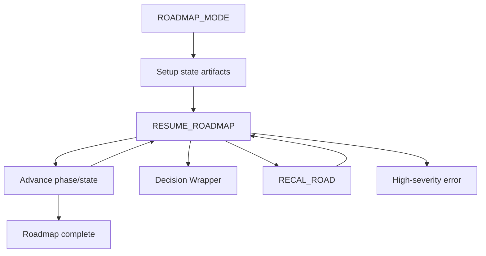

# Roadmap Quality Guide

How to get accurate, consistent project roadmaps and what to do when the system asks for your input.

## Multi-run is the default

**ROADMAP MODE** now uses **multi-run** by default: every run creates or updates persistent state (`roadmap-state.md`, `decisions-log.md`, `distilled-core.md`), distills core decisions after each phase, runs consistency checks (RECAL-ROAD), and enforces a **confidence gate** (≥85%) before a phase is marked complete. One-shot mode is **deprecated**; use **ROADMAP-ONE-SHOT** only if you must (you’ll see a deprecation warning in the log).

### Roadmap state machine (overview)



## How to interpret confidence bands

- **≥85% (high):** The pipeline may mark the phase complete, append to decisions-log and distilled-core, and advance state. Destructive steps (e.g. state updates) only happen in this band (after a snapshot).
- **68–84% (mid):** A single refinement loop may run (re-score, re-check). If after the loop confidence still isn’t ≥85%, a **Decision Wrapper** is created and progress is blocked until you choose an option.
- **<68% (low):** No automatic phase completion. A Decision Wrapper is created with options (e.g. Accept anyway, Refine with guidance, Revert phase, Abort roadmap). You must approve an option and re-run (e.g. EAT-QUEUE) to continue.

These thresholds (and the roadmap-specific **conf_phase_complete_threshold: 85**) are documented in [[3-Resources/Second-Brain/Parameters|Parameters]] and the **roadmap** block in [[3-Resources/Second-Brain-Config|Second-Brain-Config]].

## What to do when a wrapper appears

When a **Decision Wrapper** is created (e.g. under `Ingest/Decisions/Roadmap-Decisions/` or Refinements):

1. **Open the wrapper note** and read the options (A–G).
2. **Choose one option** (e.g. A: Revert to last safe phase; B: Refine with guidance; C: Accept anyway).
3. **Set `approved: true`** in the note’s frontmatter (and ensure `approved_option` matches your choice if your workflow uses it).
4. **Run EAT-QUEUE** (or Process queue) so the pipeline applies your choice and continues.

If you repeatedly **ignore** recalibration wrappers (e.g. leave them unapproved), the system may **auto-revert** to the last high-confidence phase after a configured number of ignored wrappers (default: 3). You’ll see a log line like: "Auto-reverted due to repeated ignored drift warnings."

**Bulk approve:** Use the Commander macro **"Approve All Roadmap Wrappers"** (or "Approve All Pending Wrappers in Project") when you trust the proposed fixes. With **auto_apply_safe_threshold: 82** in config, single-option wrappers with confidence ≥82% may be auto-applied with a snapshot and log entry.

## Why drift is fatal and how to fix it

**Drift** means the roadmap content has become inconsistent with the master goal or with earlier phases (e.g. Phase 4 assumes an engine that Phase 1 ruled out). The system treats drift as **fatal** until it’s fixed: it won’t silently advance past a phase that contradicts the rest of the roadmap.

- **RECAL-ROAD** runs automatically every 3 phases, or when any phase confidence is <88%, or when **drift score > 0.08** (config: `drift_score_threshold`). The exact drift score is written into the **consistency report** (e.g. in `roadmap-state.md` or a linked note).
- If drift is above the threshold, a Decision Wrapper is created with **"A: Revert to last safe phase"** as the first option. Reverting archives the bad phase to `Roadmap/Branches/`, resets `current_phase`, and re-queues EXPAND-ROAD so you can continue from a consistent state.
- **Ways to fix drift:** (1) **Revert to last safe phase** (recommended when in doubt). (2) **Re-apply with changes** — add `user_guidance` or edit the phase so it aligns with the master goal and prior phases, then re-run. (3) **Refine with guidance** — use the wrapper option that adds guidance like "Increase factual consistency and cross-check prior phases" and re-process.

See [[.cursor/skills/roadmap-audit/SKILL|roadmap-audit]] and [[.cursor/rules/context/auto-roadmap|auto-roadmap]] for the full flow; [[3-Resources/Second-Brain/Vault-Layout#Roadmap state artifacts (multi-run)|Vault-Layout § Roadmap state artifacts]] for state schema and artifacts. For automating deep hierarchy with Cursor Agent (workflow_state, iteration tracker, starter prompts), see [[3-Resources/Second-Brain/Roadmap-Upgrade-Plan|Roadmap-Upgrade-Plan]].

### Roadmap automation target (canonical target vs fallback)

**Canonical target (primary — “can you hand it to a dev?”)**  
When **handoff gate is enabled** (params.handoff_gate or config handoff_gate_enabled): target reached when the roadmap is **handoff-ready** for the defined scope.

- **Handoff target scope:** All phases 1..current_phase (every phase the pipeline has worked on). Default: when current_phase = 6 and roadmap-state.status = complete, scope = phases 1..6.
- **Condition:** For **every phase 1..current_phase**, the phase roadmap note has **handoff_readiness ≥ min_handoff_conf** (params or config, default 85%). Read handoff_readiness from each phase note frontmatter (set by [hand-off-audit](.cursor/skills/hand-off-audit/SKILL.md)). If any phase lacks handoff_readiness, run hand-off-audit for that phase (or those phases), then re-check. No structural checklist required for primary path; handoff-readiness is the criterion.

**Canonical fallback (structural checklist)**  
When **handoff gate is disabled or not evaluated**: target reached when the **structural checklist** is satisfied (so automation has a clear stopping condition without the gate):

- roadmap-state.status = complete
- current_phase = 6
- every Phase 1–6 has complete secondary → tertiary tree (subphase-index populated)
- at least one subphase at depth ≥ 4 (quaternary or deeper) under Phases 5–6 contains ≥ 3 pseudo-code blocks or TypeScript-style API signatures + edge-case tasks

The fallback does **not** require handoff ≥85%; handoff is only evaluated on the primary (gate-on) path.

The agent uses **primary when gate on, fallback when gate off** when evaluating "target reached?" and when to advance phase (advance only when depth 4+ under current phase passes handoff-audit ≥ 85% when gate on, or structural depth when gate off).

**Target-reached termination sequence (required):** When the agent determines target reached (either primary or fallback), it must: (1) Set roadmap-state.status to complete if not already. (2) Optionally run one final RECAL-ROAD to refresh distilled-core and decisions-log. (3) Archive any processed roadmap-next-step wrappers for this project from `Ingest/Decisions/Roadmap-Decisions/` to `4-Archives/Ingest-Decisions/Roadmap-Decisions/`. (4) Append to Ingest-Log and Watcher-Result a victory banner line, e.g. "Roadmap target reached — project &lt;project_id&gt;; status complete; phase 6 done. No further RESUME-ROADMAP needed." (5) Exit; do not run another RESUME-ROADMAP loop. Documented in [auto-roadmap](.cursor/rules/context/auto-roadmap.mdc) § Smart dispatch.

**Roadmap Decision Wrapper rationale:** When creating any roadmap Decision Wrapper (roadmap-next-step, stall, or pre-create gate), the agent must include a short **rationale callout** in the wrapper body (e.g. `> **Why uncertain:** …` or Architect-style one-line thought) so the user sees why the agent was uncertain. Placement: immediately after frontmatter or at top of body, before options A–G. See Parameters § roadmap-next-step wrapper and Cursor-Skill-Pipelines-Reference apply-from-wrapper table.

---

## Aggressive deepening (crank the levers)

To force the roadmap tree to match the full hierarchy (master → primary → secondary → tertiary → tasks), use **persistent guidance** plus **sequential queue calls** and **validation**.

### 1. Persistent hierarchy guidance

The canonical hierarchy rule lives in the project’s **distilled-core.md** (and a short ref in **workflow_state.md**). Every resume/expand run should read it. See [[Roadmap Structure]] for the full layout; each project’s `Roadmap/distilled-core.md` should contain a **“Hierarchy rule (enforce always)”** section with:

- Master MOC → phase MOC (Dataview) → secondary MOC (Dataview) → tertiary (tasks only).
- `subphase-index`: "N.M" (secondary), "N.M.K" (tertiary).
- Folder pattern: `Roadmap/Phase-N-.../Phase-N-M-.../Phase-N-M-K-....md`.

### 2. MOC violation check

**Trigger:** When running **roadmap-validate** or **hand-off-audit** (e.g. as part of RECAL-ROAD or before advance-phase), the agent runs a **MOC violation check**: for each phase and secondary roadmap note, if that note's folder **contains at least one child note**, the parent note MUST contain a Dataview block (opening with ```dataview) whose FROM path is that folder. **Flag only when the folder has child notes but the parent lacks the block** (empty secondaries are not violations). Violations are logged to [Errors](3-Resources/Errors.md) with `error_type: roadmap-moc-missing` and `#review-needed`; optionally a short Decision Wrapper is created under `Ingest/Decisions/Roadmap-Decisions/`. Fix: add the missing "## Subphases & notes" or "## Tertiary notes" section with the canonical Dataview block (see [Roadmap Structure](Roadmap Structure.md) and the MOC migration plan). Implemented in [roadmap-validate](.cursor/skills/roadmap-validate/SKILL.md) step 5.

### 3. Queue chain to build the tree aggressively

Start from current state (e.g. `current_phase: 1`, first secondary created). Issue **sequential RESUME-ROADMAP** calls with **action: "deepen"** (or **action: "expand"** when appending under a section). Run one, verify, then run the next.

**Example sequence:**

1. **Finish Phase 1 secondaries (aim for 4–6)**  
   `{"mode":"RESUME-ROADMAP","source_file":"1-Projects/<project_id>/Roadmap/Phase-1-Conceptual-Foundation-Core-Architecture/Phase-1-Conceptual-Foundation-Core-Architecture-Roadmap-*.md","id":"expand-p1-1","params":{"action":"deepen","granularity":"secondary","user_guidance":"Create 4–6 secondary sub-phases matching the 1.1–1.4 sections from original phase note. For each: create folder Phase-1-M-..., secondary roadmap note with roadmap-level: secondary, subphase-index: \"1.M\", and Dataview block listing tertiary notes in that folder. Do not create tertiaries yet."}}`

2. **Deepen first secondary to tertiary level**  
   `{"mode":"RESUME-ROADMAP","source_file":"1-Projects/<project_id>/Roadmap/Phase-1-.../Phase-1-1-Core-Abstractions/Phase-1-1-Core-Abstractions-Roadmap-*.md","id":"expand-p1-1-tert","params":{"action":"deepen","granularity":"tertiary","user_guidance":"Break into 5–8 tertiary notes. Each: create Phase-1-1-K-Name.md in the folder, set roadmap-level: tertiary, subphase-index: \"1.1.K\", add 6–12 detailed tasks as checklist items (- [ ]), include pseudo-code snippets or interface sketches where appropriate for abstractions layer."}}`

3. **Repeat for next secondaries**, then advance phase. After Phase 1 is complete, queue `{"mode":"RESUME-ROADMAP","params":{"action":"deepen"}}` (or with explicit `user_guidance`) to move to Phase 2 with the same pattern.

**Alias:** EXPAND-ROAD is rewritten by EAT-QUEUE to RESUME-ROADMAP with `params.action: "expand"`; use **action: "deepen"** when you want folder/note creation (roadmap-deepen); use **action: "expand"** when you want to append under a section (expand-road-assist). For aggressive *structure* creation, prefer **deepen** with explicit `granularity` and `user_guidance`.

### 4. Phase-specific technicality

Escalate depth per phase (also in distilled-core for the agent to read):

| Phase | Content |
|-------|--------|
| **1** | Conceptual definitions, interfaces; high-level pseudo-code ok. |
| **2–4** | Mid-level: data structures, algorithms, flow diagrams (Mermaid + pseudo-code). |
| **5–6** | Full technical: TypeScript-like signatures, rule engine primitives, edge cases, perf notes, integration tests as tasks. |

### 5. Validate after each major deepen

After finishing a phase’s secondaries or a full phase, queue **RECAL-ROAD** (or run **roadmap-validate**) to check:

- Folder structure matches `Phase-N-.../Phase-N-M-.../Phase-N-M-K-....md`.
- Frontmatter consistent (`roadmap-level`, `phase-number`, `subphase-index`).
- Dataview blocks return expected children.
- Drift below threshold (no drift > 0.08 without wrapper).

Queue example: `{"mode":"RESUME-ROADMAP","source_file":"1-Projects/<project_id>/Roadmap/roadmap-state.md","id":"recal-1","params":{"action":"recal"}}`.
