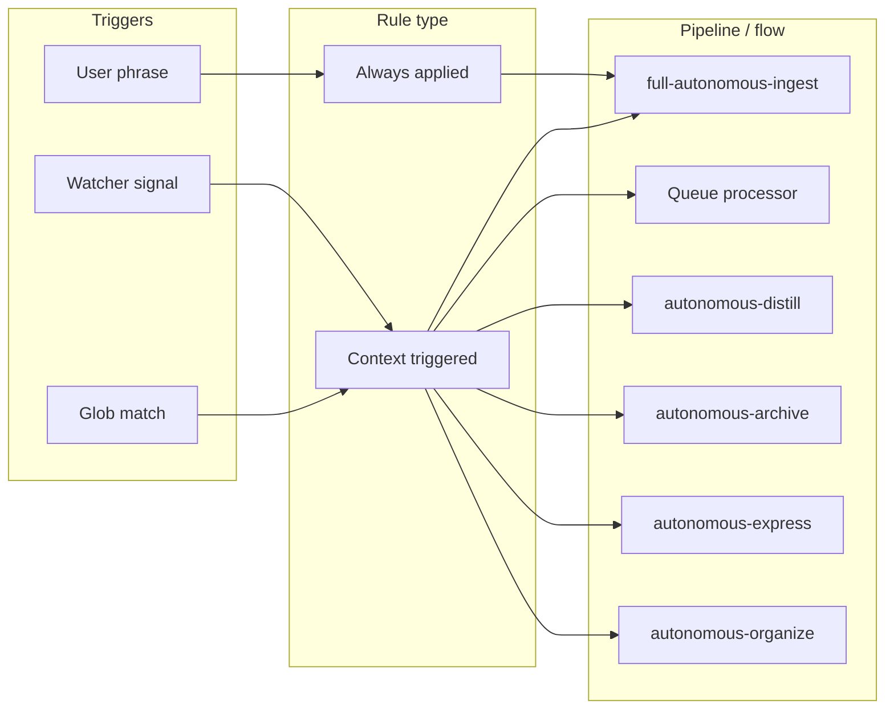
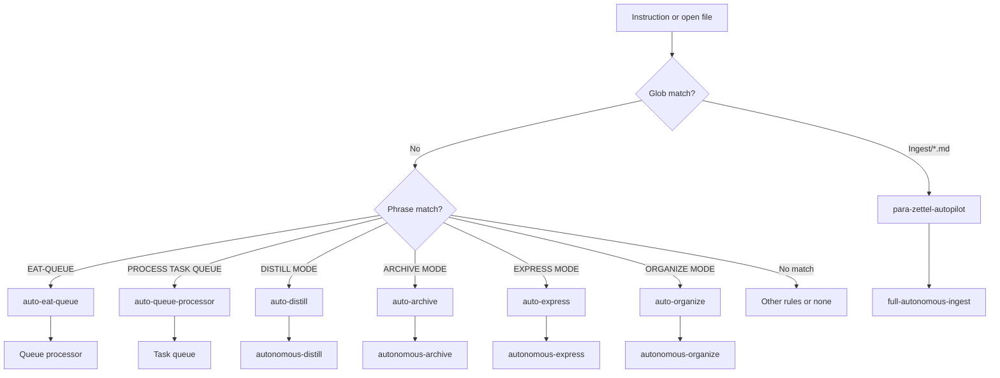

# Second Brain Rules

Map of always-applied and context (triggered) rules. Full text lives in `.cursor/rules/always/*.mdc` and `.cursor/rules/context/*.mdc`; this table is a map only.

## Always-applied

| Rule file | Purpose | Responsibilities |
|-----------|---------|------------------|
| `00-always-core.mdc` | Persona (Thoth-AI), Ingest-first; all new files in Ingest/; frontmatter on every new .md | Persona; ensure all new/unknown files start in Ingest/; frontmatter (created, tags) on every new .md |
| `mcp-obsidian-integration.mdc` | Backups, MCP usage, snapshots, fallbacks; ensure_backup vs create_backup; dry_run before move; post-move frontmatter sync; Error Handling Protocol | Backup/snapshot gates; dry_run before move_note; after move set para-type (and project-id when under 1-Projects/, status: archived when under 4-Archives/) on note at new_path; Error Handling Protocol to Errors.md; fallback table (ensure_structure, propose_alternative_paths backed by ranked PARA proposals from `propose_para_paths`) |
| `second-brain-standards.mdc` | PARA, atomic notes, attachments; frontmatter, tags, `![[5-Attachments/...]]` | PARA structure; atomic notes; attachment syntax; searchable title and tags |
| `confidence-loops.mdc` | Bands 68–84, ≥85, <68; single refinement loop per note; loop_* fields | Define confidence bands; one non-destructive loop in mid-band; loop_* in logs |
| `guidance-aware.mdc` | Guidance-Aware Run Contract; user_guidance + queue prompt as soft hints; **now merges crafted params with user_guidance** | Trigger: approved + user_guidance, or queue prompt + source_file, or #guidance-aware; load guidance; merge with queue/Config params (e.g. rationale_style); pass to classify_para, subfolder-organize, name-enhance, distill_note, split_atomic; length cap 500 words; guidance_conf_boost; never override safety; log guidance_used, guidance_truncated, guidance_ignored |
| `always-ingest-bootstrap.mdc` | INGEST MODE / Process Ingest → full-autonomous-ingest; list Ingest, run pipeline | On INGEST MODE / Process Ingest: list Ingest notes, run full-autonomous-ingest |
| `watcher-result-append.mdc` | Watcher-Result.md contract: requestId, status, message, trace, completed | On run finish (Watcher or EAT-QUEUE): append one line per request to Watcher-Result.md |
| `backbone-docs-sync.mdc` | Backbone docs + sync folder; when rules/skills change, update Second-Brain docs and .cursor/sync | Map changes to Rules/Skills/Pipelines/Logs etc.; sync rules/skills to .cursor/sync/; refresh Mermaid diagrams |

## Context (triggered)

| Rule file | Trigger / glob | Pipeline or flow | Responsibilities |
|-----------|----------------|------------------|------------------|
| `para-zettel-autopilot.mdc` | `Ingest/*.md` | full-autonomous-ingest | When Ingest/*.md open or batch: run full-autonomous-ingest; backup → classify → enrich → … → move → log. Mid/low-confidence or ambiguous cases (ingest_conf < 85 or multiple strong candidates) → **create/update a Decision Wrapper note under Ingest/Decisions/** (required) and set `decision_candidate`, `proposal_path`, and `decision_priority` on the original note; log `#decision-wrapper-created` and stop further ingest steps for that note (no split/distill/move, no `#review-needed`). Wrappers use the Decision-Wrapper template (frontmatter includes both `proposal_path` and `original_path`) and present top candidates as **lettered options A–G** from `propose_para_paths` in `"wrapper"` mode (up to 7 ranked candidates regardless of confidence); the user picks `approved_option` (A–G or 0) or `approved_path` in the wrapper, and the next EAT-QUEUE run uses that decision (and any Thoughts/user_guidance) to continue ingest on the original note. |
| `auto-eat-queue.mdc` | EAT-QUEUE, Process queue, eat cache / EAT-CACHE | Queue processor → dispatch by mode → Watcher-Result | Read queue; validate; dedup/sort; **post-process stabilizer:** when originating note conf ≥ 90%, bump TASK-ROADMAP after ORGANIZE, before DISTILL; dispatch by mode; append Watcher-Result per entry; optional queue-cleanup |
| `auto-queue-processor.mdc` | PROCESS TASK QUEUE | Task/roadmap queue → Task-Queue.md modes | Read Task-Queue.md; dispatch TASK-ROADMAP, TASK-COMPLETE, ADD-ROADMAP-ITEM, etc.; Watcher-Result + Mobile-Pending-Actions |
| `auto-distill.mdc` | DISTILL MODE, distill note/vault | autonomous-distill | Backup/snapshot before structural edits; distill layers → highlight → layer-promote → callout-tldr-wrap; exclude Backups/Logs/Hubs |
| `auto-archive.mdc` | ARCHIVE MODE, archive, #eaten | autonomous-archive | archive-check → subfolder-organize → resurface-mark → summary-preserve → move to 4-Archives/; dry_run then commit; invokes ghost sweep post-moves |
| `auto-express.mdc` | EXPRESS MODE, express note | autonomous-express | version-snapshot → related-content-pull → express-mini-outline → call-to-action-append; exclude Archives/Backups/Versions |
| `auto-organize.mdc` | ORGANIZE MODE, re-organize | autonomous-organize | Re-classify and move within PARA; frontmatter-enrich → subfolder-organize → rename (optional) → move; dry_run then commit |
| `ingest-processing.mdc` | Non-MD in Ingest, embedded normalization | Pre-step before ingest pipeline | Normalize embedded images; create companion .md for non-.md; run before full ingest on Ingest/*.md |
| `non-markdown-handling.mdc` | Non-.md in Ingest | Companion .md; #needs-manual-move | Create companion .md; leave original in Ingest/ with #needs-manual-move; no move_note on binaries |
| `snapshot-sweep.mdc` | Snapshot cleanup / retention | Per-change and batch retention | User-triggered retention/cleanup of Backups/Per-Change and Backups/Batch |
| `auto-restore.mdc` | Restore from snapshot/backup | User-triggered restore | Restore from snapshot or BACKUP_DIR; user-triggered only |
| `auto-resurface.mdc` | Resurface, show resurface candidates | Resurface flow | Surface notes marked resurface-candidate; optional Resurface hub |
| `auto-highlight-perspective.mdc` | HIGHLIGHT PERSPECTIVE: [lens] | Highlight pass with perspective | Set highlight_perspective or queue payload; run distill with perspective so distill-highlight-color uses lens |
| `mobile-seed-detect.mdc` | SEEDED-ENHANCE, "Enhance highlights from seeds" | highlight-seed-enhance | Allow highlight-seed-enhance only when triggered or queued; user <mark> as cores; no auto-run on save |
| `auto-distill-perspective.mdc` | DISTILL LENS: [angle] | Set distill_lens; autonomous-distill | Set distill_lens frontmatter; run autonomous-distill with lens for depth/TL;DR indicators |
| `auto-express-view.mdc` | EXPRESS VIEW: [angle] | Set express_view; autonomous-express | Set express_view frontmatter; run autonomous-express; express-view-layer shapes Related section |
| `auto-async-cascade.mdc` | EAT-QUEUE when queue >3 entries | Propose batch run | Propose batch to Mobile-Pending-Actions; user confirms BATCH-DISTILL/BATCH-EXPRESS |
| `auto-garden-review.mdc` | GARDEN REVIEW, run garden review, orphans and distill candidates, garden health, vault orphans, distill candidates sweep; queue **GARDEN-REVIEW** | Garden review flow | obsidian_garden_review → report → feed to distill/organize batches; params: scope, focus, output_path, auto_apply |
| `auto-curate-cluster.mdc` | CURATE CLUSTER #tag, suggest gaps and merges, cluster curate #tag, theme gaps #tag, merge suggestions; queue **CURATE-CLUSTER** | Curate cluster flow | obsidian_curate_cluster → analyze report (gaps/merges/synthesis); optional split/MOC/merge; params: query, note_list, actions |

## Commander

- **Chat prompts:** Commander macros (e.g. "Craft Chat Prompt", "Craft Ingest Default") can assemble **chat** prompts (paste into Cursor) from config/templates; output is a ready-to-paste string with optional params/guidance. See [[3-Resources/Plugins-Usage/Commander-Plugin-Usage|Commander-Plugin-Usage]] and [[3-Resources/Second-Brain/Chat-Prompts|Chat-Prompts]].

## Usage examples

- **Say "INGEST MODE" or "Process Ingest"** → always-ingest-bootstrap + para-zettel-autopilot apply; agent lists Ingest notes and runs full-autonomous-ingest (backup → classify_para → frontmatter-enrich → subfolder-organize → … → move_note → log_action).
- **Say "EAT-QUEUE" with queue populated** → auto-eat-queue runs; agent reads `.technical/prompt-queue.jsonl` (or EAT-CACHE payload), validates and dedups, dispatches each entry by mode (INGEST MODE, DISTILL MODE, etc.), and appends one line per request to Watcher-Result.md.
- **Open a note in 1-Projects/… and say "DISTILL MODE – safe batch autopilot"** → auto-distill runs autonomous-distill on that note (backup → optional auto-layer-select → distill layers → distill-highlight-color → layer-promote → callout-tldr-wrap → readability-flag).

## Trigger → rule type → pipeline

## Context rule decision flow

## Decision Wrappers as training data

Decision Wrapper notes are treated as **long-lived training artifacts**, not temporary scratch files:

- **Pending** wrappers live under `Ingest/Decisions/**` (e.g. `Ingest-Decisions/`). Pipelines never auto-delete them; they are excluded from ingest/distill/organize/express/archive as primary inputs.
- When `approved: false`, wrappers appear in the **Pending decision** Dataview in the Decision-Wrapper template.
- After apply-mode (user set `approved: true` and EAT-QUEUE ran), the queue processor **moves the wrapper to `4-Archives/Ingest-Decisions/`** (with subfolders mirroring `Ingest/Decisions/**`) so `Ingest/Decisions/**` stays uncluttered. Processed wrappers carry `processed: true` / `used_at: <timestamp>` and are listed in the **Applied (archived)** Dataview in the Decision-Wrapper template.
- **Re-wrap:** When the user sets `re-wrap: true` or checks **option 0** (reject all), EAT-QUEUE Step 0 runs the re-wrap branch: archive the current wrapper to `4-Archives/Ingest-Decisions/Re-Wrap/` (subfolders mirror live structure), then create a **new** wrapper with Thoughts as seed and a link to the archived wrapper; no default `approved_option`/`approved_path` in the template. Watcher syncs checkbox → `approved_option` + `approved_path` only when the user has already set `approved: true`; Watcher never sets `approved: true` or `re-wrap: true`. See Pipelines.md (Decision Wrapper), Logs.md (Wrapper-Sync-Log), Vault-Layout.md (Re-Wrap).
- This keeps wrappers safe to retain indefinitely as labeled examples (original_path, A–G candidates, chosen option, user_guidance) for future model training or analytics; the archive is never re-scanned by step 0.

### Task-Decision wrappers and decision lineage

- **Task-Decision wrappers (`wrapper_type: task-decision`)** are specialized Decision Wrappers used to lock in concrete implementation choices for roadmap phases or tasks (e.g. grid size, difficulty curve, iteration count).
- Recommended frontmatter (on the wrapper):
  - `wrapper_type: task-decision`
  - `target_note`: the phase/task note that should record the final choice.
  - `resolved_choice`: human-readable summary of the chosen option (e.g. `"A (20×20 fixed)"`).
  - `guidance_applied`: short text derived from the wrapper’s Thoughts block explaining why this choice was made.
- **Lineage append step (apply-mode):** when a Task-Decision wrapper is approved and applied, the queue processor (or a dedicated Task-Decision helper) should:
  1. Take a per-change snapshot of `target_note`.
  2. Append a provenance block to `target_note` using `obsidian_update_note`, for example:
     - `> [!done] Resolved via [[Task-Decision-for-Phase-1-Grid-Size-…]] on 2026-03-05`  
     - `> Choice: A (20×20 fixed)`  
     - `> Guidance applied: …`
  3. Set `processed: true` and `used_at` on the Task-Decision wrapper and archive it under an appropriate subfolder such as `4-Archives/Ingest-Decisions/Task-Decisions/`.
- This closes the loop between roadmap/phase configuration and the decisions that set those values, making it easy to audit “why this constant?” later by following the backlink to the Task-Decision wrapper.
