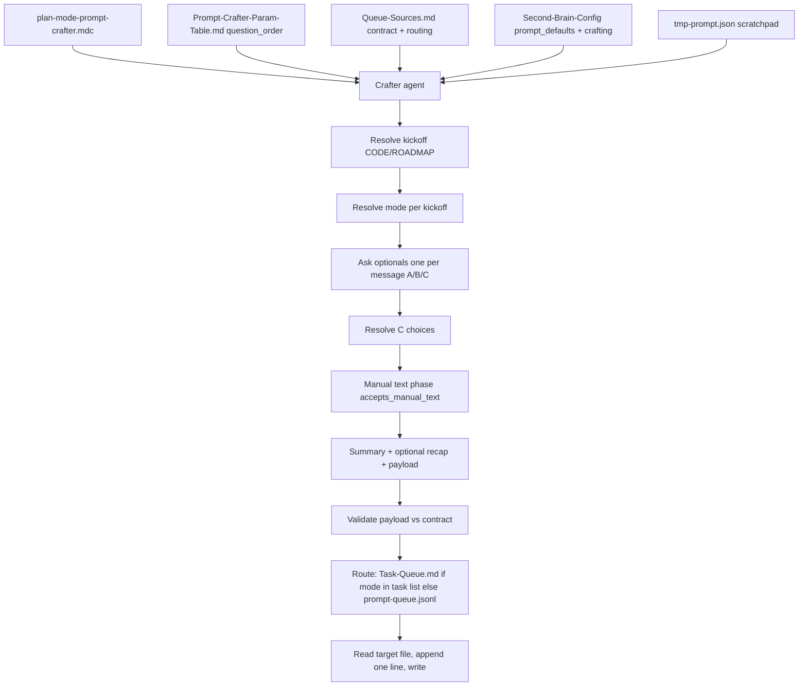
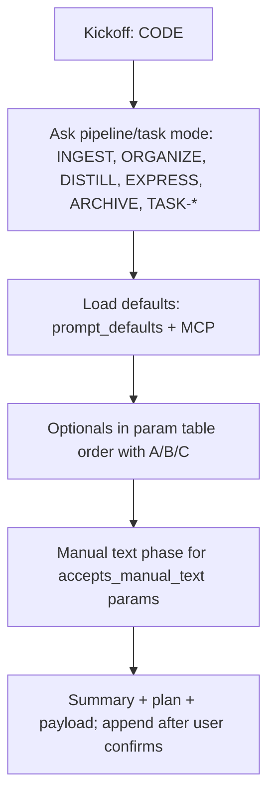
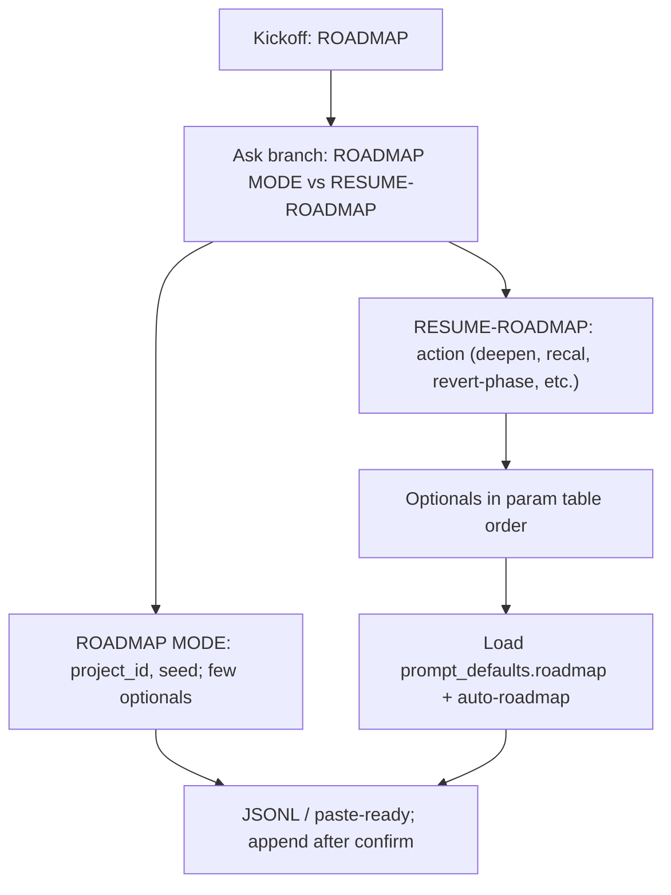

# Prompt-Crafter Structure — Detailed

This document lists every file, field, and rule involved in the prompt-crafter: Config block and keys, each template file and its role, queue payload contract and fallback order, validation rules and allowed enums, auto-eat-queue dispatch and Run steps, confidence-loops and Parameters tunables, and cross-references. Use it to implement or debug param assembly and pass-through.

---

## Question-led prompt crafting entrypoints (Chat/Agent)

Prompt crafting in **Chat or Agent mode** uses exactly **two kickoffs**. The user starts a crafting session with one of:

- **"We are making a CODE prompt"** — Leads to pipeline and task modes: INGEST MODE, ORGANIZE MODE, DISTILL MODE, EXPRESS MODE, ARCHIVE MODE, and task/queue modes (TASK-ROADMAP, TASK-COMPLETE, ADD-ROADMAP-ITEM, etc.). The agent then narrows to a concrete mode and walks through optionals (per [[#2b. Param table (question order and ownership)|param table]] question order) until a full prompt/queue entry is crafted.
- **"We are making a ROADMAP prompt"** — Leads to roadmap flows: **ROADMAP MODE** (setup only: Phase 0 + workflow_state + roadmap-generate-from-outline) and **RESUME-ROADMAP** (single continue entry; params.action: deepen, recal, revert-phase, sync-outputs, handoff-audit, etc.). The agent then branches to setup vs continue and walks through optionals until a full prompt/queue entry is crafted.

**When the user is unclear**: If the user says only **"We are making a prompt"** (or equivalent) without specifying CODE or ROADMAP, the agent **must ask** before proceeding. Put each option on its own line (e.g. "Which kind?" then newline "**A.** CODE …" then "**B.** ROADMAP …"). Do **not** guess kickoff from context. For exact question text and option wording in presentation order, use [[3-Resources/Second-Brain/User-Questions-and-Options-Reference|User-Questions-and-Options-Reference]] §1.

**Funnel**: After kickoff selection (explicit or from clarification), the agent narrows to a concrete mode (e.g. CODE → INGEST MODE, or ROADMAP → RESUME-ROADMAP deepen), then asks optionals in **param table order** (see § 2b). The agent must not skip any question; the authoritative order and list are in User-Questions-and-Options-Reference §1 "Param order by branch". Then runs the **manual text phase** for any params that accept free text. The agent must **not** build a plan or write to the queue until all optionals and the manual text phase are finished; only then may it present summary, optional plan (Q&A + payload at bottom), and append to queue after user confirms. **Scope**: Question-led crafting is **laptop-only**; queue and crafting flows are not driven from mobile (see [[3-Resources/Second-Brain/Queue-Sources|Queue-Sources]] and mobile migration). This question-led crafter is the **primary, preferred entry door** for starting automation runs; direct mode phrases (INGEST MODE, DISTILL MODE, etc.) are treated as **manual/advanced** entry points and are documented in [[3-Resources/Second-Brain/Chat-Prompts|Chat-Prompts]] and [[3-Resources/Second-Brain/Queue-Alias-Table|Queue-Alias-Table]].

**Cross-references**: [[3-Resources/Second-Brain/User-Questions-and-Options-Reference|User-Questions-and-Options-Reference]] §1 (exact question/option wording); [[3-Resources/Second-Brain/Chat-Prompts|Chat-Prompts]] § Plan-mode crafting; [[.cursor/rules/context/auto-roadmap|auto-roadmap]] for ROADMAP two-command funnel; [[3-Resources/Second-Brain/Queue-Sources|Queue-Sources]] RESUME-ROADMAP params; [[3-Resources/Second-Brain/Roadmap-Upgrade-Plan|Roadmap-Upgrade-Plan]].

---

## Question-led prompt crafting architecture (detailed)

Artifacts and data flow for question-led prompt crafting: rule file, param table, Queue-Sources, Config, **tmp-prompt scratchpad**, and queue; valuation and routing; single behavioral write to the queue (read-then-append).

---

## Q&A pattern (question-led, A/B/C and "It does …")

For each optional param or param group, the agent presents **three choices** and always explains what the param does:

- **A** — Yes / include (or first concrete option).
- **B** — No / exclude (or second concrete option).
- **C** — Let AI decide (agent chooses after all other user selections are made, using defaults + context).

**Present options with explanation**: Do **not** ask only "Use this param?" — always add a short **"It does …"** (or "They do …" for groups) so the user can choose informed.

**Question UI (Chat/Agent)**: In Chat or Agent mode, Cursor can show clarifying questions as a **questions box with click-to-answer (A, B, C)**. To trigger this UI: ask **one question per message** and put each option on **its own line** with **real newlines** (not literal `\n`). Do not wrap the question in a code block. One optional per turn; wait for the user to click or reply, then ask the next. Same for kickoff and manual-text phase. Cursor has a known bug (literal `\n` instead of newlines); use plain markdown with real line breaks.

Example (one question per message; options on separate lines):

Include enable_research? **It does:** run external research before deepen and inject results; can fill gaps when util is low.

**A.** yes (explicit on)

**B.** default (omit key)

**C.** AI reasoning (omit + suggest)

**When to offer C**: Offer C for optionals that can be inferred from context (e.g. project_id, phase, depth profile, research on/off). The agent resolves all C choices in a **final pass** after the rest of the Q&A is complete, using Config defaults and context (current file, roadmap state).

**Param grouping**: Use logical blocks — core required, common optionals, advanced optionals. For each optional or group, present A/B/C with a brief "It does …". For option semantics: A = explicit value, B = omit key (Config/MCP default), C = omit key + append short reasoning to **`agent_reasoning`** on the queue payload (and to the scratchpad `agent_reasoning_log`), never to `user_guidance` (see User-Questions-and-Options-Reference §1). Order of questions is fixed per [[3-Resources/Second-Brain/Prompt-Crafter-Param-Table|Prompt-Crafter-Param-Table]] (question_order column).

**Protocol (sequence)** (diagram labels in this doc are abbreviated; actual output uses separate lines per §1): (1) Resolve kickoff — if user said only "We are making a prompt" without CODE/ROADMAP, ask **one question** with each option on its own line: "Which kind?" then **A.** CODE … then **B.** ROADMAP …; do not guess. (2) Load base schema and defaults from [[3-Resources/Second-Brain/Queue-Sources|Queue-Sources]], [[3-Resources/Second-Brain/Parameters|Parameters]], and [[3-Resources/Second-Brain-Config|Second-Brain-Config]]. (3) Show current param block. Step (3) is **not** a substitute for asking; every param in §1 for the current branch is still asked one per message in step (4); do not skip step (4) or any question. (4) Ask optionals in **param table** question_order, **one question per message** (so Cursor shows the question box with clickable A/B/C). Output exactly one question per message; do not include the next question in the same message; wait for the user to answer before sending the next. Put each option (A., B., C.) on its own line. Do not skip any optional; follow §1 Param order by branch for the current branch. Do not create a plan document or `.plan.md` file or append to the queue until steps (4)(5)(6) are complete. (5) Collect C choices and resolve them in a final pass. (6) **Manual text phase** (see below). (7) Present summary for confirmation. (8) Optionally output a plan that lists questions and choices with the crafted payload at the bottom; ask the Final question (User-Questions-and-Options-Reference §1 Message 9: A. yes — append | B. no — cancel | C. AI reasoning). After user confirms (A), append the payload as one line to `.technical/prompt-queue.jsonl` or `3-Resources/Task-Queue.md` as appropriate (see Queue-Sources). No other vault writes in this flow.

**Manual text phase**: Some params accept free-text input (e.g. `user_guidance`, `prompt`, `research_queries`, `userText`, `sectionOrTaskLocator`). When such a param is set to true (included) during the A/B/C loop, do **not** ask for the text yet — user continues to the next question. **After all param optionals are finished**, the agent reprompts: for each param that (a) was set to true and (b) accepts manual text (see param table column `accepts_manual_text`), ask e.g. "What is the [param name]?" with a text input placeholder. Iterate until the agent has **manual confirmation** for every such param. Only then present the final summary and emit the payload.

---

## Param table (question order and ownership)

The question-led crafter uses a **param table** so questions are always in a **predictable order** and ownership is clear. Columns: **param**, **parentage / owner**, **used_by**, **question_order**, **accepts_manual_text**. See the full table and per-kickoff breakdown in [[3-Resources/Second-Brain/Prompt-Crafter-Param-Table|Prompt-Crafter-Param-Table]]. When adding new params to Queue-Sources or Parameters, add a row there with a question_order. The agent (and any future rule/skill) reads the table to determine (1) which params to ask for, (2) in what order, (3) which need a follow-up "What is the [param]?" in the manual text phase.

---

## CODE funnel design

After the user selects **CODE** (or clarifies from "We are making a prompt"):

1. **Ask which pipeline or task mode**: INGEST MODE, ORGANIZE MODE, DISTILL MODE, EXPRESS MODE, ARCHIVE MODE, or task modes (TASK-ROADMAP, TASK-COMPLETE, ADD-ROADMAP-ITEM, EXPAND-ROAD, etc.) per [[3-Resources/Second-Brain/Queue-Alias-Table|Queue-Alias-Table]].
2. **Load defaults**: For the selected sub-mode, load from `prompt_defaults` (ingest, organize) in [[3-Resources/Second-Brain-Config|Second-Brain-Config]] and MCP defaults per [[3-Resources/Second-Brain/MCP-Tools|MCP-Tools]]. Validate assembled params against MCP-Tools (e.g. rationale_style enum, context_mode, max_candidates ranges).
3. **Per-mode optionals** (ask in [[3-Resources/Second-Brain/Prompt-Crafter-Param-Table|param table]] question_order, with "It does …" and A/B/C):
   - **INGEST / ORGANIZE**: context_mode, max_candidates, profile (default / project-priority); C for project_id/source_file when obvious from context.
   - **DISTILL / EXPRESS**: distill_lens, express_view, depth; C for lens/view when inferable.
   - **ARCHIVE**: minimal optionals; C for target path when clear.
   - **Task modes**: task_id, sectionOrTaskLocator, userText as needed; C where inferable.
4. **Output**: After Q&A complete: summary, optional plan (questions/choices + payload at bottom), then **append** one line to prompt-queue.jsonl or Task-Queue.md after user confirms.

---

## ROADMAP funnel design

After the user selects **ROADMAP**:

1. **Ask branch**: ROADMAP MODE (setup only) vs RESUME-ROADMAP (continue).
2. **ROADMAP MODE**: Few optionals — project_id, seed note path; C for project when unambiguous. Load from Config. When the user confirms "Append to queue?" (Y), append the setup payload to `.technical/prompt-queue.jsonl`, commit scratchpad (session complete), then output the **V4 session-end message**: *"Queued successfully to prompt-queue.jsonl. Run **EAT-QUEUE** whenever you're ready to process it. Crafting session complete. If you need another one, just say 'We are making a prompt' again."* **End the session** — no follow-up questions. To craft a RESUME-ROADMAP entry, the user starts a new crafting run and chooses RESUME-ROADMAP. When appending any crafted RESUME-ROADMAP, remove existing RESUME-ROADMAP lines from the queue first (per Queue-Sources § Remove stale on RESUME-ROADMAP append).
3. **RESUME-ROADMAP** (standalone or after setup continuation): (a) **Resume gate (V4):** If scratchpad has prior RESUME session with non-empty `explicit_choices`, show locked-params summary and offer **A** (keep locks and resume) or **B** (discard locks, start fresh). (b) **Profile gate:** Show current `active_profile` and available roadmap profiles; options: keep current | switch profile | default | defer new profile. (c) **Profile change with locks (V4):** If user switches profile while locks exist, compute profile-vs-lock diff using `profile_derived`; show diff list and offer **A** (adopt profile, unlock affected params, re-ask them), **B** (adopt profile but keep current locked values — hybrid; final summary must label "manual override over profile default"), **C** (keep old profile), **D** (manually adjust selected locked params, then adopt profile for the rest). **Lock precedence:** Values in `explicit_choices` always win; never overwrite with profile/Config. See [[3-Resources/Second-Brain/Prompt-Crafter-Implementation-Notes-V4|Prompt-Crafter-Implementation-Notes-V4]] §3. (d) **Action selection** then optionals in **param table** order (phase/target, context/research, depth/branching, profile). (e) Load from `prompt_defaults.roadmap` and profile when set; explicit queue params from Q&A always override. (f) Output: JSONL for prompt-queue; consistent with EAT-CACHE flow.

---

## Config and scratchpad: prompt_defaults and crafting (full)

**File**: `3-Resources/Second-Brain-Config.md`

| Key | Type | Example / notes |
|-----|------|-----------------|
| prompt_defaults.ingest.context_mode | string | strict-para (ingest/wrapper); fallback organize for re-org |
| prompt_defaults.ingest.max_candidates | number | 7 (wrapper must pad to 7 per Pipelines) |
| prompt_defaults.ingest.rationale_style | string | concise (MCP-Tools optional) |
| prompt_defaults.organize.context_mode | string | organize |
| prompt_defaults.organize.max_candidates | number | 5 |
| prompt_defaults.roadmap | object | RESUME-ROADMAP defaults: action (deepen), max_iterations_per_phase (80), granularity, focus, handoff_gate, min_handoff_conf. Merged when mode is RESUME-ROADMAP; Commander "Resume roadmap" / "Recal" / "Revert phase N" build queue entry with mode RESUME-ROADMAP and params.action set. See Queue-Sources § RESUME-ROADMAP params. |
| prompt_defaults.profiles | object | Named overrides, e.g. project-priority: { context_mode: project-strict, max_candidates: 5 }; **deepen-aggressive**: { token_cap: 50000, branch_factor: 4, inject_extra_state: true, max_depth: 4 } — merged when queue entry has params.profile: "deepen-aggressive" or user selects profile. Commander macro **"Craft Deepen Aggressive"** builds RESUME-ROADMAP deepen entry with these params for high-util runs (expect util 45–65%). **V4:** Conceptually roadmap vs CODE profiles are separate; current key is roadmap-only; see Config § Profile namespaces. |
| crafting.tmp_prompt_path | string | `.technical/tmp-prompt.json` — machine-only scratchpad for question-led crafter; schema below (V4 includes profile_info, rail, rail_index). |
| crafting.max_reasoning_sentences | number | 3 — cap on sentences per C-choice reasoning snippet; used when populating `agent_reasoning_log` and queue `agent_reasoning`. |

### Scratchpad schema (V4 — lock-first, conversational-on-rails)

**File**: `crafting.tmp_prompt_path` (e.g. `.technical/tmp-prompt.json`)

| Field | Type | Purpose |
|-------|------|---------|
| session_id | string \| null | Unique id per run; used to detect mid-session restart. |
| mode | string \| null | e.g. "CODE:INGEST", "ROADMAP:RESUME-ROADMAP". |
| rail | array | Ordered list of logical steps (kickoff, gates, param ids) for this branch. |
| rail_index | number | Index of next step to ask; when < rail.length, session is resumable. |
| asked | array | Param ids already surfaced in this session. |
| explicit_choices | object | param → concrete value (user-set or locked). **Lock precedence:** these values must always win over profile/Config in final params. |
| profile_info | object | **active_profile**: string \| null. **profile_derived**: param → boolean (true = value from profile/default; false = manual/lock). Used for profile-change diff and unlock logic; see [[3-Resources/Second-Brain/Prompt-Crafter-Implementation-Notes-V4|Prompt-Crafter-Implementation-Notes-V4]] §2. |
| agent_reasoning_log | array | { param, text } for C-path reasoning. |
| final_payload_draft | object | In-progress mode + params. |

**Mid-session restart:** If valid scratchpad exists and rail_index < rail.length, offer: resume | start fresh | show summary. If start fresh, do not overwrite scratchpad until the new run completes or is explicitly cancelled; never blend sessions. See Implementation Notes V4 §4.

Safety note (in Config or Configs.md): Non-destructive defaults only; params influence proposals but require approved: true for any move/rename per Pipelines § Phase 2. No auto-approval injection.

**Pre-check**: If MCP contracts change (e.g. new param like min_score_threshold in x_semantic_search per MCP-Tools), add to prompt_defaults validation set. Run health_check (per Logs § Health check flow) post-sync.

---

## Template files (full)

**Location**: `Templates/Prompt-Components/`

| File | Content / role |
|------|----------------|
| **Base-Prompt.md** | Assembly-order comment: "# Order: Config defaults → Param-Overrides → Guidance-Default → Validation-Snippet." Canonical trigger placeholder {mode} from Pipelines fixed list. |
| **Param-Defaults.md** | Placeholders {{prompt_defaults.ingest.context_mode}}, etc. Optional Templater dynamic: {{tp.file.content \| yaml_load \| get('prompt_defaults.ingest.context_mode')}}. Validation snippet: max_candidates ≤10 (MCP limit per MCP-Tools). |
| **Param-Overrides.md** | References Config profiles; user-selectable; merge over pipeline default when profile chosen. |
| **Guidance-Default.md** | Fixed string: use note user_guidance when present; else queue prompt; apply guidance_conf_boost if set; do not override user_guidance. |
| **Error-Handling-Template.md** | If invalid: log to Errors.md with trace per mcp-obsidian-integration. |
| **Skill-Chain.md** | Optional; list skills valid for pipeline per Cursor-Skill-Pipelines-Reference. |

Templates.md documents flow and assembly order; no mobile-specific components.

---

## Queue payload and fallback (full)

**File**: `3-Resources/Second-Brain/Queue-Sources.md`

- **Optional field**: `params` (object) on a queue entry. Example: `{"mode":"INGEST MODE","source_file":"Ingest/Note.md","id":"req-1","params":{"context_mode":"strict-para","max_candidates":7}}`.
- **Fallback order**: 1. Queue entry params 2. user_guidance frontmatter (merge) 3. Config prompt_defaults/profiles 4. MCP tool defaults (e.g. max_candidates: 3 per MCP-Tools).
- **Contract validation**: EAT-QUEUE rejects invalid params pre-dispatch (e.g. rationale_style not in ['concise','detailed','bullet','technical'] per MCP-Tools); append to Errors.md.

**File**: `.cursor/rules/context/auto-eat-queue.mdc`

- **Step 5 (Dispatch)** — Before running a pipeline for an entry with `params`: merge per fallback chain; validate merged params against MCP-Tools.md (rationale_style enum; context_mode and max_candidates ranges). If invalid: skip dispatch, append to 3-Resources/Errors.md, append failure to Watcher-Result, continue. If valid: pass merged params into pipeline context.
- **Step 6 (Run)** — Guidance-aware merge: append user_guidance text to rationale_style if compatible; log full merged params to Prompt-Log.md. Do not override user_guidance.

---

## Validation rules (MCP-Tools alignment)

| Param | Allowed / contract |
|-------|---------------------|
| context_mode | wrapper, midband, organize, fallback (propose_para_paths); pipeline-specific (e.g. strict-para for ingest). |
| rationale_style | concise, detailed, bullet, technical (MCP-Tools); default concise when omitted. |
| max_candidates | string "3"–"8" in MCP; doc validation max_candidates ≤10; wrapper uses 7. |

Unknown keys: ignore or log per Error Handling Protocol. Unhandled params → Errors.md.

---

## Confidence and Parameters (full)

- **confidence-loops.mdc**: Optional **crafted-params bump** — when crafted params used, add +5% (or configured value) to pre_loop_conf floor; tunable via Parameters.md (e.g. crafted_params_conf_boost: 5); default 0 if unset.
- **Parameters.md**: crafted_params_conf_boost (0–10); prompt_defaults read by prompt-crafter and rules for MCP pass-through; queue payload overrides take precedence.
- **Pipelines.md**: Param'd MCP calls — always ensure_backup (or create_backup) before any MCP call that uses queue params or prompt-crafter output.

---

## Prompt-Log structure (full)

**File**: `3-Resources/Prompt-Log.md`

| Field | Description |
|-------|-------------|
| timestamp | ISO 8601 or YYYY-MM-DD HH:MM |
| pipeline | mode (e.g. INGEST MODE, ORGANIZE MODE) |
| params | Params as used (merged from queue + user_guidance + Config) |
| source | macro \| default |
| outcome | valid \| invalid |
| merge_trace | Optional; when guidance-aware merge applied |

Append per craft or per EAT-QUEUE when params are merged/validated. Logs.md row: Prompt-Log \| Crafted/merged params, validation outcome, merge trace \| Append per craft/EAT-QUEUE; Dataview aggregate in Vault-Change-Monitor MOC for "crafted runs this week."

---

## Skills and backbone (full)

- **Skills.md**: Row "prompt-crafter \| Assemble/validate params \| Used in ingest/organize pipelines; slots before classify_para" (doc-only; optional skill implementation follow-up).
- **Responsibilities-Breakdown.md**: prompt-crafter \| Assemble/inject params \| Config read, template concat, queue append; owns validation but delegates MCP calls.
- **Backbone.md** § Stack: Prompt-Crafter — Laptop layer for MCP param assembly from config/templates; stabilizes ingest/organize via defaults and validation.
- **Rules.md** § Always-applied: guidance-aware — now merges crafted params with user_guidance.
- **MCP-Tools.md**: propose_para_paths — rationale_style optional; defaults to concise.

---

## Examples and validation

Transcript-style examples (CODE → INGEST MODE with user_guidance; ROADMAP → RESUME-ROADMAP deepen with research and C for profile) and C resolution rules: [[3-Resources/Second-Brain/Prompt-Crafter-Examples|Prompt-Crafter-Examples]]. For given A/B/C answers and manual text, the resolved payload must match Queue-Sources and Parameters; see [[3-Resources/Second-Brain/Testing|Testing]] § Fixtures (prompt-crafter).

---

## Failure modes and rollout (tmp-prompt / guidance separation)

- **tmp-prompt.json corrupt or missing keys**: Crafter aborts with a clear error and does not attempt auto-repair; the file must be deleted or fixed manually before the next run. No queue writes occur on an aborted run.
- **tmp-prompt.json missing or empty**: Treated as a fresh session; no sacred manual choices are inferred until the user answers with A for specific params. Behavior falls back to legacy “ask everything” semantics.
- **Legacy queue entries without `agent_reasoning`**: Continue to work as today; guidance-aware runs use `prompt` / `user_guidance` only. New entries from the crafter keep AI reasoning in `agent_reasoning` and out of `user_guidance`.
- **Multiple overlapping crafting sessions (V4)**: When user chooses **start fresh** at mid-session restart, do **not** overwrite the scratchpad until the new run successfully completes or is explicitly cancelled. Never blend old and new session state. See Implementation Notes V4 §4.
- **Rollout recommendation**: Start by crafting RESUME-ROADMAP prompts for a single test project, verifying that locks persist (lock precedence), profile-change options A–D work, and that B/C choices are re-checked with fresh reasoning. Only after this is stable should broader ROADMAP and CODE flows rely on tmp-prompt-backed state.

---

## Cross-references

- Config and consumers: [[Configs]], [[Parameters]]
- Queue and dispatch: [[Queue-Sources]], [[.cursor/rules/context/auto-eat-queue|auto-eat-queue]]
- **V4 lock-first, resume gate, session safety**: [[3-Resources/Second-Brain/Prompt-Crafter-Implementation-Notes-V4|Prompt-Crafter-Implementation-Notes-V4]]
- Commander: [[3-Resources/Plugins-Usage/Commander-Plugin-Usage|Commander-Plugin-Usage]]
- Templates: [[Templates]], `Templates/Prompt-Components/`
- Logs: [[Logs]], Prompt-Log.md
- Testing: [[Testing]] § Fixtures (prompt-crafter subdir, config.yaml + base-prompt.md = expected-queue.jsonl; integration test pad to 7)
- **Implemented:** `.cursor/rules/context/plan-mode-prompt-crafter.mdc` encodes the two-kickoff funnel and A/B/C loop (read param table, ask in order, resolve C, manual text phase, emit payload). See Rules.md context table.
