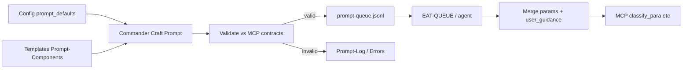
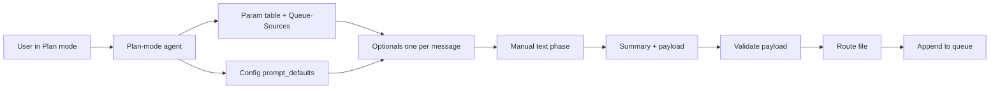

# Prompt-Crafter Structure — High-Level

This document shows the big picture of the **prompt-crafter** (laptop-only): a layer that assembles MCP params from config and templates so ingest and organize runs use pinned, consistent params—reducing path flips and variance. It answers "where do crafted params come from and how do they reach MCP?" without listing every file or field.

---

## What the prompt-crafter is

- **Purpose**: Stabilize MCP calls (e.g. `classify_para`, `propose_para_paths`) by providing **canonical defaults** and **validation** upstream of EAT-QUEUE. Params influence proposals and path quality; they do **not** auto-approve moves—approved: true remains required per Pipelines § Phase 2.
- **Scope**: Laptop/desktop only. No mobile toolbar, Mobile-Pending-Actions, or device-specific visibility.
- **Consumers**: Rules (e.g. para-zettel-autopilot, auto-eat-queue), Commander macros (Craft Prompt, Craft and Queue), and the queue payload when the user or macro appends an entry with a `params` object.

---

## Four pillars

1. **Config** — [[3-Resources/Second-Brain-Config|Second-Brain-Config]] `prompt_defaults`: per-pipeline blocks (ingest, organize) and **profiles** (e.g. project-priority) for named overrides. Single source of truth; queue payload overrides take precedence.
2. **Templates** — `Templates/Prompt-Components/`: Base-Prompt (canonical trigger), Param-Defaults (Templater placeholders), Param-Overrides (profiles), Guidance-Default (guidance-aware string), Error-Handling snippet. Assembly order: Config defaults → Param-Overrides → Guidance-Default → Validation-Snippet.
3. **Queue** — Optional `params` on a queue entry; fallback chain (queue → user_guidance merge → Config → MCP defaults). EAT-QUEUE validates against [[3-Resources/Second-Brain/MCP-Tools|MCP-Tools]] before dispatch; invalid params are rejected and logged to Errors.md.
4. **Commander** — Macros (Craft Prompt, Preview Assembly, Craft and Queue) for one-click assembly and optional append to `.technical/prompt-queue.jsonl`. Logging via commander_macro (e.g. craft_prompt_ingest, craft_prompt_preview).

---

## End-to-end flow (high-level)

User (or macro) chooses pipeline and profile → Commander assembles from Config + Templates → Validate → valid: append to queue or paste; invalid: abort and log. When EAT-QUEUE runs, agent merges params with user_guidance, then passes merged params to MCP-invoking steps.

---

## Plan-mode architecture (high-level)

Plan-mode path: user starts crafting in Cursor Plan mode; agent uses param table + Queue-Sources + Config; one question per message; then manual text, summary, validate, route, append.

---

## Safety and invariants

- **Non-destructive defaults** — Params influence proposals only; approved: true required for any move/rename (Pipelines § Phase 2). No auto-approval injection.
- **Validation before use** — EAT-QUEUE rejects invalid params (e.g. rationale_style not in allowed enum) pre-dispatch; append to Errors.md.
- **Backup before param'd MCP** — Pipelines.md: ensure_backup (or create_backup) before any MCP call that uses queue params or prompt-crafter output.

---

## Where things live

- Config: `3-Resources/Second-Brain-Config.md` (prompt_defaults block)
- Templates: `Templates/Prompt-Components/*.md`
- Queue contract and fallback: [[3-Resources/Second-Brain/Queue-Sources|Queue-Sources]]
- Dispatch and validation: [[.cursor/rules/context/auto-eat-queue|auto-eat-queue]] (step 5)
- Commander macro doc: [[3-Resources/Plugins-Usage/Commander-Plugin-Usage|Commander-Plugin-Usage]]
- Prompt-Log: `3-Resources/Prompt-Log.md` (crafted/merged params, validation outcome, merge trace)
