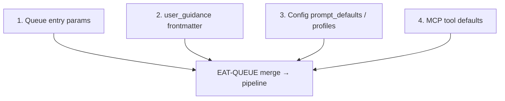
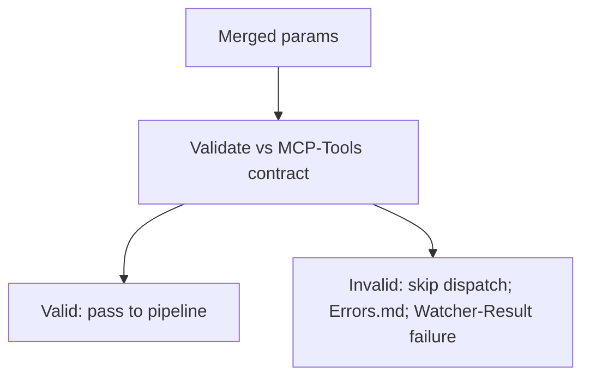
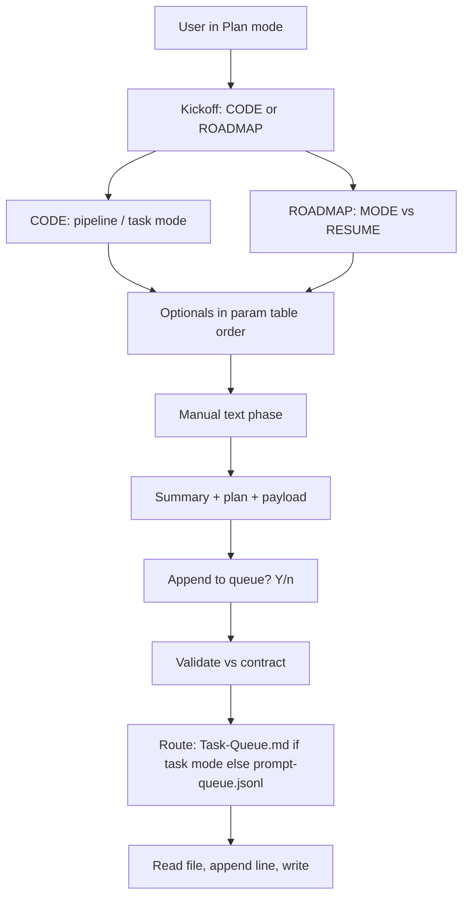

# Prompt-Crafter Structure — Mid-Level

This document adds **prompt_defaults** structure, template components, fallback chain, validation rules, and Commander options. It covers how Config and Templates feed the crafter, how queue params are merged and validated, and how EAT-QUEUE and guidance-aware interact.

---

## prompt_defaults structure (Config)

| Block | Keys | Purpose |
|-------|------|---------|
| **ingest** | context_mode, max_candidates, rationale_style | Defaults for ingest/wrapper; max_candidates: 7 (pad to 7 per Pipelines). |
| **organize** | context_mode, max_candidates | Defaults for re-org; context_mode: organize. |
| **profiles** | Named overrides (e.g. project-priority) | Selectable via Commander macro; fallback to pipeline default. Example: project-priority → context_mode: project-strict, max_candidates: 5. |

Documented in [[3-Resources/Second-Brain/Configs|Configs]] and [[3-Resources/Second-Brain/Parameters|Parameters]]. Safety: non-destructive only; approved: true required for move/rename (Pipelines § Phase 2).

---

## Template components (Templates/Prompt-Components)

| File | Role |
|------|------|
| **Base-Prompt.md** | Canonical trigger only; assembly-order comment: Config defaults → Param-Overrides → Guidance-Default → Validation-Snippet. |
| **Param-Defaults.md** | Templater placeholders from Config (e.g. {{prompt_defaults.ingest.context_mode}}); validation snippet (max_candidates ≤10). |
| **Param-Overrides.md** | User-selectable; references Config profiles. |
| **Guidance-Default.md** | Fixed guidance-aware string (user_guidance when present; queue prompt else; guidance_conf_boost if set). |
| **Error-Handling-Template.md** | If invalid: log to Errors.md with trace per mcp-obsidian-integration. |
| **Skill-Chain.md** | Optional; skills valid for pipeline per Cursor-Skill-Pipelines-Reference. |

Assembly: Base-Prompt → Param-Defaults/Param-Overrides → Guidance-Default → Validation (→ optional Skill-Chain). Documented in [[3-Resources/Second-Brain/Templates|Templates]].

---

## Fallback chain (param precedence)

1. **Queue entry params** — Explicit on the queue line.
2. **user_guidance frontmatter** — Merge (e.g. append to rationale_style if compatible). `user_guidance` remains human-only; AI reasoning from crafter C choices lives in queue `agent_reasoning` and the scratchpad instead.
3. **Config prompt_defaults / profiles** — From Second-Brain-Config for the chosen pipeline or profile.
4. **MCP tool defaults** — e.g. max_candidates: 3 per MCP-Tools when absent.

Documented in [[3-Resources/Second-Brain/Queue-Sources|Queue-Sources]]. EAT-QUEUE (auto-eat-queue step 5 and step 6) applies this order and passes merged params to classify_para, propose_para_paths, subfolder_organize.

---

## Validation (pre-dispatch)

- **Contract**: EAT-QUEUE validates merged params against [[3-Resources/Second-Brain/MCP-Tools|MCP-Tools]] before dispatching (e.g. rationale_style in ['concise','detailed','bullet','technical']; context_mode and max_candidates in allowed ranges).
- **On invalid**: Reject entry; skip dispatch; append to Errors.md per Error Handling Protocol; append failure to Watcher-Result; continue to next entry.
- **On valid**: Pass merged params into pipeline context so MCP-invoking steps receive them.

---

## Commander macro options

| Option | Behavior | commander_macro |
|--------|----------|-----------------|
| **Craft Prompt** | Pipeline + profile picker; assemble; paste to Cursor or temp note. | craft_prompt_ingest (or by pipeline) |
| **Preview Assembly** | Paste crafted prompt to temp note before queue append. | craft_prompt_preview |
| **Craft and Queue** | Append to prompt-queue.jsonl with validated params; if invalid, abort and log to Prompt-Log.md. | (same as Craft Prompt when appending) |

Sub-macros: e.g. "Craft Ingest Default", "Craft Organize Custom" for batch or one-shot. Documented in [[3-Resources/Plugins-Usage/Commander-Plugin-Usage|Commander-Plugin-Usage]].

---

## Plan-mode architecture (mid-level)

Plan-mode: two kickoffs (CODE / ROADMAP), then mode choice, then optionals from param table; routing to prompt-queue.jsonl vs Task-Queue.md by mode; read-then-append.

---

## EAT-QUEUE and guidance-aware merge

- **Merge logic** (guidance-aware): Append user_guidance text to rationale_style if compatible (e.g. "concise + explain rankings"). Do not override user_guidance; inject defaults only where missing.
- **Logging**: Full merged params logged to Prompt-Log.md for audit.
- **Confidence bump** (optional): When crafted params are used, +5% to pre_loop_conf floor (tunable via Parameters; confidence-loops). Stricter params imply higher baseline stability.

---

## Prompt-Log and observability

- **Location**: `3-Resources/Prompt-Log.md`
- **Fields**: timestamp, pipeline/mode, params (as used), source (macro/default), outcome (valid | invalid), merge_trace (when guidance-aware merge applied).
- **Aggregation**: Dataview in [[3-Resources/Vault-Change-Monitor|Vault-Change-Monitor]] MOC for "crafted runs this week." Row in [[3-Resources/Second-Brain/Logs|Logs]].