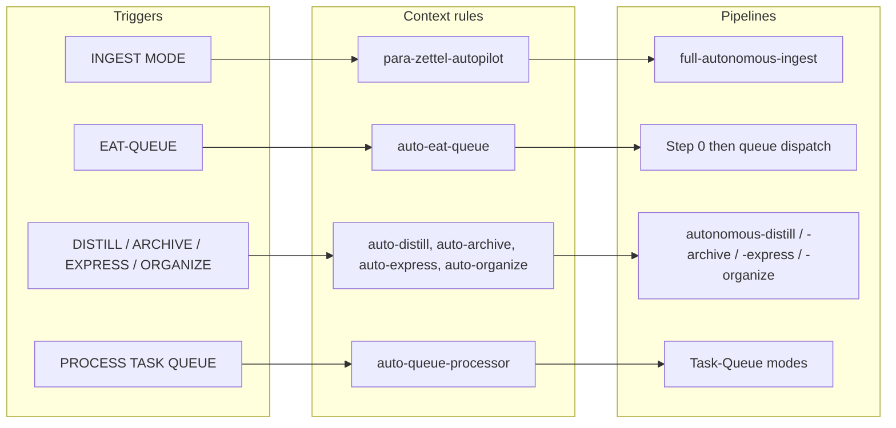
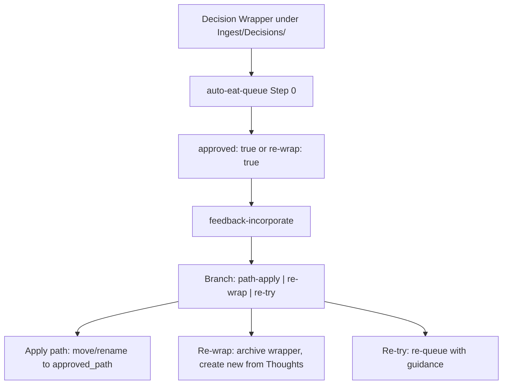
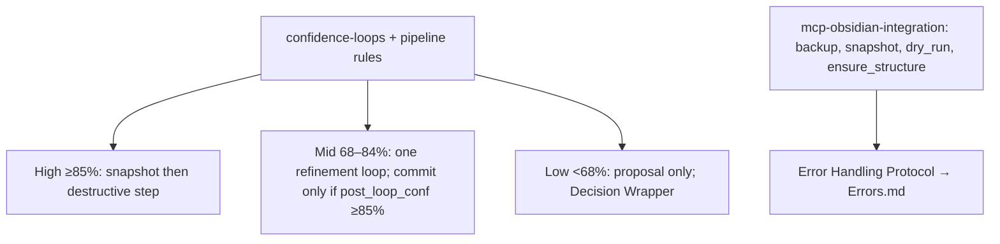

# Rules Structure — Mid-Level

This document adds per-category rule groups, trigger-to-rule mapping, and how each pipeline is governed by always-applied vs context rules. It covers ingest (Phase 1 + Decision Wrapper + Step 0 apply/re-wrap), queue processor, distill/express/archive/organize, lens and view rules, and support rules (ingest pre-step, snapshot, restore, resurface).

---

## Always-applied rules (summary)

| Rule | Role |
|------|------|
| **00-always-core** | Persona (Thoth-AI); all new/unknown files start in Ingest/; frontmatter on every new .md. |
| **mcp-obsidian-integration** | Backup/snapshot gates; dry_run before move_note; ensure_structure before move; Error Handling Protocol to Errors.md; fallback table (propose_alternative_paths, etc.). |
| **second-brain-standards** | PARA; atomic notes; attachment syntax; no blacklisted folder names. |
| **confidence-loops** | Bands (high ≥85%, mid 68–84%, low &lt;68%); single refinement loop in mid-band; when post_loop_conf &lt;85% or low band, create Decision Wrapper in Refinements/ or Low-Confidence/; loop_* in logs. |
| **guidance-aware** | When approved + user_guidance or queue prompt + source_file or #guidance-aware: load guidance; pass to classify_para, subfolder-organize, name-enhance, distill_note, split_atomic; cap 500 words; never override safety. |
| **always-ingest-bootstrap** | On INGEST MODE / Process Ingest: list Ingest, run full-autonomous-ingest. |
| **watcher-result-append** | On run finish (Watcher or EAT-QUEUE): append one line per request to Watcher-Result.md; when a Decision Wrapper is created, append line with message "created wrapper → Decisions/&lt;subfolder&gt;/&lt;basename&gt;". |
| **backbone-docs-sync** | When rules/skills change: update Second-Brain docs and .cursor/sync. |

---

## Context rules by pipeline

**Ingest**

- **para-zettel-autopilot** — Trigger: Ingest/*.md open or batch, or INGEST MODE (with bootstrap). Pipeline: full-autonomous-ingest. Creates Decision Wrappers for mid/low confidence; wrappers get A–G from propose_para_paths; user picks approved_option or approved_path; apply happens in Step 0 on EAT-QUEUE.
- **ingest-processing** — Pre-step when non-MD in Ingest: normalize embedded images; create companion .md for non-.md; run before full ingest on Ingest/*.md.
- **non-markdown-handling** — Non-.md in Ingest: companion .md; #needs-manual-move; no move_note on binaries.

**Queue**

- **auto-eat-queue** — Trigger: EAT-QUEUE, Process queue, eat cache / EAT-CACHE. Step 0 always runs first: enumerate Ingest/Decisions/ (including Refinements/, Low-Confidence/, Errors/, Roadmap-Decisions/); process approved, re-wrap, or re-try wrappers by wrapper_type (ingest, phase-direction, organize, archive, distill, express, low-confidence, error) per apply-from-wrapper table — path-apply (ingest or phase-direction provenance + comment guidance), re-wrap branch, or re-try branch (re-queue EXPAND-ROAD/TASK-TO-PLAN-PROMPT; cap re_try_max_loops); then read queue, validate, dedup, sort, dispatch by mode (including EXPAND-ROAD, TASK-TO-PLAN-PROMPT, FORCE-WRAPPER); Watcher-Result per entry; optional queue-cleanup.
- **auto-queue-processor** — Trigger: PROCESS TASK QUEUE. Read Task-Queue.md; dispatch TASK-ROADMAP, TASK-COMPLETE, ADD-ROADMAP-ITEM, EXPAND-ROAD, etc.; Watcher-Result + Mobile-Pending-Actions; post-EXPAND-ROAD may create phase-direction wrapper under Roadmap-Decisions/.

**Distill / Express / Archive / Organize**

- **auto-distill** — DISTILL MODE, distill note/vault → autonomous-distill; backup/snapshot before structural edits; exclude Backups/Logs/Hubs.
- **auto-express** — EXPRESS MODE, express note → autonomous-express; version-snapshot, related-content, outline, CTA; exclude Archives/Backups/Versions.
- **auto-archive** — ARCHIVE MODE, archive, #eaten → autonomous-archive; archive-check → subfolder-organize → resurface-mark → summary-preserve → move; dry_run then commit.
- **auto-organize** — ORGANIZE MODE, re-organize → autonomous-organize; re-classify, frontmatter-enrich, subfolder-organize, optional name-enhance; dry_run then commit.

**Lens / view / optional flows**

- **auto-highlight-perspective** — HIGHLIGHT PERSPECTIVE: [lens] → set highlight_perspective or queue payload; run distill with perspective.
- **auto-distill-perspective** — DISTILL LENS: [angle] → set distill_lens; run autonomous-distill with lens.
- **auto-express-view** — EXPRESS VIEW: [angle] → set express_view; run autonomous-express; express-view-layer shapes Related.
- **mobile-seed-detect** — SEEDED-ENHANCE, "Enhance highlights from seeds" → highlight-seed-enhance only when triggered or queued; no auto-run on save.
- **auto-async-cascade** — EAT-QUEUE when queue &gt;3 entries → propose batch to Mobile-Pending-Actions; user confirms BATCH-DISTILL/BATCH-EXPRESS.

**Support (user-triggered or pre-step)**

- **snapshot-sweep** — Snapshot cleanup/retention; user-triggered.
- **auto-restore** — Restore from snapshot/backup; user-triggered only.
- **auto-resurface** — Resurface, show resurface candidates.

---

## Trigger → rule → pipeline (mid-level)

- **INGEST MODE / Process Ingest** → always-ingest-bootstrap + para-zettel-autopilot → full-autonomous-ingest.
- **EAT-QUEUE / Process queue / eat cache** → auto-eat-queue → Step 0 (wrappers) then queue dispatch by mode → pipelines + Watcher-Result.
- **DISTILL MODE** → auto-distill → autonomous-distill.
- **ARCHIVE MODE** → auto-archive → autonomous-archive.
- **EXPRESS MODE** → auto-express → autonomous-express.
- **ORGANIZE MODE** → auto-organize → autonomous-organize.
- **PROCESS TASK QUEUE** → auto-queue-processor → Task-Queue.md modes.
- **DISTILL LENS: angle** → auto-distill-perspective → autonomous-distill with distill_lens.
- **EXPRESS VIEW: angle** → auto-express-view → autonomous-express with express_view.
- **HIGHLIGHT PERSPECTIVE: lens** → auto-highlight-perspective → highlight pass with perspective.
- **SEEDED-ENHANCE** → mobile-seed-detect → highlight-seed-enhance.

---

## Decision Wrapper and re-wrap (rules involved)

- **Template and safety** — Pipelines and template must not set default approved_option or approved_path. User sets approved: true manually; Watcher only syncs checkbox → approved_option and approved_path when approved: true is already set (see Pipelines.md, template).
- **Step 0 (auto-eat-queue)** — Enumerates Ingest/Decisions/; for each wrapper with approved: true or re-wrap: true and not processed: feedback-incorporate resolves approved_path or re-wrap intent. If re-wrap: true or approved_option: 0 → re-wrap branch (archive to Re-Wrap/, create new wrapper from Thoughts). Else → apply-mode ingest (move/rename to approved_path); then move wrapper to 4-Archives/Ingest-Decisions/.
- **feedback-incorporate (skill)** — Prefer approved_path from frontmatter; fallback parse body for A–G; treat re-wrap: true or approved_option: 0 as no path so Step 0 runs re-wrap branch.

---

## Confidence and safety (which rules enforce)

- **Bands and loop** — confidence-loops (always) + each pipeline rule: high ≥85% → snapshot then destructive step; mid 68–84% → one refinement loop; low &lt;68% → proposal only.
- **Backup / snapshot / dry_run** — mcp-obsidian-integration (always); each pipeline rule references it. ensure_structure before move; dry_run: true then dry_run: false for every move_note.
- **Error Handling Protocol** — mcp-obsidian-integration: trace, summarize, log to Errors.md, reference in pipeline log; severity and #review-needed when needed.
