# Skills Structure — Detailed

This document is the full breakdown: skill-by-skill sequence for ingest, distill, archive, express, and organize (including every listed skill and slot from Cursor-Skill-Pipelines-Reference), exact MCP tool order and params (dry_run pattern, ensure_structure, calibrate_confidence), confidence-band logic with loop_* fields, every documented snapshot trigger, queue dispatch to skill invocation, highlight-flow integration, and error/fallback paths from mcp-obsidian-integration. No steps are invented; all chains match the canonical docs.

---

## Ingest: full skill and MCP sequence (Phase 1)

```mermaid
flowchart LR
  subgraph Bootstrap [Bootstrap]
    L[list_notes Ingest]
    LP[list_projects]
    BP[bootstrap_project_batch optional]
  end
  subgraph Backup [Backup]
    CB[create_backup]
  end
  subgraph Classify [Classify]
    CP[classify_para]
  end
  subgraph Skills1 [Skills]
    FE[frontmatter-enrich]
    NE[name-enhance propose only]
    SO[subfolder-organize]
  end
  subgraph Mid [Mid-band optional]
    SFO[obsidian_subfolder_organize max_candidates]
    CAL[calibrate_confidence]
    VER[verify_classification]
  end
  subgraph Content [Content]
    SA[split_atomic]
    SLP[split_link_preserve]
    DN[distill_note]
    DHC[distill_highlight_color]
    NAE[next_action_extract]
    TR[task_reroute when ≥78% task-like]
  end
  subgraph Hub [Hub]
    MF[manage_frontmatter / manage_tags]
    AH[append_to_hub]
  end
  subgraph Wrapper [Wrapper]
    PP[propose_para_paths context_mode: wrapper max_candidates: 7]
    DW[Create/refresh Decision Wrapper A–G]
  end
  subgraph Log [Log]
    LA[log_action]
  end
  L --> LP --> BP --> CB --> CP --> FE --> NE --> SO
  SO --> Mid
  Mid --> SA --> SLP --> DN --> DHC --> NAE --> TR --> MF --> AH --> PP --> DW --> LA
```

Phase 1: no move_note. Guidance-aware: pass user_guidance (or queue prompt) to classify_para, subfolder-organize, name-enhance, distill_note, split_atomic.

---

## Ingest: snapshot triggers (per Cursor-Skill-Pipelines-Reference)

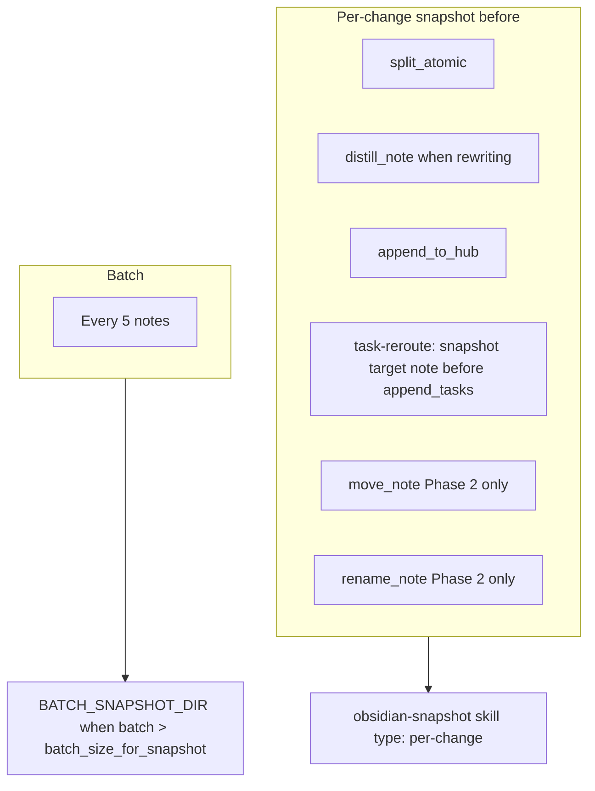

name-enhance in ingest proposes only; subfolder-organize commits name via move in Phase 2.

---

## Distill: full skill sequence with highlight flow

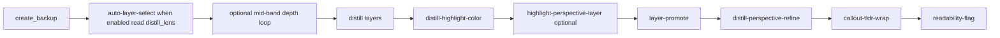

Distill snapshot triggers: before first structural rewrite (distill layers, highlight-perspective-layer, layer-promote, distill-perspective-refine, heavy update_note). Batch: ~every 3 notes.

---

## Archive: full sequence with move flow

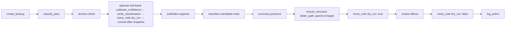

Archive snapshot: after archive-check ≥85% but before subfolder-organize, summary-preserve, move. Batch: once per archive sweep.

---

## Express: full sequence with version-snapshot

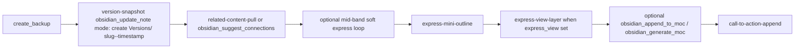

Express snapshot: before large appends (related-content-pull, express-mini-outline, express-view-layer, call-to-action-append); alongside version-snapshot. Batch: optional per batch.

---

## Organize: full sequence with rename optional

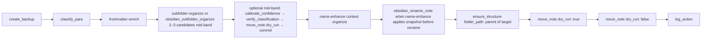

Organize snapshot: before obsidian_rename_note (when name-enhance applies) and before obsidian_move_note when confidence ≥85%. Batch: ~every 3 notes.

---

## MCP move pattern (exact order and params)

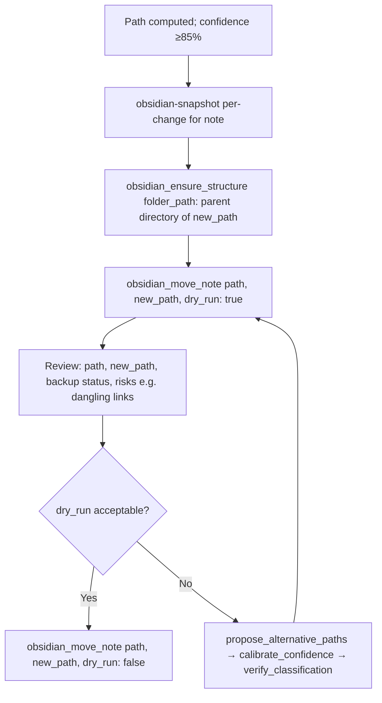

Documented in mcp-obsidian-integration. ensure_structure creates full path recursively with folder_path; move_note does not create parents.

---

## Mid-band fallback chain (move failure or dry_run risk)

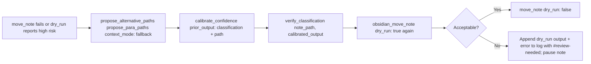

Same chain for ingest, organize, archive; do not duplicate per pipeline (mcp-obsidian-integration).

---

## Confidence band logic with loop_* (all pipelines)

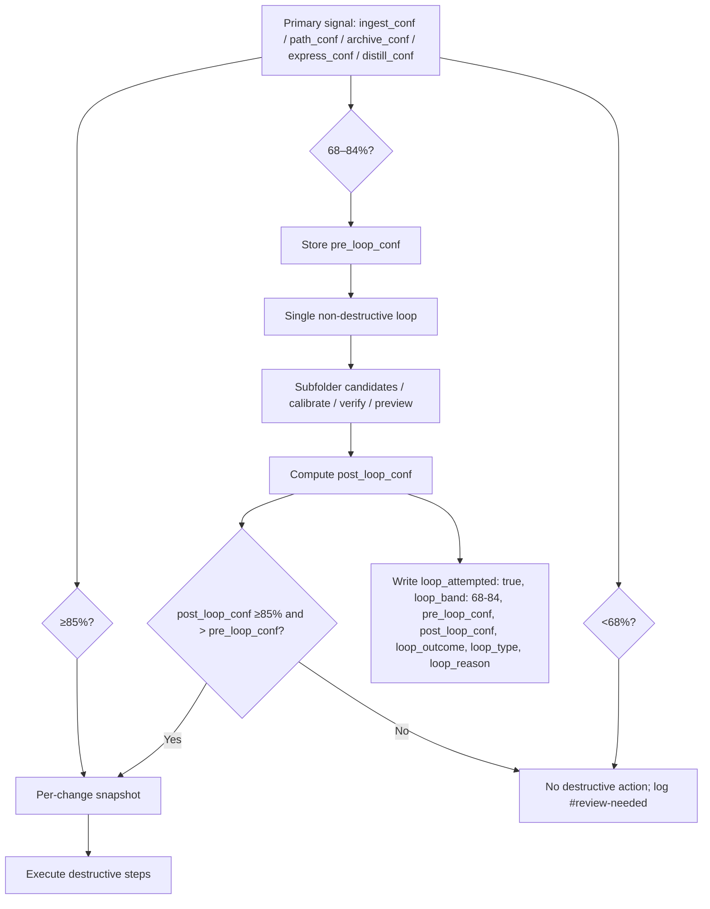

Decay rule: if post_loop_conf ≤ pre_loop_conf, fall back to user decision; no destructive action (confidence-loops).

---

## Snapshot triggers table (all pipelines)

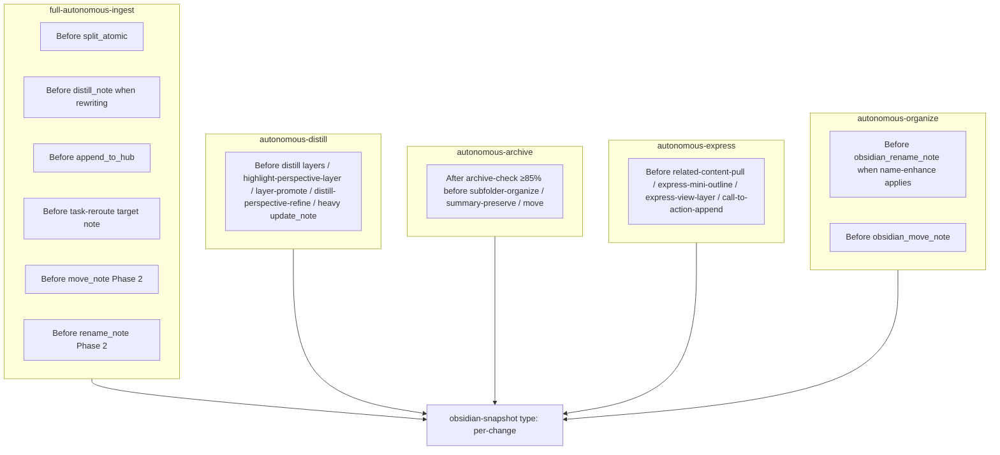

All require confidence ≥85% for the underlying action; else skip snapshot and destructive step, log #review-needed.

---

## Queue dispatch → pipeline → skills

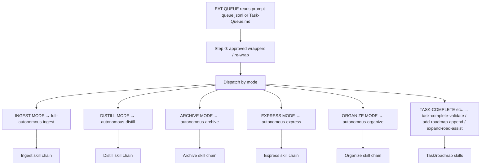

feedback-incorporate at start or re-run: load user_guidance / approved_path for guidance-aware runs.

---

## Highlight flow integration (distill and ingest)

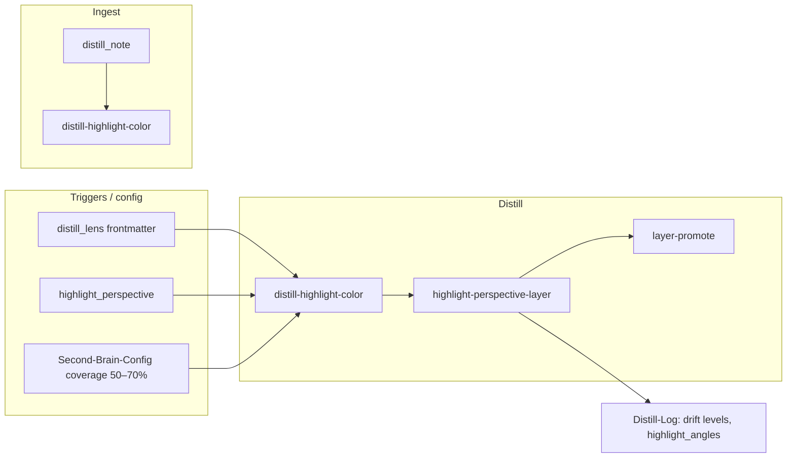

Skills.md: distill-highlight-color after distill_note (ingest) or after distill layers (distill); highlight-perspective-layer after distill-highlight-color; layer-promote after highlight-perspective-layer or distill-highlight-color.

---

## ensure_structure before move (exact param)

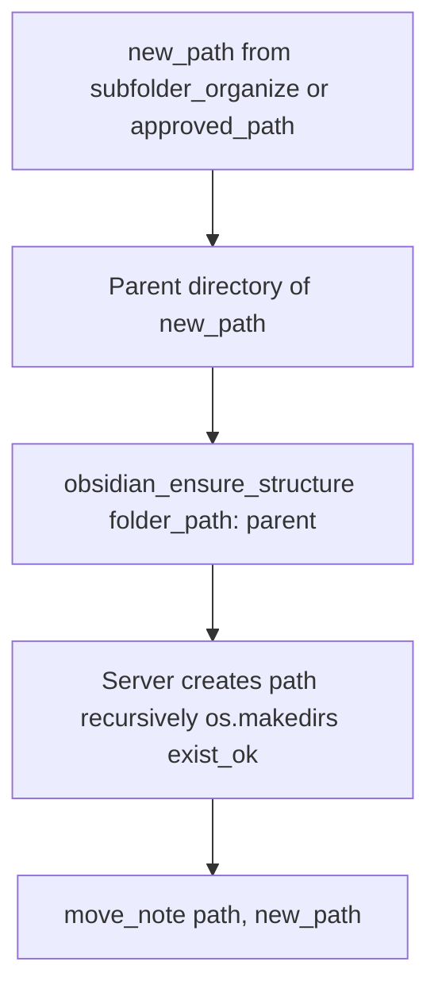

folder_path = parent directory of new_path (e.g. 4-Archives/Project-X-Archive/Subtheme). Without folder_path, only top-level PARA created. Documented mcp-obsidian-integration.

---

## Error handling path (all pipelines)

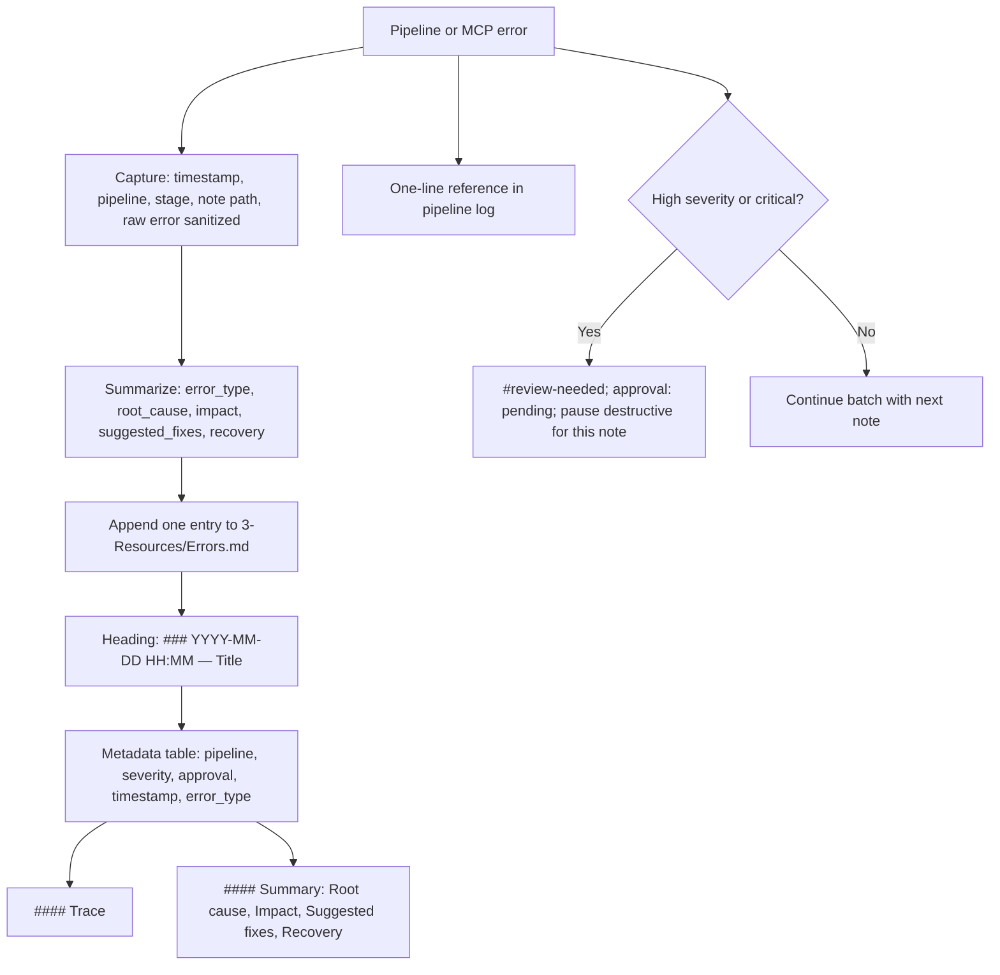

create_backup failure: abort pipeline for that note. Snapshot failure before destructive: skip destructive step, log Backup-Log with #review-needed.

---

## Backup gate (ensure_backup vs create_backup)

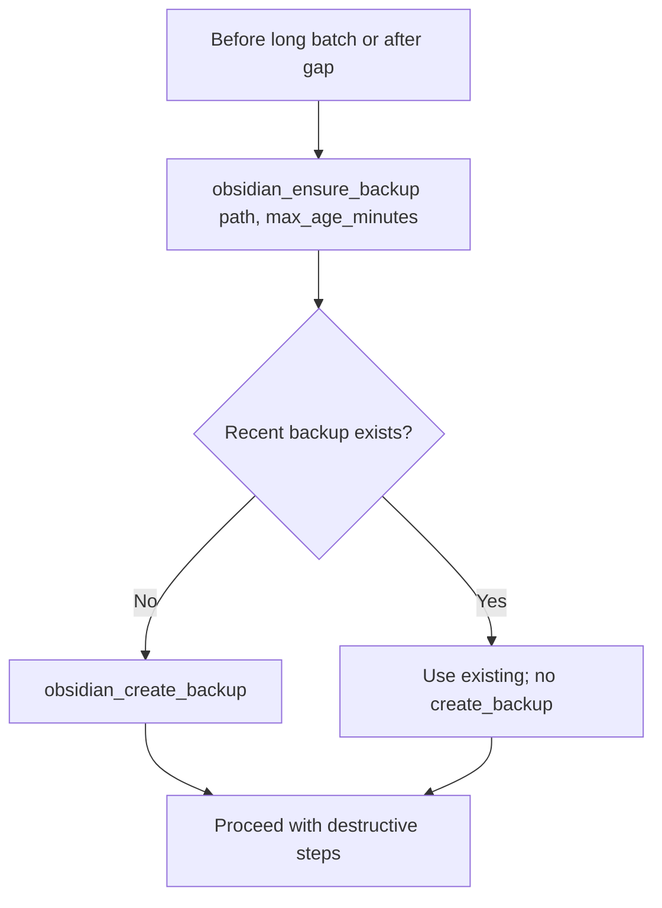

ensure_backup(max_age_minutes e.g. 1440); only call create_backup when ensure_backup indicates needed. Every ingest starts with backup; destructive MCP uses internal ensure_backup gate.
