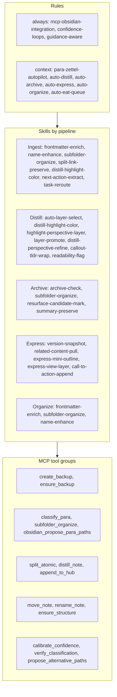
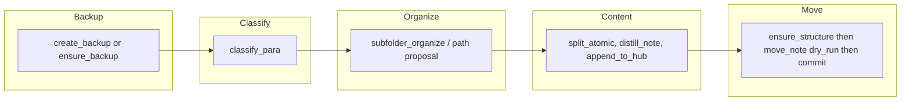
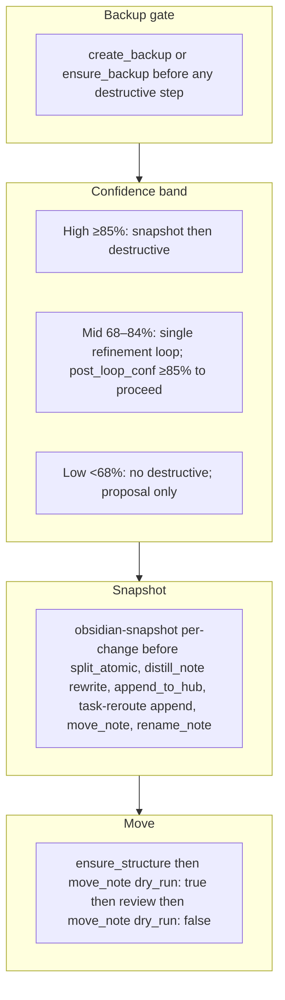
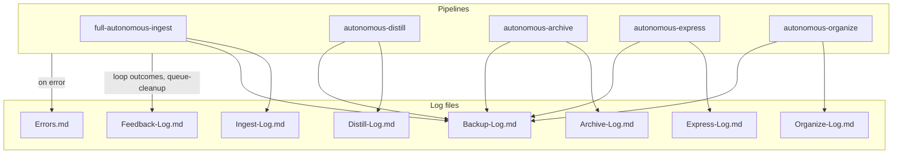
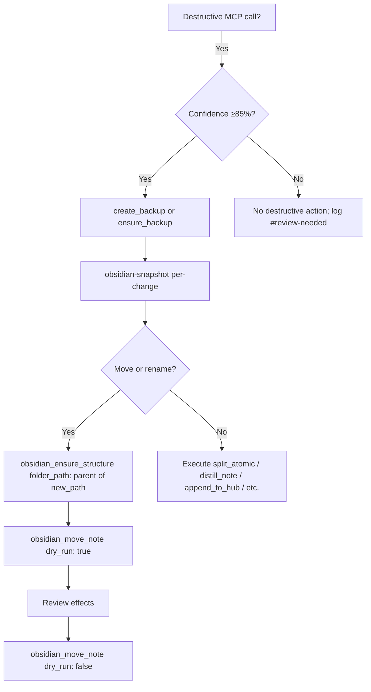

# Skills Structure — High-Level

This document describes the high-level architecture of the Second Brain skill and pipeline stack: major skill groups per pipeline, the canonical MCP flow (backup → classify → organize → content → move), confidence and safety gates, and log destinations. It does not list every skill slot; that is covered in the mid-level and detailed docs.

---

## Overall stack: rules, skills, MCP tools

---

## High-level MCP flow (backup → classify → organize → content → move)

Documented order: backup first; then classify; then path/organize (skills use subfolder_organize or obsidian_propose_para_paths); then content ops (split, distill, append_to_hub); move last with ensure_structure(folder_path: parent) then move_note(dry_run: true) then move_note(dry_run: false).

---

## Confidence and safety gates (high-level)

---

## Pipeline → log destinations

Every pipeline calls obsidian_log_action after processing; include backup_path and snapshot path in changes string. Loop fields (loop_attempted, loop_band, pre_loop_conf, post_loop_conf, loop_outcome, loop_type, loop_reason) written when applicable.

---

## Safety invariant flow (mcp-obsidian-integration)

If create_backup fails: abort pipeline for that note. If move_note fails (e.g. parent missing): ensure_structure then retry. If dry_run shows high risk: propose_alternative_paths → calibrate_confidence → verify_classification → dry_run again → commit or log and pause.
