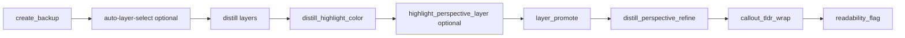
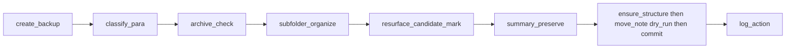
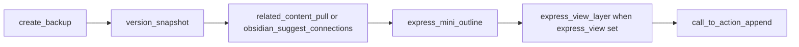
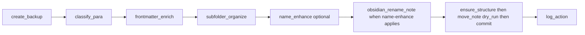
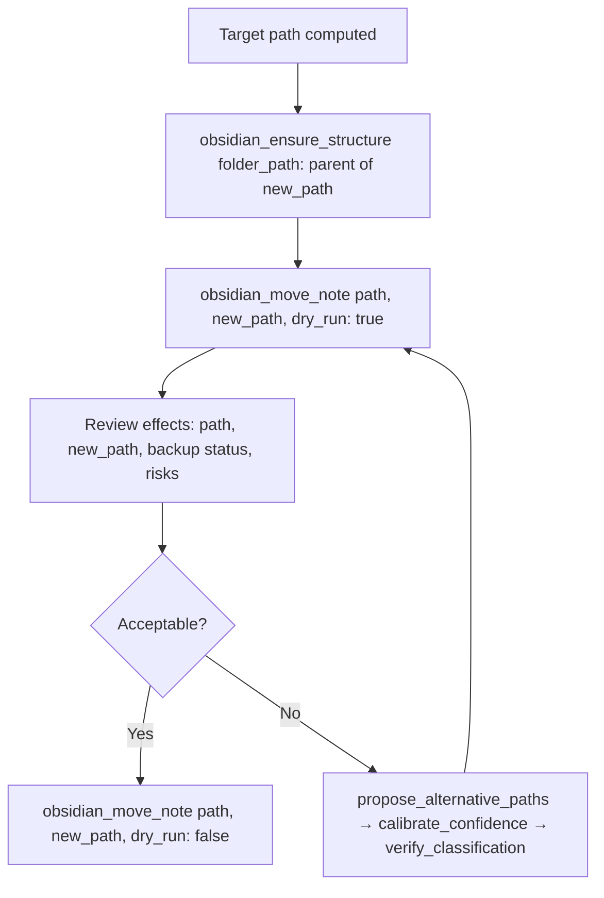
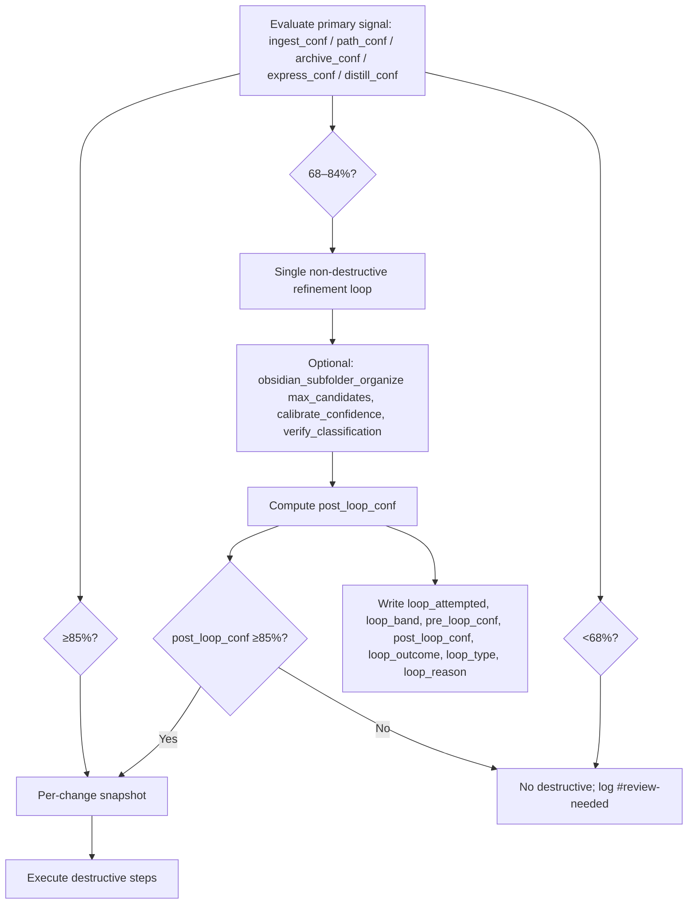
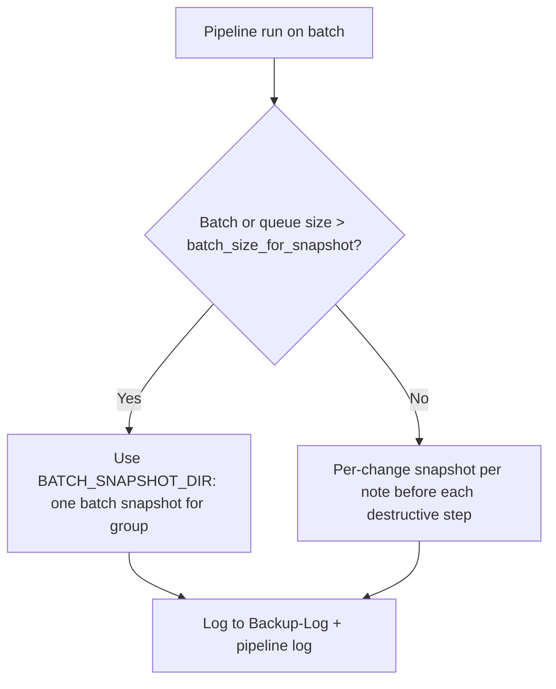
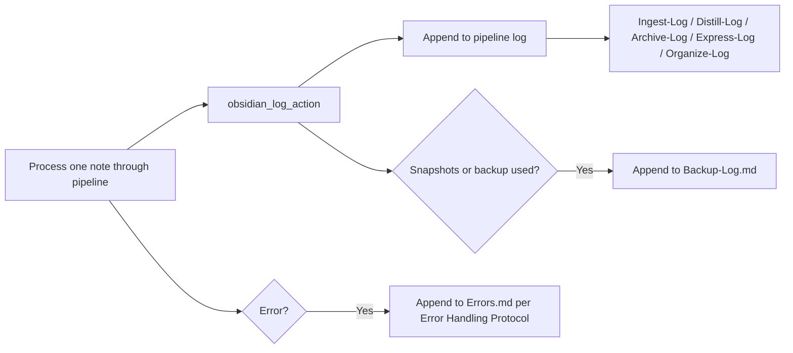

# Skills Structure — Mid-Level

This document builds on the high-level view by adding per-pipeline skill chains with slots (from Cursor-Skill-Pipelines-Reference), key MCP call sequences (e.g. classify_para → subfolder_organize → move_note dry_run), confidence-loop structure, per-change vs batch snapshot usage, and log append points. Skill order and slots are taken from the canonical reference only.

---

## Ingest skill chain (slots from Cursor-Skill-Pipelines-Reference)

```mermaid
flowchart LR
  subgraph Pre [Pre]
    A0[bootstrap_optional]
    A[create_backup]
    B[classify_para]
  end
  subgraph Enrich [Enrich / organize]
    C[frontmatter-enrich]
    N[name_enhance propose only]
    D[subfolder_organize]
  end
  subgraph Content [Content]
    E[split_atomic]
    E2[split_link_preserve]
    F[distill_note]
    G[distill_highlight_color]
    H[next_action_extract]
    I[task_reroute when task-like ≥78%]
    J[append_to_hub]
  end
  subgraph Out [Out]
    K[create/refresh Decision Wrapper]
    L[log_action]
  end
  A0 --> A --> B --> C --> N --> D --> E --> E2 --> F --> G --> H --> I --> J --> K --> L
```

Phase 1: no move_note; Phase 2 apply-mode runs after user approves wrapper (separate run). Slots: frontmatter-enrich after classify_para; name-enhance after frontmatter-enrich; subfolder-organize after name-enhance; split-link-preserve after split_atomic; distill-highlight-color after distill_note; next-action-extract after distill-highlight-color; task-reroute after next-action-extract.

---

## Distill skill chain (slots)

Pipeline order: (backup) → auto-layer-select when enabled → distill layers → distill-highlight-color → highlight-perspective-layer (optional) → layer-promote → distill-perspective-refine → callout-tldr-wrap → readability-flag.

---

## Archive skill chain (slots)

Optional mid-band loop: calibrate_confidence → verify_classification → move_note(dry_run: true) → then commit after snapshot.

---

## Express skill chain (slots)

Optional: obsidian_append_to_moc / obsidian_generate_moc after outline. version-snapshot uses obsidian_update_note(..., mode: "create") for Versions/ path.

---

## Organize skill chain (slots)

Mid-band: obsidian_subfolder_organize for 2–3 candidates → calibrate_confidence → verify_classification → move_note(dry_run: true) → commit.

---

## Key MCP sequence: move path (ensure_structure → dry_run → commit)

Required for every move (ingest apply-mode, archive, organize). Documented in mcp-obsidian-integration.

---

## Confidence loop structure (loop_* fields)

Loop fields written to pipeline log and obsidian_log_action changes string (Logs.md, Cursor-Skill-Pipelines-Reference).

---

## Per-change vs batch snapshot (batch_size_for_snapshot)

batch_size_for_snapshot from Second-Brain-Config (e.g. 5). Ingest: every 5 notes batch; distill/organize: ~every 3 notes; archive: once per sweep; express: optional per batch.

---

## Log append points (after each note)

Log line includes timestamp, pipeline, note path, confidence, actions, backup path, snapshot path(s), flag; plus loop_* when applicable. Include backup_path and snapshot path in log_action changes string (no dedicated param).
