# Second Brain System Diagram — Detailed

This document is the full breakdown: per-pipeline skill chains and slots (from Cursor-Skill-Pipelines-Reference and Skills.md), individual MCP tool calls and key parameters (from MCP-Tools.md), log flows and entry structures (from Logs.md), config consumers (from Configs.md and Second-Brain-Config), queue modes and entry formats (from Queue-Sources and Parameters.md), testing layers (from Testing.md), highlight flows (from Color-Coded-Highlighting.md), naming conventions (from Naming-Conventions.md), and all safety flows (backup/snapshot/dry_run from Rules and Parameters). Mermaid from Backbone, Pipelines, and related docs is included. Use for implementation and debugging.

---

## System flow (from Backbone)

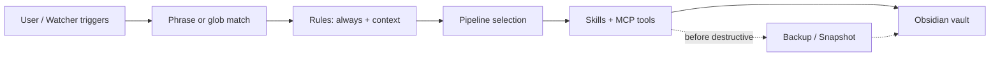

---

## Safety flow (from Backbone)

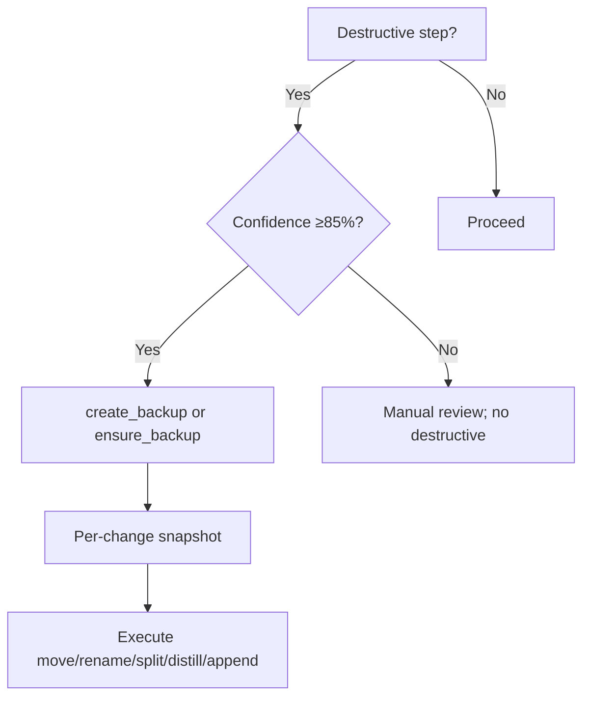

**Invariants:** Never destructive MCP without backup (create_backup or ensure_backup). For move_note: ensure_structure(folder_path: parent of target) then move_note(..., dry_run: true), review effects, then move_note(..., dry_run: false). Per-change snapshot via obsidian-snapshot skill before each destructive step when confidence ≥85%.

---

## Full ingest flowchart (two-phase, Decision Wrapper–gated, from Pipelines)

```mermaid
flowchart TD
  Start[list_notes Ingest]
  Start --> Backup[create_backup]
  Backup --> Bootstrap{Optional bootstrap_project_batch}
  Bootstrap --> Classify[classify_para]
  Classify --> Frontmatter[frontmatter_enrich]
  Frontmatter --> Subfolder[subfolder_organize]
  Subfolder --> ConfGate{ingest_conf?}
  ConfGate -->|"≥85%"| Snap1[Per-change snapshot (in-note)]
  ConfGate -->|"68-84%"| Loop[Self-critique loop]
  ConfGate -->|"<68%"| Wrapper[Decision Wrapper (low-confidence)]
  Loop --> PostConf{post_loop_conf ≥85%?}
  PostConf -->|Yes| Snap1
  PostConf -->|No| Wrapper
  Snap1 --> Split[split_atomic]
  Split --> SplitLink[split_link_preserve]
  SplitLink --> Distill[distill_note]
  Distill --> Highlight[distill_highlight_color]
  Highlight --> NextAct[next_action_extract]
  NextAct --> TaskReroute[task_reroute]
  TaskReroute --> Hub[append_to_hub]
  Hub --> Log[log_action]
  Log --> DecWrap[Create/refresh Decision Wrapper (propose_para_paths max 7 candidates → A–G)]
  DecWrap --> EAT[EAT-QUEUE (wrapper approved?)]
  EAT --> ApplyRun[Apply-mode ingest (Phase 2)]
  ApplyRun --> MoveSnap[Snapshot + dry_run move/rename]
  MoveSnap --> Done[Note in PARA; wrapper logged]
```

---

## Ingest confidence loop (state diagram, from Cursor-Skill-Pipelines-Reference)

```mermaid
flowchart LR
  eval[Evaluate ingest_conf] --> high[High (>=85)]
  eval --> mid[Mid (68-84)]
  eval --> low[Low (<68)]

  high --> snap_ingest[Per-change snapshot]
  snap_ingest --> ingest_actions[Split / distill / hub / move]

  mid --> loop_ingest[Non-destructive self-critique loop]
  loop_ingest --> post_high[post_loop_conf >= 85]
  loop_ingest --> post_low[post_loop_conf < 85 or <= pre_loop_conf]

  post_high --> snap_ingest
  post_low --> manual_ingest[Manual review (no destructive actions)]

  low --> manual_ingest
```

---

## Distill / Archive / Express / Organize (overview, from Pipelines)


---

## Snapshot triggers (per pipeline)

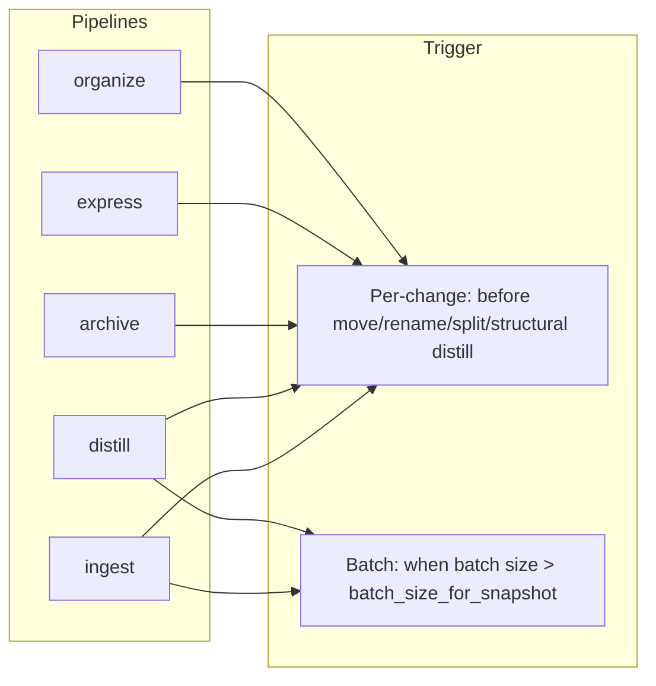

| Pipeline | Per-change triggers | Batch frequency |
|----------|---------------------|------------------|
| full-autonomous-ingest | Before split_atomic, distill_note (rewrite), append_to_hub, task-reroute (target note); Phase 2: before move_note, rename_note | Every 5 notes |
| autonomous-distill | Before first structural rewrite (distill layers, highlight-perspective-layer, layer-promote, distill-perspective-refine, heavy update_note) | ~Every 3 notes |
| autonomous-archive | After archive-check ≥85% but before subfolder-organize, summary-preserve, move | Once per sweep |
| autonomous-express | Before large appends (related-content-pull, express-mini-outline, express-view-layer, call-to-action-append); alongside version-snapshot | Optional per batch |
| autonomous-organize | Before obsidian_rename_note and before obsidian_move_note (when confidence ≥85% for each) | ~Every 3 notes |

batch_size_for_snapshot (from Second-Brain-Config): when queue/batch size > this value, use BATCH_SNAPSHOT_DIR; else per-change only.

---

## MCP tool groups and key parameters (from MCP-Tools)

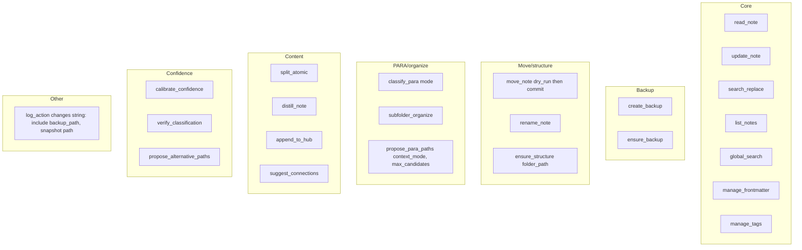

**Key params:** move_note: dry_run (true = preview only; always dry_run first, then commit). update_note: mode overwrite | create (create for new version files; server skips destination backup). ensure_backup: max_age_minutes (e.g. 1440). propose_para_paths: context_mode (wrapper | midband | organize | fallback), max_candidates ("3"–"8").

---

## Log destinations and entry structure (from Logs)

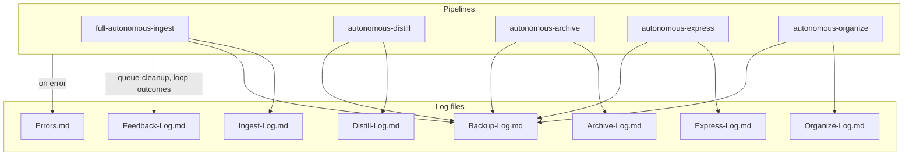

**Log line format:** `YYYY-MM-DD HH:MM | Excerpt: [snippet] | PARA: [type] | Changes: [list; include Backup: [path] when processing] | Confidence: X% | Proposed MV: [path or 'stay'] | Flag: [none or #review-needed + reason] | Loop: [attempted, type, pre, post, outcome, reason]`. **Error entry:** Heading `### YYYY-MM-DD HH:MM — Short Title`; metadata table (pipeline, severity, approval, timestamp, error_type); #### Trace; #### Summary (Root cause, Impact, Suggested fixes, Recovery).

---

## Log → MOC flow (from Logs)

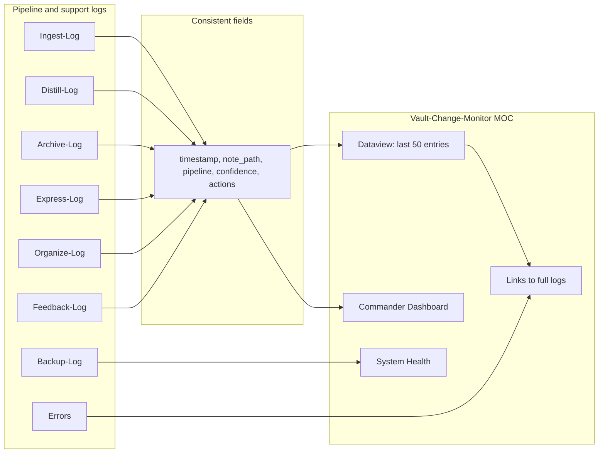

---

## Config sources and consumers (from Configs)

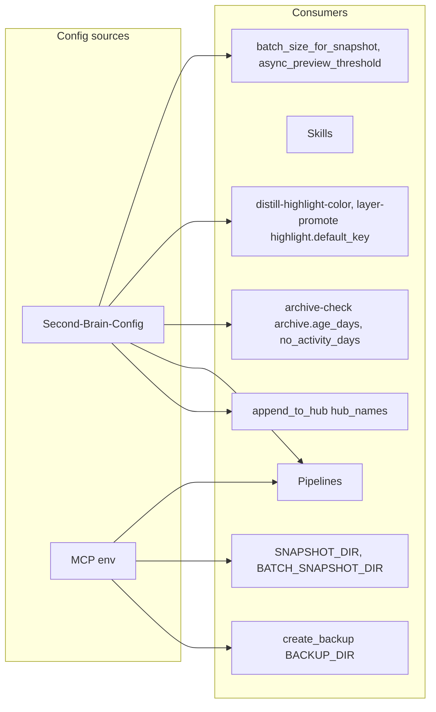

MCP env: OBSIDIAN_API_KEY, OBSIDIAN_REST_URL, OBSIDIAN_VAULT_PATH, BACKUP_DIR, SNAPSHOT_DIR, BATCH_SNAPSHOT_DIR, MAX_BACKUP_AGE_MINUTES.

---

## Queue processor flow (from Queue-Sources)

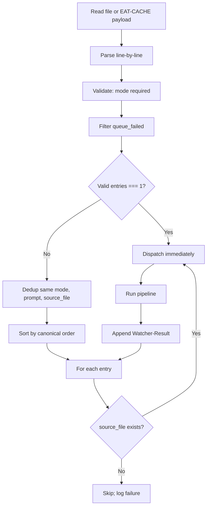

**prompt-queue.jsonl format:** One JSON per line: mode, prompt, source_file, id (requestId). **Canonical order (horizontal):** INGEST → ORGANIZE → TASK-ROADMAP → DISTILL → EXPRESS → ARCHIVE → TASK-COMPLETE → ADD-ROADMAP-ITEM. Task-Queue.md: same line format; modes TASK-ROADMAP, TASK-COMPLETE, ADD-ROADMAP-ITEM, EXPAND-ROAD, etc.

---

## Highlighter flow (from Skills / Color-Coded-Highlighting)

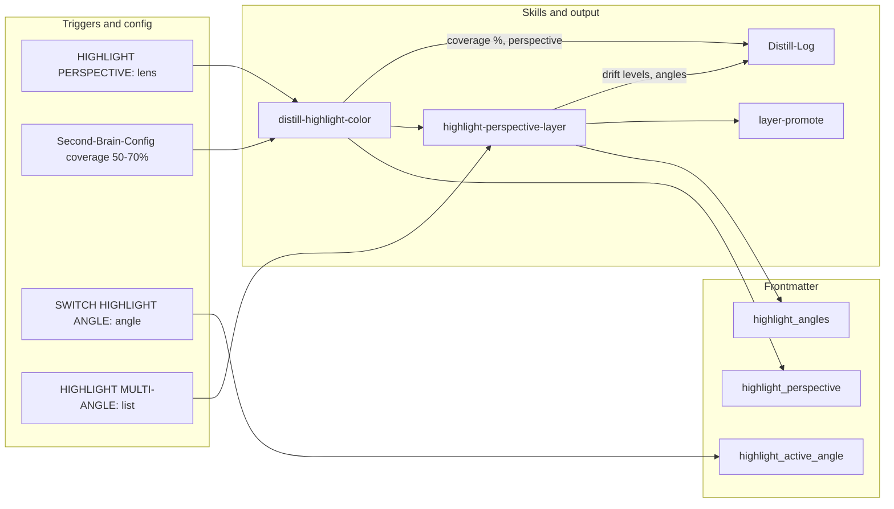

Master key: Highlightr-Color-Key.md; project override: highlight_key. Analogous = related ideas; complementary = contrast/tension.

---

## Naming conventions (from Naming-Conventions)

**Regular notes:** `kebab-slug-YYYY-MM-DD-HHMM.md` — slug first, date and time at end (24h; unknown time → 0000). Slug: max ~60–70 chars, lowercase kebab-case; source priority: first heading > TL;DR > first sentence. **MOCs:** Topic MOC.md; avoid auto-rename. **Hubs:** X Hub.md; excluded from pipelines. **Path segment format** (subfolder-organize, name-enhance): kebab-slug-YYYY-MM-DD-HHMM per Naming-Conventions (date and time at end).

---

## Testing layers (from Testing)

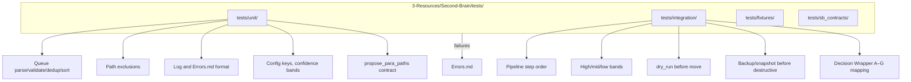

Exclusion: pipelines must not process tests/ as input.

---

## Move fallback and dry_run (from mcp-obsidian-integration)

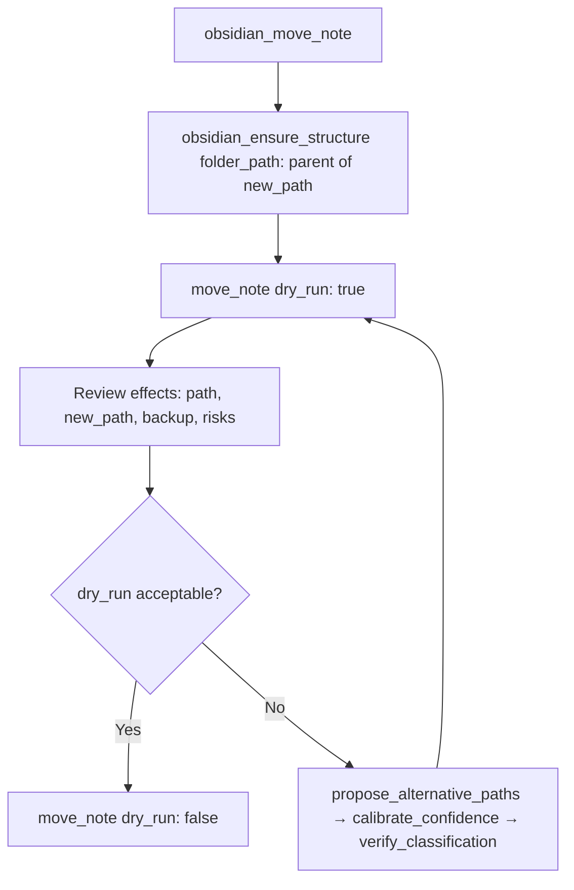

Path before every move: ensure_structure so target parent exists. No move commit without prior successful dry_run review.
