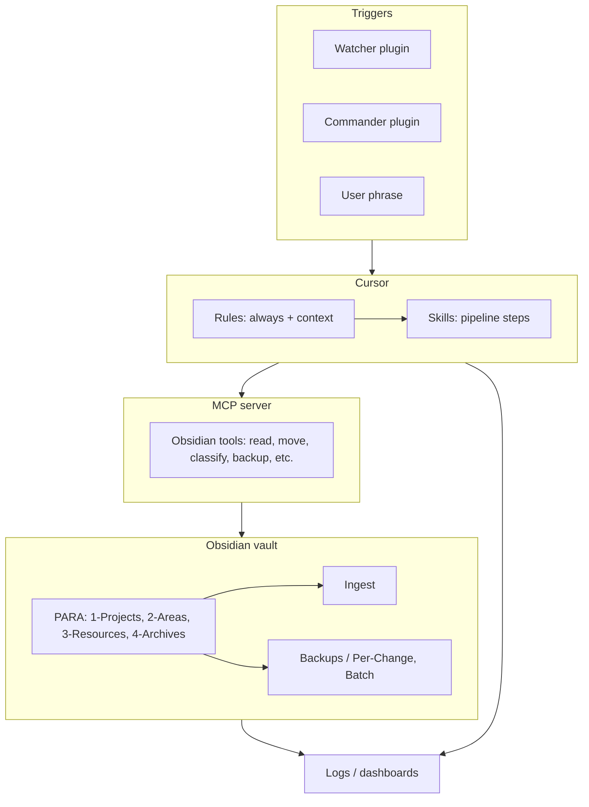
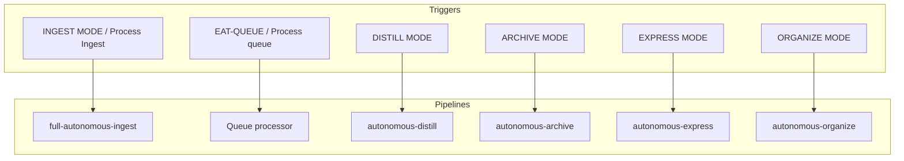
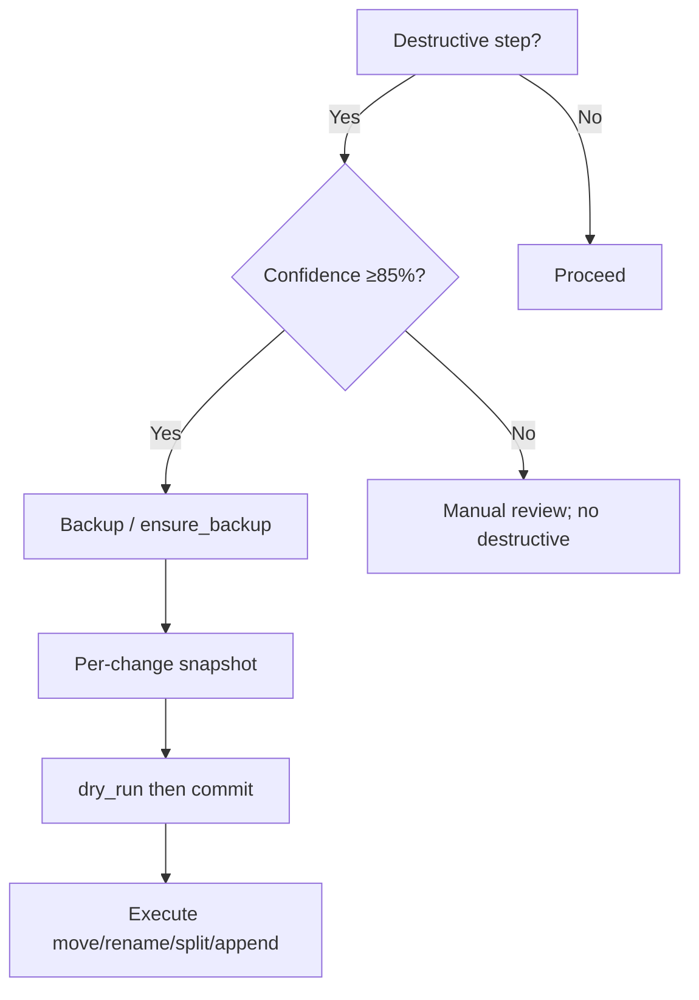
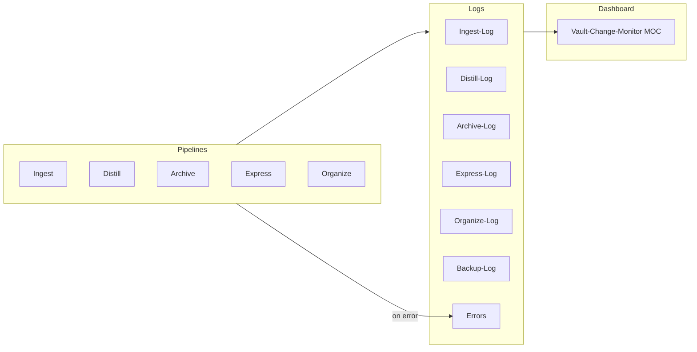

# Second Brain System Diagram — High-Level

This document gives a high-level overview of the Second Brain automation stack. It shows major components (Obsidian vault with PARA layout, Cursor rules and skills, MCP server and tools, Watcher/Commander for triggers and queues, logs and dashboards) and key flows such as capture → ingest pipeline → PARA move, without drilling into individual skills or tool parameters. Use it to orient before reading mid-level and detailed diagrams.

---

## Major components

---

## Capture to PARA flow (high-level)

All new/unknown files land in **Ingest**. Saying **INGEST MODE** or **Process Ingest** runs the full-autonomous-ingest pipeline (classify → enrich → organize → distill → hub → Decision Wrapper in Phase 1; apply-mode move in Phase 2 after user approval). The note ends up in 1-Projects, 2-Areas, or 3-Resources (or stays in Ingest with a Decision Wrapper for manual choice).

---

## Triggers to pipelines

User phrases, Watcher signals, or queue entries match rules and select the pipeline. EAT-QUEUE runs the queue processor, which dispatches by mode to the appropriate pipeline (ingest, distill, archive, etc.).

---

## Safety gates (high-level)

No destructive MCP action runs without backup (create_backup or ensure_backup) and, for moves, dry_run first then commit. Destructive steps are allowed only at high confidence (≥85%) and after a successful per-change snapshot.

---

## Logs and observability

Pipeline runs write to pipeline-specific logs (and Backup-Log when snapshots/backups are involved). Errors go to Errors.md. The Vault-Change-Monitor MOC aggregates recent activity and health.
