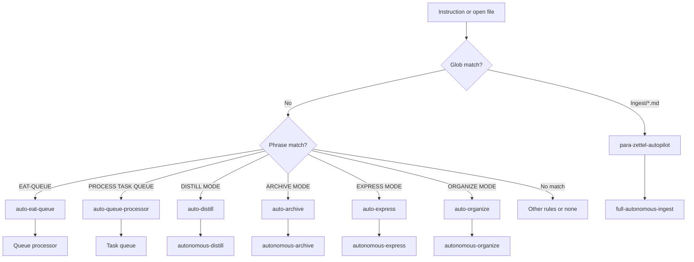
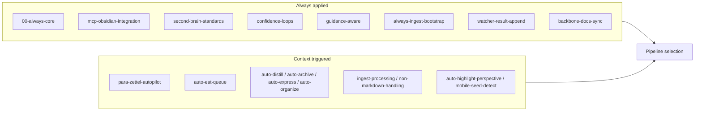
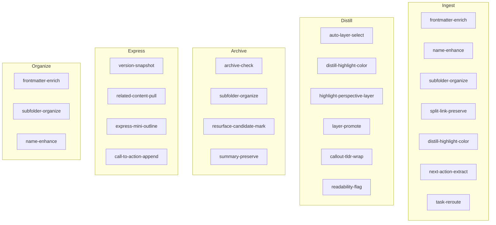
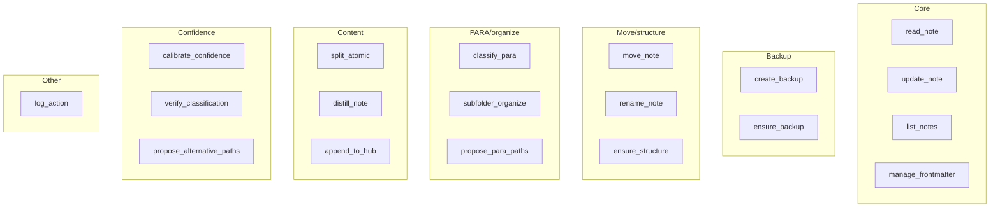
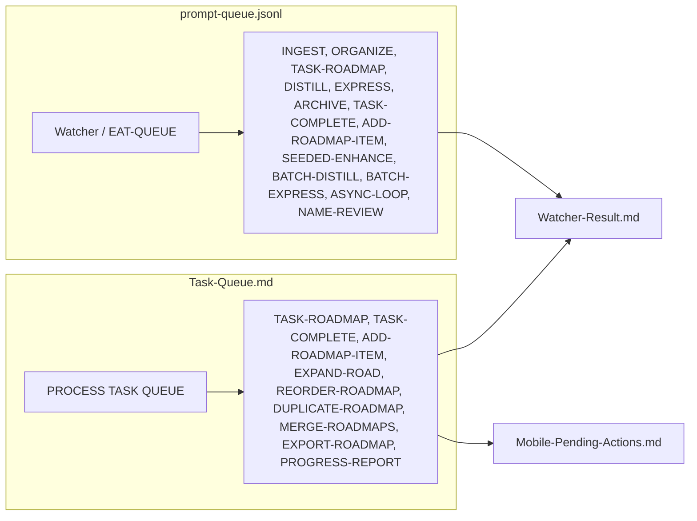
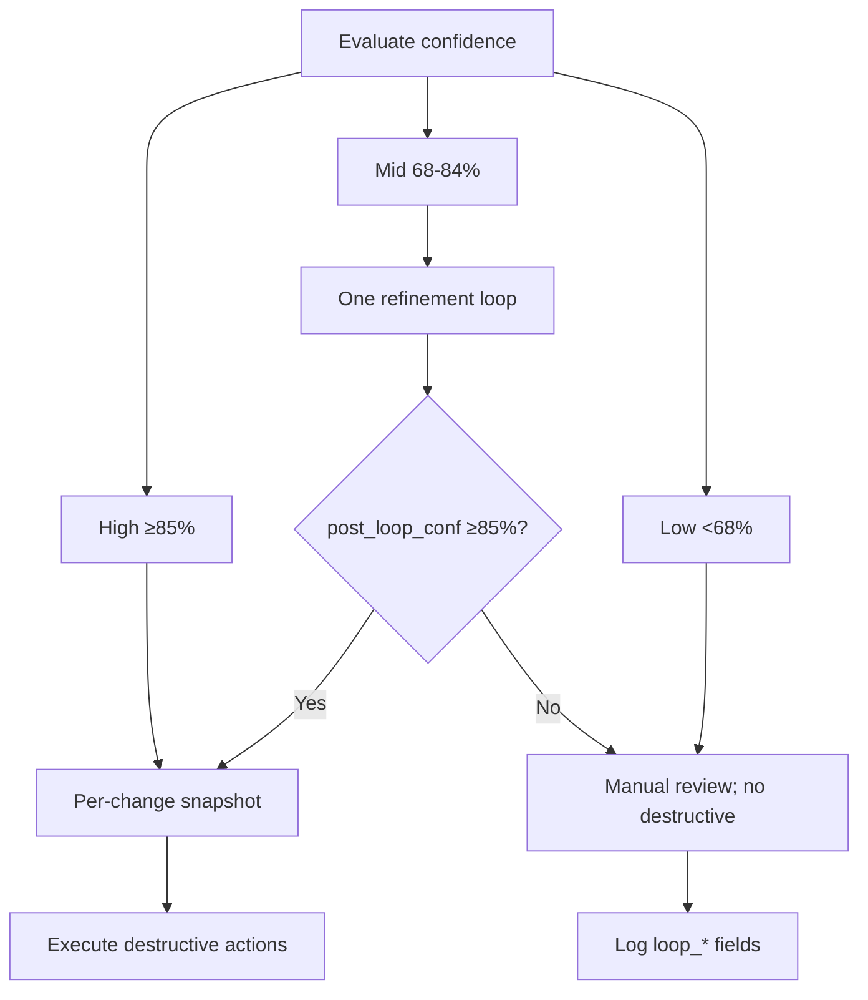
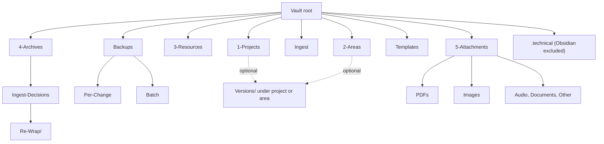

# Second Brain System Diagram — Mid-Level

This document builds on the high-level diagram by adding pipeline mappings (trigger → pipeline from Pipelines.md), rule types (always vs context), skill groups by pipeline (from Skills.md), MCP tool groups (from MCP-Tools.md), queue branches (prompt-queue.jsonl vs Task-Queue.md from Queue-Sources.md), and basic flows such as the ingest skill chain and confidence-band decisions. It also includes the vault folder tree and exclusions. Use it to see how rules, skills, and tools group by pipeline and how queues branch.

---

## Trigger → rule → pipeline mapping

Context rules fire on phrase or glob; always rules (e.g. always-ingest-bootstrap, mcp-obsidian-integration) apply every run.

---

## Rule types: always vs context

Always rules define persona, backup/snapshot/dry_run, PARA standards, confidence bands, and Watcher-Result contract. Context rules map triggers to pipelines (ingest, queue, distill, archive, express, organize).

---

## Skills by pipeline

Skills are chained in order per Cursor-Skill-Pipelines-Reference; shared skills (e.g. frontmatter-enrich, subfolder-organize) appear in multiple pipelines with pipeline-specific slots.

---

## MCP tool groups

Server: obsidian-para-zettel-autopilot. move_note uses dry_run then commit; ensure_structure creates target parent before move.

---

## Queue branches: prompt-queue vs Task-Queue

Location: `.technical/prompt-queue.jsonl` (one JSON object per line; mode, prompt, source_file, id). Task-Queue.md: same line format; task/roadmap modes. Single valid entry → fast-path dispatch without dedup/sort.

---

## Ingest skill chain (simplified)

Phase 1 ends with create/refresh Decision Wrapper (no move); Phase 2 apply-mode (after approved wrapper) runs move/rename with snapshot and dry_run. Moving a skill (e.g. name-enhance) would break path/commit semantics; order is fixed in Cursor-Skill-Pipelines-Reference.

---

## Confidence band decisions

Primary signals: ingest_conf, path_conf, archive_conf, express_conf, distill_conf. Tunable via Second-Brain-Config confidence_bands when set.

---

## Vault folder tree and exclusions

**Exclusions (do not process):** Backups/ (any subtree), **/Log*.md, **/* Hub.md, 3-Resources/Second-Brain/tests/, Watcher paths (Ingest/watched-file.md, Watcher-Signal.md, Watcher-Result.md), .technical/, watcher-protected: true, Ingest/Decisions/** (wrappers as control notes). Blacklist names: never use 00 Inbox, 10 Zettelkasten, 99 Attachments, 99 Templates; use Ingest, Templates, 5-Attachments, PARA roots only.
