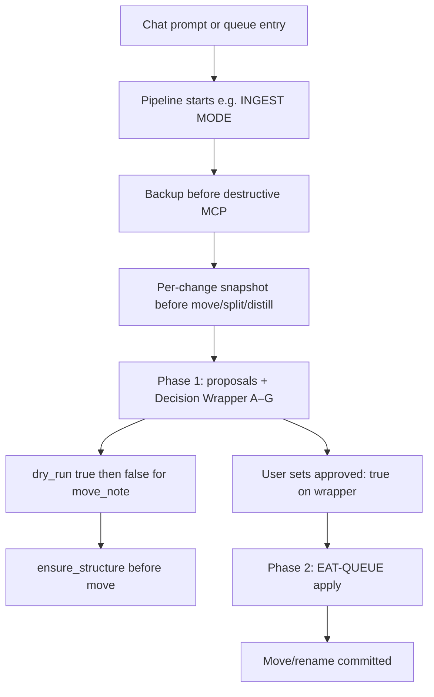
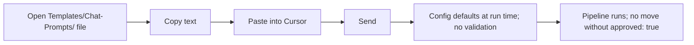
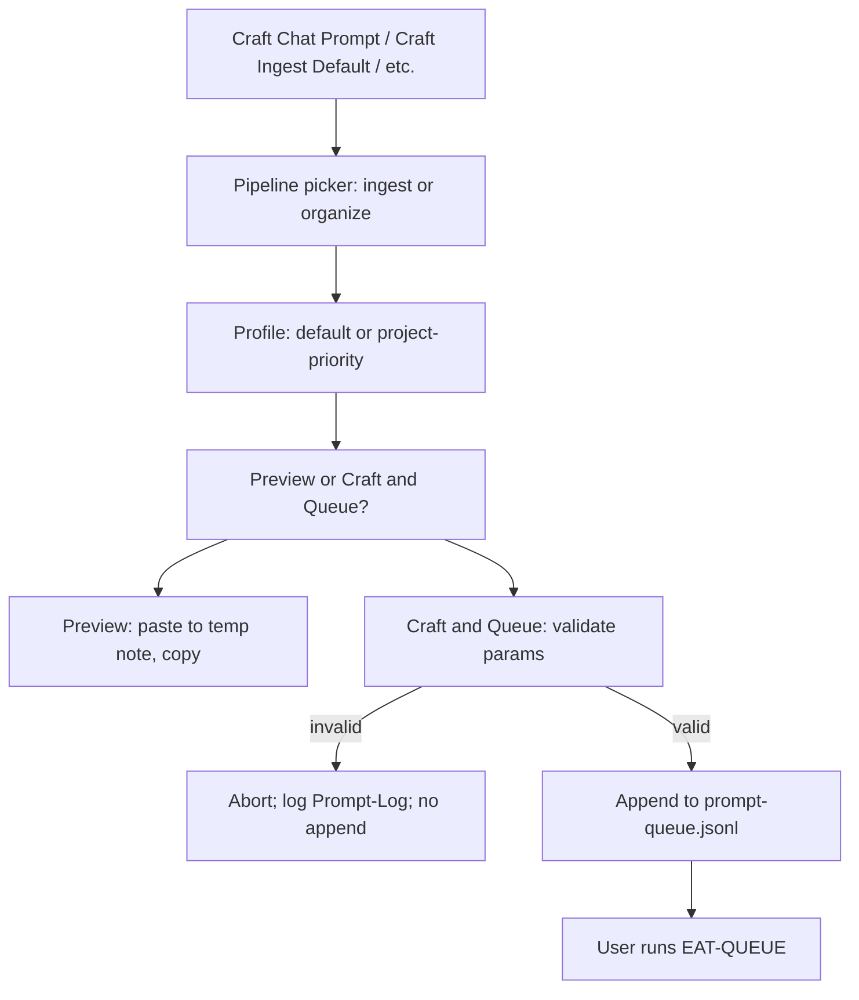
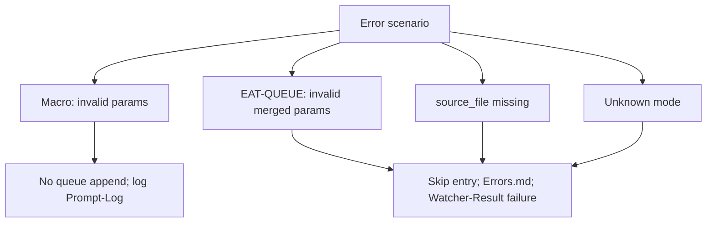
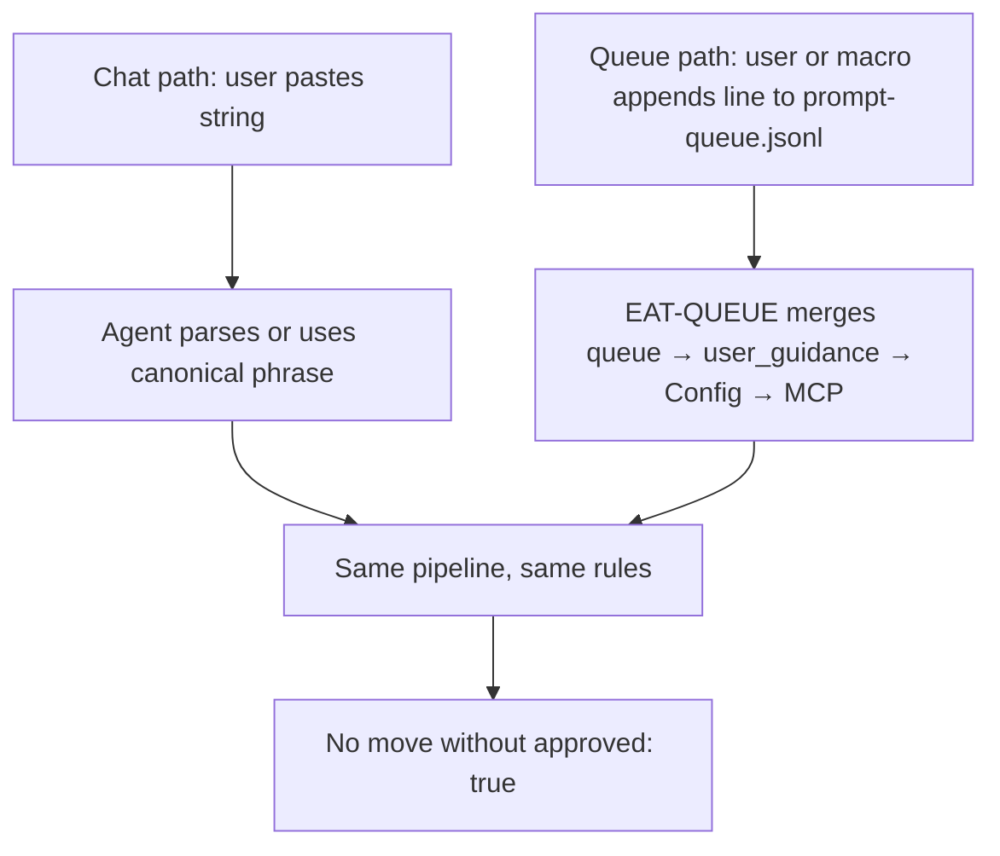

# User Flow — Chat Prompts (Detailed)

Full breakdown of **user choices** and **system response** for standardizing Cursor chat prompts: template vs macro vs queue-first, exact macro names (if any), template list and fields, validation rules, error paths, and **safety** (dedicated subsection). Queue vs chat parity: same params, different entry point.

---

## Safety: triggers propose only; no move without approval

- **Rules:** [[3-Resources/Second-Brain/Pipelines|Pipelines]] § Phase 2 — no move/rename without **approved: true** on the relevant Decision Wrapper (or apply-mode gate). [[.cursor/rules/always/mcp-obsidian-integration|mcp-obsidian-integration]]: **backup** before destructive MCP; **per-change snapshot** before move/rename/split/structural distill; **dry_run: true** then **dry_run: false** for every move_note; ensure_structure(folder_path) before move.
- **User is presented with:** Chat prompt or queue entry that starts a pipeline (e.g. INGEST MODE → full-autonomous-ingest Phase 1). Phase 1 produces proposals and Decision Wrapper (A–G); Phase 2 (apply) runs only when user sets approved: true and runs EAT-QUEUE.
- **User choice:** Paste/send a standardized prompt or run EAT-QUEUE with a crafted queue entry. The agent never auto-commits a move; user must approve via wrapper or equivalent. If the user assumes a prompt "does the move," they are wrong—docs and this subsection state the invariant clearly.

This mirrors the emphasis in [[3-Resources/Second-Brain/Second-Brain-User-Flows/User-Flow-Rules-Detailed#Decision Wrapper: full option set (rules)|User-Flow-Rules-Detailed § Decision Wrapper]]: rules and pipelines enforce the gate; the user sees options and explicitly approves.

---

## Template path (full)

- **Location:** `Templates/Chat-Prompts/` (optional). Files e.g. Ingest-Default.md, Organize-Default.md.
- **Fields/placeholders:** May include `{{prompt_defaults.ingest}}` or similar if Templater is hooked; otherwise static text (e.g. "INGEST MODE with params: { context_mode: strict-para, max_candidates: 7 }").
- **User:** Open template → copy → paste into Cursor → send. No validation step; Config defaults apply at run time. Malformed or unknown phrase → agent falls back to general behavior or Config defaults; no move without approved: true.

---

## Commander "Craft Chat Prompt" macro (full)

- **Macro names:** As configured in [[3-Resources/Plugins-Usage/Commander-Plugin-Usage|Commander-Plugin-Usage]] (e.g. "Craft Chat Prompt", "Craft Ingest Default", "Craft Organize Custom").
- **User is presented with:** Pipeline picker (ingest | organize | …), profile picker (default | project-priority), then "Preview" (paste to temp note / copy) or "Craft and Queue" (append to `.technical/prompt-queue.jsonl` with validation).
- **Validation rules:** Same as [[3-Resources/Second-Brain/Second-Brain-User-Flows/Prompt-Crafter-Structure-Detailed#Validation rules (MCP-Tools alignment)|Prompt-Crafter-Structure-Detailed § Validation]]: rationale_style in ['concise','detailed','bullet','technical']; max_candidates ≤10; context_mode allowed for tool. Invalid → abort; log to Prompt-Log.md (outcome: invalid); do not append to queue. Valid → paste or append.
- **Error paths:** Macro invalid params → no queue append; log. EAT-QUEUE invalid merged params → skip entry; Errors.md; Watcher-Result failure. source_file missing → skip entry; Watcher-Result failure. Unknown mode → skip entry; Watcher-Result failure.

---

## Queue vs chat parity

- **Same params, different entry point.** Chat: user pastes a string; agent parses (or uses canonical phrase) and runs pipeline with Config/default params. Queue: user or macro appends a line to prompt-queue.jsonl with mode and optional params; EAT-QUEUE merges (queue → user_guidance → Config → MCP) and dispatches. Same pipeline, same rules, same safety (no move without approved: true).
- **Cross-refs:** [[3-Resources/Second-Brain/Queue-Sources|Queue-Sources]] (format, modes), [[3-Resources/Second-Brain/Chat-Prompts|Chat-Prompts]] (prompt → queue mode mapping), [[3-Resources/Second-Brain/Configs|Configs]] (prompt_defaults, chat_prompt_defaults reserved).

---

## Cross-references

- Chat prompt reference: [[3-Resources/Second-Brain/Chat-Prompts|Chat-Prompts]]
- Trigger → pipeline: [[3-Resources/Second-Brain/Pipelines|Pipelines]]
- Queue contract: [[3-Resources/Second-Brain/Queue-Sources|Queue-Sources]]
- Config: [[3-Resources/Second-Brain/Configs|Configs]]
- Commander: [[3-Resources/Plugins-Usage/Commander-Plugin-Usage|Commander-Plugin-Usage]]
- Prompt-Crafter structure: [[Prompt-Crafter-Structure-Detailed]]
- Error Handling Protocol: [[.cursor/rules/always/mcp-obsidian-integration|mcp-obsidian-integration]] § Error Handling Protocol
