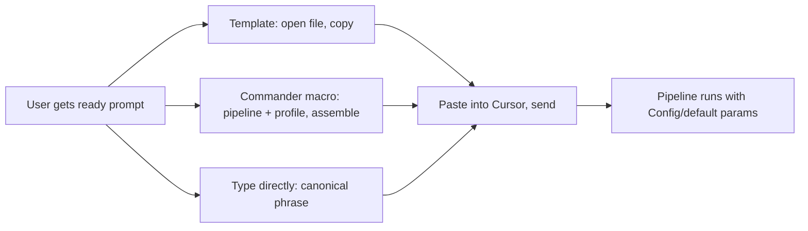
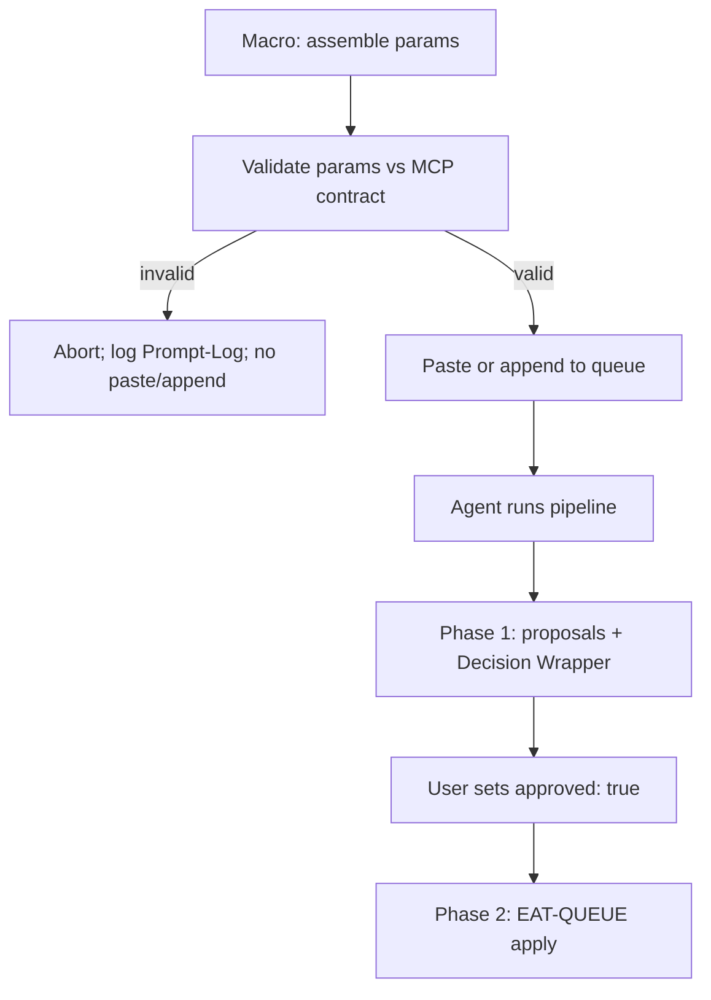
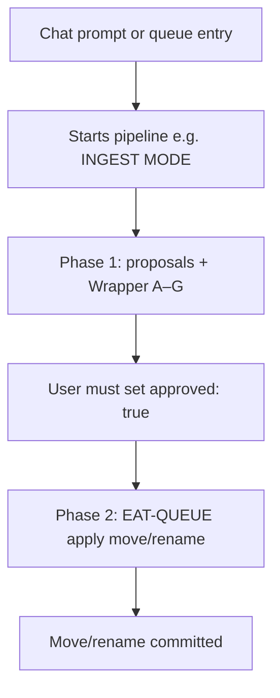

# User Flow — Chat Prompts (High-Level)

This document describes the **user's path** for standardizing what you paste or say in Cursor: get a ready prompt (from a template file or Commander "Craft Chat Prompt" macro), copy/paste into Cursor, send. Main gates: validation preview (if macro), fallback when malformed (default params; no move without approved: true).

---

## User gets a ready prompt (trigger → paste)

- **Template** — Open a file in `Templates/Chat-Prompts/` (e.g. Ingest-Default.md), copy the text, paste into Cursor chat, send. No assembly step; Config defaults apply at run time.
- **Commander "Craft Chat Prompt"** (if configured) — Macro prompts for pipeline and profile, assembles from Config/templates, shows preview. User copies the result and pastes into Cursor (or "paste to temp note" then copy). If validation fails, macro aborts and logs; no paste of invalid params.
- **Type directly** — User can type a canonical phrase (e.g. INGEST MODE, Process Ingest) in Cursor; the agent uses Config defaults when no queue params are present (fallback: queue params → user_guidance → Config → MCP defaults).

---

## Main gate: validation before use

- **Before paste or queue append** (when using a macro): Params are checked (e.g. max_candidates ≤10, rationale_style in allowed enum per MCP-Tools). **Invalid** → abort; log to Prompt-Log.md (and optionally Errors.md). **Valid** → paste or append.
- **When the agent runs** (chat or EAT-QUEUE): Rules trigger the same pipeline (e.g. INGEST MODE → full-autonomous-ingest Phase 1). Chat uses Config/default params; queue entries use merged params. Malformed chat text falls back to defaults; no move without approved: true.

So: the user gets a consistent, ready-to-send string (or types a canonical phrase) and the pipeline runs with stable params; the rest of the flow (Decision Wrapper, approval, EAT-QUEUE apply) is unchanged.

---

## Safety callout (chat prompts)

> [!warning] Triggers propose only
> **No move/rename without approved: true** (per [[3-Resources/Second-Brain/Pipelines|Pipelines]] § Phase 2). Backup/snapshot/dry_run always before commit (enforced by [[.cursor/rules/always/mcp-obsidian-integration|mcp-obsidian-integration]]). Chat prompts only start the pipeline; they do not auto-commit moves.

---

## Links

- **Canonical phrases and examples**: [[3-Resources/Second-Brain/Chat-Prompts|Chat-Prompts]]
- **Trigger → pipeline**: [[3-Resources/Second-Brain/Pipelines|Pipelines]]
- **Queue path (Craft and Queue)**: [[User-Flow-Prompt-Crafter-High-Level]]
- **Commander macros**: [[3-Resources/Plugins-Usage/Commander-Plugin-Usage|Commander-Plugin-Usage]]
