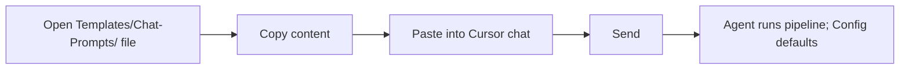
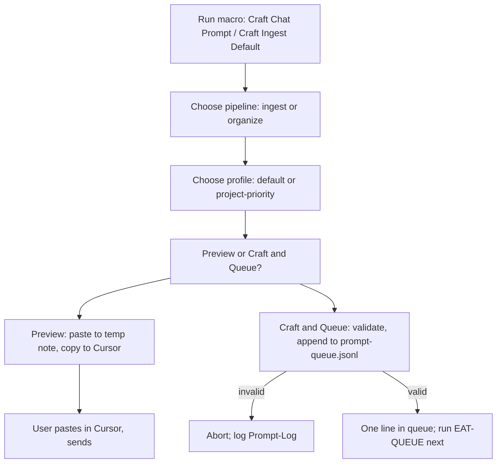
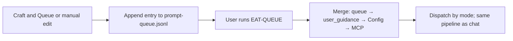
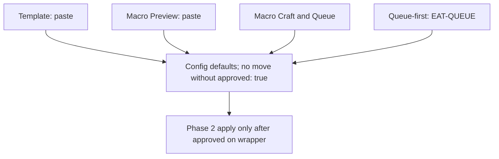

# User Flow — Chat Prompts (Mid-Level)

This document adds **per-option** user paths: template copy-paste, Commander "Craft Chat Prompt" macro (pipeline/profile, preview vs paste), and queue-first (craft queue entry instead of chat). What the user sees when valid vs invalid; safety callout in each path. Commander macro paths from [[3-Resources/Plugins-Usage/Commander-Plugin-Usage|Commander-Plugin-Usage]].

---

## Option 1: Template (copy-paste)

- **User:** Opens a file in `Templates/Chat-Prompts/` (e.g. Ingest-Default.md), copies the content, pastes into Cursor chat, sends.
- **Result:** Agent maps the phrase to the pipeline (e.g. INGEST MODE → full-autonomous-ingest); Config defaults apply. No validation step unless you use a macro.
- **Safety callout:** Triggers propose only; no move without approved: true (Pipelines § Phase 2). Backup/snapshot/dry_run before commit (mcp-obsidian-integration).

---

## Option 2: Commander "Craft Chat Prompt" macro

- **User:** Runs macro (e.g. Craft Chat Prompt, Craft Ingest Default). Chooses pipeline (ingest | organize) and profile (default | project-priority). Chooses "Preview" (paste to temp note or copy) or, if available, "Craft and Queue" (append to prompt-queue.jsonl).
- **Preview path:** Assembled string is shown/pasted; user copies to Cursor and sends. No queue append. commander_macro: e.g. craft_chat_prompt_preview.
- **Craft and Queue path:** Params validated; if valid, one line appended to `.technical/prompt-queue.jsonl`; user runs EAT-QUEUE to process. If invalid, abort; log to Prompt-Log.md.
- **User sees (valid):** Ready prompt to paste, or queue entry for next EAT-QUEUE. **User sees (invalid):** Error message or log; no queue line.
- **Safety callout:** Same as Option 1; macro does not bypass approval or backup/snapshot/dry_run.
- **Commander macro paths:** Documented in [[3-Resources/Plugins-Usage/Commander-Plugin-Usage|Commander-Plugin-Usage]] § Prompt-crafter / Chat Prompt macros.

---

## Option 3: Queue-first (craft queue entry instead of chat)

- **User:** Uses "Craft and Queue" (or manual queue edit) to append an entry with mode and params. Runs EAT-QUEUE instead of pasting in chat.
- **Result:** Same pipeline runs with merged params (queue → user_guidance → Config → MCP defaults). Validation at EAT-QUEUE dispatch; invalid → skip entry, Errors.md, Watcher-Result failure.
- **Relation to Prompt-Crafter:** Same params and profiles; chat prompt flow = paste surface; Prompt-Crafter flow = queue assembly and validation. See [[User-Flow-Prompt-Crafter-Mid-Level]].

---

## Safety in every path

- **Template:** Paste as-is; rules apply Config defaults; no move without approved: true.
- **Macro (preview):** Paste assembled string; same as template.
- **Macro (Craft and Queue):** Queue entry validated; EAT-QUEUE runs pipeline with merged params; Phase 2 apply only after user sets approved: true on wrappers.
- **Queue-first:** Same as Craft and Queue; no chat paste.

---

## Cross-references

- Canonical phrases and validation: [[3-Resources/Second-Brain/Chat-Prompts|Chat-Prompts]]
- Queue contract: [[3-Resources/Second-Brain/Queue-Sources|Queue-Sources]]
- Prompt-Crafter flows: [[User-Flow-Prompt-Crafter-Mid-Level]], [[User-Flow-Prompt-Crafter-Detailed]]
