# User Flow Diagram — Detailed

This document is the complete breakdown of every documented user choice: Decision Wrapper options (A–G, option 0, option R for re-try), phase-direction wrappers (roadmap → approve or re-try), mid-band refinement (preview → approve or feedback → re-queue), async preview (Mobile-Pending-Actions + Commander “Async Approve”), Commander macro and mobile toolbar choices, dry_run review before commit, queue modes (including EXPAND-ROAD, TASK-TO-PLAN-PROMPT) and banner cleanup, and guidance-aware re-run after user edits. It includes all confidence-band branches (high = silent proceed, mid = preview/loop, low = manual) and what happens if the user ignores a proposal.

---

## User Flow – Decision Wrapper: full option set

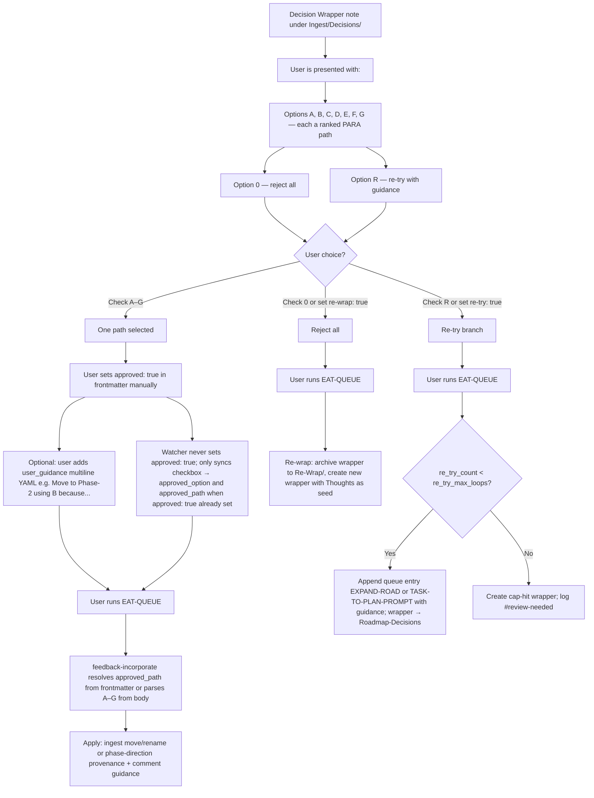

---

## User Flow – Confidence bands: high / mid / low (all pipelines)

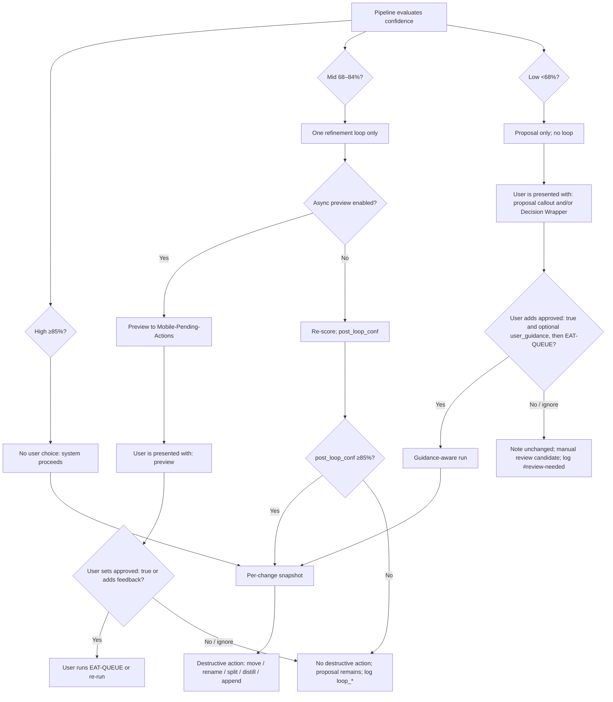

---

## User Flow – Mid-band async preview (Mobile-Pending-Actions + Commander)

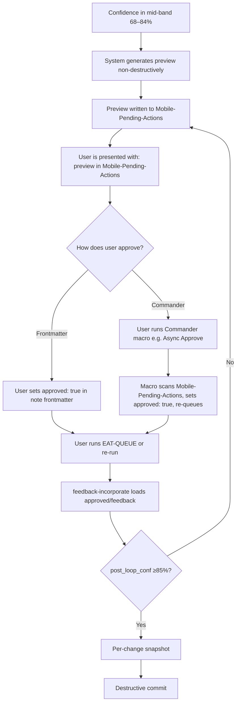

---

## User Flow – Guidance-aware re-run (approved: true + user_guidance)

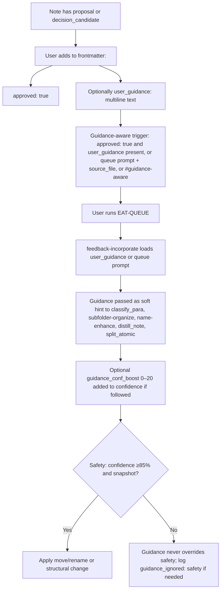

---

## User Flow – Dry_run review before commit (move/rename)

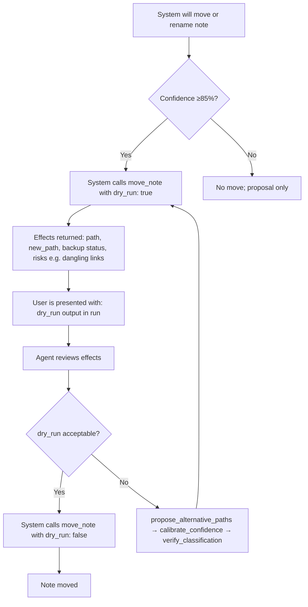

---

## User Flow – Queue modes and banner cleanup

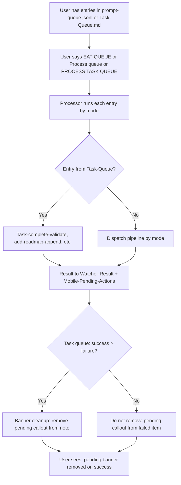

---

## User Flow – What happens if user ignores proposal (low confidence)

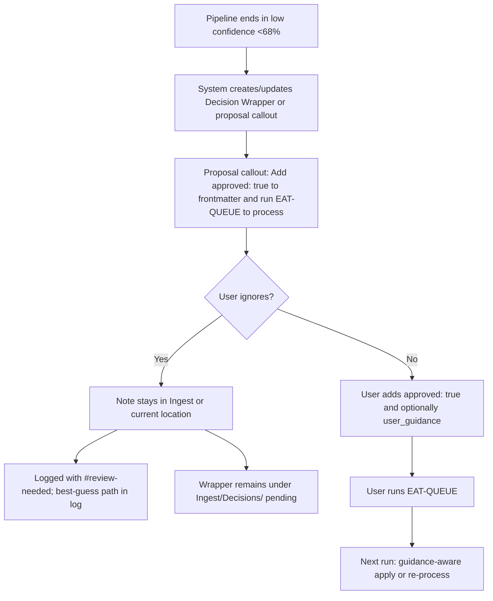

---

## User Flow – What happens if user ignores mid-band preview

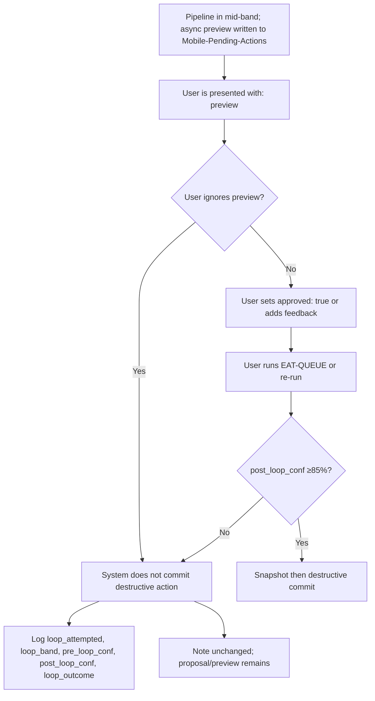

---

## User Flow – Roadmap / phase-direction (master goal → prompt)

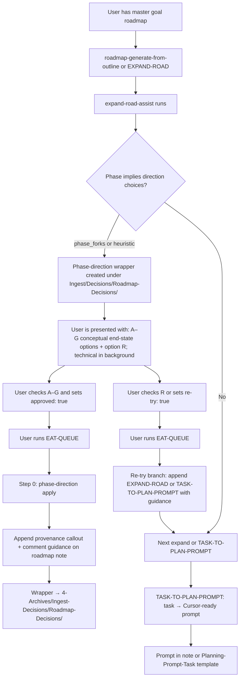

---

## User Flow – Re-wrap branch (option 0 / re-wrap: true)

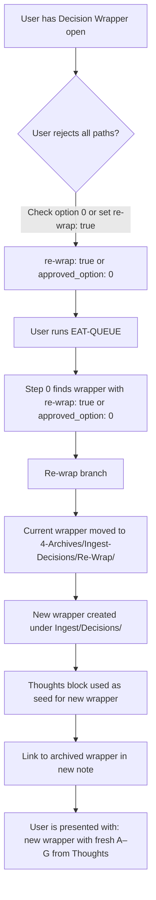

---

## User Flow – Commander and mobile toolbar (documented options)

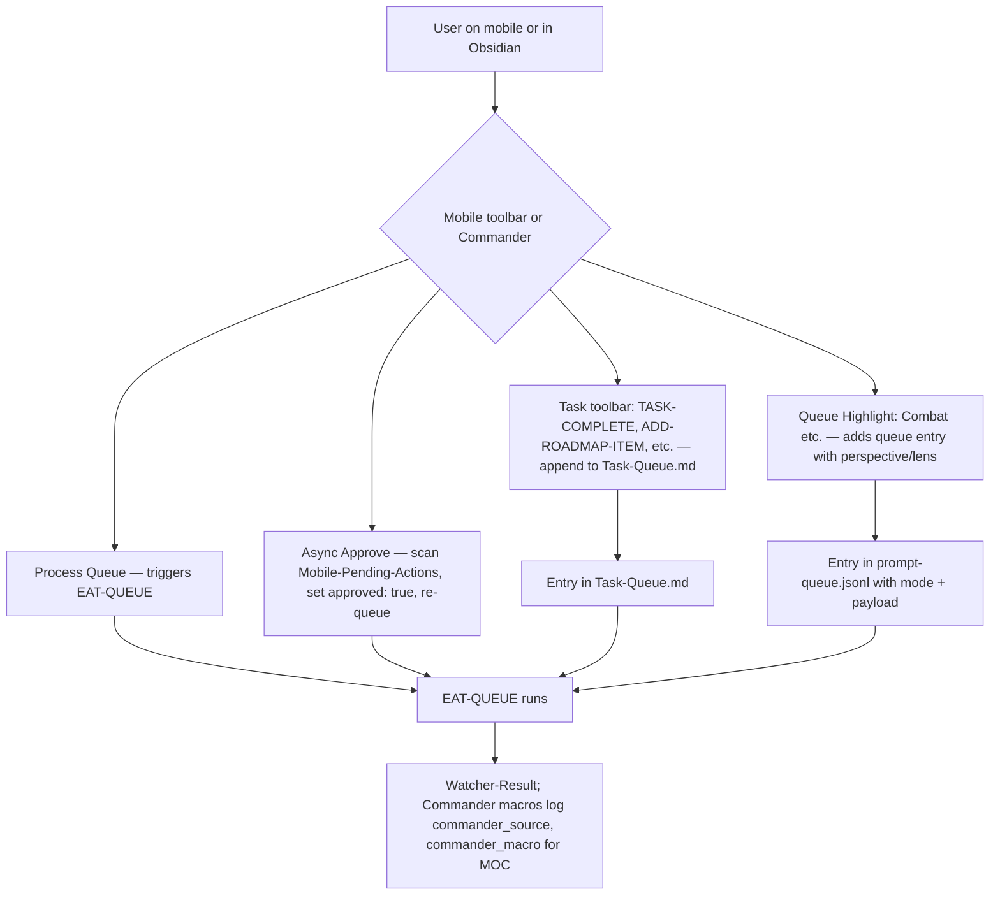

---

## User Flow – EAT-QUEUE Step 0 (approved wrappers always first)

Step 0 runs **before** reading `prompt-queue.jsonl`. Processed wrappers are moved to `4-Archives/Ingest-Decisions/` with subfolders mirrored (e.g. `Ingest/Decisions/Ingest-Decisions/` → `4-Archives/Ingest-Decisions/Ingest-Decisions/`).

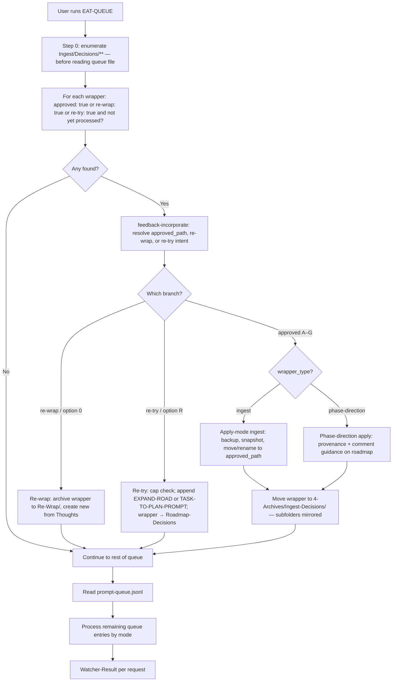

---

## User Flow – Decision Wrapper Watcher sync (user sets approved only)

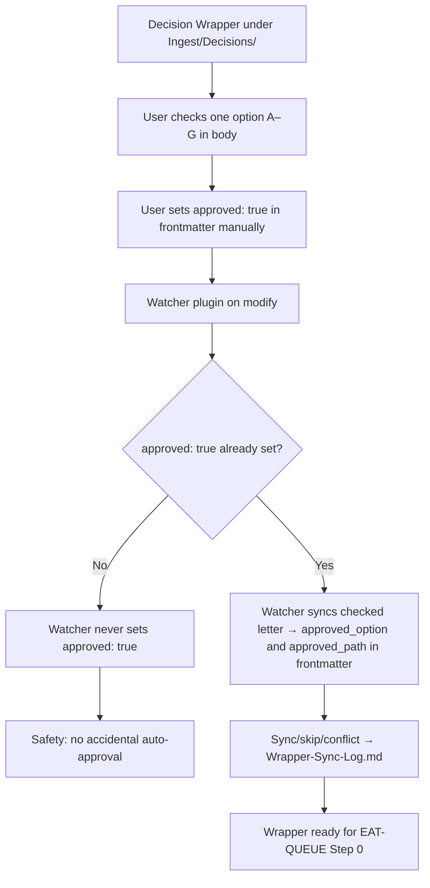
