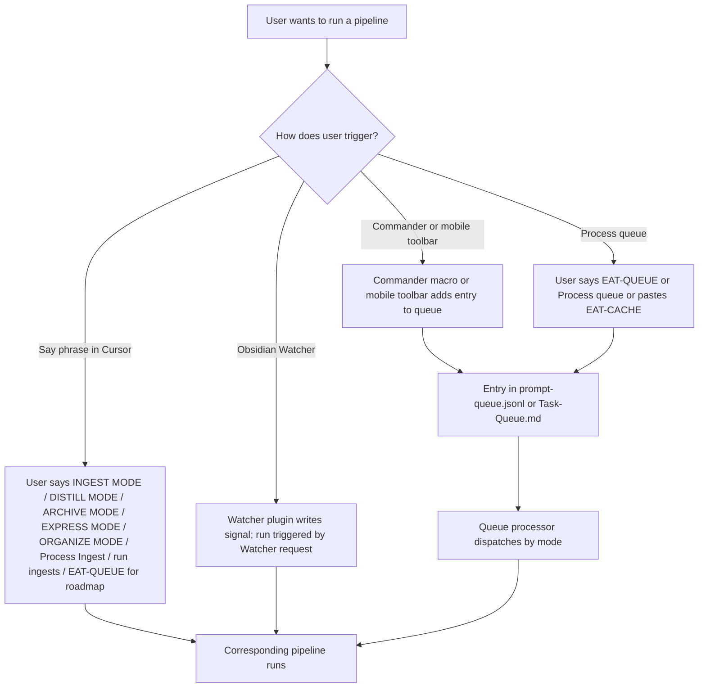
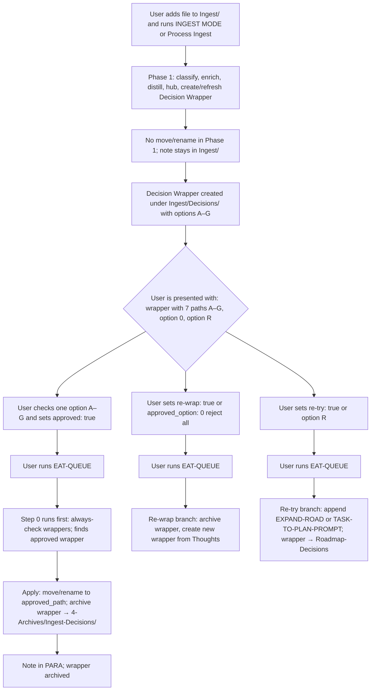
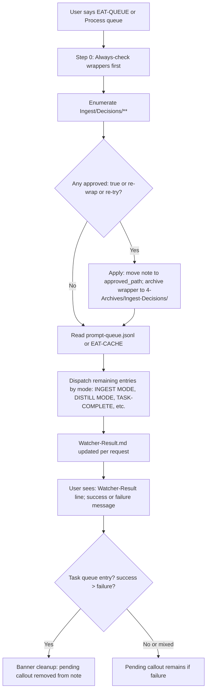
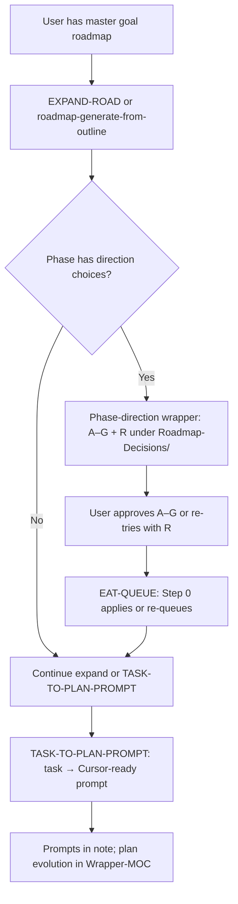

# User Flow Diagram — High-Level

This document shows the big picture of how the user moves through the Second Brain: how they start (triggers, phrases, Commander, mobile), which pipeline runs, and the main decision gates (auto vs manual review, EAT-QUEUE). It answers “what does the user do and what choices do they see?” without per-pipeline detail.

---

## User Flow – How the user starts (trigger choice)



---

## User Flow – Auto vs manual review (main gate)

```mermaid
flowchart TD
  Run[Pipeline runs on note(s)]
  Run --> Conf{Confidence band?}
  Conf -->|High ≥85%| Auto[System proceeds: snapshot, then destructive step e.g. move / distill / append]
  Conf -->|Mid 68–84%| Mid[Single refinement loop; optional async preview]
  Conf -->|Low &lt;68%| Manual[Proposal only; no destructive action]
  Auto --> Done1[Done; note updated or moved]
  Mid --> UserMid{User is presented with: preview or proposal}
  UserMid --> Approve{User adds approved: true or feedback?}
  Approve -->|Yes, then EAT-QUEUE| ReRun[Re-run; if post_loop_conf ≥85% then snapshot + commit]
  Approve -->|No / ignore| Stay1[Note unchanged; proposal remains]
  Manual --> UserLow[User is presented with: proposal callout and/or Decision Wrapper]
  UserLow --> Act{User adds approved: true + optional user_guidance, then EAT-QUEUE?}
  Act -->|Yes| Apply[Guidance-aware apply run]
  Act -->|No / ignore| Stay2[Note stays; manual review candidate]
  ReRun --> Done1
  Apply --> Done1
```

---

## User Flow – Ingest: Phase 1 vs Phase 2 (EAT-QUEUE gate)

**Phase 1** never moves or renames; the note stays in Ingest/ until you approve a wrapper and run EAT-QUEUE. **Phase 2** runs only when EAT-QUEUE Step 0 (always-check wrappers) finds your wrapper with `approved: true` and applies the move.



---

## User Flow – EAT-QUEUE: what the user gets

**Step 0 runs first**, before the queue file is read. Approved wrappers under `Ingest/Decisions/**` are applied (move note, archive wrapper); then the rest of the queue is processed by mode.



---

## User Flow – Roadmap breakdown (master goal → prompts)


