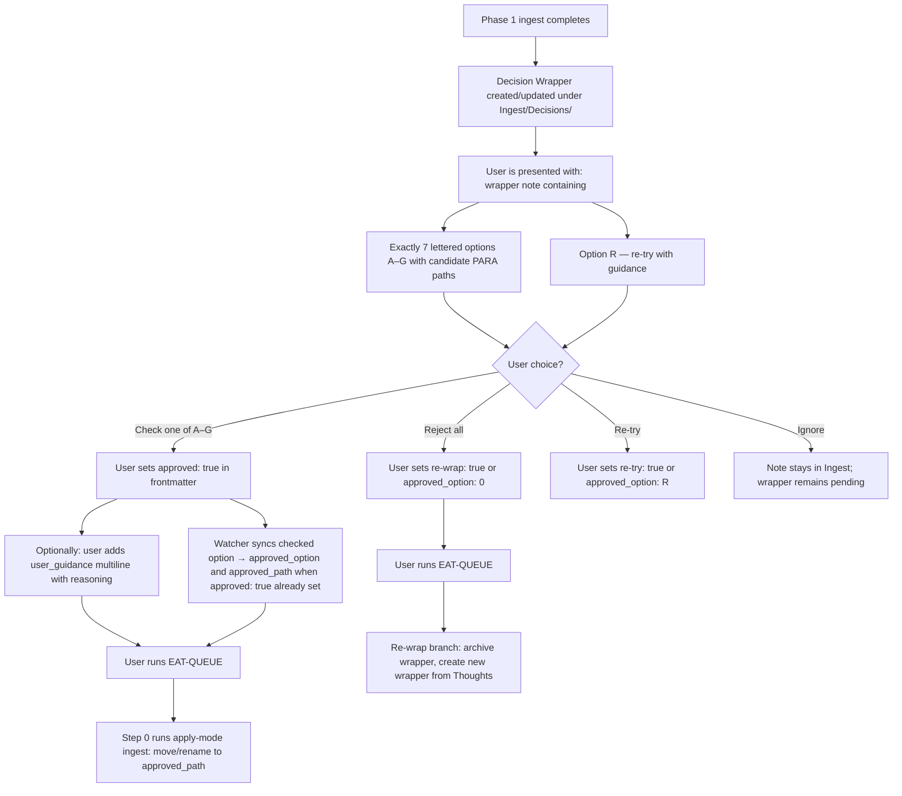
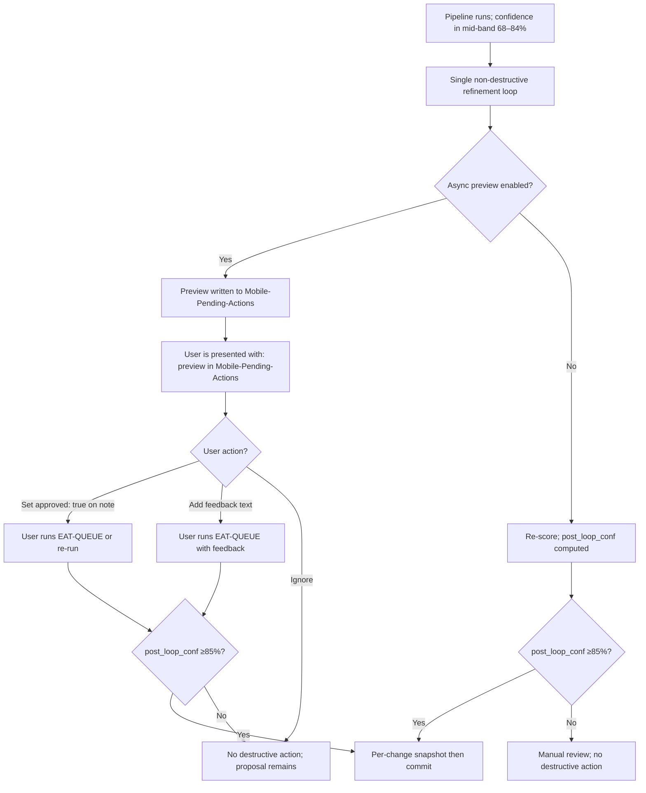
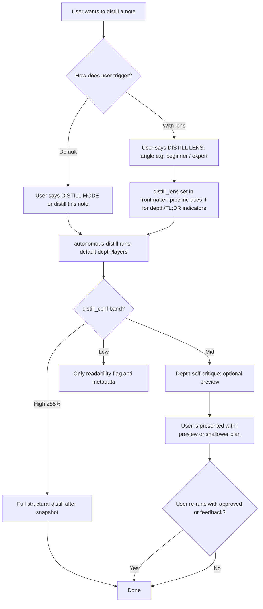
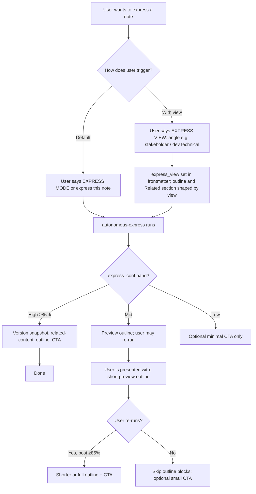
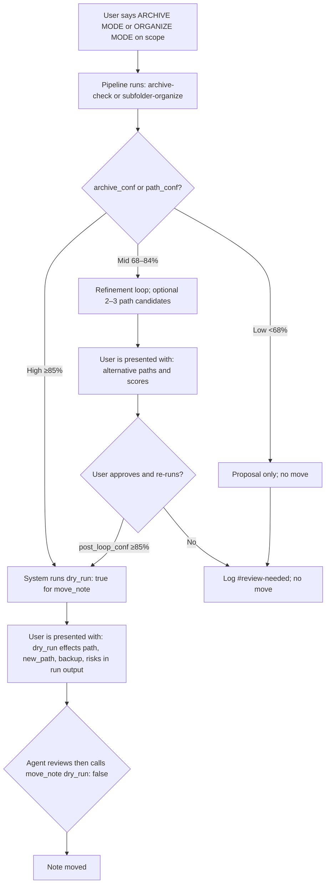
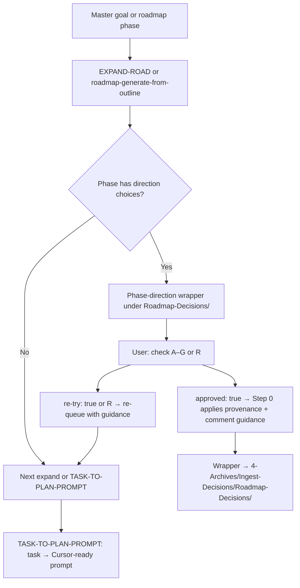
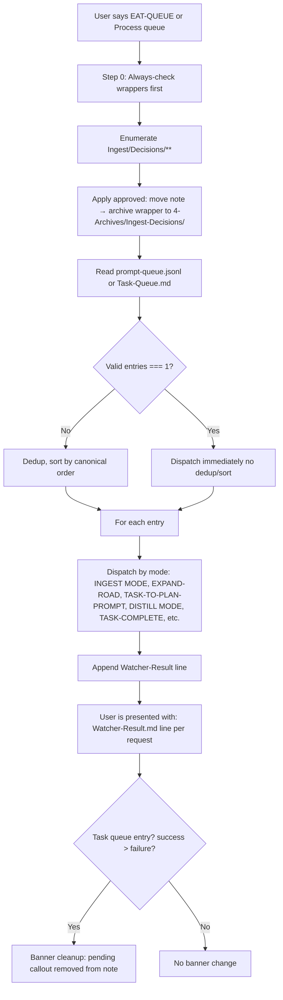
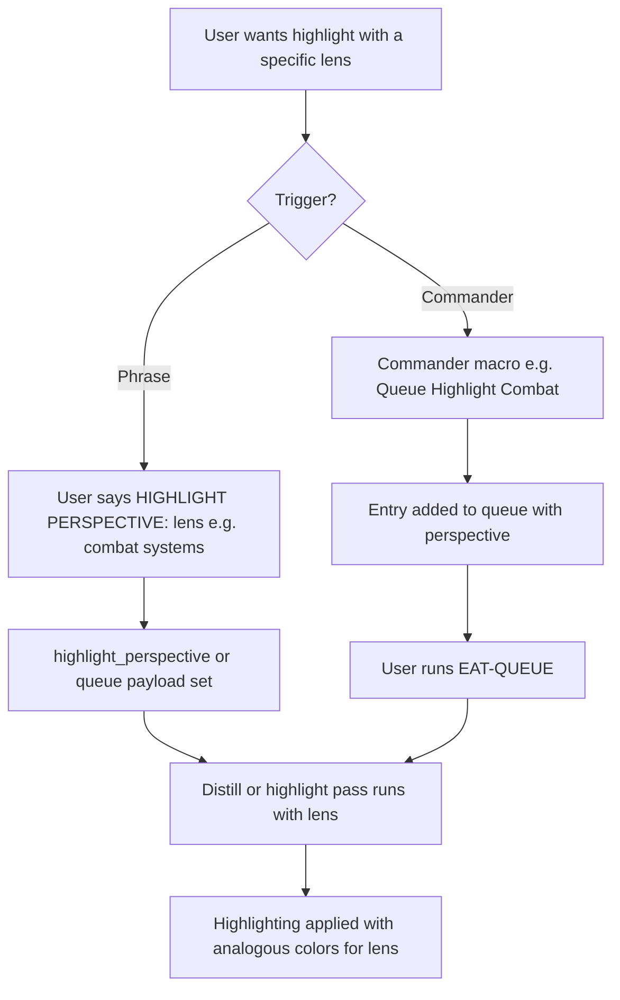

# User Flow Diagram — Mid-Level

This document builds on the high-level user flow by adding per-pipeline branches: what the user sees after ingest Phase 1 (Decision Wrapper with A–G and optional user_guidance), in the mid-band loop (preview and approve), and when choosing lens/view for distill and express, when reviewing proposed archive/organize moves, and when processing the queue. Each decision point lists the exact options the user is presented with.

---

## User Flow – Ingest Phase 1 → Decision Wrapper (options A–G)

---

## User Flow – Mid-band refinement loop (preview + approve)

---

## User Flow – Distill (lens choice)

---

## User Flow – Express (view choice)

---

## User Flow – Archive / Organize (review proposed move)

---

## User Flow – Roadmap / phase-direction (expand → wrapper → approve or re-try)

---

## User Flow – Queue processing (EAT-QUEUE choices)

**Step 0 runs first**, before reading the queue file. The processor enumerates `Ingest/Decisions/**`, applies any approved (or re-wrap/re-try) wrappers, then reads and dispatches the rest of the queue.

---

## User Flow – Highlight perspective (optional lens)

