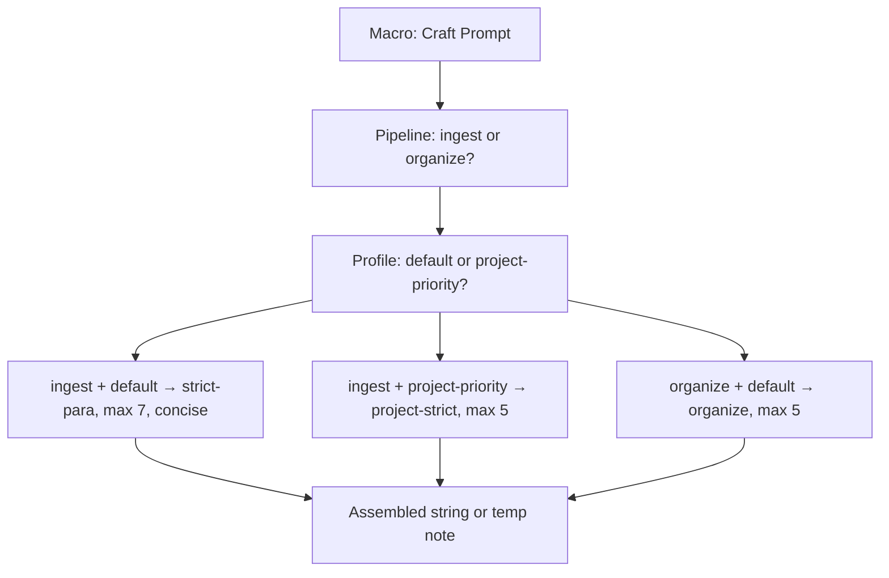
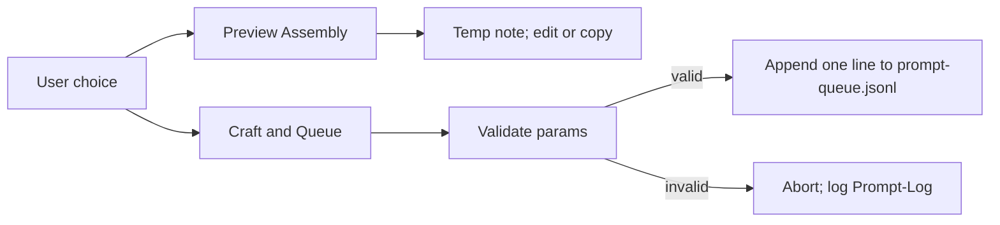
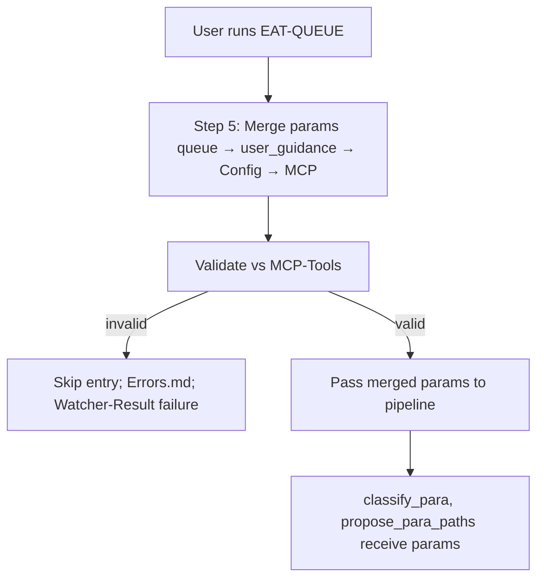
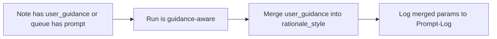
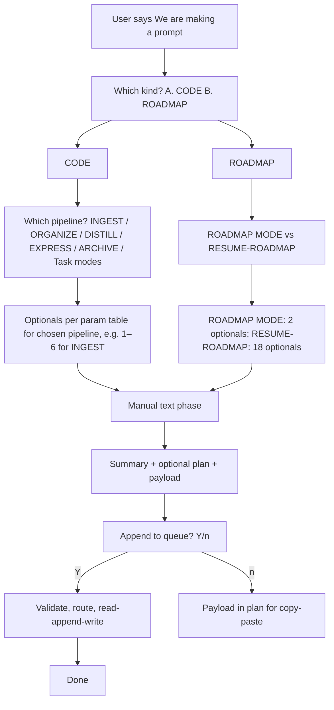

# User Flow — Prompt-Crafter (Mid-Level)

This document adds **per-option** user paths: pipeline and profile selection, Preview Assembly vs Craft and Queue, what the user sees when params are valid vs invalid, and how guidance-aware merge and confidence bump apply when the user has user_guidance or queue prompt. Each decision point is tied to Config, queue contract, and EAT-QUEUE behavior.

---

## Commander: pipeline and profile (user choices)

- **Macro prompts:** "Pipeline: ingest | organize?" and "Profile: default | project-priority?" (or equivalent).
- **User choices:**
  - **ingest + default** → Assembly uses prompt_defaults.ingest (context_mode: strict-para, max_candidates: 7, rationale_style: concise).
  - **ingest + project-priority** → Merge profile over ingest: context_mode: project-strict, max_candidates: 5.
  - **organize + default** → prompt_defaults.organize (context_mode: organize, max_candidates: 5).
- **User sees:** Assembled string (or temp note if Preview Assembly). No queue append until "Craft and Queue" is chosen.

---

## Preview Assembly vs Craft and Queue (user choices)

| User action | Result | Logging |
|-------------|--------|---------|
| **Preview Assembly** | Crafted prompt pasted to a temp note; user can edit or copy to Cursor. | commander_macro: craft_prompt_preview (if macro logs it). |
| **Craft and Queue** | Params validated; if valid, one line appended to prompt-queue.jsonl (mode, params, id, source_file, prompt). If invalid, abort; log to Prompt-Log.md. | commander_macro set; Prompt-Log entry on append (params, source: macro, outcome: valid \| invalid). |

- **User sees (valid):** Queue has one new entry; next EAT-QUEUE will pick it up and pass params to the pipeline.
- **User sees (invalid):** No queue append; error message or log line (e.g. rationale_style not in allowed enum); Prompt-Log.md entry with outcome: invalid.

---

## EAT-QUEUE with crafted params (user path)

- **User runs EAT-QUEUE** (or Process queue / eat cache). Entry has optional **params** (from Craft and Queue or manual edit).
- **auto-eat-queue** Step 5: Merge params (queue → user_guidance → Config → MCP defaults). Validate merged params against MCP-Tools. If invalid → skip entry, Errors.md, Watcher-Result failure. If valid → pass merged params into pipeline context.
- **User sees:** Watcher-Result line(s). For valid entry: pipeline runs (ingest, organize, distill, etc.) with merged params; classify_para and propose_para_paths receive them. For invalid: status: failure, message referencing param validation.

---

## Guidance-aware merge (user with user_guidance or queue prompt)

- **When note has user_guidance** (or queue entry has non-empty prompt): Run is **guidance-aware** (guidance-aware.mdc). Merged params include user_guidance merged into rationale_style if compatible (e.g. "concise + explain rankings"). Full merged params logged to Prompt-Log.md.
- **User choices:** Add user_guidance to the note (or prompt to the queue entry) for refinement hints. Do not expect user_guidance to be overwritten; defaults inject only where missing.
- **User sees:** Same pipeline outcome; Prompt-Log entry may include merge_trace (e.g. "user_guidance merged into rationale_style").

---

## Confidence bump (crafted params)

- **Optional:** When the run uses **crafted params** (queue params or prompt-crafter output), confidence-loops allow a small **pre_loop_conf floor** bump (e.g. +5%, tunable via Parameters: crafted_params_conf_boost). Stricter params imply higher baseline stability.
- **User sees:** No direct UI change; mid-band notes may cross into high band more often when crafted params are used, so fewer refinement loops or proposals.

---

## Sub-macros and batch (user choices)

- **Craft Ingest Default** / **Craft Organize Custom** — One-click assembly for a fixed pipeline+profile; user can then paste or "Craft and Queue."
- **Batch:** User may run macro multiple times (different source_file or mode) to append several queue entries; each validated independently. User runs EAT-QUEUE once to process the batch.

---

## Plan-mode Q&A user flow (mid-level)

Plan-mode path: one question per message; optionals count varies by mode (see [[3-Resources/Second-Brain/Prompt-Crafter-Param-Table|Prompt-Crafter-Param-Table]]). After kickoff and mode choice, both branches merge at manual text, then summary and append.

