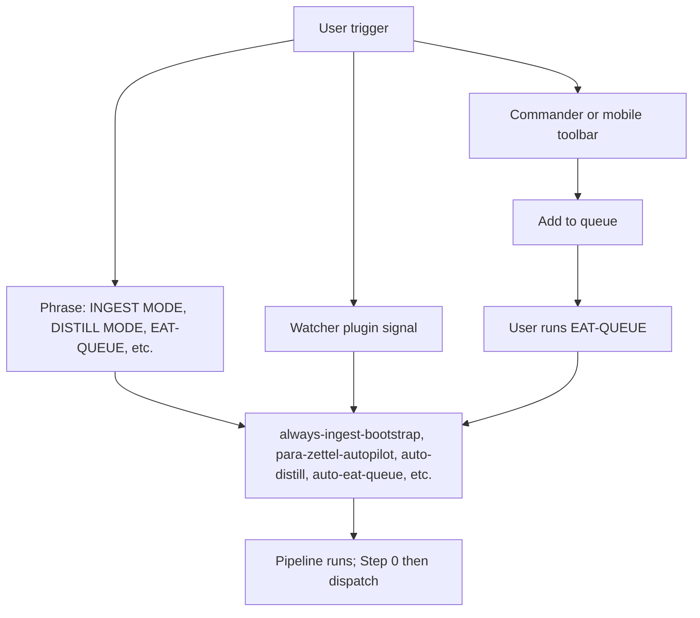
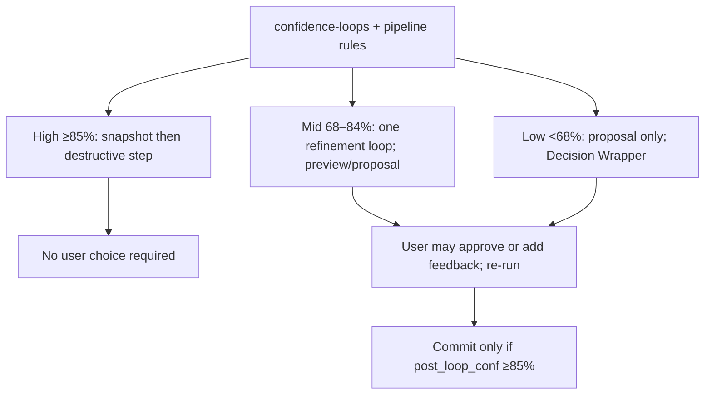
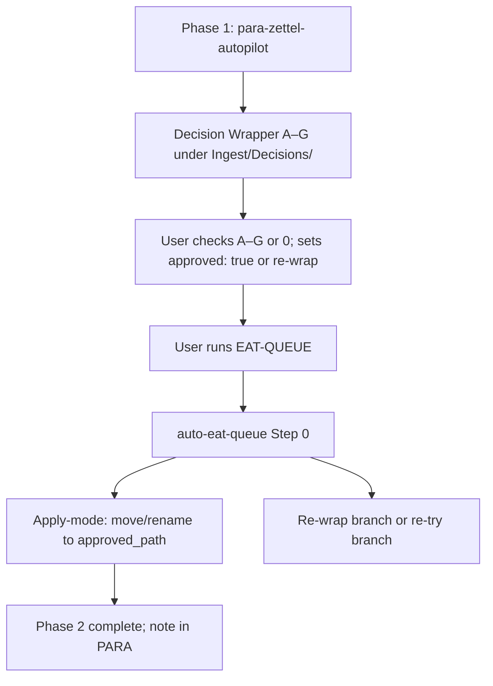
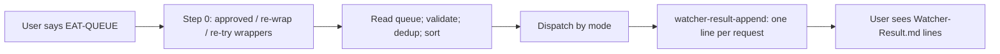
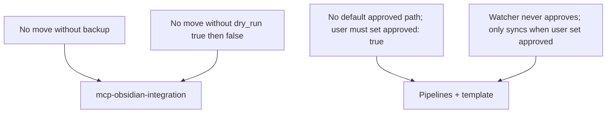

# User Flow — Rules (High-Level)

This document describes the user’s path through the Second Brain from the **rules** perspective: how the user’s trigger (phrase, Watcher, queue) selects which rules run, the main gates (auto vs manual review, EAT-QUEUE for apply), and where the user is presented with a choice. It answers “what does the user do, and which rules govern each step?” at a high level.

---

## User starts a run (trigger → rules)

- **User says a phrase in Cursor**  
  INGEST MODE, Process Ingest, run ingests → **always-ingest-bootstrap** and **para-zettel-autopilot** run the ingest pipeline (Phase 1: classify, enrich, distill, Decision Wrapper; no move yet).  
  DISTILL MODE, ARCHIVE MODE, EXPRESS MODE, ORGANIZE MODE → the matching **auto-distill**, **auto-archive**, **auto-express**, **auto-organize** context rule runs the corresponding pipeline.  
  EAT-QUEUE, Process queue, eat cache → **auto-eat-queue** runs: Step 0 (wrappers) first, then queue dispatch by mode.  
  PROCESS TASK QUEUE → **auto-queue-processor** runs task/roadmap modes.

- **Watcher plugin**  
  Watcher writes a signal; the run is still driven by the same mode (e.g. INGEST MODE). **watcher-result-append** (always) ensures one line per request is appended to Watcher-Result.md when the run finishes.

- **Commander or mobile toolbar**  
  User runs a macro or toolbar action that adds an entry to the queue. When the user (or a follow-up) runs EAT-QUEUE, **auto-eat-queue** reads the queue and dispatches by mode; the same rules apply as for phrase-triggered runs.

- **Roadmap and phase-direction**  
  Step 0 also handles **phase-direction** wrappers (from EXPAND-ROAD / roadmap-generate): approve A–G → apply (provenance + comment guidance); **option R** (re-try) → re-queue with guidance (capped by re_try_max_loops). Same safety: user sets approved or re-try manually.

---

## Main gate: auto vs manual review (rules that enforce it)

- **confidence-loops** (always) and each pipeline rule define three bands:
  - **High (≥85%)** — No user choice required. Rules require a per-change snapshot then the destructive step (move, rename, distill rewrite, etc.). **mcp-obsidian-integration** enforces backup and dry_run before move.
  - **Mid (68–84%)** — One refinement loop; optional async preview to Mobile-Pending-Actions. User may be presented with a preview or proposal; if they add approved: true or feedback and re-run, **guidance-aware** and **feedback-incorporate** apply; commit only if post_loop_conf ≥85%.
  - **Low (&lt;68%)** — Proposal only; no destructive action. User is presented with a proposal callout and/or Decision Wrapper. **guidance-aware** and **feedback-incorporate** apply when the user adds approved: true and optionally user_guidance and runs EAT-QUEUE.

So: the user either sees nothing (high band), or sees a preview/proposal (mid/low) and can approve or ignore; the rules ensure no destructive step without sufficient confidence and snapshot.

---

## Ingest: Phase 1 vs Phase 2 (rules and user choice)

- **Phase 1** — **para-zettel-autopilot** (and ingest pre-step rules if non-MD in Ingest). Pipeline creates/refreshes a Decision Wrapper under Ingest/Decisions/ with options A–G (and optionally 0). **User is presented with:** the wrapper note; they must check one option A–G or 0 and set approved: true, or set re-wrap: true. No move/rename in Phase 1; that is by design in the rule.

- **Phase 2 (apply-mode)** — Triggered when the user runs **EAT-QUEUE**. **auto-eat-queue** Step 0 runs first (always, before reading the queue): it finds wrappers with approved: true, re-wrap: true, or re-try: true. **feedback-incorporate** (skill) resolves approved_path, re-wrap intent, or re-try intent. If path chosen → apply-mode ingest (move/rename to approved_path) or phase-direction apply (provenance + comment guidance; wrapper → 4-Archives/Ingest-Decisions/Roadmap-Decisions/). If re-wrap → re-wrap branch (archive wrapper to Re-Wrap/, create new wrapper from Thoughts). If re-try (option R; roadmap/phase-direction only) → re-try branch (re-queue EXPAND-ROAD or TASK-TO-PLAN-PROMPT with guidance; wrapper archived to Roadmap-Decisions; cap re_try_max_loops). **User sees:** note in PARA and/or new wrapper, and a Watcher-Result line.

So: the user’s “I’m done choosing” action is “run EAT-QUEUE”; the rule that responds is auto-eat-queue Step 0 plus feedback-incorporate.

---

## EAT-QUEUE: what the user gets (rules involved)

- User says EAT-QUEUE or Process queue. **auto-eat-queue** runs.
- Step 0 processes any approved or re-wrap wrappers (apply or re-wrap); then the rest of the queue is processed by mode (INGEST MODE, DISTILL MODE, TASK-COMPLETE, etc.).
- **watcher-result-append** (always) appends one line per request to Watcher-Result.md.
- **User sees:** Watcher-Result line(s) with requestId, status, message, completed time. For task-queue entries, pipeline rules may also drive banner cleanup (success &gt; failure) so the user sees the pending callout removed on success.

---

## Safety invariants the user can rely on (rules)

- **No move without backup** — mcp-obsidian-integration: destructive or move steps require a recent backup (ensure_backup / create_backup).
- **No move without dry_run first** — Same rule: every move_note at ≥85% is called with dry_run: true; effects are reviewed; then dry_run: false. The user can think of this as “the system never commits a move without a dry run.”
- **No default approved path** — Pipelines and template (per Rules and Pipelines) must not set default approved_option or approved_path. The user’s explicit check and approved: true are required; Watcher only syncs checkbox → frontmatter when the user has already set approved: true.
- **Watcher never approves** — Documented in Pipelines and Cursor-Skill-Pipelines-Reference: Watcher never sets approved: true or re-wrap: true; it only syncs the checked option into frontmatter when the user has set approved: true.
