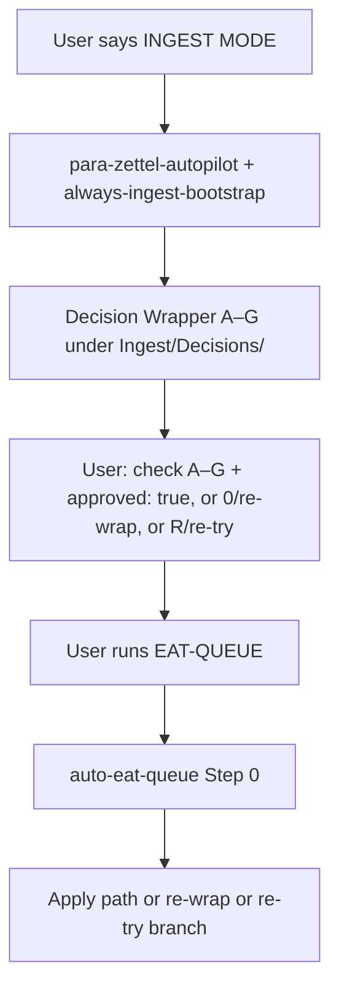
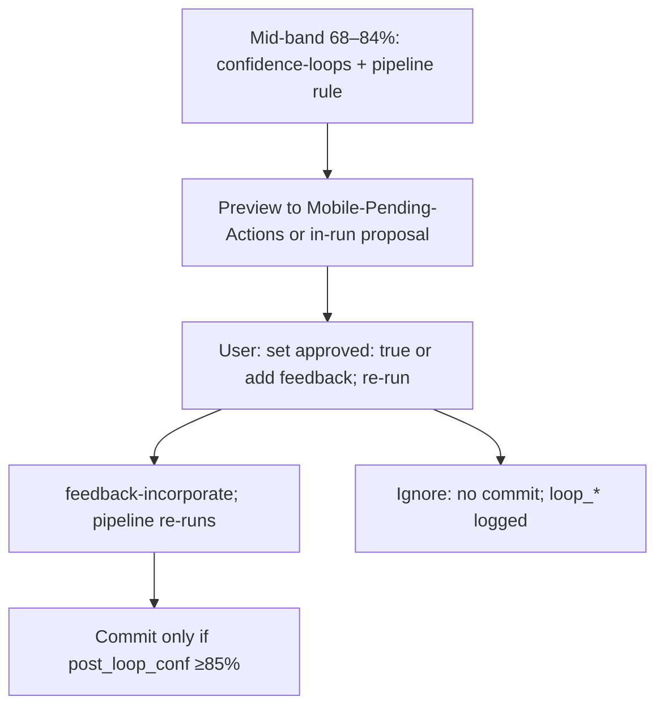
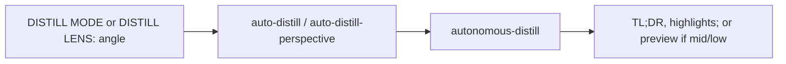
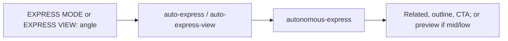
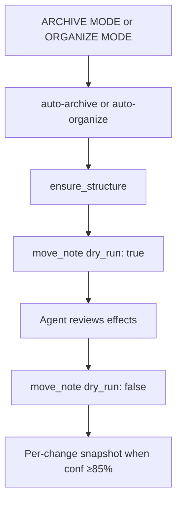
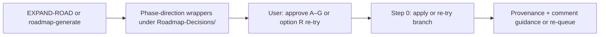
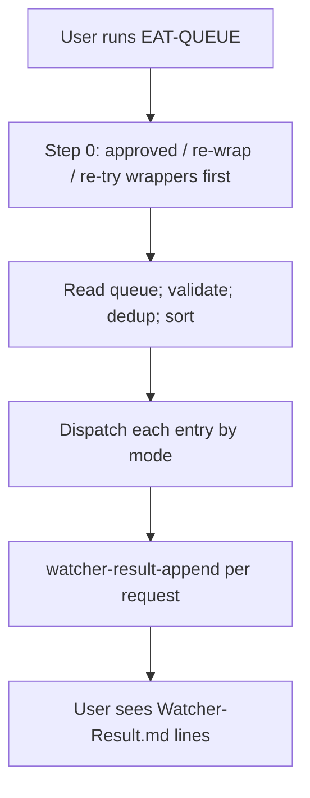
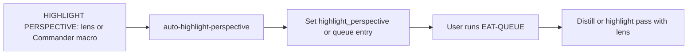

# User Flow — Rules (Mid-Level)

This document builds on the high-level user flow by adding **per-pipeline** branches from the rules’ point of view: what the user sees after ingest Phase 1 (Decision Wrapper A–G), in the mid-band loop (preview and approve), when choosing lens/view for distill and express, when reviewing proposed archive/organize moves, and when processing the queue. Each decision point is tied to the rule(s) that govern it.

---

## Ingest Phase 1 → Decision Wrapper (rules and user options)

- **Rules:** **para-zettel-autopilot** (context) plus **always-ingest-bootstrap** when the user says INGEST MODE / Process Ingest. Phase 1 creates/refreshes a Decision Wrapper under Ingest/Decisions/ with exactly 7 options A–G (from propose_para_paths in wrapper mode). **second-brain-standards** and **mcp-obsidian-integration** (no default path) ensure the template has no default approved_option or approved_path.

- **User is presented with:** Wrapper note containing options A, B, C, D, E, F, G (each a ranked PARA path; order from post-process stabilizer: re-rank by PARA rubric → semantic fit → path depth → alphabetize; exactly 7 via pad-to-7) and optionally option 0 (reject all). When order was adjusted, wrapper has heuristic_adjusted and heuristic_reason for audit.

- **User choices and which rules respond:**
  - Check one of A–G and set **approved: true** in frontmatter (manual). Optionally add **user_guidance** multiline. Watcher (plugin, not Cursor rule) may then sync the checked option → approved_option and approved_path when approved: true is already set (documented in Pipelines, Cursor-Skill-Pipelines-Reference). User runs **EAT-QUEUE** → **auto-eat-queue** Step 0 runs; **feedback-incorporate** resolves approved_path from frontmatter or parses body; apply-mode ingest runs (move/rename to approved_path), or phase-direction apply (provenance + comment guidance; wrapper → 4-Archives/Ingest-Decisions/Roadmap-Decisions/).
  - Set **re-wrap: true** or check **option 0** → User runs EAT-QUEUE → Step 0 runs re-wrap branch (auto-eat-queue): archive wrapper to Re-Wrap/, create new wrapper from Thoughts.
  - Check **option R** or set **re-try: true** (phase-direction/roadmap wrappers only) → User runs EAT-QUEUE → Step 0 runs re-try branch: append queue entry (EXPAND-ROAD or TASK-TO-PLAN-PROMPT) with guidance; wrapper archived to Roadmap-Decisions; capped by re_try_max_loops (on cap: cap-hit wrapper created).
  - Ignore → Note stays in Ingest; wrapper remains pending; no rule performs a move.

---

## Mid-band refinement loop (rules and user choices)

- **Rules:** **confidence-loops** (always) plus each pipeline rule (auto-distill, auto-archive, auto-express, auto-organize). Mid-band = 68–84%; at most one non-destructive refinement loop; commit only if post_loop_conf ≥85%.

- **User is presented with:** Either a preview written to Mobile-Pending-Actions (if async preview enabled) or an in-run re-score and proposal. Text may say to set approved: true or add feedback and re-run.

- **User choices:**
  - Set **approved: true** on the note (or add feedback) and run **EAT-QUEUE** or re-run → **feedback-incorporate** loads approved/feedback; pipeline re-runs; if post_loop_conf ≥85%, **mcp-obsidian-integration** and pipeline rule require snapshot then commit.
  - Ignore → No destructive action; proposal remains; rules require logging loop_* and no commit.

---

## Distill (rules and lens choice)

- **Rules:** **auto-distill** for DISTILL MODE; **auto-distill-perspective** for DISTILL LENS: [angle]. Pipeline runs autonomous-distill; when distill_lens is set, skills use it for depth/TL;DR indicators.

- **User is presented with:** Note updated with TL;DR callout and highlights (high confidence); or preview / shallower plan (mid); or only readability-flag and metadata (low). If user said DISTILL LENS: angle, the same rule flow applies with lens set.

- **User choices:** Default trigger (DISTILL MODE) vs with lens (DISTILL LENS: angle). Mid-band: approve or add feedback and re-run (same as above); otherwise no structural commit.

---

## Express (rules and view choice)

- **Rules:** **auto-express** for EXPRESS MODE; **auto-express-view** for EXPRESS VIEW: [angle]. Pipeline runs autonomous-express; express_view shapes outline and Related section.

- **User is presented with:** Related section, outline, CTA callout (high); or short preview outline (mid); or optional minimal CTA (low).

- **User choices:** Default (EXPRESS MODE) vs EXPRESS VIEW: angle. Mid-band: re-run with approval or feedback for commit.

---

## Archive / Organize (rules and proposed move)

- **Rules:** **auto-archive** (ARCHIVE MODE), **auto-organize** (ORGANIZE MODE). Both require **ensure_structure** then **move_note** with **dry_run: true** then **dry_run: false** (mcp-obsidian-integration). Per-change snapshot before move/rename when confidence ≥85%.

- **User is presented with:** Dry_run effects in the run output (path, new_path, backup status, risks) before the agent commits. Mid-band: 2–3 path candidates and scores; low: proposal only, no move.

- **User choices:** None required for high confidence (agent reviews dry_run then commits). Mid: user can approve and re-run; if post_loop_conf ≥85%, snapshot and move. Low: user must add approved and optionally user_guidance and run EAT-QUEUE for a guidance-aware apply.

---

## Roadmap and phase-direction (rules and user flow)

- **Rules:** After **EXPAND-ROAD** or **roadmap-generate-from-outline**, phase-direction wrappers may be created under **Ingest/Decisions/Roadmap-Decisions/** when a phase implies choices (phase_forks frontmatter or heuristic). Step 0 applies them (provenance + comment guidance on roadmap note) or runs re-try branch (option R). **TASK-TO-PLAN-PROMPT** queue mode turns a roadmap task into a Cursor-ready prompt (template Planning-Prompt-Task.md).

- **User is presented with:** Phase-direction wrapper (A–G + R); approve one direction or re-try with guidance. Plan evolution in Wrapper-MOC and 4-Archives/Ingest-Decisions/Roadmap-Decisions.

---

## Queue processing (rules and user flow)

- **Rule:** **auto-eat-queue**. Step 0 always runs first (approved / re-wrap / re-try wrappers); then queue is read, validated, deduped, sorted; each entry dispatched by mode (including EXPAND-ROAD, TASK-TO-PLAN-PROMPT); **watcher-result-append** (always) appends one line per request to Watcher-Result.md.

- **User is presented with:** Watcher-Result.md line(s): requestId, status (success or failure), message, completed timestamp. For task-queue entries, success &gt; failure may trigger banner cleanup (pending callout removed from note) per pipeline/queue rules.

- **User choices:** Add entries via Watcher/Commander/mobile toolbar or by editing the queue file; run EAT-QUEUE or Process queue (or PROCESS TASK QUEUE for Task-Queue.md). Single entry → fast-path (no dedup/sort); multiple → canonical order with CHECK_WRAPPERS first.

---

## Highlight perspective (rules and optional lens)

- **Rule:** **auto-highlight-perspective** (HIGHLIGHT PERSPECTIVE: [lens]). Sets highlight_perspective or queue payload; distill or highlight pass runs with that lens.

- **User is presented with:** Highlighting applied with analogous colors for the lens. Can be triggered by phrase or by Commander macro (e.g. Queue Highlight: Combat) that adds a queue entry; user runs EAT-QUEUE to process.
