# User Flow — Skills (Detailed)

This document maps every documented skill to the user’s flow: slot order (from Cursor-Skill-Pipelines-Reference), user-visible output (callouts, frontmatter changes, previews, proposals), and decision points (approve path, add user_guidance, dry_run review, async approve via Commander/mobile). It includes confidence-band branches that affect what the user sees, queue-triggered skill runs (SEEDED-ENHANCE, BATCH-DISTILL, NAME-REVIEW), and re-queue after user edit. All interactions are from Pipelines, Cursor-Skill-Pipelines-Reference, Skills, Parameters, Rules, Queue-Sources, Templates, Backbone, and Logs.

---

## User flow – Ingest: full skill order and user-visible outputs

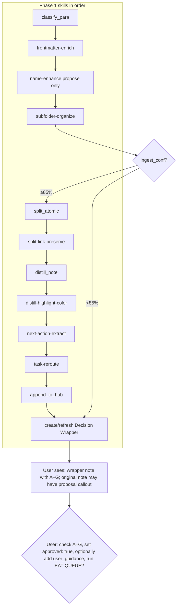

---

## User flow – Decision Wrapper: exact options user is presented with

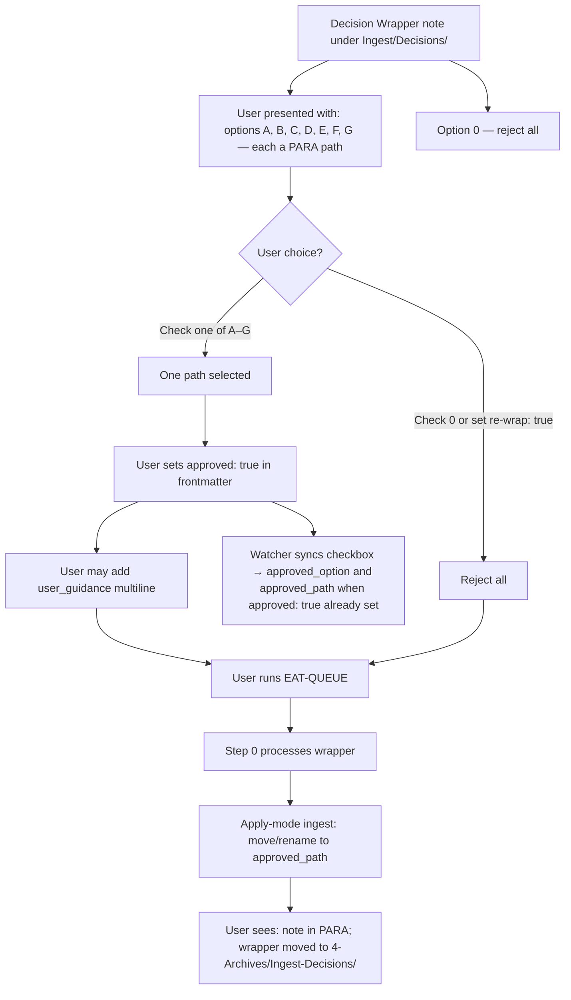

---

## User flow – Proposal and preview callouts (Templates.md text)

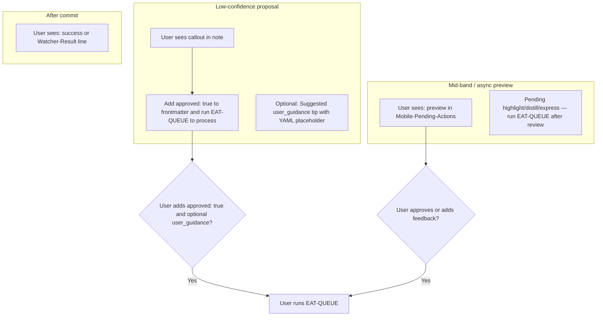

---

## User flow – Confidence band and what user sees

```mermaid
flowchart TD
  Eval[Pipeline evaluates confidence]
  Eval --> High{≥85%?}
  Eval --> Mid{68–84%?}
  Eval --> Low{&lt;68%?}
  High --> Silent[No user choice]
  Silent --> Out1[User sees: updated note or move result; Watcher-Result]
  Mid --> Loop[One refinement loop]
  Loop --> Async{Async preview?}
  Async -->|Yes| Write[Preview to Mobile-Pending-Actions]
  Write --> Out2[User presented with: preview]
  Out2 --> Act{Choices: A) approved: true B) feedback C) ignore}
  Async -->|No| Rescore[Re-score]
  Rescore --> Post{post_loop_conf ≥85%?}
  Post -->|Yes| Out1
  Post -->|No| Out3[User sees: proposal or #review-needed; no destructive action]
  Low --> Wrapper[Decision Wrapper and/or proposal callout]
  Wrapper --> Out4[User presented with: Add user_guidance and approved: true, then EAT-QUEUE]
  Act -->|A or B| ReRun[User runs EAT-QUEUE]
  Act -->|C| Out3
  ReRun --> Out1
```

---

## User flow – dry_run review (move/rename)

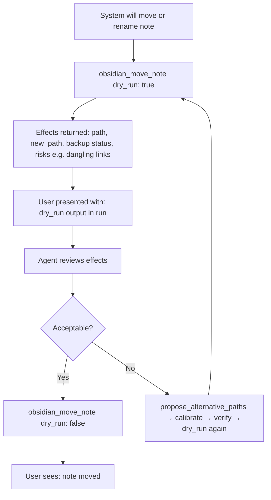

---

## User flow – Async approve (Commander / mobile)

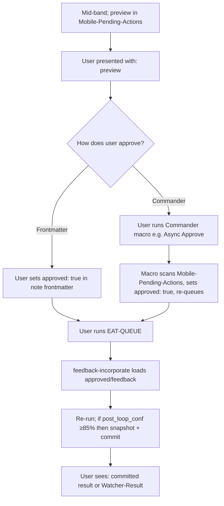

---

## User flow – Guidance-aware re-run (user adds user_guidance and approved: true)

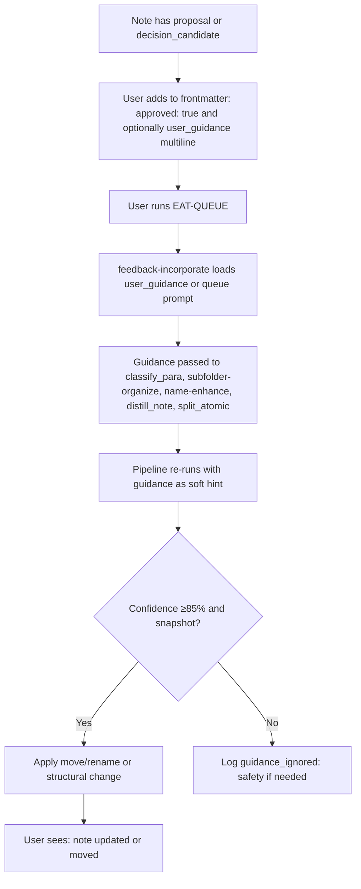

---

## User flow – Distill skills and user-visible output (slot order)

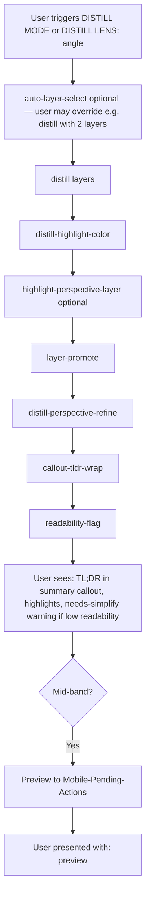

---

## User flow – Express skills and user-visible output (slot order)

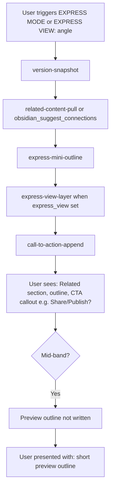

---

## User flow – Archive skills and user-visible output (slot order)

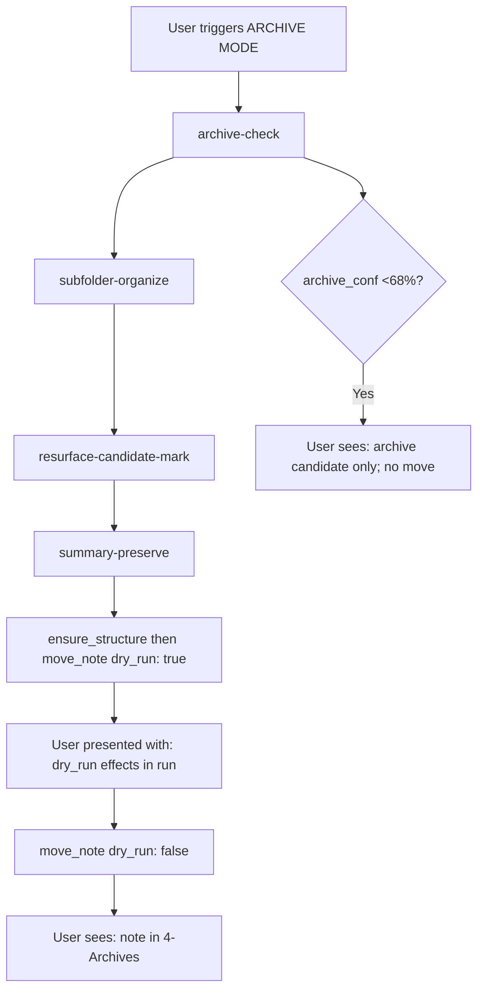

---

## User flow – Organize skills and user-visible output (slot order)

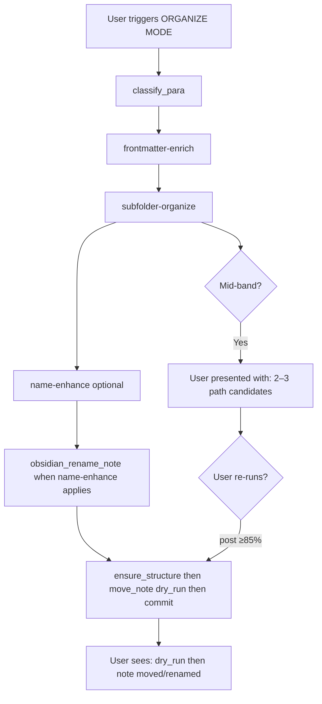

---

## User flow – Queue modes and which skills run (user adds entry)

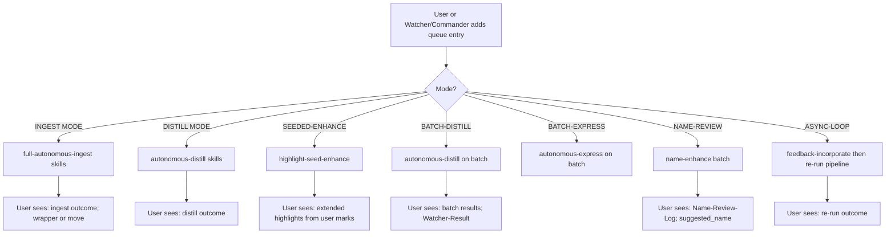

---

## User flow – Re-queue after user edit (approved: true)

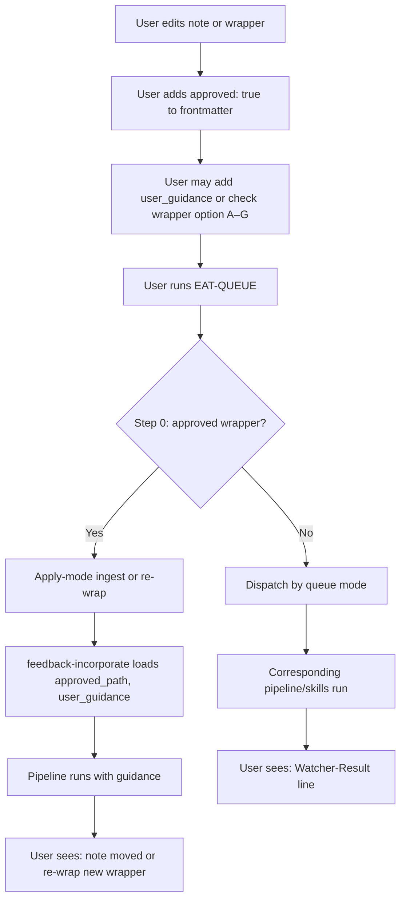

---

## User flow – Re-wrap branch (user choice option 0)

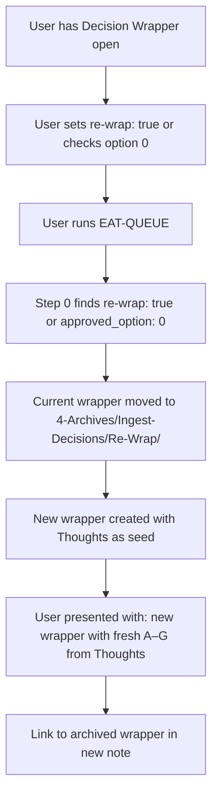

---

## User flow – Task queue and banner cleanup (user sees)

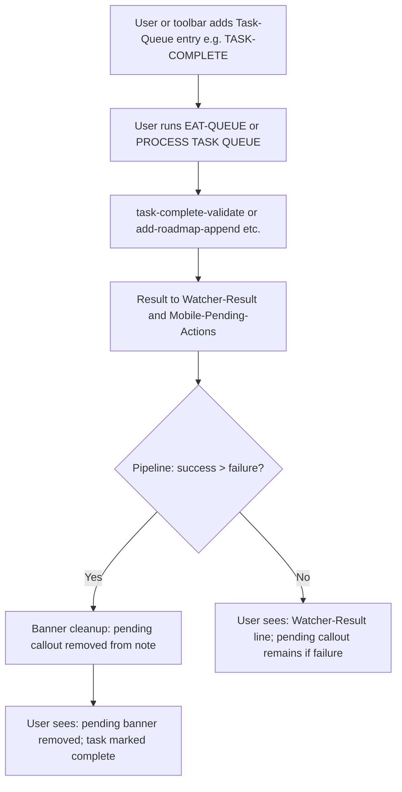
