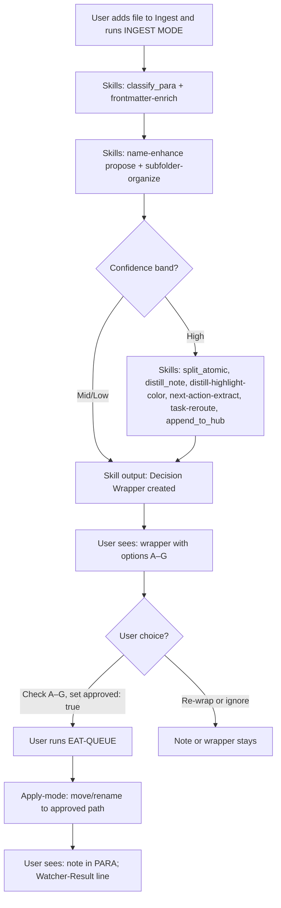
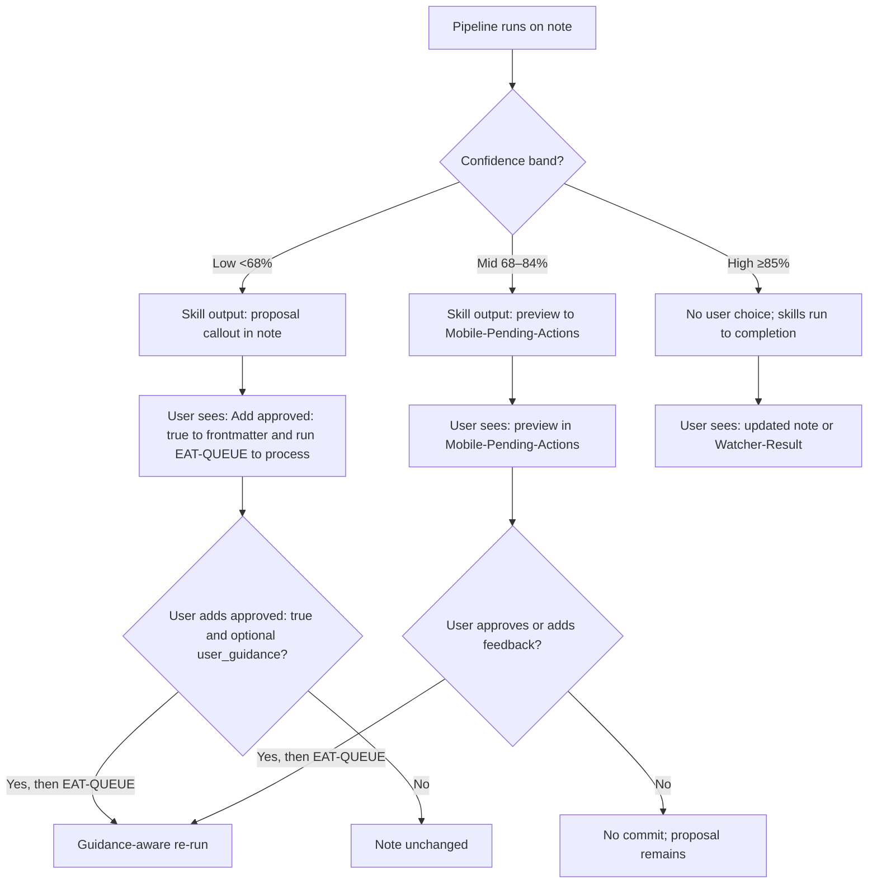
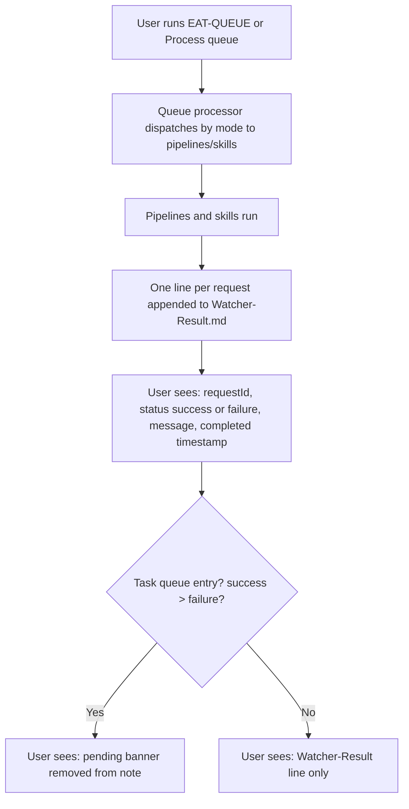

# User Flow — Skills (High-Level)

This document shows when and where the user is involved as skills run: major skill groups per pipeline as the user experiences them (e.g., ingest → classification + frontmatter + organize proposal → distill layers + highlights → hub append). It focuses only on user touchpoints—what the user sees or chooses—without per-skill slot detail. Mid-level and detailed docs add full skill sequences and every decision point.

---

## User flow – Ingest: major skill groups and user touchpoints

---

## User flow – Distill / Express / Archive: major skill groups and user touchpoints

```mermaid
flowchart TD
  subgraph Distill [Distill]
    D1[User triggers DISTILL MODE or BATCH-DISTILL]
    D1 --> D2[Skills: distill layers, distill-highlight-color, layer-promote, callout-tldr-wrap, readability-flag]
    D2 --> D3{Confidence?}
    D3 -->|High| D4[User sees: note updated with TL;DR callout and highlights]
    D3 -->|Mid| D5[User sees: preview in Mobile-Pending-Actions]
    D5 --> D6{User adds approved: true and re-runs?}
    D6 -->|Yes| D4
    D6 -->|No| D7[Preview remains]
  end
  subgraph Express [Express]
    E1[User triggers EXPRESS MODE]
    E1 --> E2[Skills: version-snapshot, related-content-pull, express-mini-outline, call-to-action-append]
    E2 --> E3[User sees: Related section, outline, CTA callout]
  end
  subgraph Archive [Archive]
    A1[User triggers ARCHIVE MODE]
    A1 --> A2[Skills: archive-check, subfolder-organize, summary-preserve]
    A2 --> A3[User sees: dry_run effects in run output before move]
    A3 --> A4[Note moved to 4-Archives; user sees result]
  end
```

---

## User flow – When user sees proposal or preview callouts

---

## User flow – Queue and Watcher-Result (user sees skill outcome)

