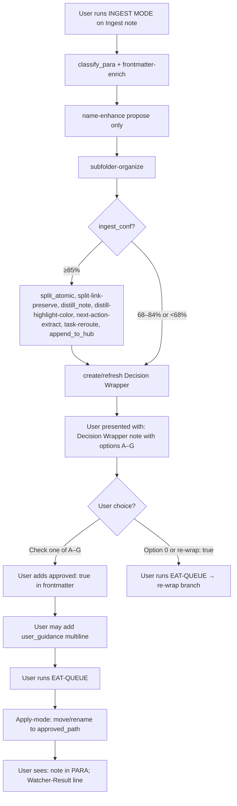
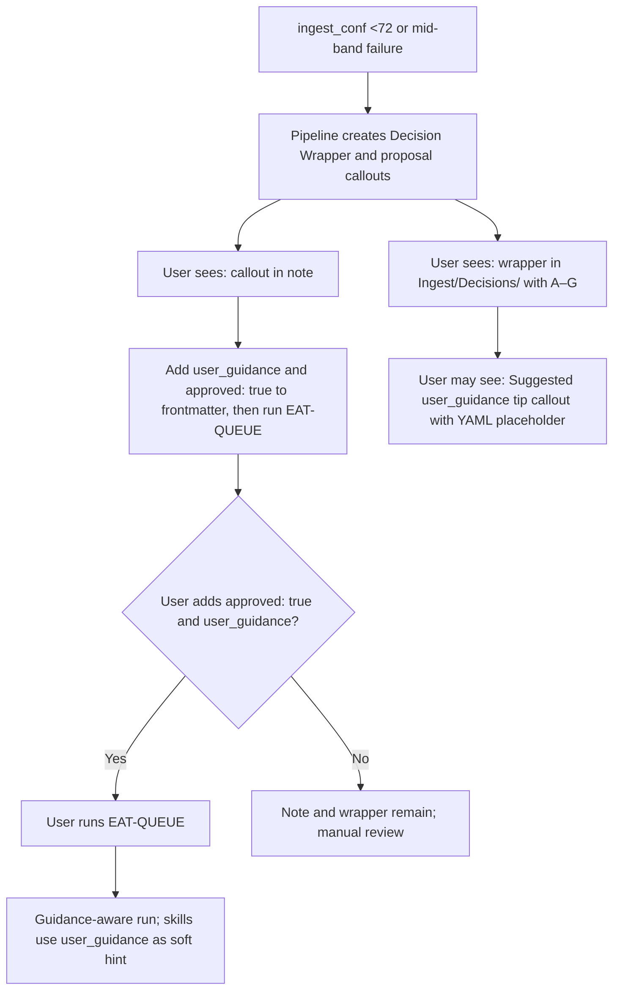
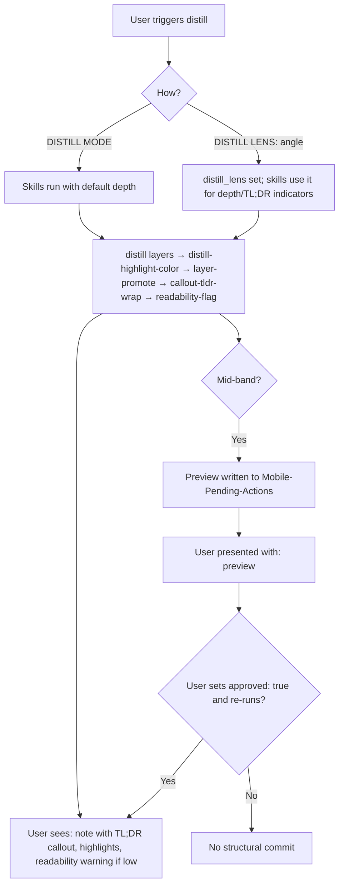
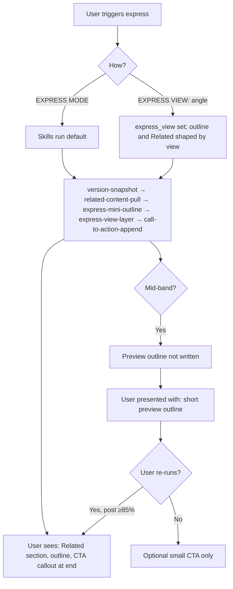
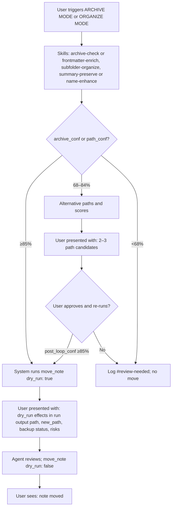
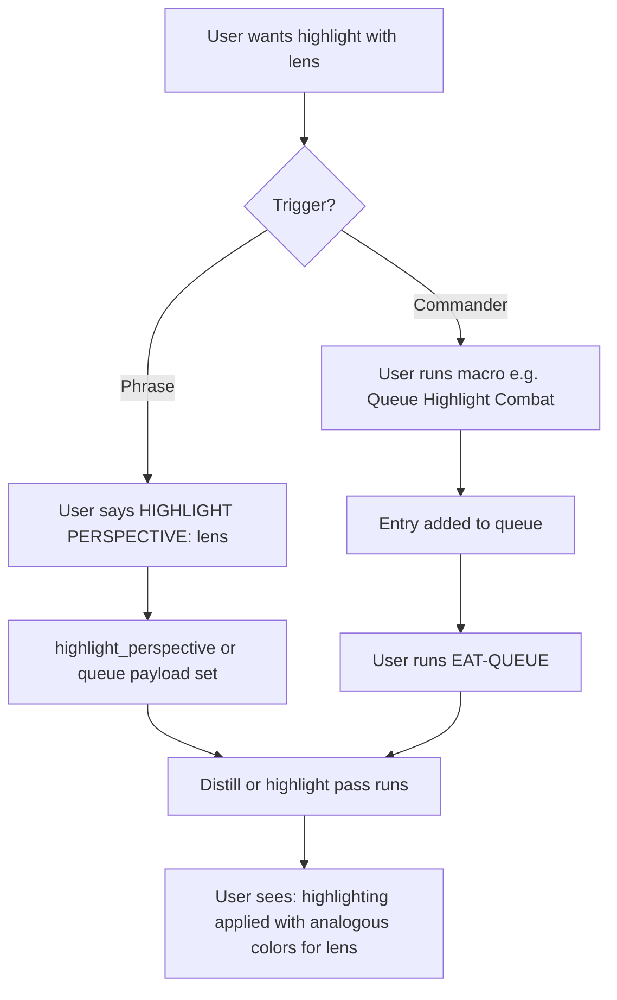
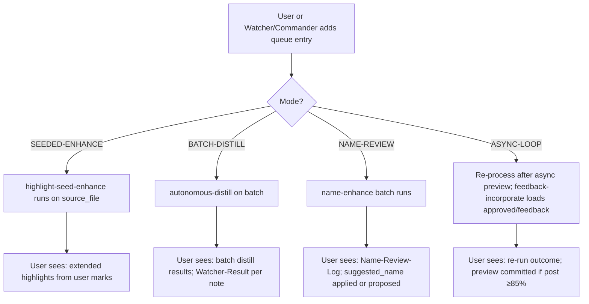

# User Flow — Skills (Mid-Level)

This document expands the high-level view to key skill sequences and user touchpoints per pipeline: the full ingest chain (classify_para → frontmatter-enrich → name-enhance propose → subfolder-organize → split → distill → highlights → next-action → task-reroute → hub), distill lens/perspective choice, express view choice, mid-band loop preview, and archive proposal review. Every decision diamond is a documented point where the user sees skill output or makes a choice.

---

## User flow – Ingest skill chain and user touchpoints



---

## User flow – Ingest low-confidence: proposal callout and wrapper



---

## User flow – Distill: lens choice and skill output



---

## User flow – Express: view choice and skill output



---

## User flow – Mid-band loop: preview and user choice

```mermaid
flowchart TD
  Mid[Pipeline in mid-band 68–84%]
  Mid --> Loop[Single refinement loop]
  Loop --> Async{Async preview enabled?}
  Async -->|Yes| Write[Preview written to Mobile-Pending-Actions]
  Write --> User1[User presented with: preview in Mobile-Pending-Actions]
  User1 --> Choices{Choices: A) Set approved: true on note B) Add feedback text C) Ignore}
  Choices -->|A or B| ReRun[User runs EAT-QUEUE or re-run]
  Choices -->|C| NoCommit[No destructive action; proposal remains]
  ReRun --> Check{post_loop_conf ≥85%?}
  Check -->|Yes| Commit[Snapshot then commit]
  Check -->|No| NoCommit
  Async -->|No| Rescore[Re-score; post_loop_conf]
  Rescore --> High{post_loop_conf ≥85%?}
  High -->|Yes| Commit
  High -->|No| NoCommit
```

---

## User flow – Archive / Organize: dry_run review and proposal



---

## User flow – Highlight perspective (user-triggered lens)



---

## User flow – Queue-triggered skill runs (user adds entry then EAT-QUEUE)


