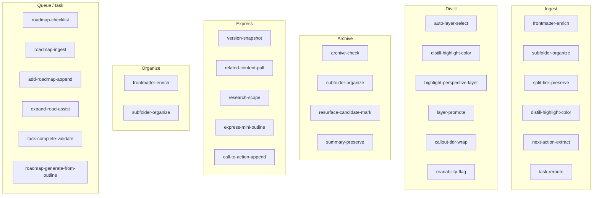
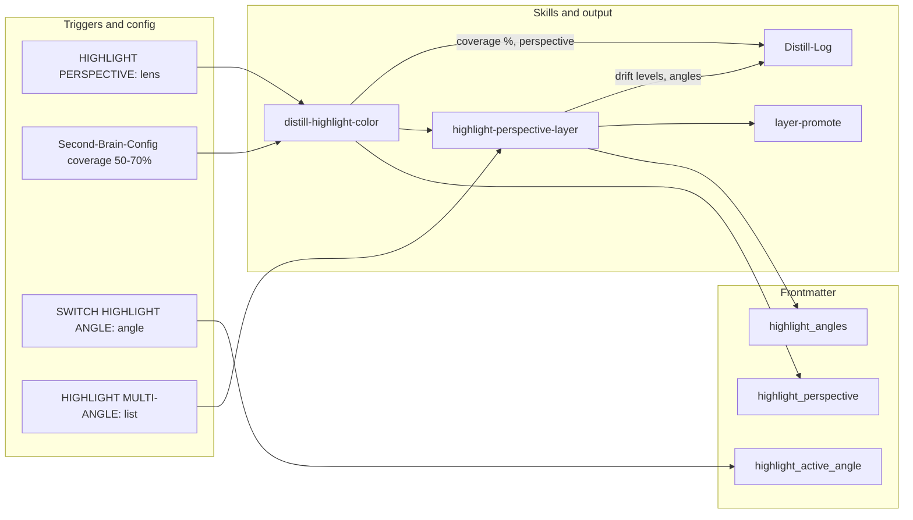

# Second Brain Skills

Per-skill behavior in `.cursor/skills/<name>/SKILL.md` and pipeline order in [[3-Resources/Second-Brain/Cursor-Skill-Pipelines-Reference|Cursor-Skill-Pipelines-Reference]]. **Cross-pipeline**: Ensure `highlight_angles` / `highlight_perspective` (and `distill_lens`, `express_view`) propagate via frontmatter so highlighter depths feed into distill/express (e.g. express-mini-outline can read `highlight_angles` for section colors).

## Skills table

| Skill | Path | Used in pipeline(s) | Slot (after) | One-line purpose | Responsibilities |
|-------|------|---------------------|--------------|------------------|------------------|
| prompt-crafter | (doc-only; optional skill) | ingest, organize | — | Assemble/validate params from config/templates | Used in ingest/organize pipelines; slots **before** classify_para when implemented; validates queue/Config params against MCP-Tools; implementation follow-up |
| frontmatter-enrich | .cursor/skills/frontmatter-enrich/SKILL.md | ingest, organize | classify_para | Set status, confidence, para-type, created, links; optional project-id | Set status, para-type, created, links from classification; optional project-id, priority, deadline |
| name-enhance | .cursor/skills/name-enhance/SKILL.md | ingest, organize, queue (NAME-REVIEW) | frontmatter-enrich (ingest); subfolder-organize (organize) | Propose or apply better filename; protections for MOC/hub/index/project | Ingest: propose only; subfolder-organize commits via move. Organize/name-review: apply with snapshot when confidence tier met; after rename sync frontmatter title from new slug (required). |
| subfolder-organize | .cursor/skills/subfolder-organize/SKILL.md | ingest, archive, organize | frontmatter-enrich / archive-check; name-enhance (ingest) | Build target path (max 4 levels) from para-type + project-id + themes; use suggested_filename when provided | Build target path (max 4 levels); accept optional suggested_filename from name-enhance; path segment kebab-slug-YYYY-MM-DD-HHMM per Naming-Conventions (date and time at end); move via MCP. **Post-process stabilizer:** After propose_para_paths, re-rank by PARA-Actionability-Rubric v1.0 → semantic fit → path depth → alphabetize; pad to 7 (A–G) with deterministic fallbacks; set heuristic_adjusted/heuristic_reason on wrapper when order changed. |
| split-link-preserve | .cursor/skills/split-link-preserve/SKILL.md | ingest | split_atomic | split_from / split_into links; Splits section on parent | Write split_from on each child; split_into or Splits section on parent; traceability |
| distill-highlight-color | .cursor/skills/distill-highlight-color/SKILL.md | ingest, distill | distill_note | Apply Highlightr colors; 50–70% coverage; perspective/lens | Apply colors from master key + project highlight_key; analogous/complementary; log coverage_adapted, perspective. **Post-process stabilizer:** Short-note core bias (config short_note_word_threshold, default_core_bias); emoji fallback only when mobile context detected; log heuristic e.g. short-note-core-bias applied (N words < threshold). |
| highlight-perspective-layer | .cursor/skills/highlight-perspective-layer/SKILL.md | distill (optional ingest) | distill-highlight-color | data-drift-level (0–3); highlight_angles frontmatter | Set data-drift-level; store highlight_angles in frontmatter; log to Distill-Log |
| highlight-seed-enhance | .cursor/skills/highlight-seed-enhance/SKILL.md | queue (SEEDED-ENHANCE) | — | User <mark> as cores; extend with AI | Treat user marks as cores; extend with analogous color; optional drift; log seed count |
| next-action-extract | .cursor/skills/next-action-extract/SKILL.md | ingest | distill-highlight-color | Extract tasks → checklists + next-actions frontmatter | Extract tasks into checklists and next-actions frontmatter for Dataview |
| task-reroute | .cursor/skills/task-reroute/SKILL.md | ingest | next-action-extract | Find parent; create task note or append_tasks; snapshot target | find_parent; create_task_note or append_tasks; snapshot target before append |
| link-to-pmg-if-applicable | .cursor/skills/link-to-pmg-if-applicable/SKILL.md | ingest | append_to_hub | When project-id set, append PMG wikilink to note's links | Read project-id; find PMG in 1-Projects/<id>/; append to links; never edit PMG |
| auto-layer-select | .cursor/skills/auto-layer-select/SKILL.md | distill | before distill layers | Suggest 1/2/3 layers from content complexity | Suggest layers from complexity; manual override remains |
| layer-promote | .cursor/skills/layer-promote/SKILL.md | distill | highlight-perspective-layer or distill-highlight-color | Bold → highlight → TL;DR; project colors | Promote bold → highlight → TL;DR; project color overrides; contrast for conflicting ideas |
| callout-tldr-wrap | .cursor/skills/callout-tldr-wrap/SKILL.md | distill | layer-promote | Wrap TL;DR in summary callout | Wrap TL;DR in `> [!summary] TL;DR` callout |
| distill-perspective-refine | .cursor/skills/distill-perspective-refine/SKILL.md | distill | layer-promote | Emojis/gradient in TL;DR for depth/drift | Add depth/drift indicators in TL;DR; use distill_lens when set; log lens + gradient stats |
| readability-flag | .cursor/skills/readability-flag/SKILL.md | distill | callout-tldr-wrap | needs-simplify + warning callout when low readability | Set needs-simplify frontmatter; insert warning callout when readability low |
| archive-check | .cursor/skills/archive-check/SKILL.md | archive | classify_para | No open tasks, status complete, age threshold; archive_conf | Evaluate archive readiness; cross-check project subfolders; output archive_conf. **Post-process stabilizer:** When age > no_activity_days and (#stale or #review-later), raise confidence floor +5–8%; never when status active/evergreen. |
| resurface-candidate-mark | .cursor/skills/resurface-candidate-mark/SKILL.md | archive | subfolder-organize | resurface-candidate: true; optional Resurface hub append | Mark high-potential notes; optionally append to Resurface hub |
| summary-preserve | .cursor/skills/summary-preserve/SKILL.md | archive | resurface-candidate-mark | TL;DR/summary callout; preserve project color links | Ensure minimal TL;DR/summary exists; preserve project color links before move |
| archive-ghost-folder-sweep | .cursor/skills/archive-ghost-folder-sweep/SKILL.md | autonomous-archive | log_action | Remove empty moved-note ancestors via MCP tool | Collect/sort candidates from moved_notes_list; pull folder_blacklist from config; loop obsidian_remove_empty_folder (dry_run then commit); log to Archive-Log with #ghost-sweep |
| version-snapshot | .cursor/skills/version-snapshot/SKILL.md | express | before major append | Dated snapshot in Versions/; mode create | Create dated snapshot in Versions/ before major append; preserve original content and colors |
| related-content-pull | .cursor/skills/related-content-pull/SKILL.md | express | version-snapshot | Pull similar notes; Related section | Pull similar notes via semantic + project-id; append Related section; color-theory emphasis |
| research-scope | .cursor/skills/research-scope/SKILL.md | express | related-content-pull | Aggregate Resources for PMG; proposal callout then commit when approved | Detect PMG; search 3-Resources by project-id/phases; propose-first callout with source citation; confidence gates; commit on second pass |
| express-mini-outline | .cursor/skills/express-mini-outline/SKILL.md | express | related-content-pull | Mini-outline or summary; project colors; express_view shapes outline | Generate outline/summary; project colors for sections; express_view shapes outline |
| express-view-layer | .cursor/skills/express-view-layer/SKILL.md | express | related-content-pull or express-mini-outline | Connection strength in Related; log view + relation stats | Apply connection strength indicators in Related when express_view set; log to Express-Log |
| call-to-action-append | .cursor/skills/call-to-action-append/SKILL.md | express | express-mini-outline | CTA callout at end (e.g. Share/Publish?) | Append CTA callout at end; optional color by action type or project |
| obsidian-snapshot | .cursor/skills/obsidian-snapshot/SKILL.md | all | before destructive step | Per-change and batch snapshots in Backups/ | Create per-change or batch snapshot in Backups/ before destructive MCP action; retention guidance |
| roadmap-checklist | .cursor/skills/roadmap-checklist/SKILL.md | queue / manual | — | Hierarchical checklist from roadmap note + links | Produce hierarchical checklist from roadmap + [[links]]; optional flatten, status-sync |
| roadmap-ingest | .cursor/skills/roadmap-ingest/SKILL.md | queue | — | Parse roadmap from queue path; standardize phases/tasks | Read roadmap from queue path; parse structure; standardize to phases/subphases/tasks |
| roadmap-generate-from-outline | .cursor/skills/roadmap-generate-from-outline/SKILL.md | queue / ROADMAP MODE | — | Generate full project roadmap tree from outline note (trigger: ROADMAP MODE – generate from outline or dedicated queue mode). Preferred seed = note with filename containing Master-Goal or MasterGoal under project root; if multiple, prefer highest created or roadmap-seed: true. | Create project folder + Roadmap subtree, master roadmap, per-phase roadmap notes, and project roadmap MOC; move original seed into Roadmap/Source; set provenance and roadmap_generation_status; no longer invoked from ingest apply-mode |
| add-roadmap-append | .cursor/skills/add-roadmap-append/SKILL.md | queue | — | Append one line to roadmap under section | Append one line to primary roadmap under chosen section; optional duplicate check |
| expand-road-assist | .cursor/skills/expand-road-assist/SKILL.md | queue | — | Parse sub-phases/tasks; append under target; **post-step:** phase fork detection | Parse user text into sub-phases/tasks; append under target section; link back to roadmap. **Post-step:** When phase_fork_heuristic is "strict", scan output for "or"/"vs"/"options:" → set phase_forks frontmatter and auto-queue Phase Direction Wrapper; when creating wrapper, options A–G = conceptual end-state only (one sentence per option, no tech terms); technical in frontmatter for provenance. When "off", only explicit phase_forks trigger wrapper. Low-conf (<68%): propose-only. See Second-Brain-Config § roadmap, Parameters § phase_fork_heuristic, Cursor-Skill-Pipelines-Reference § Phase-direction wrapper creation. |
| task-complete-validate | .cursor/skills/task-complete-validate/SKILL.md | queue | — | Validate task complete; mark [x] when subtasks done | Locate task; detect subtasks; mark [x] only when all subtasks complete |
| queue-cleanup | .cursor/skills/queue-cleanup/SKILL.md | queue (auto-eat-queue) | after dedup | Auto-mark failed entries; append to Errors.md | Mark failed entries queue_failed: true; append summary to Errors.md; trigger via auto_cleanup_after_process |
| feedback-incorporate | .cursor/skills/feedback-incorporate/SKILL.md | queue / async re-run | start or when re-running after preview | Scan for approved/feedback; load user_guidance; emit guidance object | Scan queue/Mobile-Pending-Actions for approved or feedback; adapt lens, liberalness; load user_guidance (or queue prompt); emit guidance_text, guidance_used, guidance_length, guidance_truncated for pipeline context; interpret Decision Wrappers: prefer `approved_path` from frontmatter, fallback parse body for A–G path; treat `re-wrap: true` or `approved_option: 0` as no path (re-wrap branch); emit hard target path + `guidance_conf_boost` for ingest; no destructive writes; used by ingest/organize/distill when guidance-aware |
| distill-apply-from-wrapper | .cursor/skills/distill-apply-from-wrapper/SKILL.md | queue (Step 0) | when applying approved refinement wrapper (pipeline: distill) | Re-run autonomous-distill with approved_option as distill_lens | Read wrapper original_path, approved_option; resolve distill_lens/depth; run autonomous-distill on original_path with overrides; Step 0 updates/moves wrapper |
| express-apply-from-wrapper | .cursor/skills/express-apply-from-wrapper/SKILL.md | queue (Step 0) | when applying approved refinement wrapper (pipeline: express) | Re-run autonomous-express with approved_option as express_view | Read wrapper original_path, approved_option; resolve express_view; run autonomous-express on original_path with overrides; Step 0 updates/moves wrapper |
| log-rotate | .cursor/skills/log-rotate/SKILL.md | manual / monthly | — | Copy pipeline logs to Logs-Archive/; truncate or fresh | Rotate pipeline logs to Logs-Archive/; truncate or start fresh; "Rotate logs" command |
| move-attachment-to-99 | .cursor/skills/move-attachment-to-99/SKILL.md | ingest fallback (user-invoked only) | — | Fallback move Ingest → 5-Attachments when MCP move_note fails for binaries | Explicit user request only; backup → ensure_structure → mv (only shell exception); update companion .md; log; scope strictly Ingest/ → 5-Attachments/[subtype] |

## Usage examples

- **After classify_para in ingest**, run **frontmatter-enrich** then **subfolder-organize** to get the target path; skills use MCP manage_frontmatter and subfolder_organize (or the skill builds path and move_note is called after snapshot).
- **Before any move in archive**, run **summary-preserve** so the note has a minimal TL;DR/summary callout and project color links are preserved before the note is moved to 4-Archives/.
- **When running autonomous-distill**, the chain is: (optional auto-layer-select) → distill layers → **distill-highlight-color** → **highlight-perspective-layer** (optional) → **layer-promote** → **distill-perspective-refine** → **callout-tldr-wrap** → **readability-flag**.

## Skills by pipeline

## Ingest skill chain

## Highlighter flow (depth)

