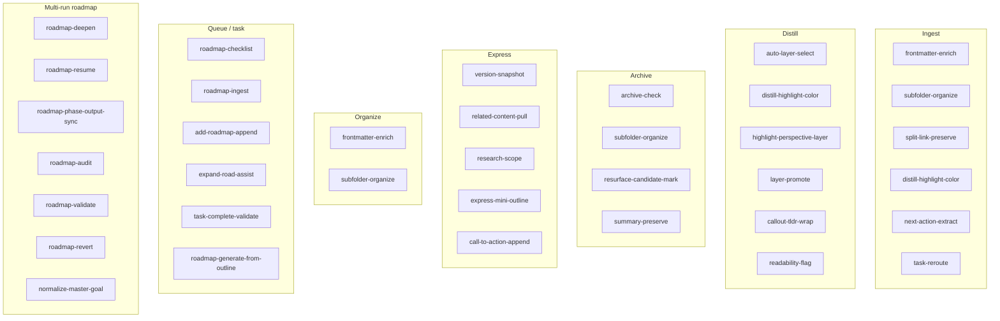
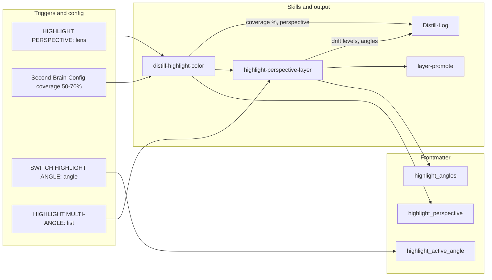

**TL;DR** — Per-skill behavior in `.cursor/skills/<name>/SKILL.md`; pipeline order and slots in [[3-Resources/Second-Brain/Cursor-Skill-Pipelines-Reference|Cursor-Skill-Pipelines-Reference]]. Use the Skills table for slot (after) and one-line purpose; snapshot before destructive steps per Cursor-Skill-Pipelines-Reference § Snapshot triggers.

---

## Quick Reference — Skills by pipeline

| Pipeline | Key skills (order) |
|----------|---------------------|
| full-autonomous-ingest | classify_para → frontmatter-enrich → name-enhance (propose) → subfolder-organize → split_atomic → split-link-preserve → distill_note → distill-highlight-color → next-action-extract → task-reroute → append_to_hub → Decision Wrapper |
| autonomous-distill | auto-layer-select → distill layers → distill-highlight-color → highlight-perspective-layer → layer-promote → distill-perspective-refine → callout-tldr-wrap → readability-flag |
| autonomous-archive | archive-check → subfolder-organize → resurface-candidate-mark → summary-preserve → move_note → archive-ghost-folder-sweep |
| autonomous-express | version-snapshot → related-content-pull → express-mini-outline → express-view-layer → call-to-action-append |
| autonomous-organize | classify_para → frontmatter-enrich → subfolder-organize → name-enhance (optional) → move_note |

---

## Skills table (full)

| Skill | Path | Used in pipeline(s) | Slot (after) | One-line purpose | Responsibilities |
|-------|------|---------------------|--------------|------------------|------------------|
| prompt-crafter | (doc-only; optional skill) | ingest, organize | — | Assemble/validate params from config/templates | Used in ingest/organize pipelines; slots **before** classify_para when implemented; validates queue/Config params against MCP-Tools; implementation follow-up |
| frontmatter-enrich | .cursor/skills/frontmatter-enrich/SKILL.md | ingest, organize | classify_para | Set status, confidence, para-type, created, links; optional project-id | Set status, para-type, created, links from classification; optional project-id, priority, deadline |
| name-enhance | .cursor/skills/name-enhance/SKILL.md | ingest, organize, queue (NAME-REVIEW) | frontmatter-enrich (ingest); subfolder-organize (organize) | Propose or apply better filename; protections for MOC/hub/index/project | Ingest: propose only; subfolder-organize commits via move. Organize/name-review: apply with snapshot when confidence tier met; after rename sync frontmatter title from new slug (required). |
| subfolder-organize | .cursor/skills/subfolder-organize/SKILL.md | ingest, archive, organize | frontmatter-enrich / archive-check; name-enhance (ingest) | Build target path (max 4 levels) from para-type + project-id + themes; use suggested_filename when provided | Build target path (max 4 levels); accept optional suggested_filename from name-enhance; path segment kebab-slug-YYYY-MM-DD-HHMM per Naming-Conventions (date and time at end); move via MCP. **Post-process stabilizer:** After propose_para_paths, re-rank by PARA-Actionability-Rubric v1.0 → semantic fit → path depth → alphabetize; pad to 7 (A–G) with deterministic fallbacks; set heuristic_adjusted/heuristic_reason on wrapper when order changed. |
| split-link-preserve | .cursor/skills/split-link-preserve/SKILL.md | ingest | split_atomic | split_from / split_into links; Splits section on parent | Write split_from on each child; split_into or Splits section on parent; traceability |
| distill-highlight-color | .cursor/skills/distill-highlight-color/SKILL.md | ingest, distill | distill_note | Apply Highlightr colors; 50–70% coverage; perspective/lens | Apply colors from master key + project highlight_key; analogous/complementary; log coverage_adapted, perspective. **Post-process stabilizer:** Short-note core bias (config short_note_word_threshold, default_core_bias); emoji fallback only when mobile context detected; log heuristic e.g. short-note-core-bias applied (N words < threshold). |
| highlight-perspective-layer | .cursor/skills/highlight-perspective-layer/SKILL.md | distill (optional ingest) | distill-highlight-color | data-drift-level (0–3); highlight_angles frontmatter | Set data-drift-level; store highlight_angles in frontmatter; log to Distill-Log |
| highlight-seed-enhance | .cursor/skills/highlight-seed-enhance/SKILL.md | queue (SEEDED-ENHANCE) | — | User <mark> as cores; extend with AI | Treat user marks as cores; extend with analogous color; optional drift; log seed count |
| next-action-extract | .cursor/skills/next-action-extract/SKILL.md | ingest | distill-highlight-color | Extract tasks → checklists + next-actions frontmatter | Extract tasks into checklists and next-actions frontmatter for Dataview |
| task-reroute | .cursor/skills/task-reroute/SKILL.md | ingest | next-action-extract | Find parent; create task note or append_tasks; snapshot target | find_parent; create_task_note or append_tasks; snapshot target before append |
| link-to-pmg-if-applicable | .cursor/skills/link-to-pmg-if-applicable/SKILL.md | ingest | append_to_hub | When project-id set, append PMG wikilink to note's links | Read project-id; find PMG in 1-Projects/<id>/; append to links; never edit PMG |
| auto-layer-select | .cursor/skills/auto-layer-select/SKILL.md | distill | before distill layers | Suggest 1/2/3 layers from content complexity | Suggest layers from complexity; manual override remains |
| layer-promote | .cursor/skills/layer-promote/SKILL.md | distill | highlight-perspective-layer or distill-highlight-color | Bold → highlight → TL;DR; project colors | Promote bold → highlight → TL;DR; project color overrides; contrast for conflicting ideas |
| callout-tldr-wrap | .cursor/skills/callout-tldr-wrap/SKILL.md | distill | layer-promote | Wrap TL;DR in summary callout | Wrap TL;DR in `> [!summary] TL;DR` callout |
| distill-perspective-refine | .cursor/skills/distill-perspective-refine/SKILL.md | distill | layer-promote | Emojis/gradient in TL;DR for depth/drift | Add depth/drift indicators in TL;DR; use distill_lens when set; log lens + gradient stats |
| readability-flag | .cursor/skills/readability-flag/SKILL.md | distill | callout-tldr-wrap | needs-simplify + warning callout when low readability | Set needs-simplify frontmatter; insert warning callout when readability low |
| archive-check | .cursor/skills/archive-check/SKILL.md | archive | classify_para | No open tasks, status complete, age threshold; archive_conf | Evaluate archive readiness; cross-check project subfolders; output archive_conf. **Post-process stabilizer:** When age > no_activity_days and (#stale or #review-later), raise confidence floor +5–8%; never when status active/evergreen. |
| resurface-candidate-mark | .cursor/skills/resurface-candidate-mark/SKILL.md | archive | subfolder-organize | resurface-candidate: true; optional Resurface hub append | Mark high-potential notes; optionally append to Resurface hub |
| summary-preserve | .cursor/skills/summary-preserve/SKILL.md | archive | resurface-candidate-mark | TL;DR/summary callout; preserve project color links | Ensure minimal TL;DR/summary exists; preserve project color links before move |
| archive-ghost-folder-sweep | .cursor/skills/archive-ghost-folder-sweep/SKILL.md | autonomous-archive | log_action | Remove empty moved-note ancestors via MCP tool | Collect/sort candidates from moved_notes_list; pull folder_blacklist from config; loop obsidian_remove_empty_folder (dry_run then commit); log to Archive-Log with #ghost-sweep |
| version-snapshot | .cursor/skills/version-snapshot/SKILL.md | express | before major append | Dated snapshot in Versions/; mode create | Create dated snapshot in Versions/ before major append; preserve original content and colors |
| related-content-pull | .cursor/skills/related-content-pull/SKILL.md | express | version-snapshot | Pull similar notes; Related section | Pull similar notes via semantic + project-id; append Related section; color-theory emphasis |
| research-scope | .cursor/skills/research-scope/SKILL.md | express | related-content-pull | Aggregate Resources for PMG; proposal callout then commit when approved | Detect PMG; search 3-Resources by project-id/phases; propose-first callout with source citation; confidence gates; commit on second pass |
| express-mini-outline | .cursor/skills/express-mini-outline/SKILL.md | express | related-content-pull | Mini-outline or summary; project colors; express_view shapes outline | Generate outline/summary; project colors for sections; express_view shapes outline |
| express-view-layer | .cursor/skills/express-view-layer/SKILL.md | express | related-content-pull or express-mini-outline | Connection strength in Related; log view + relation stats | Apply connection strength indicators in Related when express_view set; log to Express-Log |
| call-to-action-append | .cursor/skills/call-to-action-append/SKILL.md | express | express-mini-outline | CTA callout at end (e.g. Share/Publish?) | Append CTA callout at end; optional color by action type or project |
| obsidian-snapshot | .cursor/skills/obsidian-snapshot/SKILL.md | all | before destructive step | Per-change and batch snapshots in Backups/ | Create per-change or batch snapshot in Backups/ before destructive MCP action; retention guidance |
| little-val-structural | .cursor/skills/little-val-structural/SKILL.md | ingest, archive, organize, distill, express, roadmap (before Success) | end of pipeline work / before nested Validator | Read-only structural contract check (`ok`, `missing`, `hint`); false-success guard | Single-run artifact checks (logs, snapshots, state rows) per pipeline; up to 3 attempts; **no Success** if final `ok: false`; escalate to IRA per **`.cursor/agents/internal-repair-agent.md`** and [[3-Resources/Second-Brain/Subagent-Safety-Contract|Subagent-Safety-Contract]] |
| todo-orchestrator | .cursor/skills/todo-orchestrator/SKILL.md | queue, roadmap, ingest, archive, organize, distill, express | run start (logical phases) | Shared convention for dynamic, per-run todos (phases) on top of `TodoWrite`; guards against premature subagent return | Define a small, phase-oriented todo set per run (e.g. `queue-eat-queue:parse-queue`, `roadmap-resume:apply-action`); ensure at most one `in_progress` todo at a time; require that all todos are either `completed` or explicitly `cancelled` (with a reason) before a subagent returns; see per-agent `Todo orchestration` sections in `agents/*.mdc` for canonical phase lists |
| **decisions-preflight** | .cursor/skills/decisions-preflight/SKILL.md | queue (EAT-QUEUE **A.4b**), Layer 1 only | after **A.4** ordering / roadmap serialism map | Read-only: extract operator picks from **decisions-log.md** vs **`stale_scan_paths`**; emit structured YAML (`resolved_ids`, `stale_surfaces`, `recommendation`); **no vault writes** | Invoked by Queue subagent when **`queue.decisions_preflight.enabled`**; output merged into **`Task(roadmap)`** as **`## handoff_addendum.decisions_preflight`**; see [[3-Resources/Second-Brain/Docs/Decisions-Log-Operator-Pick-Convention|Decisions-Log-Operator-Pick-Convention]] |
| **config-resolve-profile** | .cursor/skills/config-resolve-profile/SKILL.md | queue (**A.2**), Prompt Crafter (step 9) | always after parse / before dispatch | Expand familial keys (combo **`+`** syntax, bare tokens); **default bundle** when omitted; **`config_profile_unknown`** on bad tokens; **deepMerge** per [[3-Resources/Second-Brain/Docs/Core/Config-Profiles|Config-Profiles]] | In-memory effective knobs for **`queue.*`** / **`validator.*`** / **`pipeline_mode`**; no vault writes |
| roadmap-checklist | .cursor/skills/roadmap-checklist/SKILL.md | queue / manual | — | Hierarchical checklist from roadmap note + links | Produce hierarchical checklist from roadmap + [[links]]; optional flatten, status-sync |
| roadmap-ingest | .cursor/skills/roadmap-ingest/SKILL.md | queue | — | Parse roadmap from queue path; standardize phases/tasks | Read roadmap from queue path; parse structure; standardize to phases/subphases/tasks |
| roadmap-generate-from-outline | .cursor/skills/roadmap-generate-from-outline/SKILL.md | queue / ROADMAP MODE, auto-roadmap | — | Generate full project roadmap tree from outline note. **Step 5b:** Create **workflow_state.md** if missing (schema per Vault-Layout, including 10-column Log header and `max_iterations_per_phase` seeded from Config). Optional **resume_from: N**. When seed is a PMG, runs **normalize-master-goal** first. | Create project folder + Roadmap subtree, master roadmap, per-phase roadmap notes, MOC, workflow_state; **preserve** a canonical PMG at `1-Projects/<id>/` (do not move off project root); only move Ingest (or non-PMG) seeds to Roadmap/Source; set provenance; resume_from and Next Phase Hand-Off for multi-run |
| **conceptual-decision-record** | .cursor/skills/conceptual-decision-record/SKILL.md | roadmap-deepen (conceptual track, step 6b) | — | Create-only atomized note under **`Roadmap/Conceptual-Decision-Records/`**: PMG alignment, alternatives, validation evidence; **`roadmap.conceptual_decision_record_mode`** in Config; append **Decision record** bullet to **`decisions-log` § Conceptual autopilot** |
| **roadmap-deepen** | .cursor/skills/roadmap-deepen/SKILL.md | RESUME-ROADMAP (action: deepen), auto-roadmap | — | One deepen step: **inject_extra_state** (step 0: distilled-core, decisions-log, siblings, phase ≥5 prior-phase; token_cap 40–50k; greedy 1.5× if last util <30%); current_depth from subphase-index; **max_depth**, **branch_factor** (default 4 for phases ≥3); **batch_subphases**, **highlight_angles** (layer-promote prune fade at 70% util); pre-create gate at depth ≥4; **context-utilization tracking** (11-column Log with **Util Delta %**; util_delta >15% → Errors.md + #review-needed; overflow est_tokens >0.9× window → context-overflow; **recal_util_high_threshold** 70%; **branch-expand** when util <50% with **chained_branch_count** cap 2). | Snapshot before write; create folders/notes per Roadmap Structure; append 11-column Log (Util Delta %); enforce max_iterations_per_phase; RECAL-ROAD when util ≥ threshold or overflow; branch-expand or next deepen; forward inject_extra_state, token_cap |
| **roadmap-advance-phase** | .cursor/skills/roadmap-advance-phase/SKILL.md | RESUME-ROADMAP (action: advance-phase), auto-roadmap, roadmap-next-step option C | — | Advance to next phase: snapshot state; depth-aware gate (phase ≤4: handoff ≥70% or depth-3 coverage ≥80%; phase ≥5: handoff ≥85% + one depth-4 pseudo-code note); update roadmap-state + workflow_state; log | Snapshot roadmap-state + workflow_state; gate check; completed_phases += current_phase; current_phase += 1; reset iterations for new phase; append a 10-column Log row to workflow_state (Ctx Util % / Leftover % / Threshold / Est. Tokens / Window written as `"-"` for this action) |
| roadmap-resume | .cursor/skills/roadmap-resume/SKILL.md | auto-roadmap, RESUME-ROADMAP (optional before deepen) | — | Build resumption context: **Persona: Senior Roadmap Architect** (load every run); distilled-core first, Hand-Off template, queue chunking when >500 tokens; state integrity check; snapshot roadmap-state before update | Read roadmap-state; fill Hand-Off-Roadmap; emit resumption prompt or queue entry; chunk directive into EXPAND-ROAD / TASK-TO-PLAN-PROMPT when large |
| roadmap-phase-output-sync | .cursor/skills/roadmap-phase-output-sync/SKILL.md | RECAL-ROAD, SYNC-PHASE-OUTPUTS, after phase writes | — | Align phase-X-output.md with canonical phase roadmap note (Approach A) | Compare narrative; report #review-needed or auto-refresh (snapshot + backup before overwrite); config phase_output_sync: report_only \| auto_refresh |
| roadmap-audit | .cursor/skills/roadmap-audit/SKILL.md | RECAL-ROAD | — | Scan phase notes + decisions-log for cross-phase drift; create Decision Wrapper when severity > medium | List drifts with severity; create wrapper under Ingest/Decisions/Refinements or Roadmap-Decisions with A–G options; log to Ingest-Log with tag roadmap-audit; optional handoff_gaps_drift_penalty, handoff_drift_last_recal, auto_fix_minor |
| hand-off-audit | .cursor/skills/hand-off-audit/SKILL.md | roadmap-generate-from-outline (post), roadmap-resume (when focus handoff-readiness), HANDOFF-AUDIT | roadmap-generate-from-outline (step 4) | Evaluate phase trace for junior-dev delegatability; output handoff_readiness, handoff_gaps | Traverse trace; apply heuristics + bonus; write frontmatter; log to decisions-log (#handoff-review, #handoff-needed); mid-band refinement with auto-stub attempts; low band → wrapper + TASK-ROADMAP |
| **Validator (roadmap_handoff)** | .cursor/rules/agents/validator.mdc | queue (ROADMAP_HANDOFF_VALIDATE) | — | Final handoff validation: hostile senior-engineer pass; one report at Roadmap/handoff-validation-report-&lt;date&gt;.md | ValidatorSubagent: read state + phase notes; flag contradictions, overconfidence, missing edges, weak sourcing; assess handoff readiness; write single report note. Read-only on inputs; model from Config § validator.roadmap_handoff.model. See Cursor-Skill-Pipelines-Reference § ROADMAP_HANDOFF_VALIDATE. |
| roadmap-validate | .cursor/skills/roadmap-validate/SKILL.md | RECAL-ROAD (post-audit) | roadmap-audit | Cross-check phase content vs master-goal; flag mismatches to Errors.md | Use obsidian_global_search; append Errors.md with #review-needed and summary |
| roadmap-revert | .cursor/skills/roadmap-revert/SKILL.md | REVERT-PHASE | — | Escape hatch: archive phase to Branches/, reset state, re-queue EXPAND-ROAD with guidance | Create Roadmap/Branches/phase-N-revision-YYYYMMDD; archive phase output; set current_phase to N; append EXPAND-ROAD with user_guidance |
| normalize-master-goal | .cursor/skills/normalize-master-goal/SKILL.md | ROADMAP MODE (internal), queue (NORMALIZE-MASTER-GOAL) | — | Restructure PMG note to [[Templates/Master-Goal]] (One-line, Vision, Phases, Technical Integration, TL;DR, Related) | Backup + per-change snapshot; map existing content into template sections; write back; skip if not a PMG; used by roadmap-generate-from-outline when seed is PMG and on demand via NORMALIZE-MASTER-GOAL |
| add-roadmap-append | .cursor/skills/add-roadmap-append/SKILL.md | queue | — | Append one line to roadmap under section | Append one line to primary roadmap under chosen section; optional duplicate check |
| expand-road-assist | .cursor/skills/expand-road-assist/SKILL.md | RESUME-ROADMAP (action: expand), queue | — | Parse sub-phases/tasks; append under target; **post-step:** phase fork detection. Used when params.action is **expand**. | Parse user text into sub-phases/tasks; append under target section; link back to roadmap. **Post-step:** When phase_fork_heuristic is "strict", scan output for "or"/"vs"/"options:" → set phase_forks frontmatter and auto-queue Phase Direction Wrapper; when creating wrapper, options A–G = conceptual end-state only (one sentence per option, no tech terms); technical in frontmatter for provenance. When "off", only explicit phase_forks trigger wrapper. Low-conf (<68%): propose-only. See Second-Brain-Config § roadmap, Parameters § phase_fork_heuristic, Cursor-Skill-Pipelines-Reference § Phase-direction wrapper creation. |
| research-agent-run | .cursor/skills/research-agent-run/SKILL.md | RESEARCH-AGENT, RESUME-ROADMAP (pre-deepen) | — | Vault-first → query → fetch → synthesize; write to Ingest/Agent-Research/; return paths/summaries for deepen injection | Accept project_id, linked_phase; research_queries (strings or structured: slot, intent, prefer); research_result_preference, candidate_urls, research_focus, avoid_duplicate_headings, **research_max_escalations** (0\|1\|2; Step 1b request-sanity). Step 0 do-not-duplicate; Step 1b sanity check (alignment/intent/retrieval risk 1–5, structured JSON, optional post-revision lite); Step 2 candidate_urls first + preference ranking, raw_blocks; Step 3 slot/intent/focus, personas. research_strategy tie-in: quick→0, critique_heavy/deep→2. Step 5: research_escalations_used, research_escalation_reason/trigger. Discovery = web_search + Semantic Scholar/arXiv/Crossref per research_tools; extraction = Firecrawl MCP → Browser MCP → mcp_web_fetch. research_max_tokens cap; on 0 results or conf <68% log to Errors.md and skip injection. |
| task-complete-validate | .cursor/skills/task-complete-validate/SKILL.md | queue | — | Validate task complete; mark [x] when subtasks done | Locate task; detect subtasks; mark [x] only when all subtasks complete |
| queue-cleanup | .cursor/skills/queue-cleanup/SKILL.md | queue (auto-eat-queue) | after dedup | Auto-mark failed entries; append to Errors.md | Mark failed entries queue_failed: true; append summary to Errors.md; trigger via auto_cleanup_after_process |
| context-vs-pipeline-audit | .cursor/skills/context-vs-pipeline-audit/SKILL.md | queue (AUDIT-CONTEXT) | — | Compare workflow_state context vs pipeline focus; output to Audit-Context-Focus.md | Read workflow_state Ctx Util % and tokens; read Distill-Log/Express-Log for lens, view, highlights; compute overlap; write summary table and verdict to Audit-Context-Focus.md |
| feedback-incorporate | .cursor/skills/feedback-incorporate/SKILL.md | queue / async re-run | start or when re-running after preview | Scan for approved/feedback; load user_guidance; emit guidance object | Scan queue/Mobile-Pending-Actions for approved or feedback; adapt lens, liberalness; load user_guidance (or queue prompt); emit guidance_text, guidance_used, guidance_length, guidance_truncated for pipeline context; interpret Decision Wrappers: prefer `approved_path` from frontmatter, fallback parse body for A–G path; treat `re-wrap: true` or `approved_option: 0` as no path (re-wrap branch); emit hard target path + `guidance_conf_boost` for ingest; no destructive writes; used by ingest/organize/distill when guidance-aware |
| distill-apply-from-wrapper | .cursor/skills/distill-apply-from-wrapper/SKILL.md | queue (Step 0) | when applying approved refinement wrapper (pipeline: distill) | Re-run autonomous-distill with approved_option as distill_lens | Read wrapper original_path, approved_option; resolve distill_lens/depth; run autonomous-distill on original_path with overrides; Step 0 updates/moves wrapper |
| express-apply-from-wrapper | .cursor/skills/express-apply-from-wrapper/SKILL.md | queue (Step 0) | when applying approved refinement wrapper (pipeline: express) | Re-run autonomous-express with approved_option as express_view | Read wrapper original_path, approved_option; resolve express_view; run autonomous-express on original_path with overrides; Step 0 updates/moves wrapper |
| log-rotate | .cursor/skills/log-rotate/SKILL.md | manual / monthly | — | Copy pipeline logs to Logs-Archive/; truncate or fresh | Rotate pipeline logs to Logs-Archive/; truncate or start fresh; "Rotate logs" command |
| move-attachment-to-99 | .cursor/skills/move-attachment-to-99/SKILL.md | ingest fallback (user-invoked only) | — | Fallback move Ingest → 5-Attachments when MCP move_note fails for binaries | Explicit user request only; backup → ensure_structure → mv (only shell exception); update companion .md; log; scope strictly Ingest/ → 5-Attachments/[subtype] |

## Usage examples

- **After classify_para in ingest**, run **frontmatter-enrich** then **subfolder-organize** to get the target path; skills use MCP manage_frontmatter and subfolder_organize (or the skill builds path and move_note is called after snapshot).
- **Before any move in archive**, run **summary-preserve** so the note has a minimal TL;DR/summary callout and project color links are preserved before the note is moved to 4-Archives/.
- **When running autonomous-distill**, the chain is: (optional auto-layer-select) → distill layers → **distill-highlight-color** → **highlight-perspective-layer** (optional) → **layer-promote** → **distill-perspective-refine** → **callout-tldr-wrap** → **readability-flag**.

## Skills by pipeline

## Ingest skill chain

## Highlighter flow (depth)

