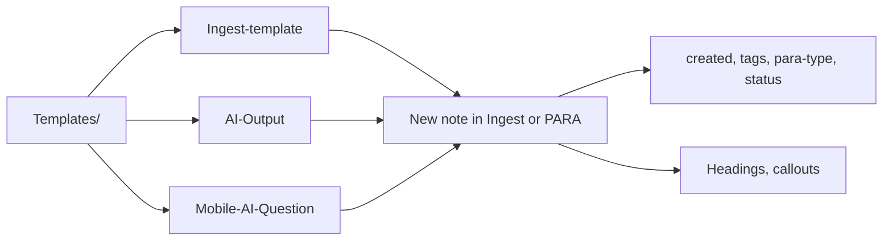
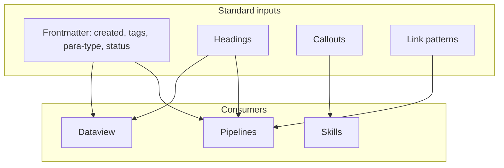

# Second Brain Templates

## Where

Templates live in **Templates/** (e.g. Ingest-template, AI-Output, Mobile-AI-Question). Optional subfolders by project or type. **Ingest by-type** (AI-Output, Link-Note, Stray-Thoughts) are consolidated at **Templates/Ingest/By-Type/**; Ingest-Selector and pipelines reference these paths.

## Prompt-Components (laptop)

**Location**: `Templates/Prompt-Components/`. Used by the prompt-crafter to assemble MCP params from config/templates for consistent ingest/organize (laptop-only; no mobile).

**Assembly order**: Config defaults → Param-Overrides → Guidance-Default → Validation-Snippet (→ optional Skill-Chain). Flow: **Base-Prompt** (canonical trigger) → **Param-Defaults** / **Param-Overrides** (from Second-Brain-Config) → **Guidance-Default** (guidance-aware string) → **Error-Handling-Template** (if invalid, log to Errors.md per mcp-obsidian-integration) → optional **Skill-Chain**. Crafter assembles via concat or read_note chain. No mobile-specific components.

## Chat-Prompts (copy-paste)

**Location** (optional): `Templates/Chat-Prompts/`. Copy-paste ready strings for Cursor chat so you trigger pipelines with consistent phrasing and optional params/guidance.

- **Purpose**: User-facing chat strings (e.g. "INGEST MODE with params: { ... } and guidance: ..."). Open a template, copy, paste into Cursor, send. No assembly step unless you use a Commander "Craft Chat Prompt" macro.
- **Relation to Prompt-Components**: Chat-Prompts = what you paste in chat; Prompt-Components = assembly for queue/crafter (param defaults, overrides, validation snippets). Reference existing `Templates/Prompt-Components/` to avoid duplication; do not duplicate param logic in Chat-Prompts.
- **Templater**: If Templater is hooked, placeholders (e.g. from Config) may be resolved when you open the template; otherwise paste as-is and rely on Config defaults at run time.

See [[3-Resources/Second-Brain/Chat-Prompts|Chat-Prompts]] for canonical phrases, validation, and safety.

## Planning prompt (TASK-TO-PLAN-PROMPT)

**Location**: `Templates/Planning-Prompt-Task.md`. Used when building Cursor-ready planning prompts from roadmap tasks (queue mode TASK-TO-PLAN-PROMPT or task-to-prompt skill). Placeholders: `{{project_name}}`, `{{session_memory_hint}}`, `{{task_text}}`, optional `{{git_diff_hint}}`. Template demands liberal explanatory comments in plan output (why, assumptions, limitations, provenance links, gotchas). Merge **code_comments** from Second-Brain-Config when present (density, required_sections, provenance_format). Step 0 apply for phase-direction wrappers appends in-roadmap **comment guidance** callout near the approved task bullet. See Cursor-Skill-Pipelines-Reference § Apply-from-wrapper and plan §6.

## Purpose

Used for new notes, ingest flow, and AI outputs so that structure and frontmatter are consistent.

## Responsibilities

Templates/ provides consistent structure for new notes. Pipelines and skills assume **frontmatter** (created, tags, para-type, status) and **standard callouts** (proposal, preview, success). second-brain-standards rule enforces frontmatter on every new .md and attachment syntax.

## Backbone: consistent formatting

Templates are backbone in that **the system is designed for consistent formatting** — frontmatter (created, tags, para-type, status), headings, callouts, and link patterns are standardized so pipelines, skills, and Dataview can rely on predictable structure. Reference [[.cursor/rules/always/second-brain-standards|second-brain-standards]] (frontmatter on every new .md, atomic notes, attachment syntax). Note naming: [[3-Resources/Second-Brain/Naming-Conventions|Naming-Conventions]].

## Template → new note flow



## Result callouts

Use for pipeline outputs (export, progress report):

- `> [!success] Progress report generated — [[path/to/export]]`
- `> [!success] Export saved — [[5-Attachments/Exports/...]]`

Document in auto-queue-processor for EXPORT-ROADMAP and PROGRESS-REPORT: skill/handler must append an in-note callout to the roadmap or a dedicated note.

## Example callouts (full text)

**Proposal** (low-confidence; needs approval):

```
> [!proposal] Classification / path proposal — Add approved: true to frontmatter and run EAT-QUEUE to process.
```

**Preview** (pending highlight/distill/express before commit):

```
> [!preview] Pending highlight/distill/express — run EAT-QUEUE after review.
```

**Success** (pipeline output, e.g. export or progress report):

```
> [!success] Progress report generated — [[path/to/export]]
```

**Feedback** (roadmaps / refinement trigger):

```
> [!feedback] Add notes here; re-queue via EAT-QUEUE for refinement.
```

Pipeline logs and Mobile-Pending-Actions reference the proposal and preview patterns for "needs approval" items.

## Proposal callout

Standard for low-confidence outputs: include "Add `approved: true` to frontmatter and run EAT-QUEUE to process" in the callout body.

## Ingest decision proposal callout (low-confidence)

When the ingest pipeline marks a note as a decision candidate (ingest_conf < 72 or mid-band failure), use:

- **Warning:** `> [!warning] Decision needed (low confidence)` — This note needs guidance. Add `user_guidance: | ...` and `approved: true` to frontmatter, then run EAT-QUEUE.
- **Suggested user_guidance (copy-paste):** A separate tip callout: `> [!tip] Suggested user_guidance (copy-paste into frontmatter)` followed by a starter YAML block, e.g. `user_guidance: |` with placeholder lines: "Classify as [Resource/Area/Project]. Prefer path: 3-Resources/Genesis-Mythos/Phase-X-... Split if >500 words or multiple topics." See para-zettel-autopilot.mdc for the exact text the pipeline inserts.

## Ingest/Decisions wrapper notes (Decision Wrapper template)

**Required:** For every ingest decision candidate, the pipeline MUST create or refresh a **Decision Wrapper** note under **`Ingest/Decisions/`**, using the canonical template **`Templates/Decision-Wrapper.md`** (A–G version). Live wrappers for ingest path decisions use the subfolder **`Ingest/Decisions/Ingest-Decisions/`**; other wrapper types (Refinements, Low-Confidence, Errors, Roadmap-Decisions, Re-Wrap) use their corresponding subfolders as described in [[3-Resources/Second-Brain/Vault-Layout#Ingest/Decisions subfolders|Vault-Layout § Ingest/Decisions subfolders]]. Ensure the target subfolder exists via `obsidian_ensure_structure` (for example `folder_path: "Ingest/Decisions/Ingest-Decisions"`) before writing.

- **Filename pattern (ingest wrappers)**: `Decision-for-<original_slug>--YYYY-MM-DD-HHMM.md` where `original_slug` comes from the original note’s filename and the timestamp is when the wrapper was (re)created.
- **Frontmatter (common fields)**:
  - `wrapper_type`: `ingest-decision` \| `roadmap-decision` \| `mid-band-refinement` \| `low-confidence` \| `error` \| `force-wrapper` (see [[3-Resources/Second-Brain/Parameters#Decision Wrapper frontmatter (clunk)|Parameters § Decision Wrapper frontmatter]]).
  - `clunk_severity`: `low` \| `medium` \| `high` (derived from band/error type).
  - `original_path`: vault-relative path of the source note (e.g. `Ingest/My-Note.md`).
  - `approved`: `false` by default; set to `true` manually by the user when ready to apply.
  - Optional: `approved_option` (`A`–`G` or `0`), `approved_path` (hard target path), `proposal_quality`, and any pipeline-specific fields (e.g. `pipeline: ingest`).
- **Body content (ingest A–G wrappers)**: The pipeline fills exactly **seven options A–G** using `propose_para_paths` in `"wrapper"` mode (plus deterministic fallbacks when fewer than 7 candidates are returned). Each option includes a candidate path, display confidence, and short rationale. The wrapper also links back to the original note and may include a **Thoughts / corrections / why this location?** section that the user can edit; this text is treated as `user_guidance` when apply-mode runs.
- **No default approval:** The template and pipelines must **never** set a default `approved_option` or `approved_path`. Apply-mode ingest and other pipelines only run when the user has explicitly set `approved: true` (Watcher may sync `approved_option` and `approved_path` once that flag is present but never sets `approved: true` itself).

The original note holds the authoritative content and, when the user chooses, any inline `user_guidance`. The wrapper coordinates options, approval, and lineage (`used_at`, `processed: true` when archived to `4-Archives/Ingest-Decisions/**`); see [[3-Resources/Second-Brain/Pipelines#Decision Wrappers (clunk)|Pipelines § Decision Wrappers (clunk)]] and [[3-Resources/Second-Brain/Cursor-Skill-Pipelines-Reference|Cursor-Skill-Pipelines-Reference]] for how wrappers are applied via EAT-QUEUE Step 0.

## Preview callout (depth / async)

For pending highlight, distill, or express previews before commit: use `> [!preview]` with "run EAT-QUEUE after review." Use when mid-band or async flow produces a preview that the user can approve or refine before the next run commits.

## Re-queue after edit (approved: true)

In the proposal callout, include: **"Add `approved: true` to frontmatter and run EAT-QUEUE to process."**

When the user adds **`approved: true`** to the note's frontmatter, the **next EAT-QUEUE** run (or a pre-dispatch scan in auto-eat-queue) detects it and auto-processes that note. The user may also set **`user_guidance`** (YAML multiline) with refinement instructions; the next EAT-QUEUE run will use it as guidance for that run (see guidance-aware rule). Document in Queue-Sources and auto-eat-queue: scan for notes with `approved: true` and a matching proposal id/tag, then inject a queue entry or process inline.

## Consistent-formatting backbone


