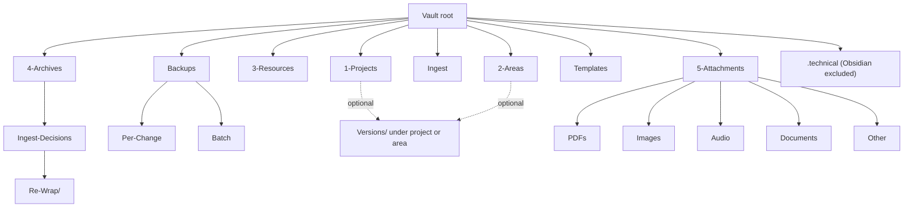
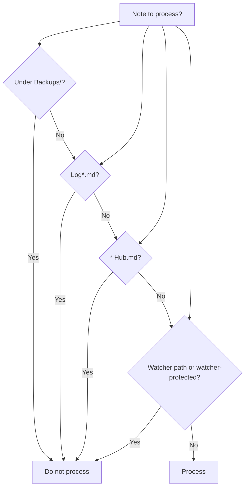

# Second Brain Vault Layout

## Folder names never to use (blacklist)

**Do not use or reference:** `00 Inbox`, `10 Zettelkasten`, `99 Attachments`, `99 Templates`. Use only the canonical names: **Ingest** (not 00 Inbox), **Templates** (not 99 Templates), **5-Attachments** or **Attach** (not 99 Attachments). There is no Zettelkasten root — use PARA roots and subfolders only. See [[.cursor/rules/always/mcp-obsidian-integration|mcp-obsidian-integration]].

## Folder structure

| Folder | Purpose | Responsibilities |
|--------|---------|------------------|
| **1-Projects** | Time-bound projects; project-id + themes; subfolders ≤4 levels | Agent moves here from Ingest when para-type=Project; subfolders from project-id + themes |
| **2-Areas** | Ongoing areas of responsibility | Agent moves here when para-type=Area |
| **3-Resources** | Evergreen reference; hubs, config, logs, Second-Brain docs | Hubs, config notes, pipeline logs, Second-Brain docs; agent moves here when para-type=Resource |
| **4-Archives** | Inactive or completed; archive path from project-id + themes | Agent moves completed notes here via autonomous-archive; never re-processed by pipelines |
| **4-Archives/Ingest-Decisions** | Applied Decision Wrappers (moved after apply-mode) | Processed wrappers from `Ingest/Decisions/**`; subfolders mirror live structure (Ingest-Decisions/, Roadmap-Decisions/, Refinements/, Low-Confidence/, Errors/, Re-Wrap/…). Kept for training/history; never auto-deleted; step 0 only scans `Ingest/Decisions/**` so this folder tree is not re-scanned. |
| **4-Archives/Ingest-Decisions/Re-Wrap/** | Archived wrappers from re-wrap flow | When user sets `re-wrap: true` or `approved_option: 0`, EAT-QUEUE archives the current wrapper here (e.g. `Re-Wrap/Ingest-Decisions/`, `Re-Wrap/Roadmap-Decisions/`) before creating a new wrapper with Thoughts as seed. Subfolders mirror live structure; never auto-deleted. See auto-eat-queue re-wrap branch. |
| **Ingest** | All new/unknown files arrive here; processed by full-autonomous-ingest | All new/unknown files land here; agent processes then moves out to PARA. Mid/low-confidence or ambiguous cases create Decision Wrappers under `Ingest/Decisions/**` (e.g. `Ingest-Decisions/`, `Refinements/`, `Low-Confidence/`, `Errors/`) that coordinate user-approved moves via EAT-QUEUE. See [[3-Resources/Second-Brain/Vault-Layout#Ingest/Decisions subfolders]]. Stale wrappers (processed but still in Decisions): EAT-QUEUE tries ingest if original still in Ingest; else archives wrapper only when original is at target; otherwise tags Orphan/True Orphan and adds internal note (no archive). |
| **Backups/Per-Change** | In-vault per-change snapshots; append-only | Agent writes per-change snapshots here; never process as pipeline input |
| **Backups/Batch** | In-vault batch checkpoint notes | Agent writes batch checkpoint notes here; append-only |
| **Versions/** (under note parent) | Version snapshots (express pipeline) | version-snapshot skill writes dated copies under the note’s parent (e.g. `1-Projects/Project-X/Versions/`); not under Backups/ |
| **Templates** | Note templates (Ingest-template, AI-Output, etc.) | Used for new notes; pipelines do not process Templates/ as input |
| **5-Attachments/PDFs** | PDFs (and other subtypes: Images, Audio, Documents, Other) | User moves binaries here; companion .md may reference via `![[5-Attachments/...]]` |
| **.technical** | Cursor/Watcher machine-only bin (queue, signals, timing log, setup logs) | Chosen: .technical for auto-hidden behavior in Obsidian; visible in Cursor. Excluded via Settings → Excluded files. Contains: `prompt-queue.jsonl`, `Watcher-Timing-Log.md`; Watcher-Signal/Result stay in 3-Resources unless plugin paths updated (Option A). Never place human-authored notes here. See [[3-Resources/Clean-technical-folder|Clean-technical-folder]]. |

## Root-level technical files (must stay at root)

These **belong conceptually to the technical setup** but **must stay at vault root** because the tools that use them read them there:

| File | Purpose | Why at root |
|------|---------|-------------|
| **.cursorignore** | Excludes paths from Cursor indexing and AI context (e.g. `.technical/`, `*.jsonl`, `Watcher-*.md`) | Cursor reads it from project root only |
| **.stignore** | Syncthing ignore patterns (like .gitignore for sync) | Syncthing reads it from the shared folder root only |
| **.obsidianignore** | Optional; some plugins use it for exclusion (Obsidian has no built-in support) | If present, plugins may expect it at vault root |

**Hub notes** (e.g. Resources Hub.md, Projects Hub.md, Areas Hub.md) stay in the vault root or 3-Resources — they are content and are linked from many notes; moving them would break links. They are excluded from pipeline processing via the `* Hub.md` rule but are not “technical” in the same sense as the ignore/config files above.

## Ingest/Decisions subfolders

Step 0 (EAT-QUEUE) enumerates all markdown under `Ingest/Decisions/` recursively. Processed wrappers are moved to `4-Archives/Ingest-Decisions/` with **subfolders mirroring the live structure** so archive stays organized.

| Live subfolder | Purpose | Archive mirror |
|----------------|---------|----------------|
| **Ingest-Decisions/** | Ingest Phase 1 path/relocation decisions (A–G) | `4-Archives/Ingest-Decisions/Ingest-Decisions/` |
| **Roadmap-Decisions/** | Roadmap seed decisions (Option A = new project + roadmap tree) | `4-Archives/Ingest-Decisions/Roadmap-Decisions/` |
| **Refinements/** | Mid-band (68–84%) refinement wrappers; FORCE-WRAPPER | `4-Archives/Ingest-Decisions/Refinements/` |
| **Low-Confidence/** | Low-confidence (<68%) proposals | `4-Archives/Ingest-Decisions/Low-Confidence/` |
| **Errors/** | Safety-gate / error recovery wrappers (link to Errors.md) | `4-Archives/Ingest-Decisions/Errors/` |

**Archive path rule**: When moving a processed wrapper to archive, derive the target from the wrapper's current path: replace prefix `Ingest/Decisions/` with `4-Archives/Ingest-Decisions/` (e.g. `Ingest/Decisions/Refinements/Decision-for-x.md` → `4-Archives/Ingest-Decisions/Refinements/Decision-for-x.md`). Re-Wrap flow continues to use `4-Archives/Ingest-Decisions/Re-Wrap/Ingest-Decisions/` (or Roadmap-Decisions) when archiving before creating a new wrapper.

**Wrapper MOC**: `Ingest/Decisions/Wrapper-MOC.md` (or Decisions-MOC.md) lists pending wrappers by `clunk_severity` and `wrapper_type` via Dataview; single "clunk dashboard" for all "please look at me" items.

## Usage example

**New file** → place in Ingest/ → run **INGEST MODE** (or Process Ingest) → file is classified, frontmatter enriched, distilled, and moved to 1-Projects/…, 2-Areas/…, or 3-Resources/… according to para-type and project-id. Filenames follow [[3-Resources/Second-Brain/Naming-Conventions|Naming-Conventions]] (kebab-slug-YYYY-MM-DD-HHMM; date and time at end).

## Exclusions

Pipelines must **not** process:

- **Backups/** (any subtree)
- **\*\*/Log*.md** (e.g. Ingest-Log.md, Archive-Log.md)
- **\*\/* Hub.md** (e.g. Resources Hub.md)
- **3-Resources/Second-Brain/tests/** (automated test suite; not pipeline input)
- **Watcher paths**: `Ingest/watched-file.md`, `3-Resources/Watcher-Signal.md`, `3-Resources/Watcher-Result.md`
- **.technical/** (technical bin: Cursor queue, Watcher signals/results if moved, setup logs — excluded from Obsidian index)
- Notes with frontmatter **watcher-protected: true**
- Decision Wrappers under **`Ingest/Decisions/**`** (control notes for ingest decisions; not pipeline inputs themselves). Processed wrappers are moved to **`4-Archives/Ingest-Decisions/`** and are also excluded from ingest pipeline input.

Context rules list these in their Excludes sections.

**Exclusions / technical**: Technical artifacts (Cursor queue, Watcher signals, setup logs) live in `.technical/`. Excluded via Settings → Files & Links → Excluded files. Root-level technical files (`.cursorignore`, `.stignore`, `.obsidianignore`) are part of the same setup but must stay at root; see “Root-level technical files” above.

**Permanent content (do not archive)**: Backbone (`3-Resources/Second-Brain/**`), config, hubs, logs, Watcher paths, Backups/, Templates/, tests/. See [[3-Resources/Archive-Prep-Checklist|Archive-Prep-Checklist]] for the full permanent vs archiveable list when prepping for manual pipeline testing.

## Unified observability (MOC)

- **Vault-Change-Monitor**: [3-Resources/Vault-Change-Monitor](3-Resources/Vault-Change-Monitor.md) — single dashboard for pipeline activity, Commander-triggered events, and health. Logs (Ingest-Log, Distill-Log, etc.) write consistent fields → MOC aggregates. See [Logs](3-Resources/Second-Brain/Logs.md) for log → MOC flow.
- **Commander contextual setup**: Roadmap macros, device-specific visibility; see [Commander-Plugin-Usage](3-Resources/Commander-Plugin-Usage.md) and [Vault-Layout](3-Resources/Second-Brain/Vault-Layout.md).

## Toolbar (mobile)

**Contextual visibility**: Optional — show Roadmap Tools only when note has `para-type: Roadmap` or path under `1-Projects/…/Roadmap/`. Configure via Commander or Note Toolbar plugin settings. See [[3-Resources/Commander-Plugin-Usage]] for Commander setup. Reduces clutter when not in a roadmap context.

## Full folder tree (diagram)

## Exclusions flow (diagram)

